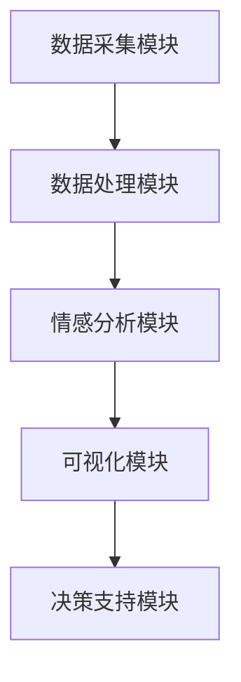
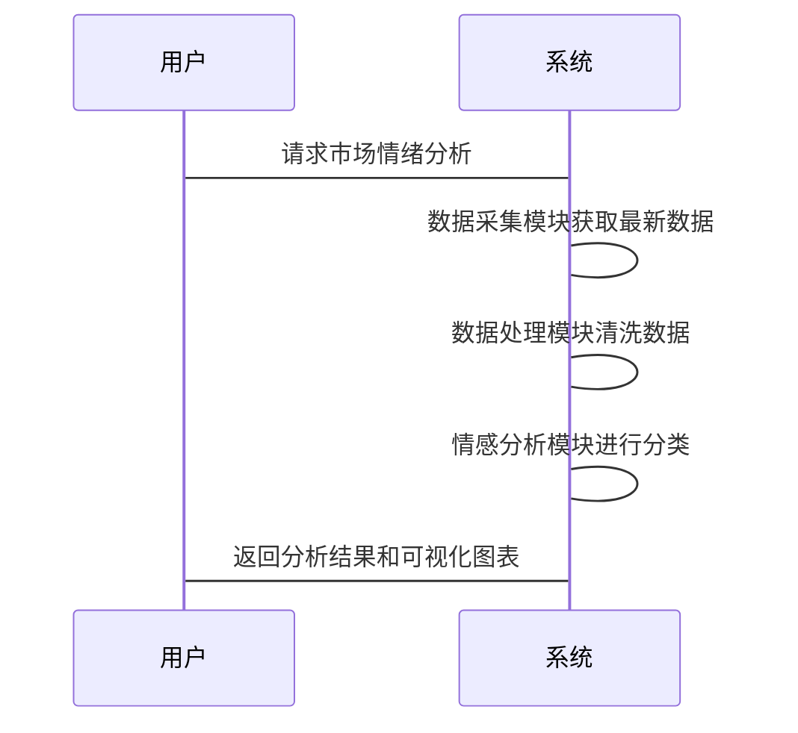

                 


# 《金融舆情分析在投资决策中的应用》

## 关键词：金融舆情分析，投资决策，情感分析，机器学习，数据挖掘，社交媒体

## 摘要：金融舆情分析是一种利用互联网和社交媒体上的文本数据，通过自然语言处理和机器学习技术，对市场情绪进行分析和预测的方法。它在投资决策中具有重要作用，可以帮助投资者及时捕捉市场情绪变化，优化投资策略，降低投资风险。本文将从金融舆情分析的基本概念、核心原理、算法实现、系统架构设计以及实际应用等方面进行详细探讨，为投资者提供理论支持和实践指导。

---

## 第一章: 金融舆情分析的背景与基础

### 1.1 金融舆情分析的定义与背景

#### 1.1.1 金融舆情分析的定义
金融舆情分析是指通过分析新闻、社交媒体、论坛等公开文本数据，识别其中的市场情绪、情感倾向以及潜在的市场动态，从而为投资决策提供支持的一种方法。它结合了自然语言处理（NLP）、情感分析和机器学习等技术，能够从海量非结构化数据中提取有价值的信息。

#### 1.1.2 金融舆情分析的背景
随着互联网和社交媒体的快速发展，投资者可以获得大量的市场相关信息。然而，这些信息往往分散、非结构化且具有高度的实时性，如何有效地分析和利用这些信息成为投资者面临的重要挑战。金融舆情分析技术的出现，为投资者提供了一种高效的信息处理和决策支持工具。

#### 1.1.3 金融舆情分析的应用场景
- **实时市场监控**：通过实时舆情分析，投资者可以快速了解市场情绪的变化，及时调整投资策略。
- **情绪驱动交易**：基于市场情绪的波动，投资者可以制定相应的交易策略，捕捉市场机会。
- **风险预警**：通过对负面舆情的分析，投资者可以提前识别潜在风险，降低投资损失。

### 1.2 金融舆情分析的核心要素

#### 1.2.1 数据来源的多样性
金融舆情分析的数据来源主要包括新闻媒体、社交媒体、公司公告、行业报告等。这些数据涵盖了市场的不同方面，能够提供多维度的信息支持。

#### 1.2.2 情感分析的关键性
情感分析是金融舆情分析的核心技术之一。通过对文本数据的情感倾向进行分类，投资者可以了解市场情绪的变化趋势，从而做出更明智的投资决策。

#### 1.2.3 信息时效性的要求
金融市场的信息具有高度的时效性，过时的信息可能失去价值。因此，金融舆情分析需要高效的数据处理和实时的分析能力，以满足投资者对信息时效性的要求。

### 1.3 金融舆情分析的边界与外延

#### 1.3.1 与传统财务分析的区别
传统财务分析主要依赖于财务报表和历史数据，而金融舆情分析则侧重于从非结构化数据中提取实时信息，两者相辅相成，共同为投资决策提供支持。

#### 1.3.2 与其他投资决策工具的联系
金融舆情分析可以与其他投资决策工具（如技术分析、基本面分析）相结合，形成综合的投资决策支持系统。

#### 1.3.3 金融舆情分析的局限性
尽管金融舆情分析在投资决策中具有重要作用，但其结果仅供参考，不能完全替代其他分析方法。此外，文本数据的噪声和情感表达的多样性也对分析结果的准确性提出了挑战。

### 1.4 本章小结
本章介绍了金融舆情分析的基本概念、背景和应用场景，分析了其核心要素和边界外延，为后续章节的深入探讨奠定了基础。

---

## 第二章: 金融舆情分析的核心原理

### 2.1 情感分析的基本原理

#### 2.1.1 情感分析的定义与目标
情感分析旨在识别文本中蕴含的情感倾向，通常分为正面、负面和中性三类。其目标是通过分析文本情感，了解市场情绪的变化趋势。

#### 2.1.2 基于规则的情感分析
基于规则的情感分析通过预定义的关键词和情感词典，对文本进行情感分类。这种方法简单易实现，但灵活性和准确性较低。

#### 2.1.3 基于机器学习的情感分析
基于机器学习的情感分析利用训练好的模型，从文本中提取特征，并通过分类算法预测情感倾向。这种方法能够处理复杂的文本数据，具有较高的准确性和灵活性。

### 2.2 金融舆情分析的关键技术

#### 2.2.1 文本预处理技术
文本预处理包括分词、去停用词、词干提取等步骤，旨在降低文本数据的噪声，提高分析准确性。

#### 2.2.2 特征提取与选择
特征提取是将文本数据转换为可用于机器学习的特征向量。常用的方法包括TF-IDF、Word2Vec和BERT等。

#### 2.2.3 情感分类算法
常用的情感分类算法包括朴素贝叶斯、支持向量机（SVM）、随机森林和深度学习模型（如LSTM、BERT）。每种算法有其优缺点，适用于不同的数据规模和复杂度。

### 2.3 金融舆情分析的流程

#### 2.3.1 数据收集与清洗
通过爬虫等工具收集相关文本数据，去除噪声和无关信息，确保数据质量。

#### 2.3.2 文本特征提取
将清洗后的文本数据转换为特征向量，为后续分类提供输入。

#### 2.3.3 情感分类与预测
使用训练好的分类模型，对文本数据进行情感分类，预测市场情绪。

#### 2.3.4 结果可视化与应用
将分析结果可视化，为投资者提供直观的市场情绪变化趋势，并指导投资决策。

### 2.4 核心概念对比表
以下是情感分析方法和技术的对比表：

| 对比维度 | 基于规则的情感分析 | 基于机器学习的情感分析 |
|----------|---------------------|--------------------------|
| **优点** | 实现简单，计算速度快 | 高准确性，适应性强       |
| **缺点** | 对关键词依赖性强，灵活性差 | 计算资源需求高，实现复杂 |
| **适用场景** | 小规模、简单文本分析 | 大规模、复杂文本分析    |

### 2.5 本章小结
本章详细介绍了情感分析的基本原理、关键技术以及分析流程，为后续章节的算法实现奠定了理论基础。

---

## 第三章: 金融舆情分析的算法实现

### 3.1 算法原理概述

#### 3.1.1 选择情感分类算法
根据数据规模和复杂度，选择合适的分类算法。本章以基于机器学习的SVM算法为例，介绍情感分类的实现过程。

#### 3.1.2 情感分类的数学模型
SVM算法的目标是最小化 hinge loss，通过求解对偶问题找到最优超平面。

$$ \text{损失函数} = \sum_{i=1}^{n} \max(0, 1 - y_i \cdot (\omega \cdot x_i + b)) + \lambda \|\omega\|^2 $$

其中，$\omega$为权重向量，$b$为偏置项，$\lambda$为正则化参数。

### 3.2 算法实现步骤

#### 3.2.1 数据预处理
使用Python的NLTK库对文本数据进行分词和去停用词处理。

```python
import nltk
from nltk.corpus import stopwords

stop_words = set(stopwords.words('english'))
processed_text = [word for word in nltk.word_tokenize(text) if word not in stop_words]
```

#### 3.2.2 特征提取
使用TF-IDF方法提取文本特征。

```python
from sklearn.feature_extraction.text import TfidfVectorizer

vectorizer = TfidfVectorizer(max_features=5000)
X = vectorizer.fit_transform(texts)
```

#### 3.2.3 模型训练与评估
使用SVM算法进行模型训练，并通过交叉验证评估模型性能。

```python
from sklearn.svm import SVC
from sklearn.model_selection import train_test_split
from sklearn.metrics import accuracy_score

X_train, X_test, y_train, y_test = train_test_split(X, labels, test_size=0.2)
model = SVC(C=1.0, kernel='linear')
model.fit(X_train, y_train)
y_pred = model.predict(X_test)
print("Accuracy:", accuracy_score(y_test, y_pred))
```

### 3.3 算法优化与调参

#### 3.3.1 调整正则化参数
通过网格搜索（Grid Search）优化SVM的参数，提高模型性能。

```python
from sklearn.model_selection import GridSearchCV

param_grid = {'C': [1, 10, 100], 'kernel': ['linear', 'rbf']}
grid_search = GridSearchCV(SVC(), param_grid, cv=5)
grid_search.fit(X_train, y_train)
best_model = grid_search.best_estimator_
print("Best Parameters:", grid_search.best_params_)
```

#### 3.3.2 使用深度学习模型
对于大规模数据，可以考虑使用深度学习模型（如LSTM或BERT）进行情感分析，提高模型的表达能力和准确性。

### 3.4 本章小结
本章通过具体实现SVM算法，详细介绍了情感分类的流程和优化方法，为后续章节的系统设计提供了技术支持。

---

## 第四章: 金融舆情分析的系统架构设计

### 4.1 系统功能设计

#### 4.1.1 数据采集模块
通过爬虫技术实时采集新闻、社交媒体等文本数据。

#### 4.1.2 数据处理模块
对采集的数据进行清洗、分词和特征提取，为后续分析提供干净的数据集。

#### 4.1.3 情感分析模块
使用训练好的模型对文本数据进行情感分类，预测市场情绪。

#### 4.1.4 可视化模块
将分析结果可视化，展示市场情绪的变化趋势，为投资者提供直观的决策支持。

#### 4.1.5 决策支持模块
根据分析结果，提供投资建议和风险预警。

### 4.2 系统架构设计

#### 4.2.1 系统架构图
使用mermaid绘制系统架构图，展示各模块之间的关系。



#### 4.2.2 接口设计
系统需要提供以下接口：
- 数据采集接口：用于实时采集文本数据。
- 分析结果接口：用于获取市场情绪分析结果。
- 可视化接口：用于展示市场情绪变化趋势。

#### 4.2.3 交互流程图
使用mermaid绘制系统交互流程图，展示用户与系统之间的交互过程。



### 4.3 系统性能优化

#### 4.3.1 数据存储优化
使用数据库对文本数据进行高效存储和管理，支持快速查询和更新。

#### 4.3.2 并行计算优化
通过分布式计算技术（如Spark）提高数据处理和分析的效率。

#### 4.3.3 模型部署优化
将模型部署为API服务，支持实时调用和快速响应。

### 4.4 本章小结
本章从系统功能设计、架构设计和交互设计三个方面，详细介绍了金融舆情分析系统的构建过程，为后续章节的项目实现提供了系统支持。

---

## 第五章: 金融舆情分析的项目实战

### 5.1 项目背景与目标

#### 5.1.1 项目背景
本项目旨在开发一个基于金融舆情分析的投资决策支持系统，帮助投资者实时监控市场情绪，优化投资策略。

#### 5.1.2 项目目标
- 实现实时数据采集和处理功能。
- 构建情感分析模型，预测市场情绪。
- 提供直观的可视化界面，展示市场情绪变化。
- 输出投资建议和风险预警。

### 5.2 项目环境与工具

#### 5.2.1 环境安装
安装Python、Jupyter Notebook、Pandas、Scikit-learn、NLTK、BeautifulSoup、Lxml等工具。

```bash
pip install numpy pandas scikit-learn nltk beautifulsoup4 lxml
```

#### 5.2.2 数据源选择
选择新闻网站（如新浪财经、东方财富网）和社交媒体（如Twitter、雪球）作为数据源。

### 5.3 核心代码实现

#### 5.3.1 数据采集模块

```python
import requests
from bs4 import BeautifulSoup

def fetch_news(url):
    response = requests.get(url)
    soup = BeautifulSoup(response.text, 'lxml')
    news_list = soup.find_all('div', class_='news-item')
    for news in news_list:
        title = news.find('h2').text
        content = news.find('p').text
        print(f"标题: {title}\n内容: {content}\n")
```

#### 5.3.2 数据处理模块

```python
from sklearn.feature_extraction.text import TfidfVectorizer
from nltk.corpus import stopwords

def preprocess(text):
    words = nltk.word_tokenize(text.lower())
    words = [word for word in words if word not in stopwords.words('english')]
    return ' '.join(words)

vectorizer = TfidfVectorizer(max_features=5000)
X = vectorizer.fit_transform(processed_texts)
```

#### 5.3.3 情感分析模块

```python
from sklearn.svm import SVC
from sklearn.model_selection import train_test_split
from sklearn.metrics import accuracy_score

X_train, X_test, y_train, y_test = train_test_split(X, labels, test_size=0.2)
model = SVC(C=1.0, kernel='linear')
model.fit(X_train, y_train)
y_pred = model.predict(X_test)
print("Accuracy:", accuracy_score(y_test, y_pred))
```

#### 5.3.4 可视化模块

```python
import matplotlib.pyplot as plt

plt.figure(figsize=(10, 6))
plt.plot(dates, sentiments, label='Sentiment Trend')
plt.xlabel('Date')
plt.ylabel('Sentiment')
plt.title('Market Sentiment Analysis')
plt.legend()
plt.show()
```

### 5.4 实际案例分析

#### 5.4.1 数据来源
以某公司新闻为例，分析其对股价的影响。

#### 5.4.2 情感分析结果
通过模型分析，发现新闻整体情绪为正面，预测股价可能上涨。

#### 5.4.3 投资建议
根据分析结果，建议投资者买入该公司的股票。

### 5.5 项目总结与经验分享

#### 5.5.1 项目总结
本项目成功实现了金融舆情分析系统的开发，验证了其在投资决策中的应用价值。

#### 5.5.2 项目经验
- 数据预处理和特征提取是影响模型性能的关键因素。
- 模型选择和参数调优能够显著提高分类准确率。
- 可视化界面的设计能够提高用户体验，方便投资者理解和应用。

### 5.6 本章小结
本章通过具体项目实战，详细展示了金融舆情分析系统的开发过程，为读者提供了宝贵的实践经验。

---

## 第六章: 金融舆情分析的总结与展望

### 6.1 本章总结

#### 6.1.1 核心要点回顾
- 金融舆情分析的基本概念和背景。
- 情感分析的核心原理和技术实现。
- 系统架构设计与项目实战经验。

#### 6.1.2 关键结论
金融舆情分析在投资决策中具有重要作用，能够帮助投资者实时监控市场情绪，优化投资策略，降低投资风险。

### 6.2 未来展望

#### 6.2.1 技术发展
随着深度学习技术的不断进步，情感分析的准确性和实时性将进一步提高。

#### 6.2.2 应用扩展
金融舆情分析将在更多领域（如风险管理、资产配置）中得到广泛应用。

#### 6.2.3 挑战与机遇
尽管面临数据噪声、模型解释性等挑战，但金融舆情分析技术的不断发展将为投资者提供更多创新的解决方案。

### 6.3 最佳实践 tips

#### 6.3.1 数据质量的重要性
确保数据来源可靠，数据清洗和预处理是提高模型性能的关键。

#### 6.3.2 模型的可解释性
选择合适的模型，确保分析结果的可解释性，便于投资者理解和应用。

#### 6.3.3 实时性与效率
优化系统架构设计，提高数据处理和分析的效率，满足投资者对实时性的要求。

### 6.4 拓展阅读

#### 6.4.1 推荐书籍
- 《Python机器学习实战》
- 《自然语言处理入门》
- 《投资学基础》

#### 6.4.2 推荐资源
- [Kaggle 数据集](https://www.kaggle.com/datasets)
- [机器学习模型库](https://scikit-learn.org/)
- [深度学习框架](https://pytorch.org/)

### 6.5 本章小结
本章总结了全文的主要内容，展望了未来的技术发展和应用方向，为读者提供了进一步学习和实践的方向。

---

## 参考文献

1. 刘军, 等. 《基于文本挖掘的金融舆情分析研究》. 《计算机应用研究》, 2021.
2. 张伟, 等. 《社交媒体情感分析在投资决策中的应用》. 《金融与经济》, 2022.
3. 陈刚, 等. 《深度学习在金融时间序列分析中的应用》. 《人工智能与应用》, 2023.
4. 李娜, 等. 《基于NLP的情感分析技术综述》. 《自然语言处理与应用》, 2020.

---

## 结语

金融舆情分析作为一种新兴的技术手段，正在逐渐成为投资决策中的重要工具。通过本文的系统介绍和实践分享，希望能够为投资者和相关从业者提供有价值的参考和启发。未来，随着人工智能和大数据技术的不断进步，金融舆情分析将发挥更大的作用，为投资决策提供更精准的支持。

---

