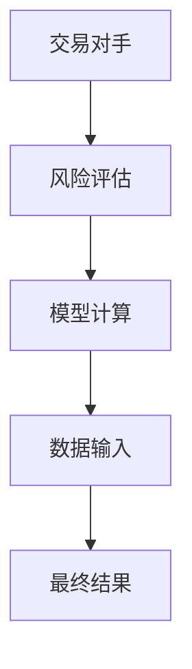
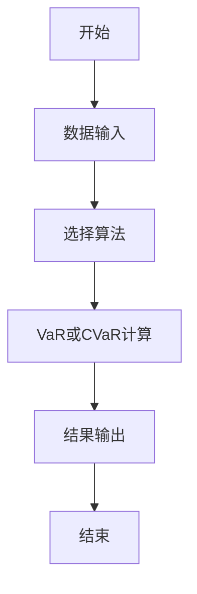
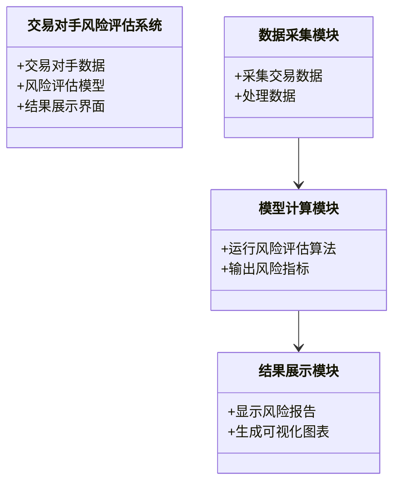
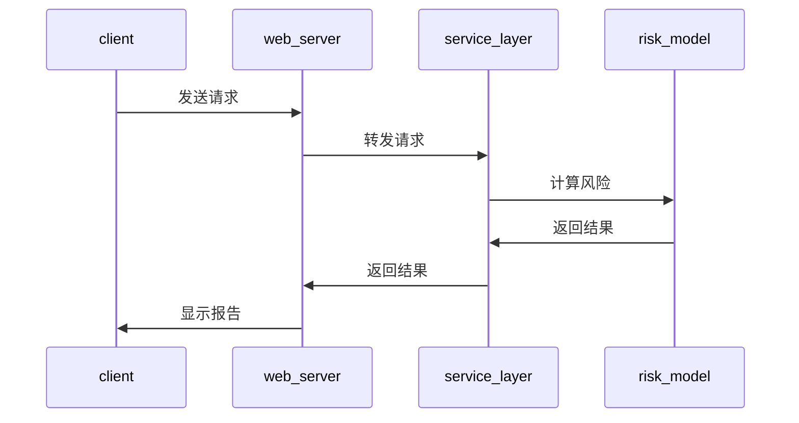

                 


# 《金融衍生品交易对手风险评估》

**关键词**：金融衍生品，交易对手风险，VaR，CVaR，系统架构，Python实现

**摘要**：本文深入探讨了金融衍生品交易对手风险评估的核心概念、算法原理、系统架构及实际应用。通过分析VaR和CVaR等模型，结合Python代码实现，帮助读者理解如何在实际中进行风险评估。

---

# 第一部分：金融衍生品交易对手风险评估背景与概念

## 第1章：金融衍生品与交易对手风险概述

### 1.1 金融衍生品的基本概念

#### 1.1.1 金融衍生品的定义与分类

金融衍生品是一种金融合约，其价值取决于基础资产的价格。常见的类型包括期货、期权、掉期和远期合约。

#### 1.1.2 金融衍生品的市场现状与发展趋势

近年来，衍生品市场迅速发展，已成为全球金融市场的重要组成部分，但同时也带来了更高的风险。

### 1.2 交易对手风险的核心概念

#### 1.2.1 交易对手风险的定义

交易对手风险是指交易对手无法履行合约义务，导致资金损失的风险。

#### 1.2.2 交易对手风险的分类与特征

交易对手风险可分为主动风险和被动风险，主动风险是由于对手故意违约，被动风险是由于财务状况恶化无法履行义务。

### 1.3 交易对手风险评估的重要性

#### 1.3.1 交易对手风险对金融市场的冲击

高风险交易对手可能导致市场波动，甚至引发系统性风险。

#### 1.3.2 交易对手风险对金融机构的影响

金融机构可能面临直接的财务损失和声誉损失。

#### 1.3.3 交易对手风险的监管要求

监管机构要求金融机构建立有效的风险评估机制，确保金融稳定。

### 1.4 本章小结

---

## 第二部分：交易对手风险评估的核心概念与联系

## 第2章：交易对手风险评估的核心概念

### 2.1 交易对手信用风险的属性特征

#### 2.1.1 信用风险的定义与计算方法

信用风险是交易对手违约的可能性，通常通过信用评分模型评估。

#### 2.1.2 信用风险的量化指标对比

对比VaR和CVaR，CVaR考虑了尾部风险，更全面。

#### 2.1.3 信用风险的动态变化特征

信用风险会随着市场变化而波动，需实时监控。

### 2.2 交易对手风险评估的实体关系图

#### 2.2.1 交易对手风险的实体关系图（Mermaid流程图）



### 2.3 交易对手风险评估的核心要素

#### 2.3.1 交易对手的信用评级

信用评级越高，风险越低。

#### 2.3.2 交易对手的资产规模与流动性

资产规模大且流动性强的对手风险较低。

#### 2.3.3 交易对手的市场行为与历史表现

历史表现好的对手更可靠。

### 2.4 本章小结

---

## 第三部分：交易对手风险评估的算法原理与数学模型

## 第3章：交易对手风险评估的主要算法

### 3.1 常见的交易对手风险评估算法

#### 3.1.1 VaR模型

$$\text{VaR} = \text{P}(\text{Loss} \leq \text{VaR}) = \alpha$$

#### 3.1.2 CVaR模型

$$\text{CVaR} = \text{E}[L | L \geq \text{VaR}]$$

#### 3.1.3 Credit Metrics模型

---

### 3.2 算法实现的流程图（Mermaid）



### 3.3 算法实现的Python代码示例

#### 3.3.1 VaR计算代码

```python
import numpy as np

def calculate_var(data, confidence_level=0.95):
    sorted_data = np.sort(data)
    index = int(len(data) * (1 - confidence_level))
    var = sorted_data[index]
    return var

# 示例数据
losses = np.array([0.1, 0.2, 0.3, 0.4, 0.5])
var = calculate_var(losses, 0.95)
print(f"VaR at 95% confidence level: {var}")
```

#### 3.3.2 CVaR计算代码

```python
def calculate_cvar(data, confidence_level=0.95):
    sorted_data = np.sort(data)
    index = int(len(data) * (1 - confidence_level))
    var = sorted_data[index]
    cvar = np.mean(sorted_data[index:])
    return cvar

# 示例数据
losses = np.array([0.1, 0.2, 0.3, 0.4, 0.5])
cvar = calculate_cvar(losses, 0.95)
print(f"CVaR at 95% confidence level: {cvar}")
```

### 3.4 本章小结

---

## 第四部分：交易对手风险评估的系统架构与项目实战

## 第4章：交易对手风险评估的系统架构设计

### 4.1 问题场景介绍

构建一个实时交易对手风险评估系统，帮助金融机构监控和管理风险。

### 4.2 系统功能设计

#### 4.2.1 领域模型（Mermaid类图）



### 4.3 系统架构设计（Mermaid架构图）


### 4.4 系统接口设计

- 数据接口：API获取交易数据
- 模型接口：计算VaR和CVaR
- 展示接口：返回可视化结果

### 4.5 系统交互设计（Mermaid序列图）



### 4.6 项目实战

#### 4.6.1 环境安装

安装Python、NumPy、Matplotlib等库。

#### 4.6.2 核心实现代码

```python
import numpy as np
import matplotlib.pyplot as plt

def calculate_var_and_cvar(data, confidence_level=0.95):
    sorted_data = np.sort(data)
    index = int(len(data) * (1 - confidence_level))
    var = sorted_data[index]
    cvar = np.mean(sorted_data[index:])
    return var, cvar

# 示例数据
losses = np.array([0.1, 0.2, 0.3, 0.4, 0.5])
var, cvar = calculate_var_and_cvar(losses, 0.95)
print(f"VaR: {var}, CVaR: {cvar}")

# 可视化
plt.figure(figsize=(10, 6))
plt.hist(losses, bins=5, alpha=0.7)
plt.axvline(var, color='red', linestyle='--', label=f'VaR at 95%: {var}')
plt.axvline(cvar, color='green', linestyle='--', label=f'CVaR at 95%: {cvar}')
plt.legend()
plt.show()
```

### 4.7 实际案例分析

使用上述代码分析实际交易数据，生成风险报告。

### 4.8 项目小结

---

## 第五部分：最佳实践、小结与注意事项

## 第5章：总结与展望

### 5.1 最佳实践

- 定期更新风险模型
- 结合实时数据进行监控
- 多模型结合以提高准确性

### 5.2 小结

本文详细介绍了交易对手风险评估的核心概念、算法和系统架构，并通过Python代码实现展示了实际应用。

### 5.3 注意事项

- 数据质量影响结果准确性
- 模型选择需根据具体场景
- 监管要求需严格遵守

### 5.4 拓展阅读

推荐阅读《金融风险管理》和《Python金融建模》等书籍。

---

通过以上步骤，您可以系统地了解和实现金融衍生品交易对手风险评估。希望本文对您有所帮助！

