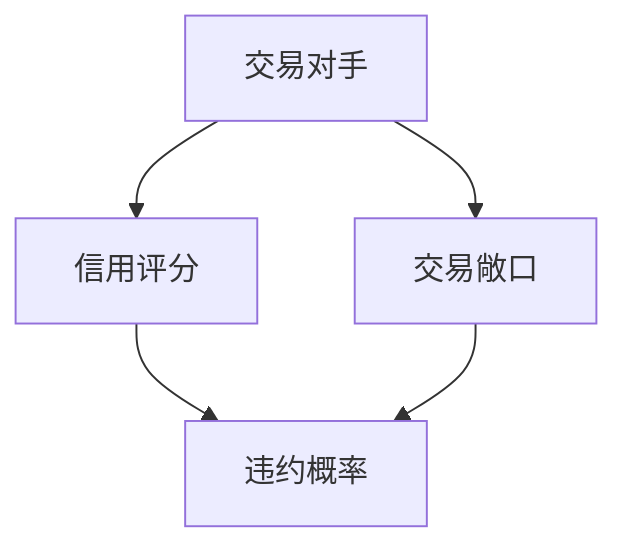
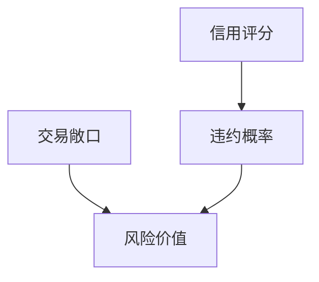
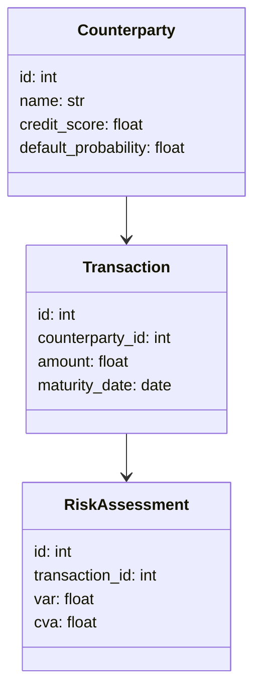
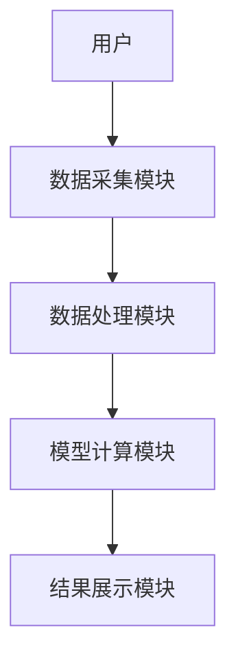
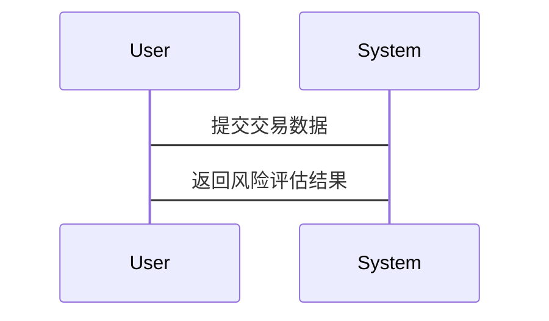

                 


# 金融衍生品交易对手风险评估模型

> 关键词：金融衍生品，交易对手风险，信用评估，风险管理，数学模型

> 摘要：金融衍生品交易中的交易对手风险是信用风险管理的重要组成部分。本文详细介绍了交易对手风险的定义、评估方法和模型构建过程，探讨了如何利用数学模型和算法对交易对手的信用风险进行量化评估。文章从背景介绍、核心概念、算法原理、系统架构设计到项目实战，逐步展开，结合实际案例，分析了模型的应用场景和实际效果，为金融从业者提供了一种有效的交易对手风险评估方法。

---

## 第一部分：背景介绍

### 第1章：金融衍生品与交易对手风险概述

#### 1.1 金融衍生品的基本概念

##### 1.1.1 金融衍生品的定义
金融衍生品（Financial Derivatives）是一类其价值依赖于其他基础资产或指数的金融工具。常见的金融衍生品包括期货、期权、掉期和远期合约等。

##### 1.1.2 金融衍生品的分类
金融衍生品可以按以下方式分类：
- 按基础资产：股票、债券、外汇、商品等。
- 按交易方式：场内交易和场外交易。
- 按收益结构：线性衍生品（如期货、期权）和非线性衍生品（如互换）。

##### 1.1.3 金融衍生品的市场现状
近年来，金融衍生品市场规模迅速增长，成为全球金融市场的重要组成部分。然而，衍生品的复杂性和杠杆效应也带来了更高的风险。

#### 1.2 交易对手风险的定义与特征

##### 1.2.1 交易对手风险的定义
交易对手风险（Counterparty Risk）是指在金融交易中，交易对手方无法履行合同义务，导致损失的风险。这种风险不仅包括交易对手的违约风险，还包括市场风险和流动性风险。

##### 1.2.2 交易对手风险的分类
交易对手风险可以分为以下几类：
- **信用风险**：交易对手因信用问题无法履行合约义务的风险。
- **市场风险**：因市场价格波动导致交易对手无法履行合约的风险。
- **流动性风险**：交易对手因资金不足或市场流动性不足而无法履行合约的风险。

##### 1.2.3 交易对手风险的影响因素
影响交易对手风险的因素包括：
- **信用评级**：交易对手的信用状况。
- **市场波动**：市场价格的波动性。
- **交易规模**：交易的规模和复杂性。
- **法律环境**：法律制度和监管环境的影响。

#### 1.3 交易对手风险评估的重要性

##### 1.3.1 风险评估的必要性
在金融衍生品交易中，交易对手风险是信用风险管理的核心内容。准确评估交易对手风险，可以帮助金融机构制定合理的风险管理策略，降低潜在损失。

##### 1.3.2 风险评估的流程与方法
风险评估的流程通常包括数据收集、模型构建、风险量化和结果分析。常见的方法包括信用评分模型、VaR（Value at Risk）模型和CVA（Credit Valuation Adjustment）模型。

##### 1.3.3 风险评估的边界与外延
交易对手风险评估的边界包括交易对手的信用状况、交易的法律结构和市场的宏观经济环境。外延则涉及风险对冲、资本分配和监管合规等内容。

#### 1.4 交易对手风险评估模型的概述

##### 1.4.1 模型的定义与作用
交易对手风险评估模型是一种用于量化交易对手信用风险的工具，其作用包括风险识别、风险测量和风险对冲。

##### 1.4.2 模型的核心要素与组成
模型的核心要素包括交易对手的信用评级、交易的敞口风险和市场的波动性。模型通常由数据输入、风险计算和结果输出三部分组成。

##### 1.4.3 模型的适用范围与局限性
模型适用于场外衍生品交易、信用衍生品交易等场景，但其局限性在于数据依赖性高、模型假设简化和市场极端情况的处理不足。

---

## 第二部分：核心概念与联系

### 第2章：核心概念与联系

#### 2.1 核心概念原理

##### 2.1.1 交易对手信用风险的数学模型
交易对手信用风险的数学模型通常基于概率论和统计学。例如，信用评分模型可以表示为：
$$ P(\text{违约}) = \frac{1}{1 + e^{-\beta x - \alpha}} $$
其中，$x$ 是交易对手的特征变量，$\alpha$ 和 $\beta$ 是模型参数。

##### 2.1.2 信用评级的影响因素
信用评级的影响因素包括财务状况、行业风险、管理能力和市场环境等。可以通过因子分析模型进行量化，例如：
$$ R = \sum_{i=1}^n w_i x_i $$
其中，$R$ 是信用评分，$w_i$ 是因子权重，$x_i$ 是因子变量。

##### 2.1.3 风险敞口的计算方法
风险敞口的计算可以通过VaR模型实现：
$$ VaR = \mu + z \cdot \sigma $$
其中，$\mu$ 是平均值，$z$ 是标准正态分布的分位数，$\sigma$ 是标准差。

#### 2.2 概念属性特征对比

##### 2.2.1 交易对手信用风险与市场风险对比
| 属性        | 信用风险                | 市场风险                |
|-------------|-------------------------|-------------------------|
| 定义        | 交易对手违约风险        | 市场价格波动风险         |
| 计算方法    | 信用评分模型            | VaR模型                 |
| 主要影响因素| 交易对手信用状况        | 市场价格波动             |

#### 2.3 实体关系图

##### 2.3.1 交易对手与风险因素的关系


##### 2.3.2 风险因素与风险评估的关系


---

## 第三部分：算法原理

### 第3章：算法原理与实现

#### 3.1 算法原理

##### 3.1.1 信用评分模型
信用评分模型是交易对手风险评估的核心算法之一。其基本步骤如下：
1. 数据收集：收集交易对手的信用数据，包括财务数据、市场数据等。
2. 数据预处理：对数据进行清洗和特征提取。
3. 模型训练：使用逻辑回归或支持向量机等算法进行建模。
4. 模型评估：通过AUC-ROC曲线评估模型性能。

##### 3.1.2 VaR模型
VaR模型用于衡量交易对手的风险价值。其计算步骤如下：
1. 计算资产的收益率分布。
2. 确定置信水平（如95%）。
3. 计算在给定置信水平下的最大损失。

##### 3.1.3 CVA模型
CVA模型是对VaR模型的扩展，考虑了交易对手信用风险的影响。其基本公式为：
$$ CVA = \text{VaR} \times (1 - \text{回收率}) $$

#### 3.2 算法实现

##### 3.2.1 信用评分模型的Python实现
```python
import pandas as pd
from sklearn.linear_model import LogisticRegression
from sklearn.metrics import roc_auc_score

# 数据加载
data = pd.read_csv('counterparty.csv')

# 特征与标签分离
X = data.drop('default', axis=1)
y = data['default']

# 模型训练
model = LogisticRegression()
model.fit(X, y)

# 模型评估
y_pred = model.predict_proba(X)[:, 1]
roc_auc = roc_auc_score(y, y_pred)
print(f"AUC-ROC Score: {roc_auc}")
```

##### 3.2.2 VaR模型的实现
```python
import numpy as np

def calculate_var(data, confidence_level=0.95):
    # 计算收益率分布
    returns = np.log(data / data.shift(1)).dropna()
    # 计算VaR
    alpha = np.percentile(returns, (1 - confidence_level) * 100)
    var = -alpha
    return var

var = calculate_var(price_data, 0.95)
print(f"VaR at 95% confidence level: {var}")
```

---

## 第四部分：系统架构设计

### 第4章：系统架构与实现

#### 4.1 系统功能设计

##### 4.1.1 领域模型


##### 4.1.2 系统架构


#### 4.2 接口设计与交互流程

##### 4.2.1 系统接口


---

## 第五部分：项目实战

### 第5章：项目实战与案例分析

#### 5.1 环境安装与数据准备

##### 5.1.1 环境安装
需要安装以下Python库：
- pandas
- numpy
- scikit-learn
- matplotlib

##### 5.1.2 数据准备
数据包括交易对手的信用评分、交易金额、交易日期等信息。

#### 5.2 核心代码实现

##### 5.2.1 信用评分模型实现
```python
import pandas as pd
from sklearn.metrics import accuracy_score

data = pd.read_csv('counterparty.csv')
X = data.drop('default', axis=1)
y = data['default']

# 模型训练
model = LogisticRegression()
model.fit(X, y)

# 预测与评估
y_pred = model.predict(X)
accuracy = accuracy_score(y, y_pred)
print(f"Accuracy: {accuracy}")
```

##### 5.2.2 VaR模型实现
```python
import numpy as np

def calculate_var(data, confidence_level=0.95):
    returns = np.log(data / data.shift(1)).dropna()
    alpha = np.percentile(returns, (1 - confidence_level) * 100)
    var = -alpha
    return var

price_data = pd.read_csv('price.csv')
var = calculate_var(price_data['price'], 0.95)
print(f"VaR: {var}")
```

#### 5.3 案例分析

##### 5.3.1 案例背景
假设我们有一个交易对手，交易金额为1000万美元，期限为1年，信用评分为B。

##### 5.3.2 模型应用
使用信用评分模型计算违约概率，结果为5%。

##### 5.3.3 结果解读
VaR结果为200万美元，意味着在95%的置信水平下，最大损失不超过200万美元。

---

## 第六部分：最佳实践与总结

### 第6章：最佳实践与总结

#### 6.1 模型优化与改进

##### 6.1.1 数据质量的重要性
确保数据的完整性和准确性，避免因数据问题导致模型偏差。

##### 6.1.2 模型的局限性
交易对手风险模型通常假设市场是正常的，但在极端市场条件下可能失效。

##### 6.1.3 模型的改进方向
引入机器学习算法（如随机森林、梯度提升树）提高模型准确性。

#### 6.2 风险对冲策略

##### 6.2.1 多元化投资
通过投资多种资产降低交易对手风险。

##### 6.2.2 金融工具对冲
使用期权、期货等工具对冲风险。

#### 6.3 监管与合规

##### 6.3.1 合规要求
遵守金融监管机构的交易对手风险评估要求。

##### 6.3.2 监测与报告
定期监测交易对手风险并提交报告。

#### 6.4 注意事项

##### 6.4.1 数据更新
定期更新交易对手的信用数据，确保模型的准确性。

##### 6.4.2 模型维护
定期重新训练模型，适应市场变化。

#### 6.5 拓展阅读

##### 6.5.1 推荐书籍
- 《信用风险模型》
- 《金融衍生品定价与风险管理》

##### 6.5.2 推荐文章
- 《交易对手风险的现代方法》
- 《信用评估与风险管理技术》

---

## 附录

### 附录A：术语表

- 交易对手风险（Counterparty Risk）：交易对手无法履行合约义务的风险。
- 风险价值（VaR）：在给定置信水平下，资产的最大可能损失。
- 信用估值调整（CVA）：考虑交易对手信用风险的调整值。

### 附录B：数据来源

- 数据来源：公开市场数据和金融机构内部数据。

### 附录C：参考文献

- [1] John C. Hull, *Options, Futures, and Other Derivatives*.
- [2] Roger L. McDonald, *Credit Risk Management*.

### 附录D：扩展资源

- 金融科技协会（FinTech Association）官网
- 交易对手风险研究小组（Counterparty Risk Research Group）资源

