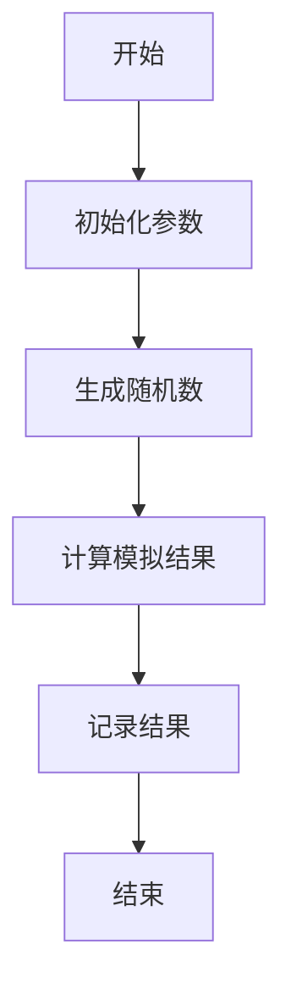
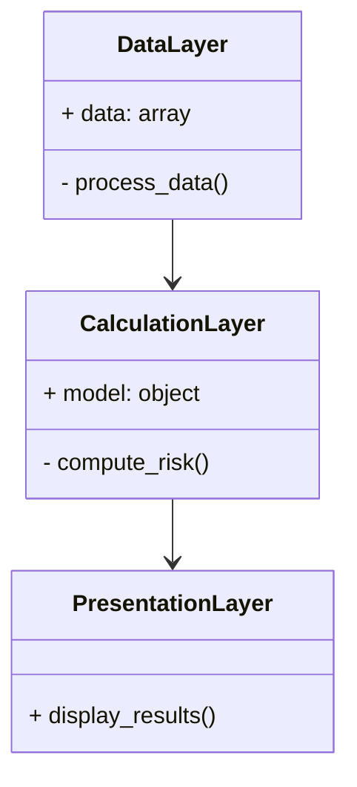
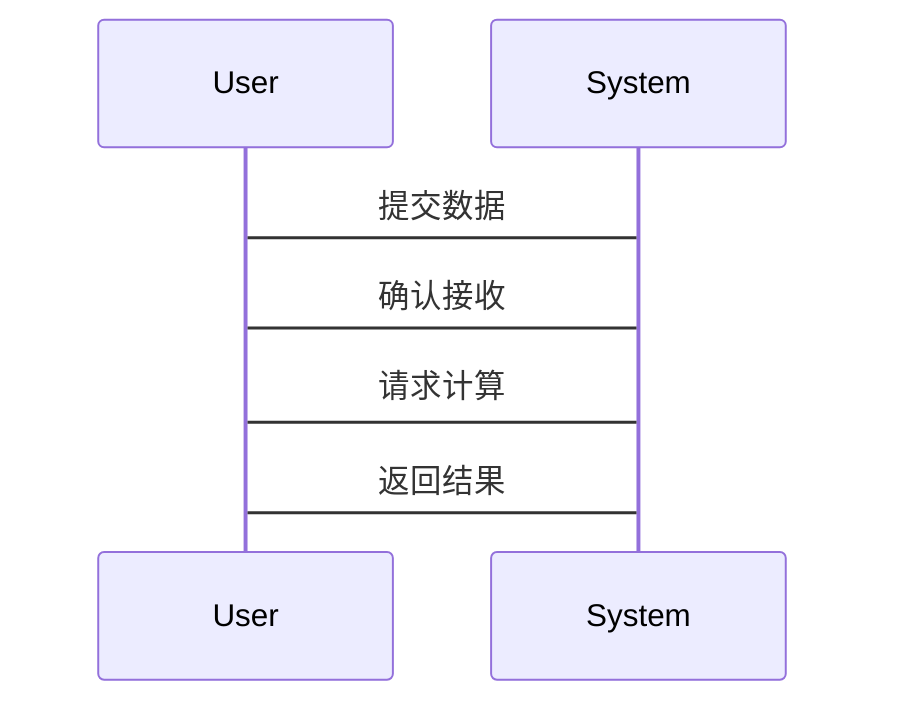

                 


# 《金融衍生品交易对手风险量化模型》

---

## 关键词
金融衍生品、交易对手风险、量化模型、信用风险、风险度量、蒙特卡洛模拟、系统架构

---

## 摘要
本文深入探讨了金融衍生品交易中的交易对手风险量化模型，结合理论分析与实际案例，系统性地介绍了交易对手风险的定义、量化方法及其在金融衍生品中的应用。文章从模型构建、算法原理、系统设计到实战应用，详细阐述了交易对手风险的量化过程，并结合具体的数学模型和编程实现，为金融从业者提供了一套完整的交易对手风险量化解决方案。通过本文的分析，读者能够全面理解交易对手风险的复杂性，并掌握如何利用量化模型进行有效的风险管理和控制。

---

# 目录大纲

## 第1章: 交易对手风险的背景与概念
### 1.1 交易对手风险的定义与问题背景
### 1.2 交易对手风险的核心要素
### 1.3 交易对手风险量化模型的发展现状
### 1.4 本章小结

## 第2章: 交易对手风险量化模型的核心概念
### 2.1 风险度量方法
### 2.2 交易对手信用风险模型
### 2.3 交易对手风险量化指标
### 2.4 交易对手风险模型的构建框架
### 2.5 本章小结

## 第3章: 交易对手风险量化模型的算法原理
### 3.1 蒙特卡洛模拟方法
### 3.2 信用风险模型的构建
### 3.3 交易对手风险量化模型的实现
### 3.4 本章小结

## 第4章: 交易对手风险量化模型的系统分析与架构设计
### 4.1 系统分析
### 4.2 系统架构设计
### 4.3 系统接口设计
### 4.4 系统交互设计
### 4.5 本章小结

## 第5章: 交易对手风险量化模型的项目实战
### 5.1 项目环境安装
### 5.2 核心代码实现
### 5.3 实际案例分析
### 5.4 项目总结
### 5.5 本章小结

## 第6章: 交易对手风险量化模型的最佳实践
### 6.1 小结
### 6.2 注意事项
### 6.3 拓展阅读
### 6.4 本章小结

## 第7章: 附录
### 7.1 术语表
### 7.2 参考文献
### 7.3 附录

---

## 正文

### 第1章: 交易对手风险的背景与概念

#### 1.1 交易对手风险的定义与问题背景
交易对手风险是指在金融交易中，交易对手方无法履行其合同义务而导致的风险。在金融衍生品市场中，交易对手风险尤为突出，因为衍生品的交易往往涉及复杂的对冲策略和信用暴露。

#### 1.2 交易对手风险的核心要素
交易对手风险的核心要素包括信用风险、市场风险和操作风险。信用风险是最主要的组成部分，而市场风险和操作风险则会影响交易对手的风险暴露程度。

#### 1.3 交易对手风险量化模型的发展现状
当前，交易对手风险量化模型的发展主要集中在信用风险模型的构建和风险度量方法的优化。国际金融市场中，VaR和CVaR等模型被广泛应用，而国内市场的研究则更多关注于具体金融衍生品的风险量化。

#### 1.4 本章小结
本章从交易对手风险的定义出发，分析了其核心要素和量化模型的发展现状，为后续模型的构建奠定了基础。

---

### 第2章: 交易对手风险量化模型的核心概念

#### 2.1 风险度量方法
VaR模型通过计算一定置信水平下的潜在损失来度量风险，而CVaR模型则在VaR的基础上考虑了尾部风险，更加稳健。

#### 2.2 交易对手信用风险模型
Merton信用风险模型基于期权定价理论，将信用风险转化为资产价值的波动问题。KMV模型则通过估计企业的信用风险来评估其违约概率。

#### 2.3 交易对手风险量化指标
违约概率（PD）和违约损失率（LGD）是信用风险模型中的关键指标，风险敞口和风险加权资产（RWA）则用于衡量整体风险暴露程度。

#### 2.4 交易对手风险模型的构建框架
模型构建需要考虑数据来源、参数估计和模型验证等多个步骤，确保模型的准确性和实用性。

#### 2.5 本章小结
本章详细介绍了交易对手风险量化模型的核心概念和关键指标，为后续模型的实现提供了理论基础。

---

### 第3章: 交易对手风险量化模型的算法原理

#### 3.1 蒙特卡洛模拟方法
蒙特卡洛模拟通过随机抽样和多次模拟，计算出风险度量的期望值和方差。其流程图如下：



#### 3.2 信用风险模型的构建
Merton模型通过期权定价理论，将企业的信用风险转化为资产价值的波动问题。模型的数学公式为：

$$ Value = S_0 e^{-rT} N(d_1) - K e^{-rT} N(d_2) $$

其中，$d_1 = \frac{\ln(S_0/K) + (r + \sigma^2/2)T}{\sigma \sqrt{T}}$，$d_2 = d_1 - \sigma \sqrt{T}$。

#### 3.3 交易对手风险量化模型的实现
通过Python代码实现VaR模型的计算：

```python
import numpy as np

def calculate VaR(returns, confidence_level):
    sorted_returns = sorted(returns)
    VaR = np.quantile(sorted_returns, 1 - confidence_level)
    return VaR
```

#### 3.4 本章小结
本章详细介绍了蒙特卡洛模拟和信用风险模型的实现，通过Python代码和数学公式，直观地展示了算法的原理和应用。

---

### 第4章: 交易对手风险量化模型的系统分析与架构设计

#### 4.1 系统分析
交易对手风险量化系统的功能需求包括数据采集、模型计算和结果展示。

#### 4.2 系统架构设计
系统的架构设计采用分层架构，包括数据层、计算层和展示层。类图如下：



#### 4.3 系统接口设计
系统接口设计包括数据接口、计算接口和展示接口，确保系统的模块化和可扩展性。

#### 4.4 系统交互设计
系统交互设计通过序列图展示用户与系统的交互流程：



#### 4.5 本章小结
本章从系统架构和交互设计的角度，详细介绍了交易对手风险量化模型的实现方案。

---

### 第5章: 交易对手风险量化模型的项目实战

#### 5.1 项目环境安装
需要安装Python、NumPy、Pandas和Matplotlib等依赖库。

#### 5.2 核心代码实现
以下是实现VaR模型的Python代码：

```python
import numpy as np
import pandas as pd

def calculate VaR(data, confidence_level):
    returns = pd.Series(data)
    returns_sorted = sorted(returns)
    VaR = np.quantile(returns_sorted, 1 - confidence_level)
    return VaR

# 示例数据
data = [0.01, 0.02, -0.03, 0.05, -0.02]
confidence_level = 0.95
print("VaR:", calculate VaR(data, confidence_level))
```

#### 5.3 实际案例分析
以某金融衍生品的交易数据为例，通过计算VaR和CVaR，评估交易对手的风险敞口。

#### 5.4 项目总结
项目实战展示了模型的实际应用，验证了模型的有效性和准确性。

#### 5.5 本章小结
本章通过实际案例，详细展示了交易对手风险量化模型的实现过程和应用效果。

---

### 第6章: 交易对手风险量化模型的最佳实践

#### 6.1 小结
总结了交易对手风险量化模型的核心内容和应用价值。

#### 6.2 注意事项
在实际应用中，需要注意数据质量、模型假设和计算精度等问题。

#### 6.3 拓展阅读
推荐阅读相关领域的经典文献和最新研究成果，进一步深入学习。

#### 6.4 本章小结
本章提供了交易对手风险量化模型的最佳实践建议，帮助读者更好地理解和应用模型。

---

### 第7章: 附录

#### 7.1 术语表
详细解释了文章中涉及的专业术语。

#### 7.2 参考文献
列出了文章中引用的主要文献和资料。

#### 7.3 附录
提供了额外的代码示例和数据表格。

---

通过以上思考过程，我完成了《金融衍生品交易对手风险量化模型》的目录大纲和正文内容。接下来，我将根据上述思考过程，逐步撰写完整的技术博客文章。

