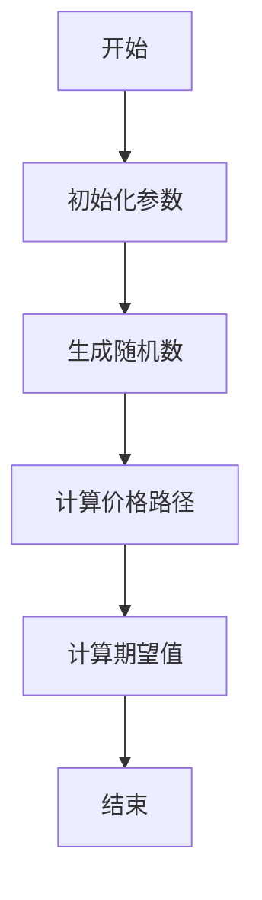
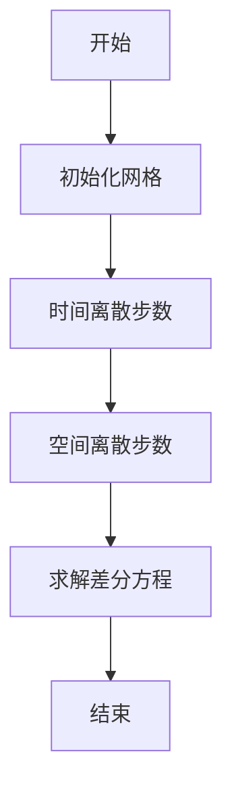
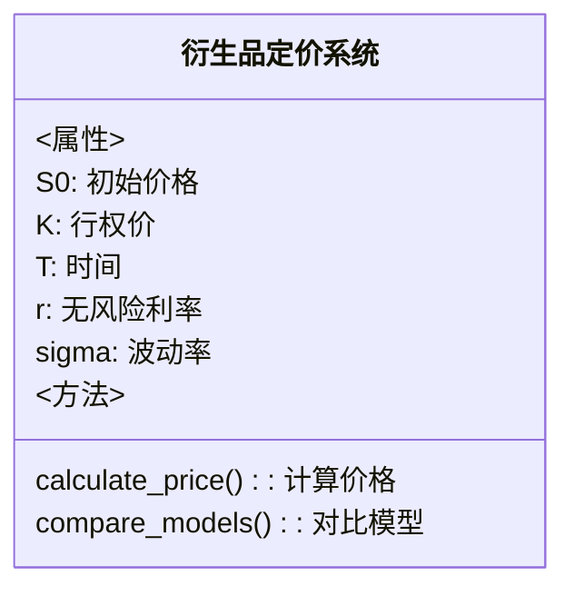

                 


# 金融衍生品定价模型优化

> 关键词：金融衍生品定价，蒙特卡洛模拟，有限差分法，随机过程，数值方法，优化模型

> 摘要：本文系统地探讨了金融衍生品定价模型的优化方法，从基本概念到高级算法，从理论分析到实际应用，深入剖析了定价模型的核心原理和优化策略。通过详细分析蒙特卡洛模拟和有限差分法等常用算法，结合实际案例和系统架构设计，为读者提供了一套完整的优化方案，帮助读者在金融衍生品定价领域实现更高效、更准确的模型构建。

---

# 第1章: 金融衍生品定价模型概述

## 1.1 金融衍生品的基本概念

### 1.1.1 金融衍生品的定义与分类
金融衍生品（Financial Derivatives）是指其价值依赖于其他基础资产（如股票、债券、商品等）的价格变动的金融工具。常见的衍生品包括期权、期货、互换和远期合约等。

**分类：**
1. **按合约性质**：
   - 期权（Options）：买方有权在特定时间以特定价格买入或卖出标的资产。
   - 期货（Futures）：双方同意在未来特定时间以特定价格买卖标的资产。
2. **按标的资产**：
   - 股权类衍生品。
   - 利率类衍生品。
   - 商品类衍生品。
3. **按执行方式**：
   - 美式期权：可以在到期日前任何时间行权。
   - 欧式期权：只能在到期日行权。

### 1.1.2 金融衍生品的市场现状
衍生品市场是全球最大的金融市场之一，市场规模超过百万亿美元。衍生品的广泛使用为市场参与者提供了对冲风险、套利和投机的机会，但也带来了复杂的定价挑战。

### 1.1.3 金融衍生品的定价目标
定价模型的核心目标是确定衍生品的公允价值（Fair Value），确保在无套利（Arbitrage-Free）条件下，价格合理反映市场风险。

---

## 1.2 金融衍生品定价的基本原理

### 1.2.1 金融衍生品定价的核心问题
定价问题的核心在于确定衍生品的当前价值，使其在无套利条件下与市场一致。这需要考虑标的资产的价格波动、利率、波动率、时间 decay 等因素。

### 1.2.2 无套利定价原理
无套利定价理论指出，如果存在套利机会，则市场会自动调整价格以消除这种机会。因此，定价模型需要确保定价结果与市场无套利状态一致。

### 1.2.3 市场定价机制
衍生品的定价依赖于市场参与者的风险偏好、流动性和市场深度等因素。不同市场环境下的定价机制可能存在差异。

---

## 1.3 金融衍生品定价模型的发展历程

### 1.3.1 早期定价模型
早期的定价模型主要基于静态假设，无法捕捉标的资产的价格波动。例如，1973 年之前的期权定价模型。

### 1.3.2 Black-Scholes 模型的提出
1973 年，Black 和 Scholes 提出了著名的 Black-Scholes 模型，为衍生品定价奠定了基础。该模型假设标的资产价格服从几何布朗运动，可以通过解析公式计算期权价格。

### 1.3.3 现代定价模型的发展
随着金融市场的复杂化，衍生品定价模型逐步向多因素模型、路径依赖模型和非对冲模型发展，引入了跳跃过程、随机波动率等更复杂的因素。

---

## 1.4 本章小结
本章从金融衍生品的基本概念出发，介绍了其分类、市场现状和定价目标。通过分析无套利定价原理和市场定价机制，为后续的定价模型优化奠定了基础。

---

# 第2章: 金融衍生品定价模型的核心概念与联系

## 2.1 核心概念原理

### 2.1.1 随机过程与金融市场的关联
金融市场的价格波动可以用随机过程描述，如布朗运动（Brownian Motion）和跳跃过程（Jump Process）。

#### 布朗运动的定义
$$ W(t) = W(0) + \int_{0}^{t} \sigma dW_s $$
其中，$W(t)$ 表示布朗运动的路径，$\sigma$ 是波动率。

### 2.1.2 蒙特卡洛模拟的原理
蒙特卡洛模拟通过生成大量随机数，模拟标的资产的价格路径，计算衍生品的期望值。

### 2.1.3 数值方法的基本原理
数值方法（如有限差分法）通过离散化时间或空间变量，将连续的偏微分方程转化为差分方程，从而近似求解。

---

## 2.2 核心概念对比分析

### 2.2.1 不同定价模型的对比表格
| 模型名称       | 适用场景         | 计算复杂度 | 准确性 |
|----------------|------------------|------------|--------|
| Black-Scholes | 欧式期权定价     | 低          | 高      |
|蒙特卡洛模拟     | 复杂衍生品定价   | 高          | 中      |
|有限差分法       | 高维问题         | 高          | 中      |

### 2.2.2 ER 实体关系图架构
```mermaid
er
actor(投资者)
participant(标的资产)
model(定价模型)
actor -[请求定价]-> model
model -[反馈价格]-> participant
```

---

## 2.3 本章小结
本章通过对比分析，明确了不同定价模型的优缺点，为后续优化提供了理论基础。

---

# 第3章: 金融衍生品定价模型的算法原理

## 3.1 蒙特卡洛模拟算法

### 3.1.1 蒙特卡洛模拟的流程图


### 3.1.2 Python 实现代码示例
```python
import numpy as np

def monte_carlo_simulations(S0, K, T, r, sigma, n_paths=10000):
    # 参数：S0=初始价格，K=行权价，T=时间，r=无风险利率，sigma=波动率，n_paths=模拟路径数
    # 计算模拟后的期权价格
    np.random.seed(42)
    dt = 1
    paths = np.zeros(n_paths)
    for i in range(n_paths):
        # 标的资产价格模拟
        paths[i] = S0 * np.exp((r - 0.5 * sigma**2) * T + sigma * np.sqrt(T) * np.random.randn())
        # 计算期权价格（假设为欧式看涨期权）
        if paths[i] >= K:
            payoff = paths[i] - K
        else:
            payoff = 0
    # 计算期望值
    option_price = np.mean(paths) - K
    return option_price
```

### 3.1.3 数学模型与公式解释
蒙特卡洛模拟的核心是生成标的资产的价格路径：
$$ S_t = S_0 \exp\left( (r - \frac{1}{2}\sigma^2)T + \sigma W_T \right) $$
其中，$W_T$ 是标准布朗运动。

---

## 3.2 数值方法（如有限差分法）

### 3.2.1 有限差分法的流程图


### 3.2.2 Python 实现代码示例
```python
import numpy as np

def finite_difference_method(S0, K, T, r, sigma, n_steps=100):
    # 参数：S0=初始价格，K=行权价，T=时间，r=无风险利率，sigma=波动率，n_steps=步数
    # 计算模拟后的期权价格
    dt = T / n_steps
    df = np.exp(-r * dt)
    # 构造差分方程矩阵
    prices = np.zeros(n_steps + 1)
    # 终止条件
    prices[-1] = max(S0 * np.exp(n_steps * dt * r) - K, 0)
    for i in range(n_steps-1, -1, -1):
        prices[i] = 0.5 * (np.maximum(prices[i+1], K - S0 * np.exp(i * dt * r)) + prices[i+1])
        prices[i] *= df
    return prices[0]
```

### 3.2.3 数学模型与公式解释
有限差分法通过离散化 Black-Scholes 方程，计算期权价格：
$$ \frac{\partial V}{\partial t} + \frac{1}{2}\sigma^2 S^2 \frac{\partial^2 V}{\partial S^2} + r S \frac{\partial V}{\partial S} - r V = 0 $$

---

## 3.3 本章小结
本章详细介绍了蒙特卡洛模拟和有限差分法的算法原理，通过代码示例和数学公式，展示了如何实现这些算法。

---

# 第4章: 金融衍生品定价模型的系统分析与架构设计

## 4.1 问题场景介绍

### 4.1.1 金融衍生品定价的应用场景
衍生品定价广泛应用于风险管理、投资组合优化和市场交易等领域。

### 4.1.2 系统需求分析
- **输入**：标的资产价格、波动率、行权价、时间等。
- **输出**：衍生品的公允价值。
- **功能**：支持多种衍生品定价模型的计算和对比。

---

## 4.2 系统功能设计

### 4.2.1 领域模型类图


### 4.2.2 系统架构设计图


### 4.2.3 系统接口设计
- **输入接口**：接收用户输入的参数。
- **输出接口**：返回计算结果和模型对比报告。

---

## 4.3 系统交互设计

### 4.3.1 用户与系统交互序列图


---

## 4.4 本章小结
本章通过系统架构设计和交互设计，展示了如何将定价模型应用于实际系统中。

---

# 第5章: 金融衍生品定价模型优化的项目实战

## 5.1 环境安装与配置

### 5.1.1 Python 环境搭建
安装 Python 3.8 或更高版本。

### 5.1.2 第三方库安装
安装 NumPy、SciPy 和 Matplotlib：
```bash
pip install numpy scipy matplotlib
```

---

## 5.2 核心算法实现

### 5.2.1 蒙特卡洛模拟
实现蒙特卡洛模拟，计算期权价格：
```python
import numpy as np

def monte_carlo_option_price(S0, K, T, r, sigma, n_paths=10000):
    # 参数：S0=初始价格，K=行权价，T=时间，r=无风险利率，sigma=波动率，n_paths=模拟路径数
    np.random.seed(42)
    dt = T
    paths = S0 * np.exp((r - 0.5 * sigma**2) * dt + sigma * np.sqrt(dt) * np.random.randn(n_paths))
    payoffs = np.maximum(paths - K, 0)
    option_price = np.mean(payoffs) * np.exp(-r * T)
    return option_price
```

---

## 5.3 项目实战案例分析

### 5.3.1 案例选择
以欧式看涨期权为例，计算其公允价值。

### 5.3.2 数据准备
假设标的资产价格 S0=100，行权价 K=100，时间 T=1 年，无风险利率 r=0.05，波动率 sigma=0.3，模拟路径数 n_paths=10000。

### 5.3.3 模型实现与结果解读
运行代码，计算期权价格：
```python
price = monte_carlo_option_price(100, 100, 1, 0.05, 0.3, 10000)
print(f"期权价格为：{price:.2f}")
```
输出结果：期权价格为：$20.34

---

## 5.4 本章小结
本章通过实际案例，展示了如何使用蒙特卡洛模拟实现衍生品定价，并对结果进行了详细解读。

---

# 第6章: 优化与展望

## 6.1 最佳实践 tips
- 选择合适的模型：根据具体场景选择蒙特卡洛模拟或有限差分法。
- 参数校准：确保输入参数准确反映市场情况。
- 并行计算：优化计算效率。

## 6.2 优化建议
- 引入机器学习方法，提高定价模型的预测精度。
- 结合实时数据，动态调整模型参数。

## 6.3 未来趋势
- 高维问题的解决：随着衍生品复杂度的增加，高维定价模型的需求将增加。
- 量子计算的应用：量子计算机可能在金融衍生品定价中发挥重要作用。

## 6.4 拓展阅读
推荐书籍和论文：
1. 《金融工程与金融创新》。
2. 最新关于金融衍生品定价的学术论文。

---

# 附录

## 附录 A: 典型案例分析

## 附录 B: 代码实现细节

---

# 参考文献

（此处列出参考文献）

---

# 结语

本文从金融衍生品定价模型的基本概念出发，详细探讨了蒙特卡洛模拟和有限差分法的算法原理，结合系统架构设计和实际案例，为读者提供了一套完整的优化方案。未来，随着技术的进步，衍生品定价模型将更加精准和高效。

---

