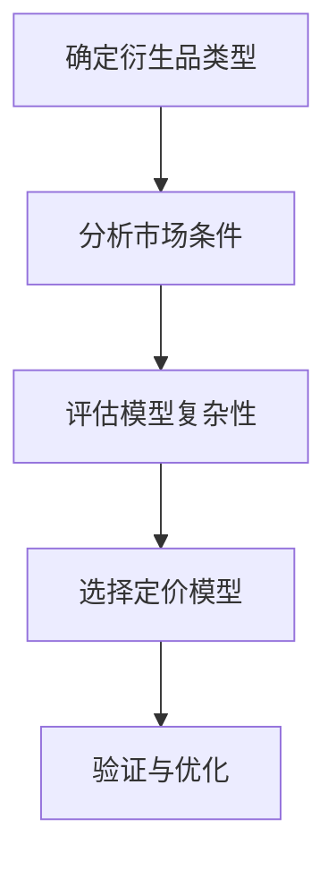
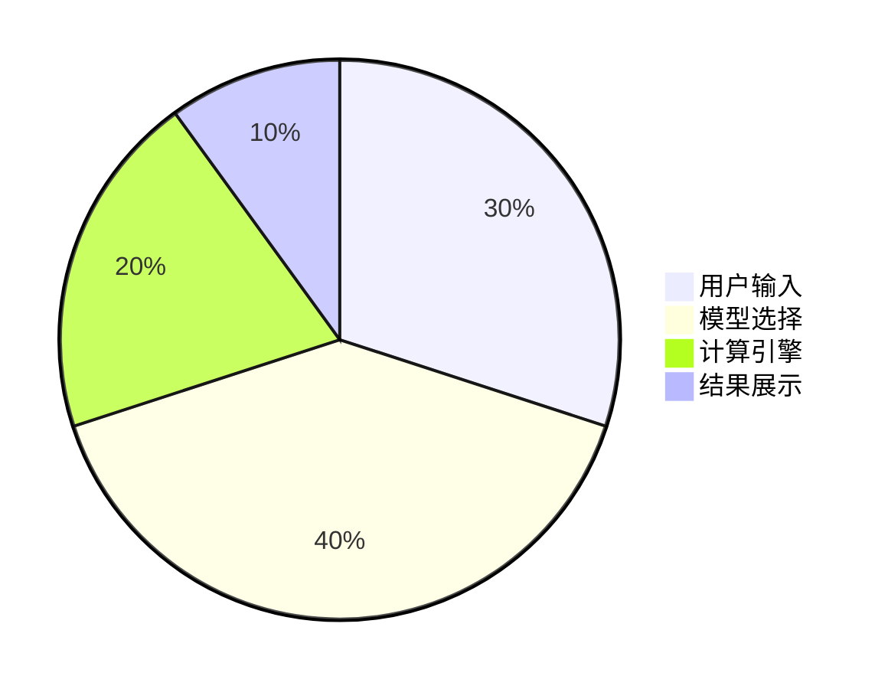

                 


# 金融衍生品定价模型比较与选择框架

> 关键词：金融衍生品，定价模型，Black-Scholes，蒙特卡罗模拟，风险管理

> 摘要：本文系统地分析了金融衍生品定价模型的核心原理、应用场景及其优缺点，并提出了一个基于需求的定价模型选择框架。通过对多种定价模型的比较，本文旨在为金融从业者提供一个清晰的指导，帮助其在复杂的金融市场中做出最优的定价决策。

---

# 第一部分: 金融衍生品定价模型背景与概述

## 第1章: 金融衍生品与定价模型概述

### 1.1 金融衍生品的基本概念

金融衍生品（Financial Derivatives）是基于基础资产（如股票、债券、外汇等）的衍生金融工具。其价值来源于基础资产的价格波动，常见的金融衍生品包括期权、期货、掉期和 warrants 等。

- **定义**：金融衍生品是一种合约，其价值取决于基础资产的价格或利率等变量。
- **分类**：根据执行价格和到期日是否固定，衍生品可以分为欧式期权（European Option）和美式期权（American Option）。
- **市场现状**：衍生品市场是全球最大的金融市场之一，市场规模超过 100 万亿美元。

### 1.2 定价模型在金融衍生品中的作用

定价模型是金融衍生品的核心工具，用于计算其理论价值。准确的定价不仅有助于风险管理，还能帮助投资者做出明智的决策。

- **基本原理**：定价模型通过数学公式，将标的资产的价格波动性、时间因素和风险偏好转化为衍生品的理论价格。
- **风险管理**：定价模型是风险管理和对冲策略的基础，帮助金融机构规避市场波动带来的风险。
- **投资决策**：投资者可以通过定价模型评估衍生品的价值，寻找套利机会或优化投资组合。

### 1.3 本文的研究意义与目标

本文旨在通过分析多种定价模型的优缺点，构建一个基于需求的定价模型选择框架。我们的目标是帮助金融从业者快速选择适合其应用场景的定价模型。

- **研究背景**：金融市场复杂多变，选择合适的定价模型对准确定价至关重要。
- **研究目标**：通过比较分析，提出一个灵活的定价模型选择框架。
- **创新点**：本文不仅比较了传统定价模型，还探讨了新兴模型的应用场景。

---

# 第二部分: 金融衍生品定价模型的核心概念与联系

## 第2章: 金融衍生品定价模型的核心概念

### 2.1 金融衍生品定价的基本原理

定价模型的数学基础包括概率论、随机微分方程和统计学。以下是定价模型的关键要素：

- **随机过程**：金融市场的波动可以用布朗运动或马尔可夫过程建模。
- **风险中性定价**：在风险中性世界中，投资者的风险偏好被调整为无风险利率。
- **套利原理**：通过套利机会消除市场不一致性，确保定价的合理性。

### 2.2 定价模型的数学基础

#### 2.2.1 概率论与统计学基础

概率论是定价模型的理论基础，而统计学则用于模型的参数估计和验证。

- **常见概率分布**：
  - 正态分布：适用于标的资产价格的连续波动。
  - 泊松分布：适用于跳跃过程的建模。
  - 对数正态分布：常用于股票价格模型。

#### 2.2.2 随机微分方程

随机微分方程（SDE）是金融数学的核心工具，用于描述标的资产的价格过程。

$$ dS_t = \mu S_t dt + \sigma S_t dW_t $$

其中：
- \( S_t \)：资产价格
- \( \mu \)：漂移系数
- \( \sigma \)：波动率
- \( W_t \)：布朗运动

### 2.3 金融衍生品定价的核心要素

#### 2.3.1 标的资产价格的波动性

波动率是定价模型的关键参数，影响衍生品的理论价格和风险敞口。

- **隐含波动率**：通过市场价倒推出波动率。
- **历史波动率**：基于历史价格数据计算得出。

#### 2.3.2 时间价值与内在价值

- **内在价值**：衍生品在到期时的理论价值。
- **时间价值**：期权的时间价值随着到期日的临近而减少。

### 2.4 定价模型的分类与对比

#### 2.4.1 理论模型与数值模型的对比

| 模型类型       | 描述                                   | 优点                       | 缺点                       |
|----------------|--------------------------------------|----------------------------|--------------------------|
| 理论模型       | 通过数学推导得出闭式解               | 精确、计算速度快             | 仅适用于简单场景         |
| 数值模型       | 使用数值方法（如蒙特卡罗模拟）求解   | 适用于复杂场景               | 计算成本高               |

---

# 第三部分: 金融衍生品定价模型的比较分析

## 第3章: 主流定价模型的原理与实现

### 3.1 Black-Scholes模型

#### 3.1.1 模型的基本假设

- 标的资产价格遵循几何布朗运动。
- 无股息支付。
- 无交易成本和税收。
- 市场无套利机会。

#### 3.1.2 模型的数学公式与推导

Black-Scholes 期权定价公式为：

$$ C = S_0 N(d_1) - K e^{-rT} N(d_2) $$

其中：
- \( C \)：欧式看涨期权的价格
- \( S_0 \)：标的资产当前价格
- \( K \)：行权价格
- \( r \)：无风险利率
- \( T \)：到期时间
- \( N(d) \)：标准正态分布的累积分布函数
- \( d_1 = \frac{\ln(S_0/K) + (r + \frac{\sigma^2}{2})T}{\sigma \sqrt{T}} \)
- \( d_2 = d_1 - \sigma \sqrt{T} \)

#### 3.1.3 模型的实现与应用

通过 Python 实现 Black-Scholes 模型：

```python
import numpy as np
from scipy.stats import norm

def black_scholes(S, K, r, sigma, T):
    t = T
    d1 = (np.log(S/K) + (r + sigma**2/2)*t) / (sigma*np.sqrt(t))
    d2 = d1 - sigma*np.sqrt(t)
    C = S*norm.cdf(d1) - K*np.exp(-r*t)*norm.cdf(d2)
    return C

# 示例
S = 100
K = 100
r = 0.05
sigma = 0.2
T = 1
print(black_scholes(S, K, r, sigma, T))
```

---

### 3.2 蒙特卡罗模拟

#### 3.2.1 模拟的基本原理

蒙特卡罗模拟通过随机采样计算衍生品的期望值。

$$ E[V] = \frac{1}{N} \sum_{i=1}^N V(S_i, \omega_i) $$

其中：
- \( V \)：衍生品的价值
- \( S_i \)：模拟的标的资产价格
- \( \omega_i \)：随机数

#### 3.2.2 模拟的实现步骤

1. 生成随机数。
2. 计算标的资产的模拟价格。
3. 计算衍生品的理论价格。
4. 计算期望值和方差。

#### 3.2.3 模拟的优缺点分析

| 优点         | 缺点         |
|--------------|--------------|
| 适用于高维问题 | 计算成本高     |
| 灵活性高       | 结果的不确定性 |

---

### 3.3 差异化定价模型

#### 3.3.1 模型的理论基础

差异化定价模型根据市场条件和投资者行为调整定价参数。

#### 3.3.2 模型的数学公式与实现

差异化模型通常基于扩展的随机过程，例如：

$$ dS_t = \mu(S_t, t) dt + \sigma(S_t, t) dW_t $$

#### 3.3.3 模型的适用场景与局限性

- **适用场景**：复杂市场环境，如跳跃过程或极端波动。
- **局限性**：模型复杂，参数估计困难。

---

# 第四部分: 金融衍生品定价模型的选择框架

## 第4章: 定价模型的选择框架

### 4.1 定价模型选择的步骤

1. **确定需求**：明确衍生品类型和市场条件。
2. **分析模型特性**：评估模型的适用性和复杂性。
3. **选择模型**：根据需求匹配模型。
4. **验证模型**：通过回测和参数调整优化模型。

### 4.2 基于需求的模型选择流程



---

## 第5章: 系统分析与架构设计方案

### 5.1 问题场景介绍

金融机构需要一个灵活的系统，支持多种定价模型的选择与实现。

### 5.2 系统功能设计

- **用户界面**：允许用户选择模型并输入参数。
- **计算引擎**：实现多种定价模型。
- **结果展示**：可视化定价结果和分析报告。

### 5.3 系统架构设计



---

## 第6章: 项目实战

### 6.1 环境安装

安装 Python 和相关库：

```bash
pip install numpy scipy matplotlib
```

### 6.2 核心实现

实现一个多模型定价系统：

```python
class PricingEngine:
    def __init__(self):
        self.models = {'bs': BlackScholes, 'mc': MonteCarlo}

    def price(self, model_name, **params):
        return self.models[model_name](**params)
```

### 6.3 实际案例分析

案例：计算一个欧式期权的价格。

```python
engine = PricingEngine()
price = engine.price('bs', S=100, K=100, r=0.05, sigma=0.2, T=1)
print(price)
```

---

## 第7章: 总结与展望

### 7.1 主要观点回顾

- 不同定价模型适用于不同的市场条件和衍生品类型。
- 选择合适的模型需要考虑需求、复杂性和计算成本。

### 7.2 未来展望

未来，随着人工智能的发展，动态定价模型和自适应算法将更加重要。

### 7.3 最佳实践 tips

- 保持对市场的敏感性，及时调整定价模型。
- 定期回测模型，确保其有效性。

---

通过本文的分析，读者可以更好地理解金融衍生品定价模型的选择与应用。希望本文能为金融从业者提供有价值的参考和指导。

