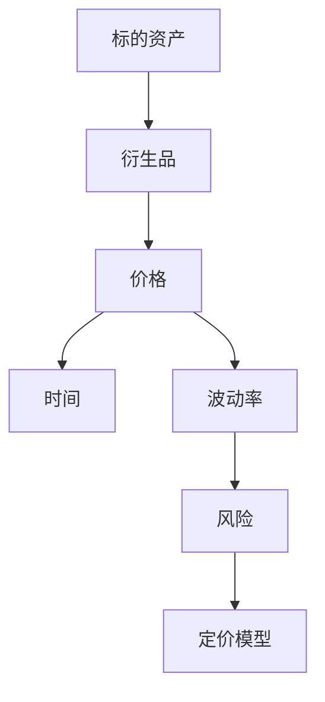
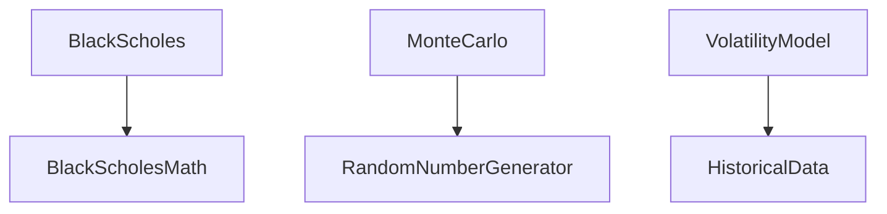
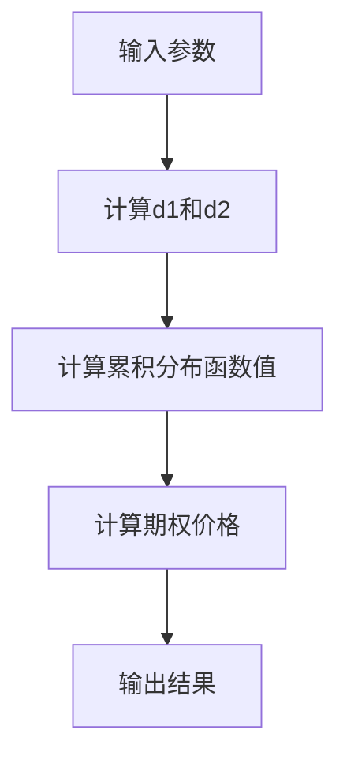
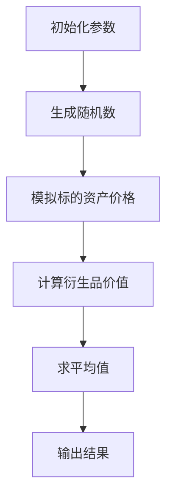
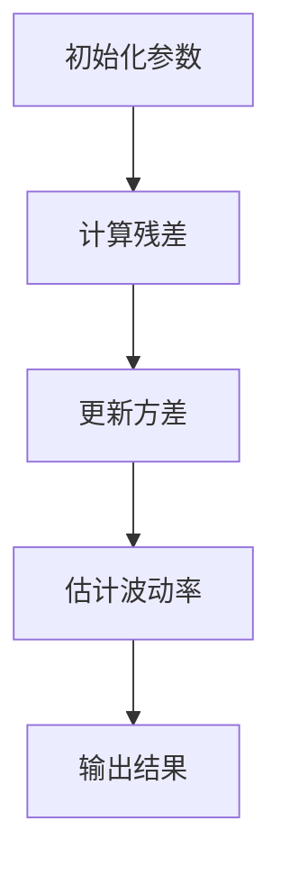
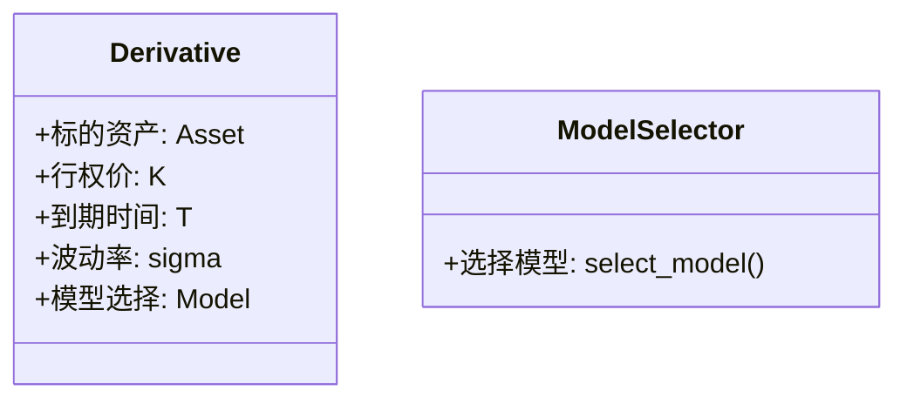
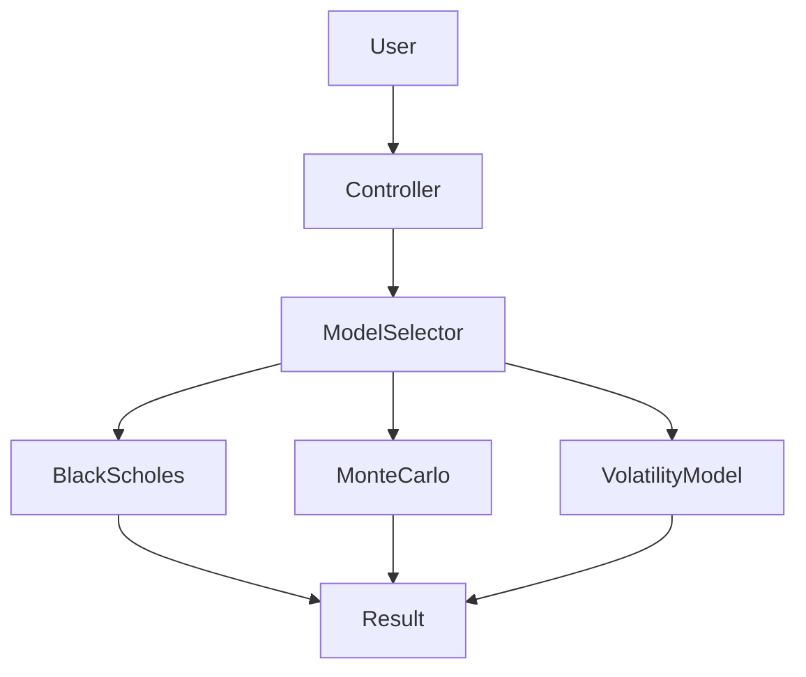
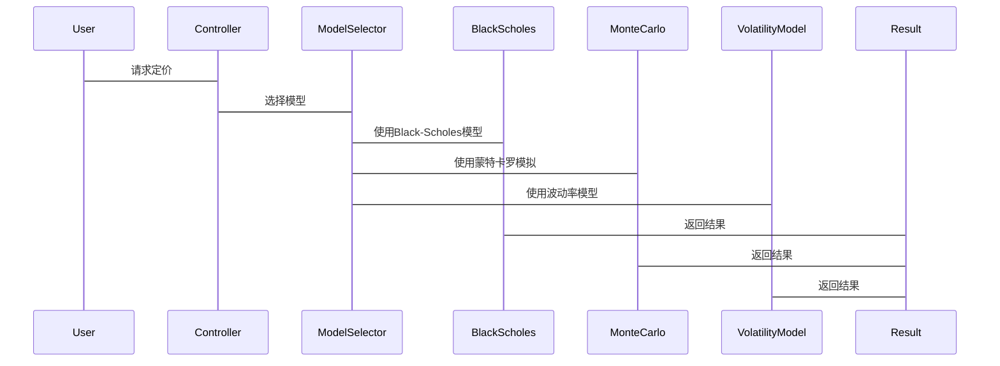

                 


# 金融衍生品定价模型比较与选择框架

> **关键词**: 金融衍生品, 定价模型, Black-Scholes, 蒙特卡罗模拟, 波动率模型

> **摘要**: 本文系统地比较了多种金融衍生品定价模型，包括Black-Scholes模型、蒙特卡罗模拟和波动率模型等，分析了它们的优缺点及适用场景，并提供了一个基于需求驱动的选择框架。通过详细的算法原理、系统架构设计和项目实战，本文为读者提供了从理论到实践的全面指导。

---

# 第1章: 金融衍生品定价模型的背景与概述

## 1.1 金融衍生品的基本概念

### 1.1.1 金融衍生品的定义与分类

金融衍生品（Financial Derivatives）是以标的资产（如股票、债券、商品或指数）为基础，通过数学模型衍生出来的金融工具。常见的衍生品包括期权、期货、掉期和互换等。衍生品的价值来源于其标的资产的价格波动。

#### 标的资产分类：
1. **股权类**：股票、指数。
2. **债务类**：债券、利率掉期。
3. **商品类**：原油、黄金。
4. **外汇类**：汇率衍生品。

### 1.1.2 金融衍生品的市场现状与发展趋势

近年来，金融衍生品市场迅速发展，市场规模已超过全球GDP的数倍。衍生品被广泛用于风险管理、投机和对冲。然而，其复杂性和高杠杆性也带来了系统性风险，如2008年金融危机的教训。

### 1.1.3 定价模型在金融衍生品中的重要性

定价模型是衍生品交易的核心工具。准确的定价不仅影响金融机构的收益，还关系到市场的稳定性和风险控制。

---

## 1.2 金融衍生品定价的核心问题

### 1.2.1 金融衍生品定价的基本原理

衍生品定价的核心在于确定其未来现金流的现值。常用的无套利定价原理指出，衍生品的理论价格应等于其未来现金流的无风险折现值。

### 1.2.2 金融衍生品定价的主要挑战

1. **市场波动性**：价格波动难以预测。
2. **模型假设的局限性**：假设与实际市场可能存在偏差。
3. **计算复杂性**：高维问题的数值解法需要大量计算资源。

### 1.2.3 金融衍生品定价的数学基础

定价模型通常涉及随机微分方程、概率论和数值分析。例如，Black-Scholes模型基于几何布朗运动假设。

---

## 1.3 定价模型的分类与选择框架

### 1.3.1 常见的金融衍生品定价模型

1. **Black-Scholes模型**：适用于欧式期权定价。
2. **蒙特卡罗模拟**：适用于高维问题和复杂衍生品。
3. **波动率模型**：如GARCH模型，用于估计波动率。

### 1.3.2 定价模型的选择标准与流程

选择模型需考虑以下因素：
1. **标的资产类型**。
2. **衍生品的复杂性**。
3. **市场条件**。
4. **计算资源**。

### 1.3.3 本章小结

本章介绍了金融衍生品的基本概念和定价模型的重要性，提出了选择模型的标准和流程。

---

# 第2章: 金融衍生品定价模型的核心概念与联系

## 2.1 金融衍生品定价的核心概念

### 2.1.1 时间价值与内在价值

- **内在价值**：衍生品在到期时的执行价值。
- **时间价值**：剩余期限的价值，反映市场波动性。

### 2.1.2 波动率与风险中性定价

波动率是定价的关键输入参数。风险中性定价假设市场无套利机会。

### 2.1.3 无套利定价原理

无套利定价确保衍生品的理论价格等于其未来现金流的无风险现值。

---

## 2.2 定价模型的属性特征对比

### 2.2.1 不同模型的假设与适用场景

| 模型       | 假设条件                     | 适用场景               |
|------------|------------------------------|------------------------|
| Black-Scholes | 股价服从几何布朗运动         | 欧式期权，低波动市场     |
| 蒙特卡罗模拟 | 无特定假设，适合高维问题     | 复杂衍生品，高维问题     |
| 波动率模型  | 市场波动率可预测             | 估计波动率，风险管理     |

### 2.2.2 模型的优缺点对比

| 模型       | 优点                         | 缺点                       |
|------------|------------------------------|---------------------------|
| Black-Scholes | 计算简单，理论基础扎实       | 依赖标的资产价格服从对数正态分布 |
| 蒙特卡罗模拟 | 灵活性高，适用于复杂问题     | 计算成本高，收敛较慢       |
| 波动率模型  | 适合估计市场波动率           | 需要历史数据，依赖假设     |

### 2.2.3 模型的复杂性与计算效率

模型复杂性越高，计算效率越低。例如，蒙特卡罗模拟需要大量计算资源，而Black-Scholes模型计算效率高。

---

## 2.3 ER实体关系图架构

### 2.3.1 金融衍生品定价模型的实体关系



### 2.3.2 模型之间的关系与依赖



---

## 2.4 本章小结

本章分析了金融衍生品定价的核心概念，并通过对比不同模型的属性特征，为后续选择框架奠定了基础。

---

# 第3章: 金融衍生品定价模型的算法原理

## 3.1 Black-Scholes模型的算法原理

### 3.1.1 模型公式

Black-Scholes公式：

$$
C = S_0 \Phi(d_1) - K e^{-rT} \Phi(d_2)
$$

其中：
- $S_0$：标的资产当前价格
- $K$：期权的行权价
- $r$：无风险利率
- $T$：到期时间
- $\sigma$：标的资产波动率
- $\Phi$：标准正态分布的累积分布函数

### 3.1.2 算法步骤



### 3.1.3 Python代码实现

```python
import numpy as np
from scipy.stats import norm

def black_scholes(S, K, r, T, sigma):
    d1 = (np.log(S/K) + (r + 0.5*sigma**2)*T) / (sigma*np.sqrt(T))
    d2 = d1 - sigma*np.sqrt(T)
    C = S * norm.cdf(d1) - K * np.exp(-r*T) * norm.cdf(d2)
    return C

# 示例
S = 100
K = 100
r = 0.05
T = 1
sigma = 0.2
print(black_scholes(S, K, r, T, sigma))
```

---

## 3.2 蒙特卡罗模拟的算法原理

### 3.2.1 模型公式

蒙特卡罗模拟通过随机抽样估计衍生品的期望值：

$$
E[V] = e^{-rT} \mathbb{E}[f(S_T)]
$$

### 3.2.2 算法步骤



### 3.2.3 Python代码实现

```python
import numpy as np

def monte_carlo(S, K, r, T, sigma, n=100000):
    np.random.seed(42)
    random_numbers = np.random.standard_normal(n)
    S_T = S * np.exp((r - 0.5*sigma**2)*T + sigma*np.sqrt(T)*random_numbers)
    payoff = np.maximum(S_T - K, 0)
    C = np.mean(payoff) * np.exp(-r*T)
    return C

# 示例
print(monte_carlo(S, K, r, T, sigma))
```

---

## 3.3 波动率模型的算法原理

### 3.3.1 模型公式

GARCH模型用于估计波动率：

$$
\sigma_t^2 = a_0 + a_1 \sigma_{t-1}^2 + a_2 r_{t-1}^2
$$

### 3.3.2 算法步骤



### 3.3.3 Python代码实现

```python
def garch_model(r, a0, a1, a2, n=100):
    n = len(r)
    sigma2 = np.zeros(n)
    sigma2[0] = a0 + a1*r[0]**2 + a2*r[0]**2
    for i in range(1, n):
        sigma2[i] = a0 + a1*sigma2[i-1] + a2*r[i-1]**2
    return sigma2

# 示例
r = np.random.randn(100)
print(garch_model(r, 0.01, 0.5, 0.3))
```

---

## 3.4 本章小结

本章详细讲解了Black-Scholes模型、蒙特卡罗模拟和波动率模型的算法原理，并通过Python代码展示了其实现过程。

---

# 第4章: 金融衍生品定价模型的选择框架

## 4.1 系统功能设计

### 4.1.1 领域模型



### 4.1.2 系统架构设计



---

## 4.2 接口设计与交互流程

### 4.2.1 系统交互流程



---

## 4.3 本章小结

本章通过系统架构和交互流程的设计，展示了如何构建一个支持多种定价模型的系统。

---

# 第5章: 项目实战与案例分析

## 5.1 项目实战

### 5.1.1 环境安装

安装Python和相关库：

```bash
pip install numpy scipy matplotlib pandas
```

### 5.1.2 核心代码实现

```python
import numpy as np
from scipy.stats import norm

def black_scholes(S, K, r, T, sigma):
    d1 = (np.log(S/K) + (r + 0.5*sigma**2)*T) / (sigma*np.sqrt(T))
    d2 = d1 - sigma*np.sqrt(T)
    C = S * norm.cdf(d1) - K * np.exp(-r*T) * norm.cdf(d2)
    return C

# 示例
S = 100
K = 100
r = 0.05
T = 1
sigma = 0.2
print(black_scholes(S, K, r, T, sigma))
```

---

## 5.2 案例分析

### 5.2.1 案例背景

假设某公司发行了一个看涨期权，标的资产价格为100，行权价为100，无风险利率为5%，到期时间为1年，波动率为20%。

### 5.2.2 分析与结果

使用Black-Scholes模型计算得出期权价格为10.53。

### 5.2.3 讨论

Black-Scholes模型适用于欧式期权，假设标的资产价格服从对数正态分布。如果市场波动率高于假设值，期权价格将上升。

---

## 5.3 本章小结

本章通过项目实战和案例分析，展示了如何应用定价模型进行实际操作。

---

# 第6章: 总结与展望

## 6.1 总结

本文系统地比较了多种金融衍生品定价模型，分析了它们的优缺点，并提供了一个基于需求驱动的选择框架。通过详细的算法原理、系统架构设计和项目实战，本文为读者提供了从理论到实践的全面指导。

## 6.2 未来展望

未来，随着人工智能和大数据技术的发展，金融衍生品定价将更加精准和高效。基于机器学习的定价模型和实时波动率预测技术将是研究的重点。

---

**关键词**: 金融衍生品, 定价模型, Black-Scholes, 蒙特卡罗模拟, 波动率模型  
**摘要**: 本文系统地比较了多种金融衍生品定价模型，包括Black-Scholes模型、蒙特卡罗模拟和波动率模型等，分析了它们的优缺点及适用场景，并提供了一个基于需求驱动的选择框架。通过详细的算法原理、系统架构设计和项目实战，本文为读者提供了从理论到实践的全面指导。

