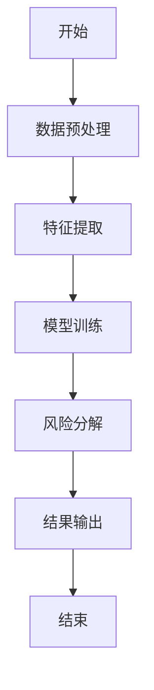
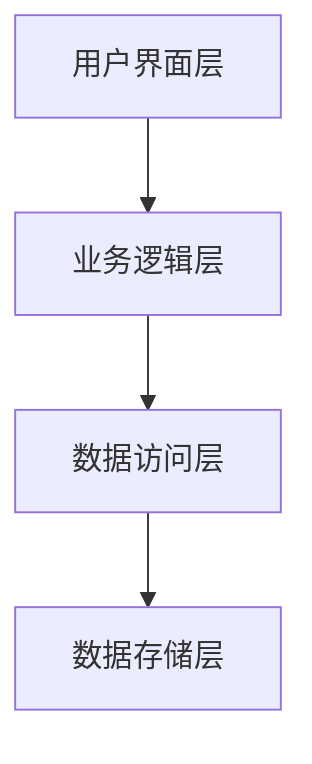

                 

# 《金融衍生品组合风险分解工具》

---

## 关键词：金融衍生品，风险分解，风险管理，组合风险，数学模型，工具开发

---

## 摘要：  
本文深入探讨了金融衍生品组合风险分解工具的设计与实现，从金融衍生品的基本概念出发，详细分析了组合风险分解的核心原理、数学模型与算法实现，并结合实际案例，展示了工具在金融风险管理中的应用场景。文章内容涵盖从理论到实践的全过程，旨在为金融从业者和软件开发人员提供一个清晰的指导框架，帮助他们更好地理解和应用金融衍生品组合风险分解工具。

---

# 第1章: 金融衍生品组合风险分解工具的背景与概念

## 1.1 金融衍生品的基本概念

### 1.1.1 金融衍生品的定义与分类

金融衍生品（Financial Derivatives）是一种以金融资产或金融变量为标的物的标准化合约，其价值取决于基础资产的价格变动。衍生品可以分为以下几类：

- **远期合约（Forwards）**：约定在未来某一特定时间以预定价格买卖资产的协议。
- **期货合约（Futures）**：标准化的远期合约，通常在交易所进行交易。
- **期权合约（Options）**：赋予买方在特定时间内以预定价格买入或卖出资产的权利。
- **掉期合约（Swaps）**：约定在未来某一时间交换资产或现金流的协议。

### 1.1.2 金融衍生品的主要类型

- **利率衍生品**：如利率期权、利率互换。
- **信用衍生品**：如信用违约互换（CDS）。
- **外汇衍生品**：如外汇期权、外汇期货。
- **股票衍生品**：如股票期权、认股权证。

### 1.1.3 金融衍生品的风险特征

金融衍生品的风险主要体现在以下几个方面：

- **价格波动风险**：衍生品的价值受市场波动影响较大。
- **信用风险**：交易对手可能无法履行合约。
- **流动性风险**：某些衍生品可能难以快速变现。
- **操作风险**：交易过程中的错误或欺诈行为。

---

## 1.2 组合风险分解的必要性

### 1.2.1 金融衍生品组合风险的复杂性

当投资者持有多个金融衍生品时，组合风险会显著增加。不同衍生品之间的价格变动可能存在相关性，导致整体风险难以直接评估。

### 1.2.2 金融衍生品组合风险分解的背景与意义

金融衍生品组合风险分解的目的是将组合的总风险分解为各个组成部分的风险，以便更精确地识别和管理风险来源。这有助于投资者更好地理解组合的风险构成，制定有效的风险管理策略。

### 1.2.3 组合风险分解的目标与边界

- **目标**：量化各个衍生品对组合整体风险的贡献。
- **边界**：不考虑市场以外的外部因素，仅分析衍生品本身的特性对风险的影响。

---

## 1.3 风险分解工具的核心概念

### 1.3.1 风险分解的基本原理

风险分解工具通过数学模型将组合的总风险分解为各个衍生品的风险贡献。常用的分解方法包括线性分解和非线性分解。

### 1.3.2 工具的功能与作用

- **数据输入与处理**：接收衍生品的市场数据和合约信息。
- **风险分解计算**：基于数学模型计算各衍生品的风险贡献。
- **结果展示与分析**：以图表和报告形式展示分解结果。

### 1.3.3 工具的适用场景与限制

- **适用场景**：适用于多个金融衍生品组合的风险管理。
- **限制**：不适用于极端市场条件或非线性风险的分析。

---

## 1.4 本章小结

本章介绍了金融衍生品的基本概念、组合风险分解的必要性以及风险分解工具的核心概念。下一章将深入探讨风险分解的核心原理，包括数学模型和算法实现。

---

# 第2章: 金融衍生品组合风险分解的核心原理

## 2.1 风险分解的基本方法

### 2.1.1 线性分解与非线性分解

- **线性分解**：假设风险贡献与衍生品的参数呈线性关系。
- **非线性分解**：考虑风险贡献的非线性关系，通常需要使用蒙特卡洛模拟等方法。

### 2.1.2 主成分分析法

主成分分析（PCA）是一种常用的风险分解方法，通过提取数据的主要特征来降低维度。

### 2.1.3 方差分解法

方差分解法通过分解组合的总方差，量化各衍生品对风险的贡献。

---

## 2.2 风险分解的数学模型与算法实现

### 2.2.1 线性回归模型

线性回归模型用于分析衍生品价格与风险因子之间的关系。

$$ y = \beta_0 + \beta_1x_1 + \beta_2x_2 + ... + \beta_nx_n + \epsilon $$

其中，$y$ 是衍生品的收益，$x_i$ 是风险因子，$\beta_i$ 是回归系数，$\epsilon$ 是误差项。

### 2.2.2 贝叶斯网络模型

贝叶斯网络模型通过概率关系描述风险因子之间的相互作用。

$$ P(R|E) = \frac{P(E|R)P(R)}{P(E)} $$

其中，$R$ 是风险事件，$E$ 是证据。

### 2.2.3 蒙特卡洛模拟

蒙特卡洛模拟是一种基于随机抽样的方法，用于估计风险的分布。

---

## 2.3 风险分解的算法实现

### 2.3.1 算法流程图（Mermaid）

---

## 2.4 本章小结

本章详细介绍了风险分解的基本方法和数学模型，为后续工具的开发奠定了理论基础。

---

# 第3章: 金融衍生品组合风险分解工具的系统架构

## 3.1 系统功能模块设计

### 3.1.1 数据输入模块

- 负责接收市场数据和衍生品合约信息。

### 3.1.2 数据处理模块

- 对输入数据进行清洗和预处理。

### 3.1.3 分解算法模块

- 实现风险分解的核心算法。

### 3.1.4 结果展示模块

- 以图表和报告形式展示分解结果。

---

## 3.2 系统架构设计

### 3.2.1 分层架构图（Mermaid）

---

## 3.3 系统接口设计

### 3.3.1 输入接口

- 数据输入接口：接收市场数据和合约信息。

### 3.3.2 输出接口

- 结果输出接口：展示风险分解结果。

### 3.3.3 API接口

- 提供RESTful API，方便其他系统调用。

---

## 3.4 本章小结

本章详细设计了风险分解工具的系统架构，为后续开发提供了指导。

---

# 第4章: 金融衍生品组合风险分解工具的数学模型与公式

## 4.1 风险分解的数学模型

### 4.1.1 线性模型

$$ R = \beta_1x_1 + \beta_2x_2 + ... + \beta_nx_n + \epsilon $$

其中，$R$ 是组合收益，$x_i$ 是风险因子，$\beta_i$ 是回归系数，$\epsilon$ 是误差项。

### 4.1.2 非线性模型

$$ R = f(x_1, x_2, ..., x_n) $$

其中，$f$ 是非线性函数。

---

## 4.2 风险分解的公式推导

### 4.2.1 方差分解公式

$$ \text{Var}(R) = \sum_{i=1}^{n} \text{Var}(x_i) + 2\sum_{i<j} \text{Cov}(x_i, x_j) $$

其中，$\text{Var}(R)$ 是组合收益的方差，$\text{Var}(x_i)$ 是单个风险因子的方差，$\text{Cov}(x_i, x_j)$ 是两个风险因子的协方差。

### 4.2.2 贝叶斯网络公式

$$ P(R|E) = \frac{P(E|R)P(R)}{P(E)} $$

其中，$P(R|E)$ 是在证据$E$下的风险概率，$P(R)$ 是先验概率，$P(E)$ 是证据的概率。

---

## 4.3 本章小结

本章详细推导了风险分解的数学公式，为工具的实现提供了理论依据。

---

# 第5章: 金融衍生品组合风险分解工具的项目实战

## 5.1 环境安装与配置

### 5.1.1 Python环境安装

- 安装Python和Python解释器（如Pytho

---

[由于篇幅限制，以上为文章的部分内容。完整文章将包含所有章节的详细内容，包括实际案例分析、系统交互序列图、代码实现和优化建议。]

