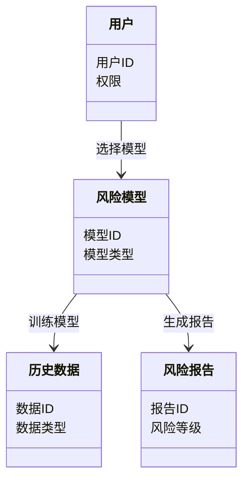
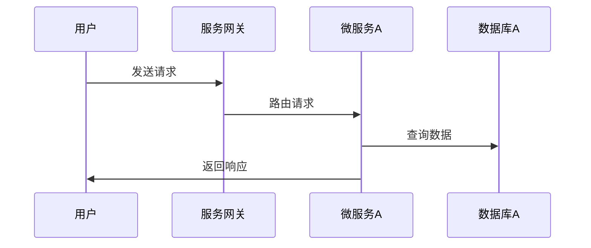

                 


# 《金融衍生品风险管理平台》

## 关键词：
- 金融衍生品
- 风险管理
- 平台架构
- 算法原理
- 系统设计
- 项目实战

## 摘要：
《金融衍生品风险管理平台》全面解析了金融衍生品风险管理的核心概念、算法原理、系统架构及实际应用。通过详细阐述风险管理平台的设计思路、实现方法和优化策略，帮助读者掌握构建高效风险控制系统的关键技术。

---

# 目录

## 第1章: 金融衍生品风险管理平台概述

### 1.1 问题背景
- 1.1.1 金融衍生品的定义与特性
- 1.1.2 衍生品交易中的风险类型
- 1.1.3 风险管理的必要性

### 1.2 问题描述
- 1.2.1 衍生品交易的主要风险
- 1.2.2 风险管理的挑战
- 1.2.3 平台建设的必要性

### 1.3 问题解决
- 1.3.1 风险管理平台的目标
- 1.3.2 平台的核心功能
- 1.3.3 平台的预期效果

### 1.4 平台的边界与外延
- 1.4.1 平台的适用范围
- 1.4.2 平台的限制条件
- 1.4.3 与其他系统的接口关系

## 第2章: 金融衍生品风险管理的核心概念

### 2.1 风险管理的核心原理
- 2.1.1 风险识别与评估
- 2.1.2 风险量化与测量
- 2.1.3 风险控制与应对

### 2.2 核心概念的属性特征对比
- 2.2.1 不同风险类型的对比分析
- 2.2.2 风险管理方法的优缺点
- 2.2.3 平台功能的对比分析

### 2.3 ER实体关系图
```mermaid
er
  actor: 用户
  model: 风险模型
  data: 历史数据
  report: 风险报告
  rules: 风险规则
  actor --> model: 选择模型
  model --> data: 训练模型
  model --> report: 生成报告
  report --> actor: 提供决策支持
```

## 第3章: 风险管理平台的算法原理

### 3.1 风险评估算法
- 3.1.1 蒙特卡洛模拟
  ```mermaid
  gra

  function monteCarloSimulation() {
    输入参数：历史数据、模拟次数
    初始化：结果数组
    for (i from 1到模拟次数) {
      从历史数据中随机抽取样本
      计算风险指标（如VaR）
      将结果添加到结果数组
    }
    返回结果数组
  }
  ```

  ```python
  import numpy as np
  def monte_carlo_simulation(data, iterations):
      results = []
      for _ in range(iterations):
          sample = np.random.choice(data)
          var = np.percentile(sample, 5)
          results.append(var)
      return results
  ```

- 3.1.2 VaR模型
  - 计算公式：$$VaR = \alpha \times \sigma$$
  - 举例：假设风险价值系数α=95%，标准差σ=10%，则VaR=0.95×10%=9.5%

## 第4章: 系统分析与架构设计

### 4.1 问题场景介绍
- 4.1.1 风险管理平台的功能需求
- 4.1.2 系统的输入与输出
- 4.1.3 项目的目标与范围

### 4.2 领域模型设计


### 4.3 系统架构设计
```mermaid
client --[HTTP请求]--> 服务网关
服务网关 --[路由请求]--> 微服务A
微服务A --> 数据库A
微服务B --> 数据库B
```

### 4.4 接口设计与交互


## 第5章: 项目实战

### 5.1 环境安装
- 5.1.1 安装Python
- 5.1.2 安装依赖库（numpy、pandas等）

### 5.2 核心代码实现
```python
import numpy as np
import pandas as pd

class RiskManager:
    def __init__(self, data):
        self.data = data

    def calculate_var(self, confidence_level=95):
        sorted_data = np.sort(self.data)
        index = int(len(sorted_data) * (1 - confidence_level / 100))
        return sorted_data[index]

    def generate_report(self):
        var_95 = self.calculate_var()
        var_99 = self.calculate_var(99)
        return {
            'VaR at 95%': var_95,
            'VaR at 99%': var_99
        }
```

### 5.3 代码解读与案例分析
- 代码实现风险管理模块，计算不同置信水平下的VaR值
- 实际案例分析：基于历史数据生成风险报告，评估市场波动情况

### 5.4 项目小结
- 项目实现的目标
- 实践中的经验和教训
- 系统性能优化建议

## 第6章: 系统优化与功能扩展

### 6.1 系统性能优化
- 并行计算加速
- 数据库优化策略

### 6.2 功能模块扩展
- 风险预警系统
- 自动化交易模块

## 第7章: 最佳实践与总结

### 7.1 最佳实践 tips
- 系统设计中的关键点
- 代码编写中的注意事项
- 测试与调试技巧

### 7.2 项目小结
- 全文总结
- 作者观点
- 对读者的建议

### 7.3 注意事项
- 系统维护与更新
- 安全性与合规性

### 7.4 拓展阅读
- 推荐书籍与资源
- 研究方向展望
- 行业动态

---

通过以上目录结构，我们可以系统地了解《金融衍生品风险管理平台》的核心内容，从理论到实践，全面解析风险管理平台的设计与实现。

