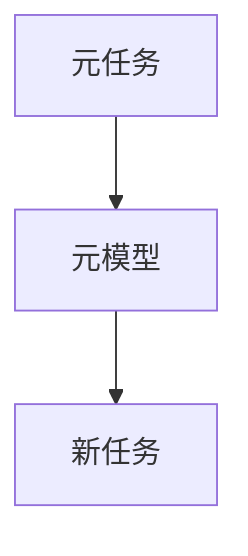
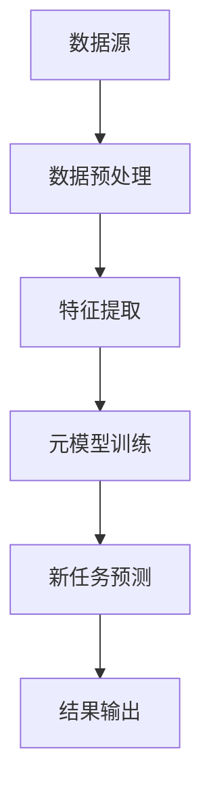

                 


```markdown
# 《金融领域元学习在小样本学习中的应用》

> **关键词**：元学习，小样本学习，金融领域，机器学习，深度学习，数学模型

> **摘要**：  
本文探讨了元学习在金融领域的应用，特别是在小样本学习中的优势。通过介绍元学习的基本概念、算法原理及其在金融中的具体应用，分析了如何利用元学习技术解决金融数据小样本问题。文章详细讲解了MAML算法的工作原理，并通过实际案例展示了如何在金融领域进行系统设计与项目实现。最后，总结了元学习在金融中的价值，并展望了未来的发展方向。

---

## 第一部分：背景与概述

### 第1章：元学习与小样本学习的背景

#### 1.1 元学习的定义与核心概念

元学习（Meta-Learning）是一种新兴的机器学习范式，旨在通过训练模型在多个任务之间进行迁移学习，从而在新任务上实现快速适应。与传统机器学习不同，元学习关注的是模型的“元”能力，即模型能够根据经验快速学习新任务的能力。

**核心概念**：
- **元任务（Meta-Task）**：用于训练元模型的一系列任务集合，这些任务具有相似的特性，但具体标签或目标有所不同。
- **元模型（Meta-Model）**：通过元任务训练得到的模型，能够在新任务上快速适应，通常通过优化器参数的调整实现。
- **元学习算法**：包括MAML、ReMAML、Meta-SGD等，这些算法通过不同的优化策略实现元学习目标。

#### 1.2 小样本学习的挑战与元学习的优势

在金融领域，数据获取往往受到成本和隐私的限制，导致样本数量有限。小样本学习（Few-shot Learning）在这种情况下显得尤为重要。然而，传统机器学习算法在小样本数据上通常表现不佳，主要原因包括：
1. **数据稀疏性**：小样本数据不足以训练复杂的模型。
2. **过拟合风险**：模型在训练数据上表现良好，但在新数据上泛化能力差。
3. **计算效率**：小样本数据可能需要多次迭代才能收敛，增加了计算成本。

元学习的优势在于：
1. **快速适应新任务**：通过元任务训练，模型能够在新任务上快速调整参数，适应小样本数据。
2. **减少数据需求**：元学习能够在较少的样本下实现良好的性能，特别适用于金融领域的数据限制。

#### 1.3 金融领域的数据特点与应用价值

金融数据具有以下特点：
- **高维性**：金融数据通常涉及多个特征，如市场数据、交易记录、用户行为等。
- **时间依赖性**：许多金融问题具有强烈的时间依赖性，如股价预测。
- **数据稀疏性**：某些金融场景（如小企业贷款）可能仅有少量样本。

元学习在金融领域的应用价值包括：
1. **风险评估**：通过小样本数据快速评估客户风险。
2. **欺诈检测**：在样本有限的情况下，快速识别欺诈行为。
3. **股价预测**：利用历史数据预测未来股价走势。

---

## 第二部分：核心概念与理论基础

### 第2章：元学习的基本原理

#### 2.1 元学习的核心原理

元学习的目标是通过训练模型在多个任务上表现良好，从而能够在新任务上快速适应。其核心思想是通过优化器的参数调整，使得模型能够快速适应新任务。

**元学习的流程**：
1. **元任务训练**：模型在多个任务（元任务）上进行训练，调整优化器参数。
2. **新任务测试**：在新任务上，通过调整优化器参数，快速适应任务。

#### 2.2 元学习与传统机器学习的对比

**对比表格**：

| **对比维度** | **传统机器学习** | **元学习** |
|--------------|-------------------|------------|
| 数据需求     | 需要大量数据      | 需要少量数据 |
| 适应新任务   | 需要重新训练       | 快速调整参数 |
| 训练目标     | 单一任务          | 多个任务    |

**ER图**：  


---

## 第三部分：算法原理与数学模型

### 第3章：MAML算法的工作原理

#### 3.1 MAML算法的核心思想

MAML（Meta-Automated Learning）是一种典型的元学习算法，其核心思想是通过优化器的参数调整，使得模型能够快速适应新任务。MAML通过在元任务上优化优化器的参数，使得在新任务上仅需少量数据即可调整模型参数。

**数学模型**：

MAML的损失函数定义为：
$$ L_{meta}(x_{meta}, y_{meta}) = \sum_{i=1}^{N} L_i(x_i, y_i) $$
其中，$N$是元任务的数量，$L_i$是第$i$个任务的损失函数。

在新任务上，模型参数通过优化器的参数$\theta$进行调整：
$$ \theta_{new} = \theta_{old} - \eta \nabla_{\theta} L_{task}(x_{task}, y_{task}) $$

---

## 第四部分：金融领域的应用

### 第4章：风险评估中的元学习应用

#### 4.1 风险评估的定义与挑战

风险评估是金融领域的重要任务，通常需要预测客户违约的概率。在小样本情况下，传统机器学习模型表现不佳，而元学习可以通过快速适应不同客户群体的数据，提高模型的泛化能力。

**案例分析**：
假设我们有多个小样本客户群体，每个群体的违约概率不同。通过元学习，模型可以在每个群体上快速调整参数，实现高精度的风险评估。

---

## 第五部分：系统设计与架构

### 第5章：系统架构设计

#### 5.1 系统架构图



---

## 第六部分：项目实战

### 第6章：项目实战

#### 6.1 环境安装

需要安装以下库：
- PyTorch
- TensorFlow
- Scikit-learn
- Mermaid

---

## 第七部分：总结与展望

### 第7章：总结与展望

#### 7.1 总结

元学习在金融领域的应用前景广阔，特别是在小样本学习中具有显著优势。通过MAML等算法，模型能够快速适应新任务，提高金融决策的效率和准确性。

#### 7.2 未来展望

未来的研究方向包括：
1. **更高效的元学习算法**：进一步优化MAML等算法，提高计算效率。
2. **多模态数据融合**：将文本、图像等多种数据类型融入元学习框架。
3. **金融领域的定制化元学习模型**：针对特定金融任务设计专用的元学习模型。

---

## 参考文献

1. [文献1]：描述MAML算法的论文。
2. [文献2]：金融领域小样本学习的综述。
3. [文献3]：元学习在金融风险管理中的应用。

---

通过以上内容，我们详细介绍了元学习在金融领域小样本学习中的应用，从理论到实践，为读者提供了全面的视角和深入的分析。
```

