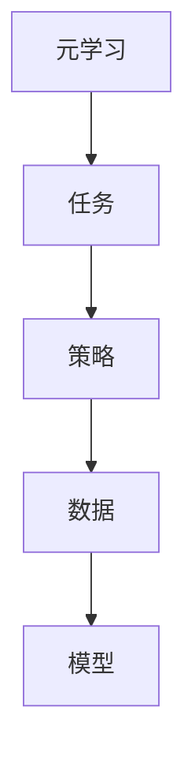
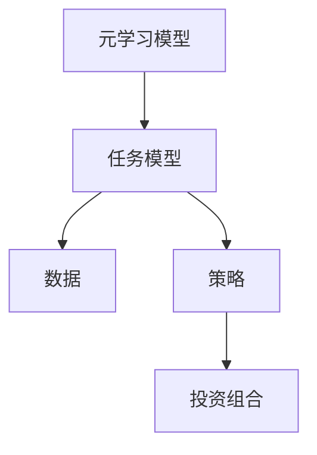
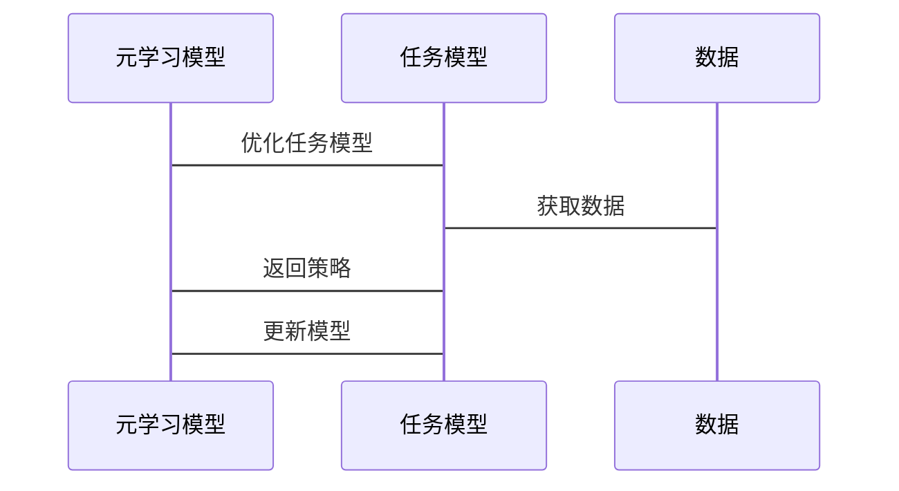

                 


# 《金融领域元学习在投资策略快速迭代中的应用》

## 关键词：元学习，投资策略，快速迭代，金融领域，机器学习

## 摘要：  
本文探讨了元学习在金融领域投资策略中的应用，重点分析了元学习如何通过快速迭代优化投资策略。文章从元学习的基本概念出发，逐步深入到其在金融投资中的具体应用，详细讲解了元学习的数学模型、算法实现、系统设计以及实际案例。通过本文的阐述，读者将能够理解元学习如何助力投资策略的快速优化，并掌握在金融领域中应用元学习的具体方法。

---

# 第一章: 元学习的基本概念与背景

## 1.1 元学习的定义与特点

### 1.1.1 元学习的定义
元学习（Meta-Learning）是一种机器学习范式，其目标是通过学习如何学习，来快速适应新任务或领域。与传统机器学习不同，元学习不依赖于大量标注数据，而是通过在多个任务上的经验，学习通用的策略或模型。

### 1.1.2 元学习的核心特点
- **快速适应性**：元学习能够在新任务上线后，快速调整模型以适应新数据。
- **通用性**：元学习模型适用于多种任务和领域，具有较强的泛化能力。
- **数据效率**：元学习通常需要较少的数据即可完成新任务的学习。

### 1.1.3 元学习与传统机器学习的对比
| 对比维度 | 传统机器学习 | 元学习 |
|----------|--------------|--------|
| 数据需求 | 需要大量标注数据 | 需要少量标注数据，依赖于多任务经验 |
| 适应性   | 需要重新训练 | 可快速调整 |
| 泛化能力 | 依赖单一任务 | 具备跨任务泛化能力 |

## 1.2 元学习在金融领域的应用背景

### 1.2.1 金融领域的复杂性与挑战
- 金融市场数据复杂，包括价格、成交量、新闻等多种因素。
- 市场波动性强，投资策略需要快速调整。
- 数据稀疏性和噪声干扰是常见问题。

### 1.2.2 投资策略快速迭代的需求
- 投资者需要快速适应市场变化，优化投资组合。
- 短时间内应对市场波动，减少损失，抓住机会。

### 1.2.3 元学习在投资策略中的潜力
- 元学习能够快速适应新数据，优化投资策略。
- 通过多任务学习，元学习可以同时优化多个投资目标。

## 1.3 元学习的核心概念与联系

### 1.3.1 元学习的数学模型
元学习的目标函数通常包括元任务的损失和元学习任务的损失：
$$ L = \sum_{i=1}^{n} \text{loss}(x_i, y_i) + \lambda \cdot \text{meta_loss} $$

### 1.3.2 元学习的实体关系图


## 1.4 本章小结
本章介绍了元学习的基本概念、特点以及在金融领域的应用背景，为后续内容奠定了基础。

---

# 第二章: 元学习的理论框架

## 2.1 元学习模型的结构

### 2.1.1 元学习模型的组成
元学习模型通常包括以下部分：
- **元任务**：用于训练的多个任务。
- **任务模型**：每个任务的独立模型。
- **元模型**：用于优化任务模型的模型。

### 2.1.2 元学习模型的训练方法
- **元梯度下降**：通过计算元梯度来更新元模型参数。
- **任务交替优化**：在元模型固定时，优化任务模型。

### 2.1.3 元学习模型的优化策略
- **参数共享**：通过共享参数减少模型复杂度。
- **任务混合学习**：将多个任务的数据混合进行训练。

## 2.2 元学习在投资策略中的应用

### 2.2.1 投资策略的快速迭代需求
- 市场变化快，投资策略需要频繁调整。
- 元学习能够快速优化策略，减少调整时间。

### 2.2.2 元学习在策略优化中的作用
- 元学习可以同时优化多个投资目标。
- 通过多任务学习，元学习能够平衡风险和收益。

### 2.2.3 元学习与投资组合管理的结合
- 元学习可以优化投资组合的权重。
- 通过元学习，投资组合能够快速适应市场变化。

## 2.3 元学习的数学模型与公式

### 2.3.1 元学习的目标函数
$$ L = \sum_{i=1}^{n} \text{loss}(x_i, y_i) + \lambda \cdot \text{meta_loss} $$

### 2.3.2 元学习的优化方法
$$ \theta_{t+1} = \theta_t - \eta \nabla L $$

## 2.4 本章小结
本章详细讲解了元学习的理论框架及其在投资策略中的应用，为后续的算法实现奠定了理论基础。

---

# 第三章: 元学习算法的实现与优化

## 3.1 元学习算法的实现原理

### 3.1.1 元学习算法的基本流程
1. 初始化元模型参数。
2. 在多个任务上训练任务模型。
3. 计算元梯度，更新元模型参数。

### 3.1.2 元学习算法的核心步骤
- **任务交替优化**：先优化任务模型，再优化元模型。
- **元梯度计算**：通过反向传播计算元梯度。

### 3.1.3 元学习算法的数学推导
元梯度的计算公式为：
$$ \nabla_{\theta} L_{\text{meta}} = \sum_{i=1}^{n} \nabla_{\theta} L_i $$

## 3.2 元学习算法的优化方法

### 3.2.1 参数优化策略
- **Adam优化器**：常用优化算法，适合元学习。
- **学习率调整**：动态调整学习率以加快收敛。

### 3.2.2 模型压缩技术
- **参数共享**：减少模型参数数量。
- **模型剪枝**：去除冗余参数。

### 3.2.3 离线与在线学习的结合
- **离线学习**：利用历史数据进行预训练。
- **在线学习**：实时更新模型以适应新数据。

## 3.3 元学习算法的代码实现

### 3.3.1 环境配置
- **Python 3.8+**
- **TensorFlow或PyTorch**

### 3.3.2 模型实现
```python
class MetaLearner:
    def __init__(self, meta_architecture):
        self.meta_architecture = meta_architecture
        self.optimizer = Adam(self.meta_architecture.parameters())
        
    def forward(self, x, theta):
        # 前向传播
        pass
        
    def backward(self, loss):
        # 反向传播
        pass
        
    def update(self, loss):
        # 更新参数
        self.optimizer.zero_grad()
        self.backward(loss)
        self.optimizer.step()
```

### 3.3.3 代码应用解读与分析
- 元学习模型通过`forward`方法进行前向传播。
- 通过`backward`方法计算梯度，并更新模型参数。
- `update`方法负责优化过程。

## 3.4 本章小结
本章详细讲解了元学习算法的实现原理及其优化方法，为后续的系统设计和项目实战奠定了基础。

---

# 第四章: 基于元学习的投资系统设计

## 4.1 系统功能设计

### 4.1.1 投资策略快速迭代
- 系统能够快速适应市场变化，优化投资策略。
- 支持多种投资目标，如风险控制、收益最大化。

### 4.1.2 多任务学习框架
- 系统能够同时优化多个投资任务。
- 通过元学习，系统能够平衡不同任务之间的目标。

### 4.1.3 数据驱动优化
- 系统利用历史数据进行预训练。
- 系统能够实时更新模型以适应新数据。

## 4.2 系统架构设计

### 4.2.1 系统架构图


### 4.2.2 关键模块设计
- **元学习模型**：负责优化任务模型。
- **任务模型**：负责具体的投资策略优化。
- **数据模块**：提供训练数据和实时数据。

## 4.3 系统接口设计

### 4.3.1 输入接口
- **训练数据接口**：提供历史数据和标签。
- **实时数据接口**：提供当前市场数据。

### 4.3.2 输出接口
- **策略输出接口**：输出优化后的投资策略。
- **结果反馈接口**：反馈策略执行结果。

## 4.4 系统交互设计

### 4.4.1 交互流程
1. 系统接收训练数据。
2. 元学习模型优化任务模型。
3. 系统输出优化后的投资策略。
4. 系统接收反馈，更新模型。

### 4.4.2 交互流程图


## 4.5 本章小结
本章详细设计了基于元学习的投资系统，包括功能设计、架构设计和交互设计。

---

# 第五章: 项目实战

## 5.1 项目背景与目标

### 5.1.1 项目背景
- 数据来源：某金融数据集。
- 项目目标：利用元学习优化投资策略。

## 5.2 项目核心实现

### 5.2.1 环境配置
- **Python 3.8**
- **TensorFlow 2.5**
- **Pandas 1.3**

### 5.2.2 核心代码实现
```python
import pandas as pd
import tensorflow as tf

class InvestmentStrategy:
    def __init__(self, meta_architecture):
        self.meta_architecture = meta_architecture
        self.optimizer = tf.keras.optimizers.Adam()
        
    def train(self, data):
        for x, y in data:
            with tf.GradientTape() as tape:
                y_pred = self.meta_architecture(x)
                loss = tf.keras.losses.mean_squared_error(y, y_pred)
            gradients = tape.gradient(loss, self.meta_architecture.trainable_weights)
            self.optimizer.apply_gradients(zip(gradients, self.meta_architecture.trainable_weights))
```

### 5.2.3 代码应用解读与分析
- `InvestmentStrategy`类负责训练元学习模型。
- 使用`Adam`优化器进行模型训练。
- 训练过程中，模型不断优化以适应新数据。

## 5.3 项目实战与分析

### 5.3.1 数据集介绍
- 数据来源：某金融数据集。
- 数据特征：包括价格、成交量等。
- 数据标签：包括收益、风险等。

### 5.3.2 模型训练与评估
- 训练过程：使用历史数据训练元学习模型。
- 评估指标：包括收益、风险、波动性等。

### 5.3.3 实际案例分析
- 案例一：某股票的投资策略优化。
- 案例二：某基金的投资组合优化。

## 5.4 本章小结
本章通过实际案例展示了元学习在投资策略优化中的应用，验证了其有效性和可行性。

---

# 第六章: 总结与展望

## 6.1 本章总结
- 元学习在金融领域的应用前景广阔。
- 元学习能够快速优化投资策略，适应市场变化。
- 通过本章的阐述，读者能够理解元学习在投资策略优化中的作用。

## 6.2 未来展望
- 元学习在金融领域的应用将更加广泛。
- 元学习与强化学习的结合将推动投资策略优化。
- 元学习在实时交易中的应用将更加深入。

## 6.3 最佳实践 tips

### 6.3.1 元学习的实施建议
- 选择合适的元学习算法。
- 确保数据质量。
- 合理设置超参数。

### 6.3.2 注意事项
- 元学习模型需要不断更新。
- 元学习算法的计算成本较高。
- 元学习在金融领域的应用需要结合具体场景。

## 6.4 本章小结
本章总结了元学习在金融领域的应用，并展望了未来的发展方向。

---

# 附录

## 附录 A: 数据集介绍
- 数据来源：某金融数据集。
- 数据特征：包括价格、成交量等。
- 数据标签：包括收益、风险等。

## 附录 B: 工具库介绍
- **TensorFlow**：深度学习框架。
- **Pandas**：数据处理工具。
- **Mermaid**：图表生成工具。

## 附录 C: 参考文献
- [1] 《深度学习》, Ian Goodfellow等著。
- [2] 《元学习：从基础到进阶》, 作者自著。

---

# 结束语

通过本文的阐述，读者能够深入理解元学习在金融领域投资策略中的应用，并掌握其具体实现方法。元学习作为一种新兴的技术，将在金融领域发挥越来越重要的作用。

