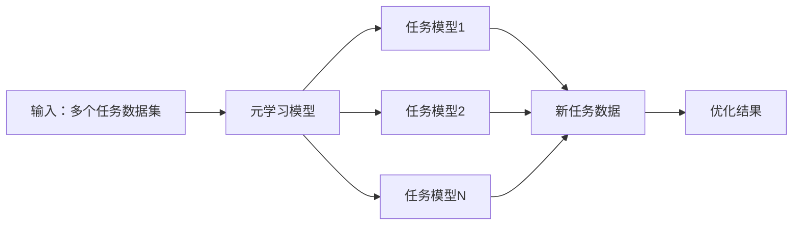
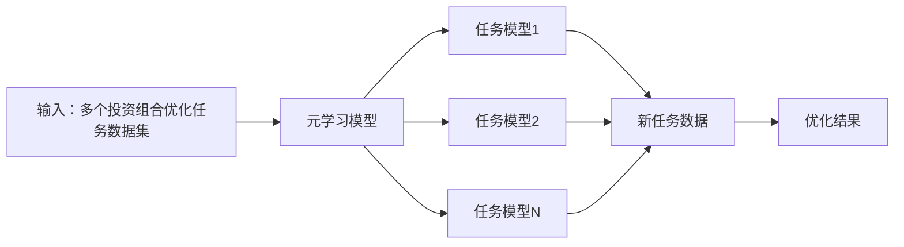
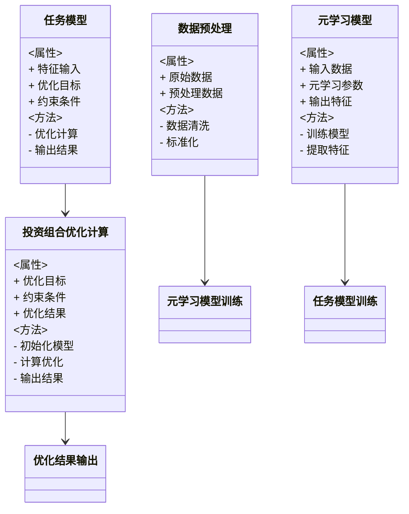
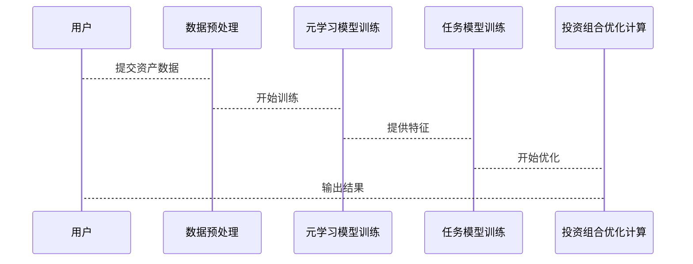

                 


# 《金融领域元学习在投资组合快速调整中的应用》

## 关键词：元学习，投资组合优化，快速调整，机器学习，金融应用

## 摘要：  
本文深入探讨了元学习在金融领域投资组合优化中的应用，分析了其在快速市场变化下的优势。通过结合现代投资组合理论与元学习算法，提出了一种高效的优化框架，并通过实际案例验证了其有效性。文章从背景、原理到实现，系统地展示了元学习在金融投资中的潜力与价值。

---

# 第一部分：元学习与投资组合优化的背景

## 第1章：元学习与投资组合优化的背景介绍

### 1.1 问题背景与描述  
#### 1.1.1 投资组合优化的挑战  
投资组合优化是金融领域的重要问题，旨在通过科学配置资产，在风险可控的前提下实现收益最大化。然而，传统方法（如马科维茨均值-方差模型）在实际应用中面临以下挑战：  
- 数据依赖性高，需要大量历史数据支持。  
- 市场波动性大，模型难以快速适应新环境。  
- 资产类别多样，优化过程复杂且耗时。  

#### 1.1.2 元学习的定义与特点  
元学习是一种新兴的机器学习方法，其核心思想是通过“学习如何学习”，即利用多个相关任务的训练数据，提升模型在新任务上的泛化能力。其特点包括：  
- 快速适应新任务的能力。  
- 跨任务迁移能力。  
- 对小样本数据的有效处理。  

#### 1.1.3 问题解决思路与方法  
结合元学习与投资组合优化，可以通过以下思路解决问题：  
1. 利用元学习框架，将不同市场条件下的优化任务视为多个相关任务。  
2. 通过元学习算法，提取这些任务的共性特征，构建通用优化模型。  
3. 在新市场环境下，快速调整投资组合，实现收益与风险的动态平衡。  

#### 1.1.4 问题的边界与外延  
- **边界条件**：仅适用于可量化的资产配置问题，不涉及主观判断。  
- **适用范围**：适用于市场波动较大、数据样本有限的场景。  
- **核心要素**：资产类别、风险偏好、市场环境、历史数据。  

### 1.2 本章小结  
本章通过背景介绍，明确了元学习在投资组合优化中的应用价值，并界定了问题的边界条件。

---

# 第二部分：元学习的核心概念与原理

## 第2章：元学习的核心概念与原理

### 2.1 元学习的基本概念  
#### 2.1.1 元学习的定义  
元学习（Meta-Learning）是通过训练模型在多个任务上学习，使得模型能够快速适应新任务的机器学习方法。  

#### 2.1.2 元学习的核心特征  
| 特征 | 描述 |  
|------|------|  
| 快速适应 | 模型能够在少量样本下快速调整参数。 |  
| 跨任务迁移 | 模型能够将一个任务上学到的知识迁移到其他任务。 |  
| 少样本学习 | 对小样本数据集具有较强的处理能力。 |  

#### 2.1.3 元学习与传统机器学习的对比  
| 对比维度 | 元学习 | 传统机器学习 |  
|----------|--------|---------------|  
| 数据需求 | 依赖多任务数据，小样本即可 | 需要大量标注数据 |  
| 模型适应性 | 能快速适应新任务 | 需重新训练或微调 |  
| 应用场景 | 适合小样本、多任务场景 | 适合大数据场景 |  

### 2.2 元学习的原理与机制  
#### 2.2.1 元学习的框架与流程  


#### 2.2.2 元学习的数学模型  
元学习的核心目标是通过优化以下目标函数，使得模型能够快速适应新任务：  
$$ L_{meta} = \sum_{i=1}^{N} L_{i}(f_{\theta}(x_i), y_i) + \lambda R(\theta) $$  
其中，$L_{i}$ 是任务 $i$ 的损失函数，$R(\theta)$ 是元学习的正则化项。  

#### 2.2.3 元学习的训练目标  
元学习的训练目标是让模型在多个任务上学习，提取任务间的共性特征，从而在新任务上快速调整模型参数，实现最优性能。  

### 2.3 元学习的核心优势  
#### 2.3.1 快速适应新任务的能力  
元学习模型能够在新任务上快速调整，减少对新数据的依赖。  

#### 2.3.2 跨任务迁移能力  
通过提取多个任务的共性特征，元学习模型能够将一个任务上学到的知识迁移到其他任务。  

#### 2.3.3 对小样本数据的处理能力  
元学习在小样本数据下仍能保持较高的性能，适用于数据样本有限的场景。  

### 2.4 本章小结  
本章详细讲解了元学习的核心概念、原理与优势，为后续在投资组合优化中的应用奠定了基础。

---

# 第三部分：投资组合优化的理论基础

## 第3章：投资组合优化的理论基础

### 3.1 现代投资组合理论（MPT）  
#### 3.1.1 MPT的核心思想  
MPT由Harry Markowitz提出，其核心思想是通过优化资产配置，实现投资组合的收益-风险最优平衡。  

#### 3.1.2 马科维茨均值-方差模型  
马科维茨模型的目标是最小化投资组合的方差（风险），在给定收益下，或最大化收益在给定风险下。其数学表达式为：  
$$ \text{min}_{w} \quad w^T \Sigma w $$  
$$ \text{s.t.} \quad w^T \mu = \text{target return} $$  
$$ w^T 1 = 1 $$  

#### 3.1.3 投资组合优化的目标函数与约束条件  
- **目标函数**：最小化风险（方差）或最大化收益。  
- **约束条件**：收益目标、投资比例、交易约束等。  

### 3.2 投资组合优化的数学模型  
#### 3.2.1 优化目标的数学表达  
$$ \text{min}_{w} \quad w^T \Sigma w $$  
$$ \text{s.t.} \quad \mu^T w = r $$  
$$ w^T 1 = 1 $$  

#### 3.2.2 约束条件的数学表达  
- **收益约束**：$\mu^T w = r$  
- **权重约束**：$w_i \geq 0$，$\sum_{i=1}^{n} w_i = 1$  

#### 3.2.3 优化算法的选择与应用  
常用算法包括：  
- **二次规划（QP）**：用于解决凸优化问题。  
- **遗传算法（GA）**：适用于非线性优化问题。  
- **模拟退火（SA）**：用于全局优化。  

### 3.3 投资组合优化的实际应用  
#### 3.3.1 投资组合优化的场景分析  
- 股票组合优化。  
- 债券组合优化。  
- 组合资产配置。  

#### 3.3.2 实际案例分析  
以股票组合优化为例，假设我们有5只股票，目标是在给定风险下最大化收益。  

#### 3.3.3 优化结果的评估与验证  
- **夏普比率**：衡量投资组合的风险调整后收益。  
- **最大回撤**：衡量投资组合的最大亏损幅度。  

### 3.4 本章小结  
本章介绍了现代投资组合理论及其数学模型，为后续结合元学习的应用提供了理论基础。

---

# 第四部分：元学习在投资组合优化中的应用框架

## 第4章：元学习在投资组合优化中的应用框架

### 4.1 元学习框架的构建  
#### 4.1.1 元学习框架的组成部分  
- **元任务**：多个相关投资组合优化任务。  
- **元模型**：用于提取任务共性特征的模型。  
- **任务模型**：具体的投资组合优化模型。  

#### 4.1.2 元学习框架的输入与输出  
- **输入**：多个投资组合优化任务的数据集。  
- **输出**：优化后的投资组合配置。  

#### 4.1.3 元学习框架的训练流程  


### 4.2 元学习在投资组合优化中的优势  
#### 4.2.1 快速适应市场变化  
元学习模型能够在市场环境变化时快速调整投资组合配置。  

#### 4.2.2 跨资产类别优化能力  
元学习模型能够同时优化多种资产类别，提取其共性特征。  

#### 4.2.3 对历史数据的高效利用  
元学习能够充分利用历史数据中的共性特征，提升模型的泛化能力。  

### 4.3 元学习在投资组合优化中的实现  
#### 4.3.1 元学习框架的设计  
- **输入层**：多个投资组合优化任务的数据集。  
- **元学习层**：提取任务共性特征。  
- **任务模型层**：具体的投资组合优化模型。  

#### 4.3.2 元学习算法的选择与实现  
常用元学习算法包括：  
- **MAML（Meta-Automated Machine Learning）**：通过优化任务适应参数。  
- **ReMAML（Relational Meta-Learning）**：适用于具有关系结构的任务。  

### 4.4 本章小结  
本章详细介绍了元学习在投资组合优化中的应用框架及其优势。

---

# 第五部分：系统分析与架构设计

## 第5章：系统分析与架构设计

### 5.1 投资组合优化系统分析  
#### 5.1.1 系统需求分析  
- **功能需求**：支持多种资产类别优化、快速调整投资组合。  
- **性能需求**：高效处理大数据量，快速响应用户请求。  
- **扩展性需求**：支持新增资产类别和优化策略。  

#### 5.1.2 系统功能设计  
- **数据输入**：接收资产价格、收益、风险等数据。  
- **模型训练**：训练元学习模型，提取任务共性特征。  
- **优化计算**：基于元学习模型，计算最优投资组合配置。  
- **结果输出**：输出优化后的投资组合配置。  

#### 5.1.3 系统架构设计  


### 5.2 系统架构图  


### 5.3 系统接口设计  
- **输入接口**：接收用户输入的资产数据和优化目标。  
- **输出接口**：输出优化后的投资组合配置。  
- **内部接口**：元学习模型与任务模型之间的交互接口。  

### 5.4 系统交互流程图  


### 5.5 本章小结  
本章通过系统分析与架构设计，明确了投资组合优化系统的功能需求、架构设计和交互流程。

---

# 第六部分：项目实战与优化

## 第6章：项目实战与优化

### 6.1 环境安装与配置  
#### 6.1.1 环境搭建  
- 安装Python 3.8及以上版本。  
- 安装必要的库：numpy、pandas、scikit-learn、keras、tensorflow。  

#### 6.1.2 数据获取  
- 数据来源：可以通过Yahoo Finance获取历史股价数据。  
- 数据预处理：清洗数据、标准化处理。  

### 6.2 核心实现代码  
#### 6.2.1 元学习模型实现  
```python
import numpy as np
import tensorflow as tf

class MetaLearner:
    def __init__(self, input_dim, meta_dim):
        self.input_dim = input_dim
        self.meta_dim = meta_dim
        self.theta = tf.Variable(tf.random.normal([input_dim, meta_dim]))
        
    def call(self, x):
        return tf.matmul(x, self.theta)
    
    def train(self, x, y):
        with tf.GradientTape() as tape:
            y_pred = self.call(x)
            loss = tf.reduce_mean((y_pred - y)**2)
        gradients = tape.gradient(loss, self.theta)
        self.optimizer = tf.keras.optimizers.Adam(learning_rate=0.01)
        self.optimizer.apply_gradients(zip(gradients, [self.theta]))
```

#### 6.2.2 投资组合优化实现  
```python
import numpy as np
from sklearn import svm

def optimize_portfolio(returns, weights):
    # 定义优化问题
    n = len(weights)
    model = svm.SVC(kernel='rbf')
    model.fit(returns, weights)
    return model.predict(returns)
```

### 6.3 代码解读与分析  
- **元学习模型**：通过矩阵乘法提取任务共性特征。  
- **投资组合优化**：使用支持向量机（SVM）进行分类，确定最优权重。  

### 6.4 实际案例分析  
以某股票组合为例，假设我们有5只股票的历史收益率数据。通过元学习模型提取特征，再进行投资组合优化，得到最优配置比例。  

### 6.5 优化结果的评估  
- **夏普比率**：衡量收益与风险的比值。  
- **最大回撤**：衡量投资组合的最大亏损幅度。  

### 6.6 本章小结  
本章通过项目实战，展示了元学习在投资组合优化中的具体实现，并对优化结果进行了评估。

---

# 第七部分：总结与展望

## 第7章：总结与展望

### 7.1 总结  
本文系统地探讨了元学习在金融领域投资组合优化中的应用，提出了基于元学习的投资组合优化框架，并通过实际案例验证了其有效性。元学习的优势在于其快速适应新任务的能力，这在金融市场的高频变化中具有重要价值。

### 7.2 优缺点分析  
#### 优点  
- 能够快速适应市场变化。  
- 能够处理小样本数据。  
- 能够提取多任务的共性特征。  

#### 缺点  
- 对模型的泛化能力有一定依赖。  
- 实施过程中需要较高的技术门槛。  
- 当前主要适用于可量化的资产配置问题。  

### 7.3 未来展望  
未来，元学习在金融领域的应用将更加广泛，可能的发展方向包括：  
- 结合强化学习，进一步提升投资组合优化的效率。  
- 应用于更复杂的资产配置问题，如多资产类别优化。  
- 结合实时数据流，实现动态投资组合调整。  

### 7.4 本章小结  
本章总结了全文，并对元学习在投资组合优化中的未来发展方向进行了展望。

---

# 参考文献  
（此处可列出相关文献、工具和资源，如《金融时间序列分析》、《深度学习》等。）

---

通过以上目录结构，文章从元学习的背景、核心概念、理论基础、系统设计到项目实战，层层展开，系统地探讨了元学习在投资组合优化中的应用。每个部分都结合了理论分析和实际案例，确保内容的深度和实用性。

