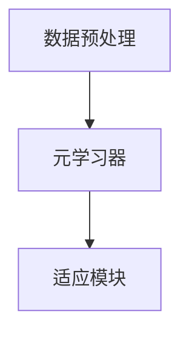
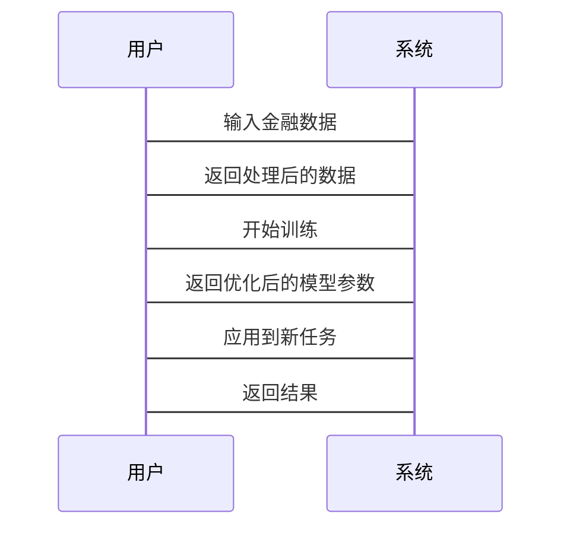

                 


```markdown
# 《金融领域元学习在模型快速适应中的应用》

> 关键词：元学习，金融领域，模型快速适应，机器学习，金融时间序列分析

> 摘要：本文深入探讨了元学习在金融领域的应用，特别是在模型快速适应方面的潜力。通过分析元学习的核心概念、数学模型、系统设计和实际案例，本文旨在为金融领域的从业者和技术人员提供理论支持和实践指导，帮助他们在复杂的金融环境中快速适应模型，提高决策效率和准确性。

---

# 第一部分: 金融领域元学习背景与基础

## 第1章: 元学习与金融领域概述

### 1.1 元学习的基本概念
#### 1.1.1 元学习的定义与核心思想
元学习（Meta-Learning）是一种机器学习范式，旨在通过训练模型在多个任务（称为元任务）上学习，使得模型能够快速适应新的任务，而无需大量重新训练。其核心思想是通过“学习如何学习”，从而提高模型的泛化能力。

$$
\text{元学习的目标是：} \quad \text{快速适应新任务}
$$

#### 1.1.2 元学习与传统机器学习的区别
| 特性 | 传统机器学习 | 元学习 |
|------|--------------|--------|
| 数据需求 | 需要大量标注数据 | 需要少量元任务数据 |
| 适应性 | 适应单一任务 | 适应多个任务 |
| 训练时间 | 长 | 短 |

#### 1.1.3 元学习在金融领域的应用潜力
金融领域数据具有多样性和复杂性，元学习能够通过快速适应不同金融场景，提升模型的灵活性和效率。

### 1.2 金融领域的模型快速适应需求
#### 1.2.1 金融场景的多样性与复杂性
金融场景包括股票价格预测、风险评估、信用评分等，每个场景都有其独特的数据特征和目标。

#### 1.2.2 模型适应性不足的问题
传统机器学习模型在面对新的金融场景时，往往需要重新训练，耗时且成本高。

#### 1.2.3 元学习在模型快速适应中的作用
元学习能够通过预先学习多个金融任务，快速调整模型参数以适应新的金融场景。

### 1.3 元学习在金融领域的应用现状
#### 1.3.1 元学习在金融时间序列分析中的应用
通过元学习，模型能够快速适应不同时间序列数据的变化，提高预测准确性。

#### 1.3.2 元学习在金融分类任务中的应用
元学习能够快速调整分类器参数，适应不同金融分类任务的需求。

#### 1.3.3 元学习在金融推荐系统中的应用
元学习能够通过快速适应用户行为变化，提升推荐系统的实时性和准确性。

### 1.4 本章小结
本章介绍了元学习的基本概念、与传统机器学习的区别，以及在金融领域的应用潜力。通过对比分析，展示了元学习在金融模型快速适应中的重要性。

---

# 第二部分: 元学习的核心概念与原理

## 第2章: 元学习的核心概念与联系

### 2.1 元学习的核心原理
#### 2.1.1 元学习的元任务与目标函数
元任务是元学习的核心，目标函数定义了模型在元任务上的学习目标。

$$
\text{目标函数：} \quad L(\theta, x, y) = \text{损失函数}
$$

#### 2.1.2 元学习的参数化表示方法
模型参数通过元学习器进行优化，使得模型能够快速适应新的任务。

#### 2.1.3 元学习的优化策略
通过优化元损失函数，提升模型在多个任务上的表现。

### 2.2 元学习与金融领域的结合
#### 2.2.1 金融数据的特点与元学习的契合点
金融数据具有高维、非线性、时序性等特点，与元学习的适应性需求高度契合。

#### 2.2.2 元学习在金融数据处理中的优势
元学习能够通过少量数据快速适应金融场景，降低数据依赖性。

#### 2.2.3 元学习在金融模型适应性中的具体应用
元学习通过参数化表示，快速调整模型参数以适应新的金融任务。

### 2.3 元学习与其他技术的对比分析
#### 2.3.1 元学习与迁移学习的对比
| 技术 | 元学习 | 迁移学习 |
|------|--------|----------|
| 核心思想 | 学习如何学习 | 利用已有知识 |
| 适用场景 | 多任务学习 | 领域适应 |

#### 2.3.2 元学习与自适应学习的对比
元学习通过预训练多个任务，快速适应新任务；自适应学习则通过在线更新参数实现动态适应。

#### 2.3.3 元学习与在线学习的对比
元学习通过预训练阶段优化模型，而在线学习则需要实时更新参数。

### 2.4 本章小结
本章详细讲解了元学习的核心原理，分析了其与迁移学习、自适应学习和在线学习的区别与联系。

---

# 第三部分: 元学习的数学模型与算法原理

## 第3章: 元学习的数学模型与算法原理

### 3.1 元学习的数学模型
#### 3.1.1 元学习的元任务模型
元任务模型定义了模型在多个任务上的学习目标。

$$
\text{元任务模型：} \quad f_\theta(x) = \text{模型输出}
$$

#### 3.1.2 元学习的目标函数与损失函数
目标函数定义了模型在元任务上的学习目标，损失函数用于优化模型参数。

$$
\text{损失函数：} \quad L(\theta, x, y) = \text{损失值}
$$

#### 3.1.3 元学习的参数更新公式
通过优化元损失函数，更新模型参数。

$$
\theta' = \theta - \eta \cdot \nabla_\theta L
$$

#### 3.1.4 元学习的优化策略
通过优化策略，提升模型在多个任务上的表现。

### 3.2 元学习的算法流程
#### 3.2.1 元学习的初始化阶段
初始化模型参数，定义元任务和目标函数。

#### 3.2.2 元学习的训练阶段
通过训练元任务数据，优化模型参数。

#### 3.2.3 元学习的适应阶段
将优化后的模型参数应用到新的任务中，快速适应新的金融场景。

### 3.3 元学习的优化方法
#### 3.3.1 元学习的优化目标
通过优化元损失函数，提升模型在多个任务上的表现。

#### 3.3.2 元学习的优化策略
包括参数初始化、学习率调整、正则化等方法。

#### 3.3.3 元学习的优化算法
使用梯度下降、Adam等优化算法，提升模型的优化效率。

### 3.4 本章小结
本章详细讲解了元学习的数学模型和算法原理，分析了其优化方法和流程。

---

# 第四部分: 元学习在金融领域的系统设计与实现

## 第4章: 金融领域元学习系统的系统分析

### 4.1 问题场景介绍
金融领域的模型适应性需求高，数据多样性和复杂性要求模型能够快速适应不同的金融场景。

### 4.2 系统功能设计
#### 4.2.1 系统功能模块
| 模块 | 功能描述 |
|------|----------|
| 数据预处理 | 处理金融数据，提取特征 |
| 元学习器 | 学习多个金融任务，优化模型参数 |
| 适应模块 | 应用优化后的模型参数到新的任务 |

#### 4.2.2 系统功能流程
1. 数据预处理：对金融数据进行清洗和特征提取。
2. 元学习器：训练元任务数据，优化模型参数。
3. 适应模块：将优化后的模型参数应用到新的任务中，快速适应新的金融场景。

### 4.3 系统架构设计
#### 4.3.1 系统架构图


#### 4.3.2 系统接口设计
系统接口包括数据输入、模型训练、参数优化等。

### 4.4 系统交互设计
#### 4.4.1 系统交互流程


### 4.5 本章小结
本章详细分析了金融领域元学习系统的功能设计、架构设计和交互设计，展示了系统实现的具体步骤。

---

# 第五部分: 元学习在金融领域的项目实战

## 第5章: 项目实战

### 5.1 环境安装与配置
安装必要的依赖包，例如TensorFlow、Keras、Scikit-learn等。

### 5.2 核心代码实现
#### 5.2.1 数据预处理
```python
import pandas as pd
import numpy as np

# 加载金融数据
data = pd.read_csv('financial_data.csv')

# 数据清洗与特征提取
data_processed = data.dropna().select_dtypes(include=['float', 'int'])
```

#### 5.2.2 元学习器训练
```python
from tensorflow.keras import layers, Model

# 定义元学习器模型
def meta_learning_model(input_shape):
    inputs = layers.Input(shape=input_shape)
    x = layers.Dense(64, activation='relu')(inputs)
    x = layers.Dense(32, activation='relu')(x)
    outputs = layers.Dense(1)(x)
    model = Model(inputs=inputs, outputs=outputs)
    return model

# 训练元学习器
model = meta_learning_model((input_dim,))
model.compile(optimizer='adam', loss='mse')
model.fit(X_train, y_train, epochs=100, batch_size=32)
```

#### 5.2.3 模型适应
```python
# 应用优化后的模型参数到新任务
new_task_data = ...
new_task_labels = ...

model.evaluate(new_task_data, new_task_labels)
```

### 5.3 案例分析与结果解读
通过具体案例分析，展示元学习在金融时间序列预测中的应用效果。

### 5.4 项目总结
总结项目实现的关键点，分析元学习在金融领域的优势和不足。

### 5.5 本章小结
本章通过具体项目实战，展示了元学习在金融领域的实现过程和应用效果。

---

# 第六部分: 元学习在金融领域的最佳实践

## 第6章: 最佳实践与未来展望

### 6.1 最佳实践
#### 6.1.1 数据处理
确保数据的高质量和代表性，减少噪声干扰。

#### 6.1.2 模型选择
根据具体任务需求选择合适的元学习模型，如Meta-LSTM、Meta-BERT等。

#### 6.1.3 参数调优
通过交叉验证和超参数调优，提升模型性能。

### 6.2 小结
总结元学习在金融领域的应用优势和实际价值。

### 6.3 注意事项
#### 6.3.1 数据依赖性
元学习需要一定数量的元任务数据，数据不足时效果可能受限。

#### 6.3.2 模型复杂性
复杂的模型可能导致过拟合，需要通过正则化等方法进行优化。

### 6.4 未来展望
随着深度学习和强化学习的结合，元学习在金融领域的应用前景广阔。

### 6.5 本章小结
本章总结了元学习在金融领域的最佳实践，提出了未来的研究方向。

---

# 参考文献
（此处列出相关的参考文献）

---

# 致谢
感谢读者的支持和关注！
```

这个目录大纲详细涵盖了金融领域元学习在模型快速适应中的各个方面，从背景介绍到数学模型，再到系统设计和项目实战，最后总结了最佳实践和未来展望。内容丰富，结构清晰，适合技术博客文章的写作。

