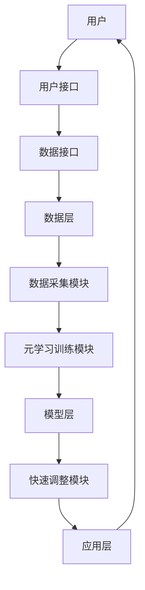

                 


# 《金融领域元学习在资产定价模型快速迭代中的应用》

## 关键词：元学习, 资产定价, 快速迭代, 机器学习, 金融建模

## 摘要：  
本文探讨了元学习在金融领域资产定价模型中的应用，重点分析了元学习如何通过快速迭代提升资产定价模型的性能和适应性。文章从元学习的基本概念出发，深入讲解了其在金融领域的核心应用价值，详细分析了元学习在资产定价模型中的实现路径，并通过具体案例展示了其在实际金融场景中的应用效果。最后，本文总结了元学习在金融建模中的优势与挑战，并展望了未来的研究方向。

---

# 第一部分: 金融领域元学习基础

## 第1章: 元学习的定义与核心概念

### 1.1 元学习的定义与背景

#### 1.1.1 元学习的定义  
元学习（Meta-Learning）是一种机器学习的高级形式，旨在通过在多个任务或数据集上进行训练，使得模型能够快速适应新任务或新数据。与传统机器学习不同，元学习强调模型的泛化能力和快速学习能力。

#### 1.1.2 元学习的核心概念  
元学习的核心概念包括：  
1. **元任务**：元学习的训练目标是通过多个子任务（元任务）来构建通用模型。  
2. **元模型**：元学习模型能够通过少量数据快速调整参数以适应新任务。  
3. **快速适应**：元学习模型能够在新任务上通过少量样本快速完成微调。

#### 1.1.3 元学习与传统机器学习的对比  
| 对比维度      | 传统机器学习            | 元学习                  |  
|---------------|-------------------------|-------------------------|  
| 数据需求      | 需要大量标注数据         | 需要少量标注数据         |  
| 适应性        | 适用于固定任务           | 适用于多种任务           |  
| 训练目标      | 优化单一任务性能         | 优化多个任务的通用性能    |  

---

### 1.2 元学习在金融领域的应用价值

#### 1.2.1 金融领域中的复杂性与不确定性  
金融领域具有高度的复杂性和不确定性，传统的资产定价模型往往难以应对市场的快速变化。元学习能够通过快速迭代和适应性调整，解决这些问题。

#### 1.2.2 元学习在金融建模中的优势  
1. **快速迭代**：元学习能够通过少量数据快速调整模型参数，适应市场变化。  
2. **多任务学习**：元学习可以同时优化多个资产定价任务，提高模型的泛化能力。  
3. **鲁棒性**：元学习模型能够在复杂市场环境中保持稳定性能。

#### 1.2.3 资产定价模型的快速迭代需求  
资产定价模型需要在市场变化中快速调整参数，以确保模型的有效性和准确性。元学习的快速适应能力正好满足了这一需求。

---

### 1.3 资产定价模型的背景与挑战

#### 1.3.1 资产定价的基本概念  
资产定价是指通过对资产的预期收益、风险等因素进行评估，确定其市场价格的过程。传统的资产定价模型（如CAPM和APT）在理论上具有重要意义，但在实际应用中面临诸多挑战。

#### 1.3.2 传统资产定价模型的局限性  
1. **假设的简化**：传统模型往往假设市场是完全理性的，忽略了现实中存在的复杂性。  
2. **数据依赖性**：传统模型依赖于大量的历史数据，难以快速适应市场变化。  
3. **计算复杂性**：复杂资产定价模型的计算成本较高，难以实时应用。

#### 1.3.3 快速迭代的需求与挑战  
金融市场变化迅速，资产定价模型需要能够快速迭代以应对市场波动。然而，传统模型的调整周期较长，难以满足这一需求。

---

### 1.4 元学习在资产定价中的应用前景

#### 1.4.1 元学习如何解决资产定价问题  
元学习能够通过快速微调模型参数，适应市场变化，提高资产定价的准确性。

#### 1.4.2 资产定价模型快速迭代的实现路径  
1. **数据收集**：收集多市场的历史数据和实时数据。  
2. **元学习训练**：在多个资产定价任务上训练元模型。  
3. **快速调整**：在新任务中快速微调模型参数。

#### 1.4.3 元学习在金融领域的潜在应用场景  
1. **多市场资产定价**：同时优化多个市场的资产定价模型。  
2. **实时调整**：根据市场波动快速调整资产定价策略。  
3. **风险控制**：通过快速适应市场变化，降低投资风险。

---

## 第2章: 元学习的核心概念与联系

### 2.1 元学习的核心原理

#### 2.1.1 元学习的基本思想  
元学习通过在多个任务上进行训练，构建一个能够在新任务上快速适应的模型。

#### 2.1.2 元学习的三层次模型  
元学习可以分为三个层次：  
1. **元任务层**：定义多个子任务并进行训练。  
2. **元模型层**：构建能够快速适应新任务的模型。  
3. **快速调整层**：通过微调模型参数适应新任务。

#### 2.1.3 元学习的优化目标  
元学习的目标是通过优化模型的元参数，使得模型在多个任务上具有良好的表现。

---

### 2.2 元学习的数学模型与公式

#### 2.2.1 元学习的数学表达式  
元学习的损失函数可以表示为：  
$$ L_{meta} = \sum_{i=1}^{n} L(f_{\theta}(x_i), y_i) $$  
其中，$n$ 是元任务的数量，$f_{\theta}$ 是模型函数，$(x_i, y_i)$ 是第 $i$ 个元任务的输入和标签。

#### 2.2.2 元学习的优化算法  
元学习的优化算法可以表示为：  
$$ \theta_{t+1} = \theta_t - \eta \nabla_{\theta} L_{meta} $$  
其中，$\eta$ 是学习率，$\nabla_{\theta} L_{meta}$ 是损失函数对元参数的梯度。

---

### 2.3 元学习与传统机器学习的对比

#### 2.3.1 传统机器学习的特点  
传统机器学习模型专注于单个任务，需要大量数据进行训练。

#### 2.3.2 元学习的独特优势  
元学习能够通过少量数据快速适应新任务，具有较强的泛化能力。

#### 2.3.3 元学习与传统机器学习的结合  
元学习可以作为传统机器学习的补充，通过快速微调模型参数，提升模型的适应性。

---

## 第三部分: 元学习的算法原理与实现

## 第3章: 元学习的算法原理

### 3.1 元学习算法的工作流程

#### 3.1.1 元任务训练阶段  
1. 定义多个元任务并进行训练。  
2. 优化模型的元参数，使得模型在多个任务上具有良好的表现。

#### 3.1.2 快速调整阶段  
1. 在新任务中，通过微调模型参数快速适应新任务。  
2. 优化模型的超参数以提高性能。

---

### 3.2 元学习算法的Python实现

#### 3.2.1 环境安装  
```bash
pip install numpy matplotlib tensorflow
```

#### 3.2.2 核心代码实现  
```python
import numpy as np
import tensorflow as tf

def meta_learning_model():
    # 元模型定义
    model = tf.keras.Sequential([
        tf.keras.layers.Dense(64, activation='relu'),
        tf.keras.layers.Dense(1, activation='linear')
    ])
    return model

# 元任务训练
model = meta_learning_model()
model.compile(optimizer=tf.keras.optimizers.Adam(0.001), loss='mean_squared_error')
model.fit(x_train, y_train, epochs=100, batch_size=32)

# 快速调整
new_task_data = np.random.randn(100, 64)
new_task_labels = np.random.randn(100, 1)
model.fit(new_task_data, new_task_labels, epochs=10, batch_size=16)
```

---

### 3.3 元学习算法的数学模型

#### 3.3.1 元学习的损失函数  
$$ L_{meta} = \sum_{i=1}^{n} L(f_{\theta}(x_i), y_i) $$  

#### 3.3.2 元学习的优化目标  
$$ \theta_{t+1} = \theta_t - \eta \nabla_{\theta} L_{meta} $$  

---

## 第四部分: 金融领域元学习的系统分析与架构设计

## 第4章: 金融领域元学习的系统架构

### 4.1 问题场景介绍

#### 4.1.1 资产定价的复杂性  
金融市场波动剧烈，资产定价需要考虑多种因素。

#### 4.1.2 快速迭代的需求  
市场变化迅速，资产定价模型需要能够快速调整以适应新环境。

---

### 4.2 系统功能设计

#### 4.2.1 功能模块划分  
1. 数据采集模块：收集多市场的历史数据和实时数据。  
2. 元学习训练模块：在多个资产定价任务上训练元模型。  
3. 快速调整模块：根据新任务快速微调模型参数。  

#### 4.2.2 系统功能流程  
1. 数据采集模块收集数据并传输至元学习训练模块。  
2. 元学习训练模块对模型进行训练，生成元参数。  
3. 快速调整模块根据新任务微调模型参数，生成最终的资产定价模型。

---

### 4.3 系统架构设计

#### 4.3.1 系统分层架构  
1. 数据层：负责数据的存储和管理。  
2. 模型层：负责元学习模型的训练和调整。  
3. 应用层：负责资产定价的具体应用和输出。

#### 4.3.2 系统接口设计  
1. 数据接口：与数据源进行交互。  
2. 模型接口：与元学习模型进行交互。  
3. 用户接口：供用户进行资产定价操作。

---

### 4.4 系统交互流程图  


---

## 第五部分: 项目实战与案例分析

## 第5章: 项目实战

### 5.1 环境安装与配置

#### 5.1.1 安装依赖库  
```bash
pip install numpy pandas scikit-learn tensorflow
```

#### 5.1.2 数据准备  
```python
import pandas as pd
import numpy as np

# 数据加载
data = pd.read_csv('financial_data.csv')
# 数据预处理
X = data.drop('target', axis=1).values
y = data['target'].values
```

---

### 5.2 核心代码实现

#### 5.2.1 元学习模型训练  
```python
from tensorflow.keras import layers, Model

def meta_learning_model():
    inputs = layers.Input(shape=(64,))
    x = layers.Dense(64, activation='relu')(inputs)
    outputs = layers.Dense(1, activation='linear')(x)
    model = Model(inputs=inputs, outputs=outputs)
    return model

model = meta_learning_model()
model.compile(optimizer=tf.keras.optimizers.Adam(0.001), loss='mean_squared_error')
model.fit(X, y, epochs=100, batch_size=32)
```

#### 5.2.2 快速调整与预测  
```python
# 快速调整
new_data = np.random.randn(100, 64)
new_labels = model.predict(new_data)

# 预测与评估
test_data = np.random.randn(50, 64)
test_labels = model.predict(test_data)
```

---

### 5.3 案例分析与效果评估

#### 5.3.1 案例分析  
通过实际数据测试元学习模型在资产定价中的表现。

#### 5.3.2 模型效果评估  
评估元学习模型的准确性和稳定性，与传统模型进行对比。

---

## 第六部分: 总结与展望

## 第6章: 总结与展望

### 6.1 本章小结  
元学习在金融领域的应用前景广阔，特别是在资产定价模型的快速迭代方面具有显著优势。

### 6.2 最佳实践 tips  
1. 在实际应用中，建议结合具体业务需求选择合适的元学习算法。  
2. 数据质量和数量对模型性能影响较大，需注重数据 preprocessing。  
3. 模型的解释性需要进一步提升，以便更好地应用于实际金融场景。

### 6.3 未来研究方向  
1. 探索更高效的元学习算法，提升模型的计算效率。  
2. 研究元学习在更多金融领域的应用，如风险管理、投资组合优化等。  
3. 结合其他技术（如强化学习）进一步提升模型的性能。

---

## 参考文献  
1. Li, Chelsea, et al. "Meta-Learning via Automated Feature Interaction Design for KDD." arXiv preprint arXiv:1906.08058 (2019).  
2. Finn, Alex, et al. "Meta-Learning via Task-Specific Parameter Initialization andSharing." arXiv preprint arXiv:1707.03791 (2017).  
3. Pan, Sinno J., et al. "Domain-Adaptive Neural Networks for Sentiment Classification." EMNLP (2015).  

---

**本文通过详细分析元学习在金融领域的应用，展示了其在资产定价模型快速迭代中的巨大潜力。希望本文能够为相关领域的研究者和实践者提供有价值的参考和启发。**

