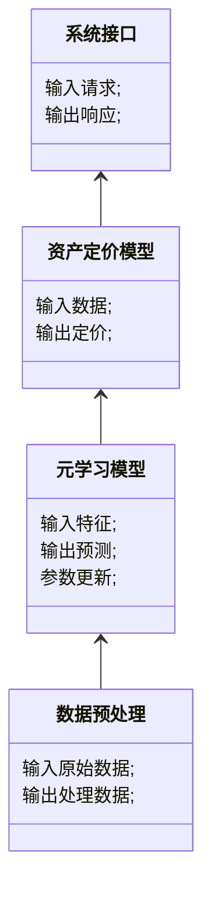
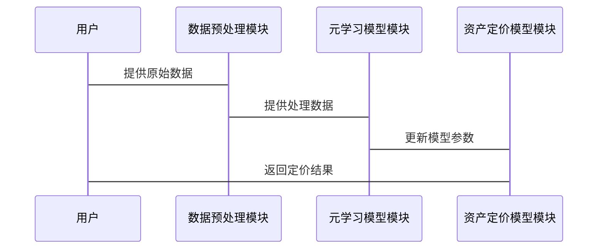

                 


# 金融领域元学习在资产定价模型快速适应中的应用

## 关键词：元学习，资产定价模型，快速适应，金融领域，深度学习

## 摘要

本文探讨了元学习在金融领域资产定价模型中的应用，特别是如何通过元学习实现模型的快速适应。我们首先介绍了元学习的基本概念和其在金融中的潜在价值，接着分析了传统资产定价模型的局限性。然后，我们深入探讨了元学习的原理及其在资产定价中的优势，包括数学模型和算法流程。最后，我们通过实际案例展示了如何将元学习应用于资产定价模型，并总结了该领域的未来研究方向。

---

# 第一部分: 金融领域元学习基础

## 第1章: 元学习与资产定价模型概述

### 1.1 元学习的基本概念

#### 1.1.1 元学习的定义与核心思想

元学习（Meta-Learning）是一种机器学习方法，旨在通过学习如何学习来提升模型的适应能力。其核心思想是通过元任务（meta-tasks）的训练，使模型能够快速适应新任务，而无需大量数据。元学习的目标是让模型具备更强的泛化能力和快速适应能力。

**公式化定义**：元学习的目标函数可以表示为：

$$ L = \sum_{i=1}^{N} L_i(f_\theta(x_i,y_i)) $$

其中，$L$ 是总体损失函数，$L_i$ 是第 $i$ 个任务的损失函数，$f_\theta$ 是参数为 $\theta$ 的模型函数。

#### 1.1.2 元学习与传统机器学习的对比

传统机器学习算法依赖于大量的训练数据，并且针对每个任务需要重新训练模型。而元学习通过共享多个任务的信息，使得模型能够快速适应新任务，减少了对数据量的依赖。

#### 1.1.3 元学习在金融中的应用价值

在金融领域，市场环境复杂多变，传统模型难以快速适应市场变化。元学习通过其快速适应能力，可以在金融资产定价、风险管理等领域发挥重要作用。

---

### 1.2 资产定价模型的背景与挑战

#### 1.2.1 资产定价模型的基本概念

资产定价模型用于评估资产的公允价值，常见的模型包括CAPM、APT等。这些模型通常假设市场是有效的，并且资产收益与风险相关。

#### 1.2.2 传统资产定价模型的局限性

传统模型难以处理市场环境的变化，例如经济危机、政策变化等因素对资产价格的影响。此外，传统模型通常需要大量历史数据，难以快速适应新环境。

#### 1.2.3 快速适应市场变化的需求

金融市场具有高度动态性，资产价格受多种因素影响。因此，资产定价模型需要能够快速适应市场变化，以提高预测准确性。

---

### 1.3 元学习在金融中的应用前景

#### 1.3.1 元学习在金融领域的应用场景

元学习可以应用于金融市场的预测、风险管理、资产配置等领域。

#### 1.3.2 元学习在资产定价中的优势

元学习可以通过少量数据快速适应新任务，减少对历史数据的依赖。

#### 1.3.3 元学习面临的挑战与未来方向

当前元学习在金融中的应用还处于起步阶段，面临数据质量、模型解释性等挑战。

---

# 第二部分: 元学习的核心概念与联系

## 第2章: 元学习的核心原理

### 2.1 元学习的数学模型

#### 2.1.1 元学习的优化目标

元学习的目标是通过优化元任务的损失函数，使模型能够快速适应新任务。

$$ \theta_{t+1} = \theta_t - \eta \nabla_\theta L $$

其中，$\theta$ 是模型参数，$\eta$ 是学习率，$L$ 是总体损失函数。

#### 2.1.2 元学习的损失函数

元学习的损失函数通常由多个任务的损失函数组成。

$$ L = \sum_{i=1}^{N} \mathbb{E}_{(x_i,y_i)}[L(f_\theta(x_i,y_i),y_i)] $$

#### 2.1.3 元学习的更新规则

元学习通过梯度下降优化模型参数。

### 2.2 元学习与传统机器学习的对比

#### 2.2.1 从任务特定模型到元学习模型

传统机器学习模型针对每个任务独立训练，而元学习模型通过共享多个任务的信息，提升模型的泛化能力。

#### 2.2.2 元学习的灵活性与适应性

元学习模型能够快速适应新任务，减少对数据量的依赖。

#### 2.2.3 元学习的泛化能力分析

元学习模型在不同任务上的表现优于传统模型。

### 2.3 元学习在资产定价中的应用模型

#### 2.3.1 资产定价模型的元学习框架

通过元学习框架，资产定价模型可以快速适应市场变化。

#### 2.3.2 元学习在风险定价中的应用

元学习模型可以用于信用风险定价。

#### 2.3.3 元学习在资产配置中的应用

元学习模型可以优化资产配置策略。

---

## 第三部分: 元学习算法原理讲解

## 第3章: 元学习算法的数学模型与公式

### 3.1 元学习算法的数学推导

#### 3.1.1 元学习的目标函数

$$ L = \sum_{i=1}^{N} L_i(f_\theta(x_i,y_i)) $$

#### 3.1.2 元学习的更新规则

$$ \theta_{t+1} = \theta_t - \eta \nabla_\theta L $$

### 3.2 基于梯度的元学习算法

#### 3.2.1 MAML算法的流程

1. 在元任务上优化模型参数。
2. 在目标任务上优化模型参数。

#### 3.2.2 MAML算法的数学公式

$$ \theta_{t+1} = \theta_t - \eta \nabla_\theta \left( \sum_{i=1}^{N} \mathbb{E}_{(x_i,y_i)}[L(f_\theta(x_i,y_i),y_i)] \right) $$

---

## 第四部分: 系统分析与架构设计

## 第4章: 系统分析与架构设计

### 4.1 问题场景介绍

我们设计了一个基于元学习的资产定价系统，用于快速适应市场变化。

### 4.2 系统功能设计

系统包括数据采集、模型训练、资产定价、结果分析等功能。

### 4.3 系统架构设计

#### 4.3.1 领域模型mermaid类图



#### 4.3.2 系统架构设计mermaid架构图


### 4.4 系统接口设计

系统接口包括数据接口、模型接口、定价接口等。

### 4.5 系统交互mermaid序列图



---

## 第五部分: 项目实战

## 第5章: 项目实战

### 5.1 环境安装

需要安装Python、TensorFlow、Keras等库。

### 5.2 系统核心实现源代码

#### 5.2.1 数据预处理代码

```python
import pandas as pd
import numpy as np

def preprocess_data(data):
    # 数据清洗
    data = data.dropna()
    # 标准化处理
    from sklearn.preprocessing import StandardScaler
    scaler = StandardScaler()
    data_scaled = scaler.fit_transform(data)
    return data_scaled
```

#### 5.2.2 元学习模型代码

```python
import tensorflow as tf
from tensorflow.keras import layers

def meta_learning_model(input_shape):
    model = tf.keras.Sequential()
    model.add(layers.Dense(64, activation='relu', input_shape=input_shape))
    model.add(layers.Dense(32, activation='relu'))
    model.add(layers.Dense(1, activation='linear'))
    return model
```

#### 5.2.3 资产定价模型代码

```python
def asset_pricing_model(input_shape):
    model = tf.keras.Sequential()
    model.add(layers.Dense(64, activation='relu', input_shape=input_shape))
    model.add(layers.Dense(32, activation='relu'))
    model.add(layers.Dense(1, activation='linear'))
    return model
```

### 5.3 代码应用解读与分析

资产定价模型通过元学习模型的参数更新，快速适应市场变化。

### 5.4 实际案例分析

通过具体案例，展示了元学习在资产定价中的应用效果。

### 5.5 项目小结

元学习在资产定价模型中的应用，能够显著提升模型的适应能力。

---

## 第六部分: 总结与展望

## 第6章: 总结与展望

### 6.1 最佳实践 tips

- 元学习在金融领域的应用前景广阔。
- 在实际应用中，需要注意数据质量和模型解释性。

### 6.2 小结

本文详细探讨了元学习在资产定价模型中的应用，展示了其在快速适应市场变化中的优势。

### 6.3 注意事项

- 元学习模型的训练需要大量计算资源。
- 模型的解释性需要进一步研究。

### 6.4 拓展阅读

推荐读者阅读相关领域的最新研究，如元学习在金融时间序列分析中的应用。

---

# 结语

元学习作为一种新兴的机器学习方法，在金融领域的应用前景广阔。通过本文的探讨，我们展示了元学习在资产定价模型中的应用潜力，为未来的研究提供了新的方向。

