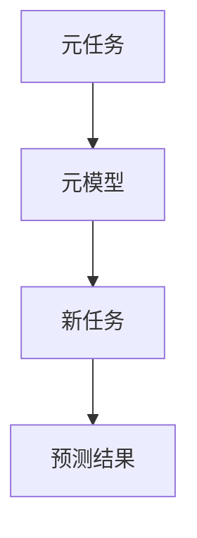
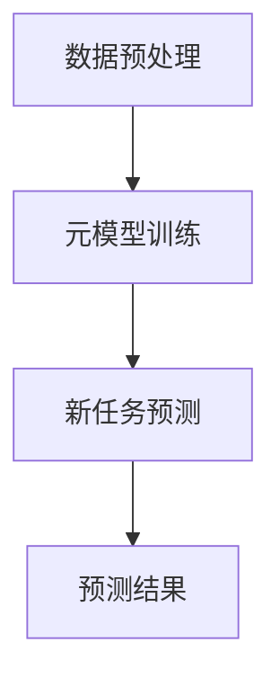

                 


# 金融领域元学习技术的探索与应用

## 关键词：元学习，金融，机器学习，迁移学习，算法优化

## 摘要：
本文深入探讨了元学习技术在金融领域的应用与探索，从理论基础到算法实现，再到系统设计和项目实战，全面解析了元学习在金融智能化中的重要作用。通过详细分析元学习的核心概念、算法原理、系统架构以及实际案例，本文为读者提供了一套完整的元学习技术在金融领域的解决方案，帮助读者更好地理解和应用这一技术。

---

# 第一部分: 元学习技术的背景与基础

## 第1章: 元学习的基本概念与背景

### 1.1 元学习的定义与核心概念
元学习是一种机器学习范式，旨在通过在多个任务上的学习，提升模型在新任务上的泛化能力。与传统机器学习不同，元学习注重从经验中快速学习新任务的能力，这在金融领域尤为重要，因为金融问题往往具有多样性和动态性。

#### 1.1.1 元学习的定义
元学习（Meta-Learning）是一种通过学习多个相关任务，从而快速适应新任务的学习方法。其核心在于利用跨任务的知识迁移，减少新任务上的训练数据需求。

#### 1.1.2 元学习的核心概念
- **元任务**：元学习中的多个训练任务，例如股票价格预测中的不同时间序列预测任务。
- **元模型**：用于学习任务间共性的模型，例如MAML（Meta-Algorithm for Meta-Learning）。
- **快速适应**：元学习模型能够在新任务上通过少量数据快速调整参数。

#### 1.1.3 元学习与传统机器学习的区别
| 方面       | 传统机器学习              | 元学习                     |
|------------|---------------------------|----------------------------|
| 数据需求   | 需要大量标注数据          | 可以通过少量数据快速适应新任务 |
| 任务处理   | 单任务学习                | 多任务学习                |
| 灵活性     | 较低                     | 较高                     |

### 1.2 元学习在金融领域的应用背景
金融领域的数据具有高度动态性和复杂性，传统机器学习方法往往难以应对快速变化的市场环境。元学习通过跨任务的知识迁移，能够有效提升模型的泛化能力。

#### 1.2.1 金融领域的复杂性与挑战
- 数据稀疏性：金融数据往往难以获取，且标注成本高。
- 动态性：市场环境快速变化，模型需要快速适应新数据。
- 多样性：金融问题涉及多个相关任务，例如股票预测、风险评估等。

#### 1.2.2 元学习在金融中的潜在价值
- 提高模型的泛化能力，减少对大量数据的依赖。
- 快速适应新任务，降低模型部署成本。
- 在多任务场景下表现出色，例如同时预测股票价格和评估风险。

#### 1.2.3 元学习与金融智能化的结合
金融智能化的核心是通过机器学习技术提升金融决策的效率和准确性。元学习作为机器学习的一种高级形式，能够为金融智能化提供新的解决方案。

---

## 第2章: 元学习的核心概念与联系

### 2.1 元学习的框架与原理
元学习的框架通常包括元任务和元模型两个部分。元任务用于训练元模型，元模型用于快速适应新任务。

#### 2.1.1 元学习的框架结构


#### 2.1.2 元学习的核心算法
元学习的核心算法包括基于梯度的元学习（如MAML）和基于参数初始化的元学习（如ReMAML）。

### 2.2 元学习与迁移学习的对比分析
迁移学习和元学习都关注跨任务的知识迁移，但两者在实现方式和应用场景上有显著区别。

#### 2.2.1 迁移学习的基本概念
迁移学习通过将一个任务上的知识迁移到另一个任务，以减少新任务上的数据需求。

#### 2.2.2 元学习与迁移学习的异同点
| 方面       | 迁移学习                  | 元学习                     |
|------------|---------------------------|----------------------------|
| 跨任务方式  | 直接迁移                   | 通过元任务学习             |
| 灵活性     | 较低                     | 较高                     |

#### 2.2.3 金融场景中的应用对比
在金融领域，迁移学习常用于跨市场的预测任务，而元学习则适用于多任务预测和动态适应场景。

### 2.3 元学习的数学模型与公式
元学习的数学模型通常涉及优化目标和损失函数。

#### 2.3.1 元学习的数学表达式
$$ \text{元学习目标} = \min_{\theta} \sum_{i=1}^{N} \mathcal{L}_i(\theta) $$

其中，$\theta$ 是元模型的参数，$\mathcal{L}_i$ 是第 $i$ 个任务的损失函数。

#### 2.3.2 元学习的优化目标
元学习的优化目标通常包括两个部分：元任务的优化和新任务的优化。

$$ \text{元任务优化} = \min_{\theta} \sum_{i=1}^{N} \mathcal{L}_i(f_\theta(x_i)) $$

其中，$f_\theta(x_i)$ 是元模型在第 $i$ 个任务上的预测结果。

---

## 第3章: 元学习算法的原理与实现

### 3.1 元学习算法的基本原理
元学习算法的核心在于通过元任务的训练，生成能够在新任务上快速适应的模型。

#### 3.1.1 基于梯度的元学习算法
MAML（Meta-Algorithm for Meta-Learning）是一种经典的基于梯度的元学习算法，其核心思想是通过计算梯度的梯度（即二阶导数）来更新参数。

#### 3.1.2 基于参数初始化的元学习算法
ReMAML（Recursive Meta-Learning）是一种基于参数初始化的元学习算法，其核心思想是通过递归地初始化参数，使得模型能够快速适应新任务。

### 3.2 元学习算法的实现步骤
1. **数据预处理**：将数据划分为多个任务，并进行标准化处理。
2. **模型构建**：定义元模型的结构，例如使用深度神经网络。
3. **元任务训练**：通过元任务的训练，优化元模型的参数。
4. **新任务预测**：在新任务上，利用元模型快速调整参数，生成预测结果。

---

## 第4章: 元学习技术在金融领域的应用

### 4.1 金融场景下的系统分析
在金融领域，元学习可以应用于股票价格预测、风险评估和交易策略优化等任务。

#### 4.1.1 股票价格预测
通过元学习，模型可以从多个股票的历史数据中学习，快速预测新股票的价格走势。

#### 4.1.2 风险评估与控制
元学习可以帮助模型在多个风险评估任务中学习，快速适应新的风险评估场景。

### 4.2 元学习系统的架构设计
元学习系统的架构通常包括数据预处理模块、元模型训练模块和新任务预测模块。

#### 4.2.1 系统功能设计
- 数据预处理模块：负责将原始数据划分为多个任务。
- 元模型训练模块：负责通过元任务训练元模型。
- 新任务预测模块：负责在新任务上快速调整元模型参数，生成预测结果。

#### 4.2.2 系统架构设计


---

## 第5章: 元学习技术的项目实战

### 5.1 项目环境安装
安装必要的依赖库，例如TensorFlow和Keras。

### 5.2 系统核心实现
实现元学习模型的训练和预测功能。

#### 5.2.1 数据预处理代码
```python
import numpy as np

def preprocess_data(data, tasks):
    # 将数据划分为多个任务
    task_data = {}
    for task in tasks:
        task_data[task] = data[task]
    return task_data
```

#### 5.2.2 元模型训练代码
```python
def meta_train(meta_model, task_data, epochs=100):
    for epoch in range(epochs):
        for task in task_data:
            # 训练元模型
            meta_model.fit(task_data[task]['X'], task_data[task]['y'])
```

### 5.3 项目实战案例
以股票价格预测为例，展示元学习模型的训练和预测过程。

---

## 第6章: 元学习技术的总结与展望

### 6.1 总结
元学习技术在金融领域的应用前景广阔，能够有效提升模型的泛化能力和适应性。

### 6.2 展望
未来，随着深度学习技术的不断发展，元学习在金融领域的应用将更加广泛和深入。

---

通过本文的系统讲解，读者可以全面了解元学习技术在金融领域的核心概念、算法原理和应用实践，为后续的研究和应用奠定坚实的基础。

