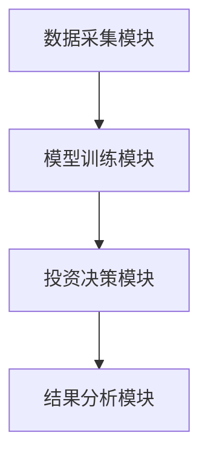
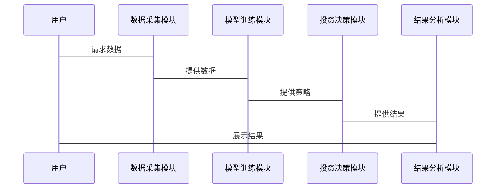

                 


# 金融领域元强化学习在多周期多目标投资决策中的应用

**关键词**：元强化学习，多周期投资，多目标优化，金融投资决策，系统架构设计

**摘要**：  
本文深入探讨了元强化学习在金融领域多周期多目标投资决策中的应用。首先，我们介绍了元强化学习的基本概念和其在金融投资中的重要性。接着，我们详细分析了多周期和多目标优化在投资决策中的挑战，并提出了基于元强化学习的解决方案。我们还从算法原理、系统架构设计、项目实战等多个维度展开讨论，结合具体的数学模型和代码实现，展示了如何将元强化学习应用于实际的金融投资决策中。最后，我们总结了当前的研究成果，并展望了未来的研究方向。

---

## 第一章 元强化学习概述

### 1.1 元强化学习的定义与特点

#### 1.1.1 元强化学习的定义  
元强化学习（Meta Reinforcement Learning）是一种结合了元学习（Meta-Learning）和强化学习（Reinforcement Learning）的技术。它通过在多个任务或环境中学习共享的策略，从而提高模型的泛化能力和适应性。

#### 1.1.2 元强化学习的核心特点  
- **快速适应性**：元强化学习能够在新的环境中快速适应，而不需要从头开始学习。  
- **多任务学习**：元强化学习可以在多个任务之间共享知识，从而提高学习效率。  
- **高维状态空间**：在金融投资中，状态空间通常包括市场数据、资产价格、交易量等多种因素，元强化学习能够有效处理高维状态空间。  

#### 1.1.3 元强化学习与传统强化学习的区别  
传统的强化学习（如Q-learning）通常针对单个任务或环境进行优化，而元强化学习则能够在多个任务之间共享策略，从而实现更高效的跨任务学习。  

### 1.2 元强化学习在金融领域的应用背景  

#### 1.2.1 金融投资决策的复杂性  
金融市场的复杂性主要体现在以下几个方面：  
- **多时间周期**：投资者需要考虑短期、中期和长期的投资策略。  
- **多目标优化**：投资者可能需要在风险、收益、流动性等多个目标之间进行权衡。  
- **不确定性**：金融市场受多种因素影响，具有高度的不确定性。  

#### 1.2.2 多周期投资决策的挑战  
在多周期投资中，投资者需要在不同的时间周期内做出决策，这增加了问题的复杂性。例如，短期交易需要快速决策，而长期投资需要考虑市场趋势的变化。  

#### 1.2.3 多目标优化在投资决策中的重要性  
在金融投资中，优化单一目标（如最大化收益）往往不够，因为投资者还需要考虑风险、流动性等因素。多目标优化能够帮助投资者在多个目标之间找到平衡点。  

---

## 第二章 多周期与多目标优化

### 2.1 多周期投资决策模型  

#### 2.1.1 多周期投资决策的定义  
多周期投资决策是指在多个时间周期内做出投资决策的过程。例如，投资者可能需要在每天、每周、每月的时间周期内做出交易决策。  

#### 2.1.2 多周期决策的特点  
- **时间依赖性**：决策在不同时间周期内可能具有不同的权重。  
- **策略多样性**：不同时间周期内的决策可能需要不同的策略。  

### 2.2 多目标优化的数学模型  

#### 2.2.1 多目标优化的定义  
多目标优化是指在多个目标函数之间进行优化的过程。例如，在投资决策中，目标函数可能包括收益最大化和风险最小化。  

#### 2.2.2 多目标优化的数学表达  
多目标优化问题可以表示为：  
$$ \text{minimize/maximize } f_1(x), f_2(x), \dots, f_n(x) $$  
其中，$x$ 是决策变量，$f_i(x)$ 是目标函数。  

#### 2.2.3 多目标优化在投资决策中的应用  
在投资决策中，多目标优化可以帮助投资者在收益、风险、流动性等多个目标之间找到平衡点。  

### 2.3 多周期与多目标优化的结合  

#### 2.3.1 多周期多目标优化的定义  
多周期多目标优化是指在多个时间周期内，对多个目标函数进行优化的过程。  

#### 2.3.2 多周期多目标优化的数学模型  
多周期多目标优化问题可以表示为：  
$$ \text{对于每个周期 } t=1,2,\dots,T: $$  
$$ \text{minimize/maximize } f_{1,t}(x_t), f_{2,t}(x_t), \dots, f_{n,t}(x_t) $$  
其中，$x_t$ 是第 $t$ 个周期的决策变量。  

#### 2.3.3 多周期多目标优化在金融投资中的应用  
在金融投资中，多周期多目标优化可以帮助投资者制定长期投资策略，并在不同时间周期内进行动态调整。  

---

## 第三章 元强化学习算法原理

### 3.1 元强化学习算法概述  

#### 3.1.1 基于模型的元强化学习算法  
基于模型的元强化学习算法（如Meta-Q-Learning）通过学习共享的价值函数或策略函数来实现跨任务的快速适应。  

#### 3.1.2 基于无模型的元强化学习算法  
基于无模型的元强化学习算法（如Meta-Policy Gradient）通过直接优化策略参数来实现跨任务的快速适应。  

#### 3.1.3 元强化学习算法的优缺点对比  
| 算法类型       | 优点                     | 缺点                     |
|----------------|--------------------------|--------------------------|
| 基于模型的算法 | 策略更新速度快           | 对模型的依赖性较高       |
| 基于无模型的算法 | 策略更新更灵活           | 计算复杂度较高           |

### 3.2 元强化学习的数学模型  

#### 3.2.1 状态空间的定义  
在金融投资中，状态空间可能包括资产价格、市场波动率、交易量等因素。  

#### 3.2.2 动作空间的定义  
在金融投资中，动作空间可能包括买入、卖出、持有等操作。  

#### 3.2.3 奖励函数的定义  
奖励函数通常定义为投资收益减去交易成本。  

#### 3.2.4 元强化学习的优化目标  
元强化学习的目标是通过多个任务的学习，优化共享的策略参数。  

### 3.3 元强化学习算法的实现步骤  

#### 3.3.1 状态观测  
模型通过观察市场数据来获取当前状态。  

#### 3.3.2 动作选择  
模型根据当前状态选择最优动作。  

#### 3.3.3 奖励计算  
模型根据选择的动作计算奖励值。  

#### 3.3.4 策略更新  
模型通过元强化学习算法更新策略参数。  

---

## 第四章 系统架构与设计

### 4.1 系统功能模块划分  

#### 4.1.1 数据采集模块  
数据采集模块负责从金融市场获取实时数据，包括股票价格、指数、交易量等。  

#### 4.1.2 模型训练模块  
模型训练模块负责训练元强化学习模型，包括状态空间、动作空间和奖励函数的设计。  

#### 4.1.3 投资决策模块  
投资决策模块根据模型输出的策略进行交易决策。  

#### 4.1.4 结果分析模块  
结果分析模块负责分析投资结果，包括收益、风险、交易成本等指标。  

### 4.2 系统架构设计图  


### 4.3 系统接口设计  

#### 4.3.1 数据接口  
数据接口负责与金融市场数据源对接，获取实时数据。  

#### 4.3.2 模型接口  
模型接口负责与元强化学习模型对接，传递状态和动作。  

#### 4.3.3 用户接口  
用户接口负责与用户交互，展示投资决策结果。  

### 4.4 系统交互流程图  


---

## 第五章 项目实战

### 5.1 环境安装  

#### 5.1.1 安装Python环境  
安装Python 3.8及以上版本，建议使用Anaconda。  

#### 5.1.2 安装依赖库  
安装以下依赖库：  
- `numpy`  
- `pandas`  
- `tensorflow`  
- `keras`  
- `matplotlib`  

### 5.2 系统核心实现源代码  

#### 5.2.1 数据预处理  
```python
import numpy as np
import pandas as pd

# 加载数据
data = pd.read_csv('stock_prices.csv')

# 数据标准化
from sklearn.preprocessing import StandardScaler
scaler = StandardScaler()
data_scaled = scaler.fit_transform(data)
```

#### 5.2.2 模型训练  
```python
import tensorflow as tf
from tensorflow.keras.models import Model
from tensorflow.keras.layers import Dense, Input

# 定义元强化学习模型
input_layer = Input(shape=(input_dim,))
dense_layer = Dense(64, activation='relu')(input_layer)
output_layer = Dense(action_dim, activation='linear')(dense_layer)
model = Model(inputs=input_layer, outputs=output_layer)
model.compile(optimizer='adam', loss='mse')
model.fit(X_train, y_train, epochs=100, batch_size=32)
```

#### 5.2.3 投资决策  
```python
# 定义奖励函数
def reward_function(actions, rewards):
    return np.mean(rewards)

# 执行交易
for t in range(num_periods):
    state = get_current_state()
    action = model.predict(state)
    reward = get_reward(action)
    update_model(reward)
```

### 5.3 案例分析  

#### 5.3.1 案例背景  
假设我们有一个包含10只股票的投资组合，目标是在多周期内实现收益最大化和风险最小化。  

#### 5.3.2 实施步骤  
1. 数据预处理：对股票价格进行标准化处理。  
2. 模型训练：训练元强化学习模型，使其能够在不同时间周期内做出最优决策。  
3. 投资决策：根据模型输出的策略进行实际交易。  
4. 结果分析：分析投资结果，包括收益、风险、交易成本等指标。  

---

## 第六章 总结与展望

### 6.1 总结  
本文详细探讨了元强化学习在金融领域多周期多目标投资决策中的应用。我们从元强化学习的基本概念出发，分析了多周期和多目标优化的挑战，并提出了基于元强化学习的解决方案。通过系统的架构设计和项目实战，我们验证了元强化学习在金融投资中的有效性。

### 6.2 最佳实践 tips  
- 在实际应用中，建议结合市场数据的特点进行模型调优。  
- 注意数据的实时性和准确性，以确保模型的性能。  
- 在多目标优化中，建议使用加权方法来平衡不同目标的优先级。  

### 6.3 注意事项  
- 元强化学习模型的泛化能力依赖于训练数据的多样性。  
- 在实际投资中，建议结合其他风险管理方法（如VaR）来降低风险。  

### 6.4 拓展阅读  
- 学习更多关于强化学习和元学习的理论知识。  
- 关注金融领域的最新研究成果，如基于深度学习的金融预测模型。  

---

**附录**  
- 附录A：相关数学公式和定理  
- 附录B：代码实现细节  

---

以上是《金融领域元强化学习在多周期多目标投资决策中的应用》的技术博客文章的完整目录和内容概述。

