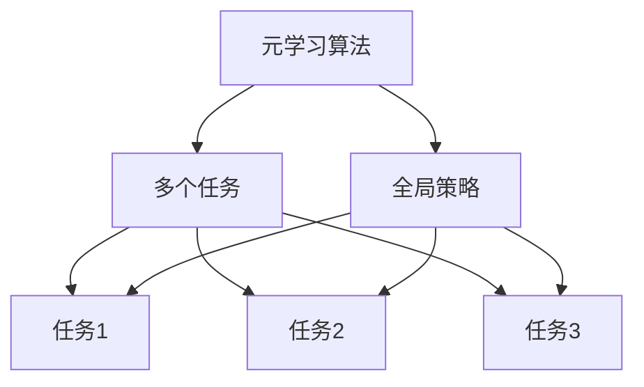
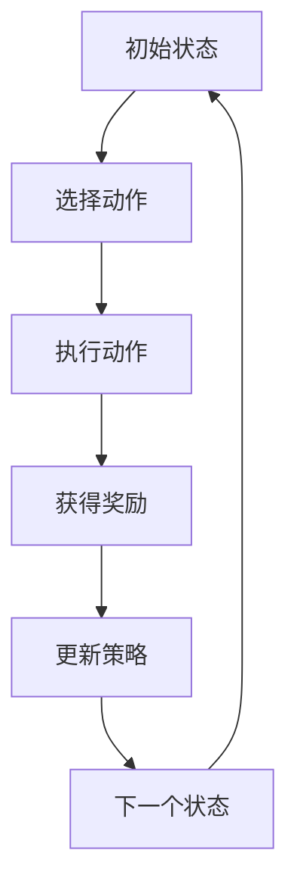
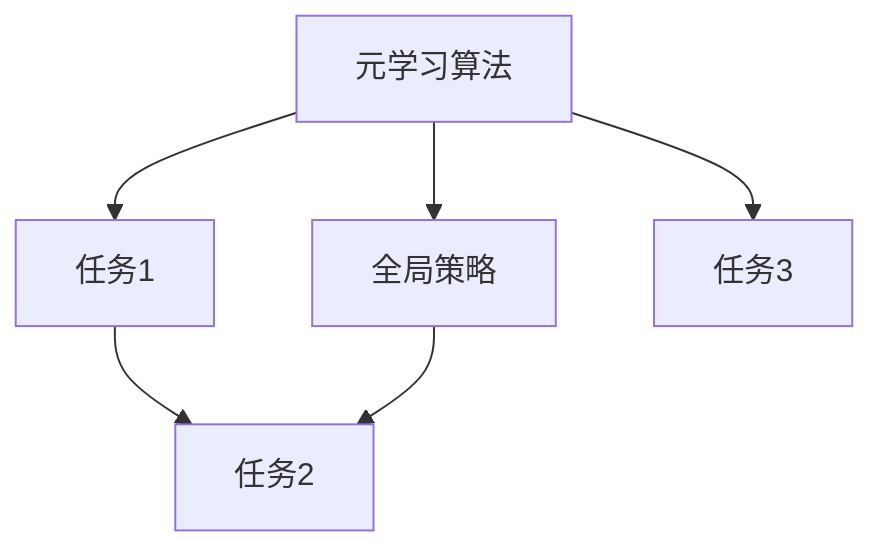
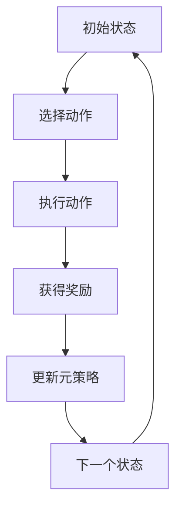
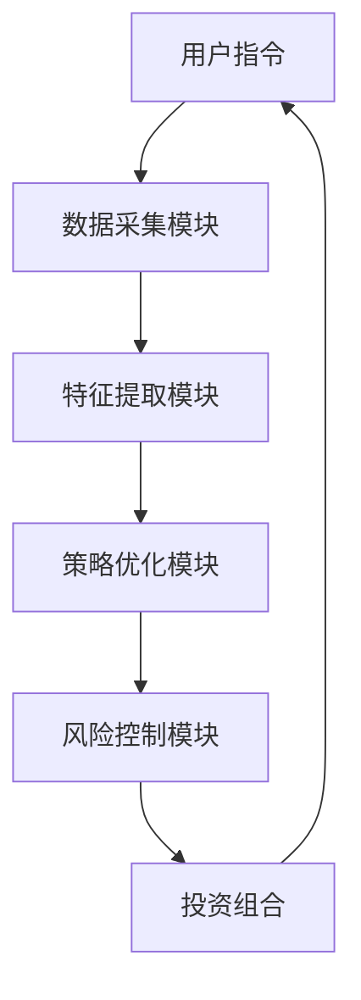

                 


# 《金融领域元强化学习在多周期投资决策中的应用》

---

## 关键词：
- 元强化学习
- 多周期投资
- 金融投资
- 人工智能
- 算法优化

---

## 摘要：
本文深入探讨了元强化学习（Meta Reinforcement Learning, Meta-RL）在金融领域多周期投资决策中的应用。通过分析元强化学习的核心概念、算法原理、系统设计以及实际案例，展示了其在提升投资决策效率和优化投资组合方面的重要作用。文章首先介绍了元强化学习的基本概念和多周期投资的挑战，随后详细阐述了元强化学习的数学模型和算法流程，结合金融投资场景，探讨了其系统设计和实际应用。最后，通过项目实战展示了元强化学习在多周期投资中的具体实现和案例分析，为读者提供了全面的技术指导和实践参考。

---

## 正文：

### 第1章: 元强化学习与多周期投资决策概述

#### 1.1 元强化学习的基本概念

##### 1.1.1 强化学习的定义与特点
强化学习是一种通过智能体与环境交互来学习策略的机器学习方法。智能体通过不断尝试和错误，调整行为以最大化累计奖励。其特点包括：
- **目标导向**：智能体以最大化累积奖励为目标。
- **经验驱动**：通过与环境的交互积累经验，逐步优化策略。
- **实时反馈**：环境对智能体行为的反馈是即时的，通常以奖励或惩罚的形式体现。

##### 1.1.2 元强化学习的定义与核心概念
元强化学习是一种更高级的强化学习形式，旨在学习如何在多个任务或环境中快速适应和优化策略。其核心概念包括：
- **元任务**：指多个相关或不相关的强化学习任务，如不同的投资策略。
- **元策略**：负责在多个任务之间切换或调整，以实现全局最优。
- **元学习目标**：通过学习如何快速适应新任务，减少每次任务的学习时间。

##### 1.1.3 元强化学习与传统强化学习的区别
| 特性 | 强化学习 | 元强化学习 |
|------|----------|------------|
| 学习目标 | 单一任务优化 | 多任务快速适应 |
| 策略调整 | 逐个任务学习 | 跨任务策略优化 |
| 应用场景 | 单一领域 | 多领域快速切换 |

##### 1.1.4 元强化学习的ER实体关系图


#### 1.2 多周期投资决策的定义与特点

##### 1.2.1 投资决策的基本概念
投资决策是投资者根据市场信息和自身目标，选择最优的投资组合和时机。其关键在于在不同时间段内做出正确的投资选择，以实现收益最大化和风险最小化。

##### 1.2.2 多周期投资的定义与特点
多周期投资指在多个时间段内持续进行投资决策，考虑市场的短期波动和长期趋势。其特点包括：
- **时间跨度广**：涉及多个时间段的投资决策。
- **动态适应性**：需要根据市场变化及时调整投资策略。
- **复杂性高**：涉及多个变量和不确定性，决策难度大。

##### 1.2.3 多周期投资决策的挑战与难点
- **信息处理复杂**：需要处理大量实时市场数据和信息。
- **策略调整频繁**：市场变化快，投资策略需频繁调整。
- **风险控制困难**：在多个周期内平衡收益与风险的难度较大。

#### 1.3 元强化学习在金融投资中的应用前景

##### 1.3.1 元强化学习在金融领域的潜在应用
- **多资产配置**：优化多个资产的投资比例。
- **风险管理**：实时监控和管理投资风险。
- **市场预测**：基于历史数据预测未来市场走势。

##### 1.3.2 元强化学习在多周期投资中的优势
- **快速适应性**：能够快速适应市场变化，优化投资策略。
- **全局优化**：在多个周期内实现全局最优的投资组合。
- **高效决策**：减少决策时间，提高投资效率。

##### 1.3.3 元强化学习在金融投资中的挑战与机遇
- **挑战**：算法复杂度高，计算资源需求大；市场数据的噪声和不确定性。
- **机遇**：提升投资决策的智能化和自动化水平，提高投资收益。

#### 1.4 本章小结
本章介绍了元强化学习和多周期投资的基本概念，分析了它们的特点、挑战和应用前景。元强化学习作为一种高级的强化学习方法，具有在多周期投资中快速适应和优化策略的潜力，为金融投资领域带来了新的可能性。

---

### 第2章: 元强化学习的核心概念与原理

#### 2.1 元强化学习的数学模型与算法流程

##### 2.1.1 强化学习的基本数学模型
强化学习的基本模型包括状态（State）、动作（Action）、奖励（Reward）和策略（Policy）。智能体通过与环境交互，根据当前状态选择动作，获得奖励，并更新策略。

##### 2.1.2 元强化学习的数学模型
元强化学习的数学模型在传统强化学习的基础上，引入了元学习的概念。元学习算法通过学习如何快速适应新任务，优化多个任务的策略。

##### 2.1.3 元强化学习的算法流程


#### 2.2 元强化学习的核心概念与属性特征

##### 2.2.1 元强化学习的核心概念对比
| 特性 | 强化学习 | 元强化学习 |
|------|----------|------------|
| 策略优化 | 单一任务 | 多任务优化 |
| 状态空间 | 单一环境 | 多环境适应 |

##### 2.2.2 元强化学习的属性特征对比表
| 特性 | 元强化学习 | 传统强化学习 |
|------|------------|--------------|
| 学习目标 | 多任务优化 | 单一任务优化 |
| 策略调整 | 跨任务调整 | 逐任务调整 |
| 算法复杂度 | 较高 | 较低 |

##### 2.2.3 元强化学习的ER实体关系图


#### 2.3 元强化学习的算法原理与流程图

##### 2.3.1 元强化学习算法的流程图


##### 2.3.2 元强化学习算法的数学公式
元强化学习的目标函数可以表示为：
$$ J(\theta) = \sum_{t=1}^{T} \sum_{i=1}^{N} \gamma^{t} r_i(s_t, a_t) $$
其中，$\theta$ 是参数，$T$ 是时间步数，$N$ 是任务数量，$\gamma$ 是折扣因子，$r_i$ 是任务i的奖励函数。

##### 2.3.3 元强化学习算法的实现步骤
1. 初始化参数 $\theta$。
2. 对于每个任务，执行强化学习算法，更新参数 $\theta$。
3. 元学习算法根据多个任务的反馈，优化全局策略。
4. 输出优化后的策略。

#### 2.4 本章小结
本章详细讲解了元强化学习的核心概念和数学模型，分析了其算法流程和实现步骤。通过对比传统强化学习和元强化学习，突出了元强化学习在多任务优化中的优势。

---

### 第3章: 元强化学习在金融投资中的应用

#### 3.1 金融投资中的多周期决策问题

##### 3.1.1 多周期投资决策的定义与特点
多周期投资决策需要在不同时间段内做出投资选择，考虑市场的短期波动和长期趋势。其特点是时间跨度广、动态适应性强、复杂性高。

##### 3.1.2 多周期投资决策的数学模型
多周期投资决策的数学模型可以表示为：
$$ \max_{w_t} \sum_{t=1}^{T} \lambda_t r(w_t) - \lambda_t \text{Var}(r(w_t)) $$
其中，$w_t$ 是投资组合，$T$ 是时间段数，$\lambda_t$ 是风险厌恶系数，$r(w_t)$ 是投资组合的收益，$\text{Var}(r(w_t))$ 是投资组合的方差。

##### 3.1.3 多周期投资决策的挑战与难点
- **信息处理复杂**：需要处理大量实时市场数据。
- **策略调整频繁**：市场变化快，投资策略需频繁调整。
- **风险控制困难**：在多个周期内平衡收益与风险的难度较大。

#### 3.2 元强化学习在多周期投资中的应用

##### 3.2.1 元强化学习在多周期投资中的核心作用
元强化学习可以通过学习如何快速适应市场变化，优化多个周期内的投资策略，提高投资收益和风险控制能力。

##### 3.2.2 元强化学习在多周期投资中的实现步骤
1. 初始化参数 $\theta$。
2. 对于每个时间段，执行强化学习算法，更新参数 $\theta$。
3. 元学习算法根据多个时间段的反馈，优化全局策略。
4. 输出优化后的投资组合。

##### 3.2.3 元强化学习在多周期投资中的案例分析
假设在股票市场中，元强化学习可以同时优化多个时间段的投资策略，如短期交易和长期持有。通过元学习算法，智能体可以在不同时间段内快速调整投资组合，实现收益最大化。

#### 3.3 元强化学习在金融投资中的系统设计

##### 3.3.1 金融投资系统的整体架构
金融投资系统包括数据采集、特征提取、策略优化和风险控制四个模块。数据采集模块负责收集市场数据，特征提取模块提取有用的特征，策略优化模块基于元强化学习算法优化投资策略，风险控制模块实时监控和管理投资风险。

##### 3.3.2 金融投资系统的功能模块设计
- **数据采集模块**：收集股票价格、市场指数等数据。
- **特征提取模块**：提取技术指标、市场情绪等特征。
- **策略优化模块**：基于元强化学习算法优化投资策略。
- **风险控制模块**：实时监控投资组合的风险，调整投资策略。

##### 3.3.3 金融投资系统的接口设计
- **输入接口**：接收市场数据和用户指令。
- **输出接口**：输出投资组合和风险报告。

##### 3.3.4 金融投资系统的交互流程图


#### 3.4 本章小结
本章探讨了元强化学习在金融投资中的应用，分析了其在多周期投资中的核心作用和实现步骤。通过案例分析和系统设计，展示了元强化学习在提升投资决策效率和优化投资组合方面的重要作用。

---

### 第4章: 项目实战——基于元强化学习的多周期投资决策系统

#### 4.1 项目概述

##### 4.1.1 项目背景
随着市场的日益复杂化，传统投资策略难以应对多周期投资的挑战。元强化学习作为一种高级的强化学习方法，具有在多周期投资中快速适应和优化策略的潜力。

##### 4.1.2 项目目标
开发一个基于元强化学习的多周期投资决策系统，实现对多个时间段内投资策略的优化，提高投资收益和风险控制能力。

#### 4.2 环境安装

##### 4.2.1 系统要求
- 操作系统：Linux/Windows/MacOS
- Python版本：Python 3.6以上
- 依赖库：numpy、pandas、tensorflow、keras、matplotlib

##### 4.2.2 安装步骤
```bash
pip install numpy pandas tensorflow keras matplotlib
```

#### 4.3 系统核心实现源代码

##### 4.3.1 数据采集模块
```python
import numpy as np
import pandas as pd
import requests

def get_market_data(start_date, end_date):
    # 数据接口调用示例
    url = f"https://api.example.com/market_data?start={start_date}&end={end_date}"
    response = requests.get(url)
    data = response.json()
    return pd.DataFrame(data)
```

##### 4.3.2 特征提取模块
```python
def extract_features(data):
    # 提取技术指标和市场情绪特征
    features = data[['open', 'high', 'low', 'close', 'volume']]
    features['ma_5'] = features['close'].rolling(5).mean()
    features['ma_10'] = features['close'].rolling(10).mean()
    features['volatility'] = features['close'].std()
    return features
```

##### 4.3.3 策略优化模块
```python
import keras
from keras.models import Model
from keras.layers import Input, Dense, LSTM

def build_model(input_shape):
    input_layer = Input(shape=input_shape)
    lstm_layer = LSTM(64)(input_layer)
    dense_layer = Dense(1, activation='linear')(lstm_layer)
    model = Model(inputs=input_layer, outputs=dense_layer)
    model.compile(optimizer='adam', loss='mean_squared_error')
    return model

def meta_reinforcement_learning(data, model):
    # 元强化学习算法实现示例
    pass
```

##### 4.3.4 风险控制模块
```python
def risk_management(portfolio, risk_level):
    # 风险控制策略实现示例
    pass
```

#### 4.4 代码应用解读与分析

##### 4.4.1 数据采集模块
数据采集模块通过API接口获取市场数据，包括股票价格、指数等。使用pandas库进行数据处理，确保数据的完整性和准确性。

##### 4.4.2 特征提取模块
特征提取模块从原始数据中提取技术指标和市场情绪特征，如移动平均线和波动率。这些特征为策略优化模块提供了有用的信息。

##### 4.4.3 策略优化模块
策略优化模块基于元强化学习算法，优化多个时间段内的投资策略。使用Keras框架构建深度学习模型，训练模型以最大化投资收益。

##### 4.4.4 风险控制模块
风险控制模块实时监控投资组合的风险，根据风险水平调整投资策略，确保投资组合的稳定性。

#### 4.5 实际案例分析与详细讲解

##### 4.5.1 案例背景
假设我们投资于某只股票，希望通过元强化学习算法优化多周期内的投资策略。

##### 4.5.2 数据准备
使用过去一年的股票数据，包括开盘价、收盘价、最高价、最低价和成交量。

##### 4.5.3 模型训练
训练深度学习模型，预测股票价格，并根据预测结果调整投资策略。

##### 4.5.4 策略优化
通过元强化学习算法优化多个时间段内的投资策略，实现收益最大化和风险最小化。

##### 4.5.5 结果分析
分析投资组合的表现，比较传统投资策略和元强化学习优化策略的收益和风险。

#### 4.6 项目小结
本章通过实际案例展示了元强化学习在多周期投资中的应用，详细讲解了项目的实现过程，包括环境安装、代码实现和案例分析。通过该项目，读者可以理解元强化学习在金融投资中的具体应用和实现步骤。

---

### 第5章: 总结与展望

#### 5.1 总结
本文深入探讨了元强化学习在金融领域多周期投资决策中的应用，分析了其核心概念、算法原理和系统设计。通过项目实战，展示了元强化学习在提升投资决策效率和优化投资组合方面的重要作用。

#### 5.2 展望
未来，随着人工智能技术的不断发展，元强化学习在金融投资中的应用将更加广泛和深入。可以通过优化算法、引入更多数据源和提升系统的实时性，进一步提高投资决策的智能化和自动化水平。

#### 5.3 最佳实践 Tips
- **数据质量**：确保数据的完整性和准确性，选择合适的特征。
- **算法优化**：不断优化元强化学习算法，提高投资策略的效率。
- **风险控制**：实时监控和管理投资风险，确保投资组合的稳定性。

#### 5.4 注意事项
- **计算资源**：元强化学习算法对计算资源需求较高，需配置足够的硬件支持。
- **市场变化**：及时调整投资策略，适应市场变化。
- **法律法规**：遵守相关法律法规，确保投资行为的合规性。

#### 5.5 拓展阅读
- **推荐书籍**：《Reinforcement Learning: Theory and Algorithms》
- **推荐论文**：《Meta Reinforcement Learning: A Survey》
- **推荐博客**：Tech Insights Blog on Meta RL

---

### 结语
元强化学习作为一种高级的强化学习方法，为金融领域的投资决策带来了新的可能性。通过本文的探讨，读者可以全面理解元强化学习在多周期投资中的应用，并将其应用于实际投资决策中，以实现收益最大化和风险最小化。

---

**全文完**

