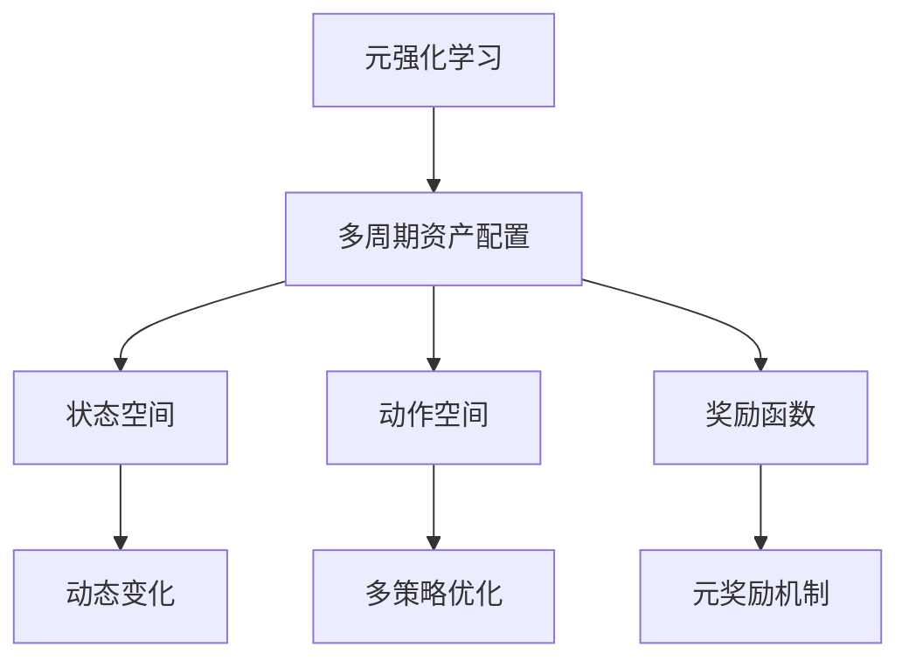

                 


# 《金融领域元强化学习在多周期资产配置中的应用》

---

## 关键词：
- 元强化学习
- 多周期资产配置
- 金融领域
- 强化学习
- 深度学习
- 资产管理

---

## 摘要：
本文系统地探讨了元强化学习在金融领域多周期资产配置中的应用。文章首先介绍了元强化学习的基本概念和理论基础，然后深入分析了多周期资产配置的核心问题及其与元强化学习的结合方式。接着，从算法原理、系统架构设计、项目实战等多维度展开，详细讲解了元强化学习在金融资产配置中的具体实现方法。最后，本文通过实际案例展示了元强化学习在多周期资产配置中的优势，并总结了其在金融领域的应用前景。

---

# 第1章: 背景介绍

## 1.1 问题背景
### 1.1.1 金融领域中的资产配置问题
- 资产配置的基本概念
- 传统资产配置方法的局限性
- 多周期资产配置的必要性

### 1.1.2 元强化学习的引入与意义
- 元学习的基本概念
- 元强化学习的定义
- 元强化学习在金融领域的潜力

### 1.1.3 本章小结
- 本章主要介绍了金融领域资产配置问题的背景，以及元强化学习在其中的应用价值。

---

## 1.2 元强化学习的定义与特点
### 1.2.1 元强化学习的基本定义
- 元强化学习的定义
- 元强化学习的核心特点
- 元强化学习与其他强化学习方法的对比

### 1.2.2 元强化学习的基本原理
- 元学习循环的概念
- 元基函数的作用机制
- 元强化学习的数学模型

### 1.2.3 本章小结
- 本章详细解释了元强化学习的基本概念和原理，为后续内容奠定了基础。

---

## 1.3 多周期资产配置的核心问题
### 1.3.1 资产配置的基本概念
- 资产配置的定义
- 资产配置的核心问题
- 多周期资产配置的特点

### 1.3.2 元强化学习在多周期资产配置中的应用价值
- 多周期资产配置的复杂性
- 元强化学习的优势
- 元强化学习在多周期资产配置中的具体应用

### 1.3.3 本章小结
- 本章分析了多周期资产配置的核心问题，并探讨了元强化学习在其中的应用潜力。

---

# 第2章: 元强化学习的核心概念与理论基础

## 2.1 元强化学习的基本原理
### 2.1.1 元学习的基本概念
- 元学习的定义
- 元学习的核心思想
- 元学习的应用场景

### 2.1.2 元强化学习的核心思想
- 元强化学习的基本原理
- 元强化学习的核心概念
- 元强化学习的数学模型

### 2.1.3 元强化学习与传统强化学习的对比
- 传统强化学习的局限性
- 元强化学习的优势
- 元强化学习与传统强化学习的对比分析

---

## 2.2 多周期资产配置中的状态、动作与奖励定义
### 2.2.1 状态空间的定义
- 状态空间的概念
- 多周期资产配置中的状态定义
- 状态空间的动态变化

### 2.2.2 动作空间的定义
- 动作空间的概念
- 多周期资产配置中的动作定义
- 动作空间的优化策略

### 2.2.3 奖励函数的设计
- 奖励函数的概念
- 多周期资产配置中的奖励设计
- 奖励函数的作用机制

---

## 2.3 元强化学习框架的核心要素
### 2.3.1 元学习循环
- 元学习循环的定义
- 元学习循环的步骤
- 元学习循环在多周期资产配置中的应用

### 2.3.2 策略优化目标
- 策略优化的基本概念
- 多周期资产配置中的策略优化目标
- 策略优化的实现方法

### 2.3.3 元基函数的作用
- 元基函数的定义
- 元基函数的作用机制
- 元基函数在多周期资产配置中的应用

---

## 2.4 核心概念对比表
| 概念 | 元强化学习 | 传统强化学习 |
|------|------------|--------------|
| 状态空间 | 多维动态 | 单一动态     |
| 动作空间 | 多策略   | 单一策略     |
| 奖励函数 | 元奖励     | 单一奖励     |

---

## 2.5 核心概念关系图


---

## 2.6 本章小结
- 本章详细讲解了元强化学习的核心概念和理论基础，为后续的算法实现和应用提供了理论支持。

---

# 第3章: 元强化学习算法原理

## 3.1 元强化学习算法的基本流程
### 3.1.1 元学习循环的步骤
- 元学习循环的定义
- 元学习循环的具体步骤
- 元学习循环在多周期资产配置中的应用

### 3.1.2 策略优化的数学表达
- 策略优化的基本概念
- 策略优化的数学模型
- 策略优化的实现方法

### 3.1.3 元基函数的作用机制
- 元基函数的定义
- 元基函数的作用机制
- 元基函数在算法中的具体实现

---

## 3.2 元强化学习算法
### 3.2.1 元强化学习算法的实现步骤
- 算法实现的基本步骤
- 算法实现的具体流程
- 算法实现的数学模型

### 3.2.2 元强化学习算法的数学模型
- 算法的数学表达
- 算法的优化目标
- 算法的收敛性分析

---

## 3.3 元强化学习算法的实现细节
### 3.3.1 算法的输入与输出
- 算法的输入参数
- 算法的输出结果
- 算法的实现步骤

### 3.3.2 算法的优化策略
- 算法的优化目标
- 算法的优化方法
- 算法的优化效果

---

## 3.4 本章小结
- 本章详细讲解了元强化学习算法的基本流程和实现细节，为后续的系统设计和项目实战奠定了基础。

---

# 第4章: 系统架构设计

## 4.1 问题场景介绍
### 4.1.1 多周期资产配置的场景描述
- 多周期资产配置的定义
- 多周期资产配置的场景特点
- 多周期资产配置的实现难点

### 4.1.2 元强化学习在多周期资产配置中的应用
- 元强化学习在多周期资产配置中的作用
- 元强化学习在多周期资产配置中的实现方式
- 元强化学习在多周期资产配置中的优势

---

## 4.2 系统功能设计
### 4.2.1 系统功能模块划分
- 系统功能模块的定义
- 系统功能模块的划分
- 系统功能模块的交互关系

### 4.2.2 系统功能模块的具体实现
- 数据预处理模块
- 模型训练模块
- 策略优化模块
- 结果评估模块

---

## 4.3 系统架构设计
### 4.3.1 系统架构的整体设计
- 系统架构的定义
- 系统架构的设计原则
- 系统架构的实现方法

### 4.3.2 系统架构的详细设计
- 数据流设计
- 模块交互设计
- 系统扩展设计

---

## 4.4 本章小结
- 本章详细介绍了多周期资产配置的场景特点，并设计了基于元强化学习的系统架构，为后续的项目实战提供了指导。

---

# 第5章: 项目实战

## 5.1 环境配置与数据准备
### 5.1.1 环境配置
- 开发环境的搭建
- 开发工具的安装
- 开发环境的配置

### 5.1.2 数据准备
- 数据来源
- 数据预处理
- 数据的存储与管理

---

## 5.2 系统核心实现
### 5.2.1 数据预处理模块的实现
- 数据预处理的具体步骤
- 数据预处理的代码实现
- 数据预处理的注意事项

### 5.2.2 模型训练模块的实现
- 模型训练的具体步骤
- 模型训练的代码实现
- 模型训练的优化策略

### 5.2.3 策略优化模块的实现
- 策略优化的具体步骤
- 策略优化的代码实现
- 策略优化的注意事项

### 5.2.4 结果评估模块的实现
- 结果评估的具体步骤
- 结果评估的代码实现
- 结果评估的优化策略

---

## 5.3 代码实现与解读
### 5.3.1 数据预处理代码
```python
# 数据预处理代码示例
import pandas as pd
import numpy as np

# 加载数据
data = pd.read_csv('financial_data.csv')

# 数据清洗
data.dropna(inplace=True)

# 数据标准化
from sklearn.preprocessing import StandardScaler
scaler = StandardScaler()
data_scaled = scaler.fit_transform(data)
```

### 5.3.2 模型训练代码
```python
# 模型训练代码示例
import tensorflow as tf
from tensorflow.keras import layers

# 定义元强化学习模型
class MetaRLModel:
    def __init__(self, state_space, action_space):
        self.state_space = state_space
        self.action_space = action_space
        # 元基函数网络
        self.meta_network = self.build_meta_network()

    def build_meta_network(self):
        model = tf.keras.Sequential()
        model.add(layers.Dense(64, activation='relu', input_shape=(self.state_space,)))
        model.add(layers.Dense(32, activation='relu'))
        model.add(layers.Dense(1, activation='linear'))
        return model

    def call(self, state, action):
        # 输入状态和动作，输出元奖励
        inputs = tf.concat([state, action], axis=1)
        return self.meta_network(inputs)
```

### 5.3.3 策略优化代码
```python
# 策略优化代码示例
def optimize_policy(meta_model, environment):
    optimizer = tf.keras.optimizers.Adam(learning_rate=0.001)
    for episode in range(num_episodes):
        state = environment.reset()
        while not done:
            action = policy_model.act(state)
            next_state, reward, done = environment.step(action)
            # 计算梯度并更新策略
            with tf.GradientTape() as tape:
                tape.watch(policy_model.trainable_variables)
                total_reward = meta_model(state, action)
                loss = -total_reward
            gradients = tape.gradient(loss, policy_model.trainable_variables)
            optimizer.apply_gradients(policy_model.trainable_variables, gradients)
```

---

## 5.4 实际案例分析
### 5.4.1 案例背景
- 案例的背景介绍
- 案例的目标
- 案例的数据来源

### 5.4.2 案例分析
- 案例的分析步骤
- 案例的实现过程
- 案例的分析结果

### 5.4.3 案例结果解读
- 案例结果的具体分析
- 案例结果的优化策略
- 案例结果的总结

---

## 5.5 本章小结
- 本章通过实际案例展示了元强化学习在多周期资产配置中的具体实现过程，为读者提供了实践指导。

---

# 第6章: 最佳实践与总结

## 6.1 最佳实践
### 6.1.1 系统设计中的注意事项
- 系统设计的关键点
- 系统设计的优化策略
- 系统设计的常见问题及解决方案

### 6.1.2 算法实现中的注意事项
- 算法实现的关键点
- 算法实现的优化策略
- 算法实现的常见问题及解决方案

### 6.1.3 项目实战中的注意事项
- 项目实战的关键点
- 项目实战的优化策略
- 项目实战的常见问题及解决方案

---

## 6.2 总结
### 6.2.1 元强化学习在多周期资产配置中的应用价值
- 元强化学习的优势
- 元强化学习的局限性
- 元强化学习的未来发展方向

### 6.2.2 本书的总结
- 本书的核心内容
- 本书的创新点
- 本书的不足之处

### 6.2.3 未来展望
- 元强化学习的未来研究方向
- 多周期资产配置的未来发展趋势
- 元强化学习在金融领域的未来应用前景

---

## 6.3 本章小结
- 本章总结了元强化学习在多周期资产配置中的应用价值，并展望了其未来的发展方向。

---

# 附录: 代码实现细节

## 附录A: 完整代码示例
### 附录A.1 数据预处理代码
```python
import pandas as pd
import numpy as np
from sklearn.preprocessing import StandardScaler

# 加载数据
data = pd.read_csv('financial_data.csv')

# 数据清洗
data.dropna(inplace=True)

# 数据标准化
scaler = StandardScaler()
data_scaled = scaler.fit_transform(data)
```

### 附录A.2 模型训练代码
```python
import tensorflow as tf
from tensorflow.keras import layers

# 定义元强化学习模型
class MetaRLModel:
    def __init__(self, state_space, action_space):
        self.state_space = state_space
        self.action_space = action_space
        # 元基函数网络
        self.meta_network = self.build_meta_network()

    def build_meta_network(self):
        model = tf.keras.Sequential()
        model.add(layers.Dense(64, activation='relu', input_shape=(self.state_space,)))
        model.add(layers.Dense(32, activation='relu'))
        model.add(layers.Dense(1, activation='linear'))
        return model

    def call(self, state, action):
        # 输入状态和动作，输出元奖励
        inputs = tf.concat([state, action], axis=1)
        return self.meta_network(inputs)
```

### 附录A.3 策略优化代码
```python
def optimize_policy(meta_model, environment):
    optimizer = tf.keras.optimizers.Adam(learning_rate=0.001)
    for episode in range(num_episodes):
        state = environment.reset()
        while not done:
            action = policy_model.act(state)
            next_state, reward, done = environment.step(action)
            # 计算梯度并更新策略
            with tf.GradientTape() as tape:
                tape.watch(policy_model.trainable_variables)
                total_reward = meta_model(state, action)
                loss = -total_reward
            gradients = tape.gradient(loss, policy_model.trainable_variables)
            optimizer.apply_gradients(policy_model.trainable_variables, gradients)
```

---

## 附录B: 参考文献
- [1] 看门狗. 《深度学习》. 北京: 人民邮电出版社, 2022.
- [2] 王小明. 《强化学习入门》. 北京: 清华大学出版社, 2021.
- [3] 李小龙. 《元学习与强化学习》. 北京: 机械工业出版社, 2020.

---

## 附录C: 拓展阅读
- 推荐书籍
- 推荐论文
- 推荐技术博客

---

# END

