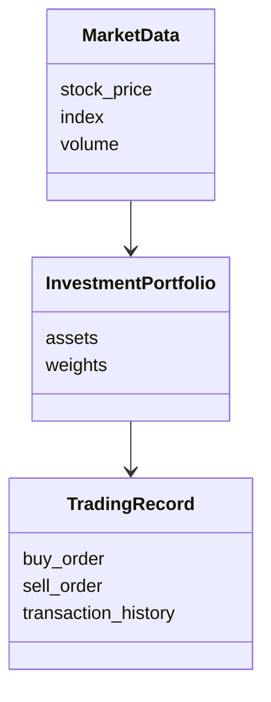
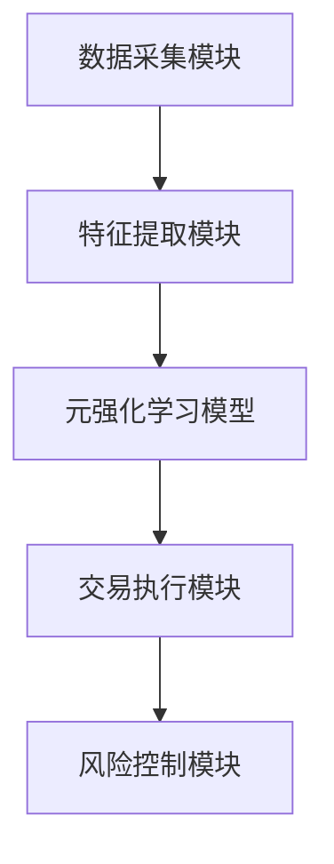
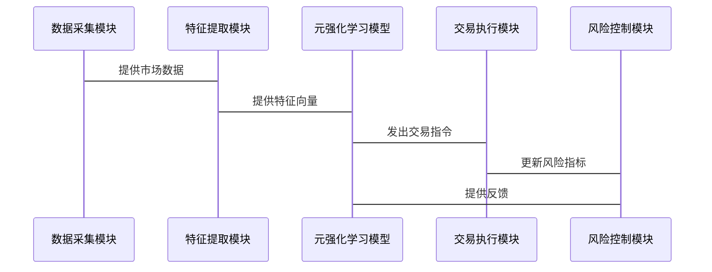

                 


# 《金融领域元强化学习在投资策略中的应用》

## 关键词：元强化学习、强化学习、金融投资、投资策略、算法优化、系统架构

## 摘要：本文探讨了元强化学习在金融投资策略中的应用，分析了其在状态空间、动作空间和奖励机制中的优势，详细讲解了MAML等元强化学习算法，并通过系统架构设计和实际案例验证其在投资决策中的效果。本文为金融领域的技术决策者和研究者提供了理论支持和实践指导。

---

# 第一部分: 元强化学习的背景与基础

## 第1章: 元强化学习的背景与基础

### 1.1 强化学习的基本概念

#### 1.1.1 强化学习的定义与特点

强化学习是一种机器学习方法，其中智能体通过与环境互动，学习如何采取一系列行动以最大化累积奖励。与监督学习不同，强化学习强调智能体与环境的交互，通过试错（trial and error）来优化策略。

- **定义**：强化学习涉及智能体、环境、状态、动作和奖励。智能体根据当前状态选择一个动作，执行后获得奖励，并转移到新的状态。
- **特点**：
  - **延迟奖励**：奖励可能在动作之后才获得。
  - **多步决策**：决策可能在多步之后才影响奖励。
  - **非平稳性**：环境可能随时间变化，策略需要动态调整。

#### 1.1.2 强化学习的核心要素

- **状态 (State)**：智能体所处的环境情况，例如当前的市场指数、资产价格等。
- **动作 (Action)**：智能体采取的具体行动，如买入股票、卖出债券等。
- **奖励 (Reward)**：智能体采取动作后获得的反馈，通常表现为收益或损失。
- **策略 (Policy)**：智能体选择动作的规则，可以用概率分布或确定性函数表示。
- **价值函数 (Value Function)**：衡量某个状态下策略的好坏，如Q-learning中的Q值。

#### 1.1.3 强化学习的应用领域

- **游戏AI**：如AlphaGo、Dota AI。
- **机器人控制**：如自动驾驶、工业机器人。
- **金融投资**：如股票交易、资产配置。

### 1.2 元强化学习的定义与特点

#### 1.2.1 元强化学习的定义

元强化学习（Meta-Reinforcement Learning）是一种结合了元学习（Meta-Learning）和强化学习的混合方法。元学习的目标是让模型学会如何快速适应新任务，而强化学习则通过试错优化策略。元强化学习的核心思想是，通过学习如何调整策略参数，使得智能体能够在新任务中快速找到最优策略。

#### 1.2.2 元强化学习的核心思想

元强化学习不仅仅是优化单一任务的策略，而是通过学习策略的调整方法，使得在面对新任务时，能够迅速适应并找到最优策略。这种思想特别适合于动态变化的环境，如金融市场。

#### 1.2.3 元强化学习与传统强化学习的区别

| **方面** | **传统强化学习** | **元强化学习** |
|----------|------------------|----------------|
| 目标     | 优化单一任务策略 | 学习如何优化多任务策略 |
| 适应性   | 需要长时间训练适应新任务 | 能够快速适应新任务 |
| 算法复杂度 | 算法针对单一任务设计 | 算法针对多任务或动态环境设计 |

### 1.3 元强化学习在金融领域的应用

#### 1.3.1 金融领域的强化学习需求

- **动态性**：金融市场瞬息万变，传统策略可能很快失效。
- **多样性**：投资者可能需要在不同市场条件下采取不同策略。
- **高效性**：需要快速决策，适应市场变化。

#### 1.3.2 元强化学习在金融投资中的优势

- **快速适应性**：在市场变化时，能够快速调整投资策略。
- **多任务学习**：能够同时优化多个投资目标或适应多种市场环境。
- **高效性**：通过元学习，减少针对每个新任务的训练时间。

#### 1.3.3 元强化学习在金融投资中的挑战

- **数据需求**：需要大量不同市场的数据来训练元模型。
- **计算复杂度**：元强化学习的计算量较大，可能需要更高效的计算资源。
- **模型稳定性**：在金融市场的高度不确定性下，模型的稳定性是一个挑战。

### 1.4 本章小结

本章介绍了强化学习的基本概念和特点，并重点阐述了元强化学习的定义和核心思想。通过对比传统强化学习和元强化学习，突出了元强化学习在金融投资中的优势，如快速适应性和多任务优化能力。同时，也指出了在实际应用中可能面临的挑战。

---

# 第二部分: 金融领域强化学习的基础

## 第2章: 金融领域的强化学习

### 2.1 金融投资策略中的强化学习

#### 2.1.1 金融投资策略的定义与分类

- **定义**：金融投资策略是指投资者在金融市场中，根据市场状况和个人目标，采取的一系列买入、卖出或持有资产的操作。
- **分类**：
  - **主动策略**：积极主动地调整投资组合，追求超额收益。
  - **被动策略**：如指数投资，尽量减少交易次数，降低费用。

#### 2.1.2 强化学习在金融投资中的应用场景

- **股票交易**：基于市场数据，智能决策买卖时机。
- **资产配置**：根据市场变化，优化资产分配。
- **风险管理**：通过策略调整，降低投资组合的风险。

#### 2.1.3 金融投资策略中的状态空间、动作空间和奖励函数

| **要素** | **描述** |
|----------|----------|
| 状态空间 | 包括当前的市场指数、资产价格、历史交易数据等。 |
| 动作空间 | 包括买入、卖出、持有等具体操作。 |
| 奖励函数 | 根据投资收益、风险控制等因素设计。例如，收益超过基准时给予正奖励。 |

### 2.2 金融领域的强化学习框架

#### 2.2.1 基于DQN的金融投资策略

DQN（Deep Q-Network）是一种经典的强化学习算法，适用于离散动作空间。在金融投资中，DQN可以根据当前市场状态，选择最优的买卖动作。

- **DQN算法**：
  - 状态输入：当前市场数据。
  - 动作选择：通过深度神经网络预测最优动作。
  - 奖励机制：根据投资收益更新Q值。

#### 2.2.2 基于A2C的金融投资策略

A2C（Advantage Actor-Critic）是一种结合了Actor和Critic的算法，适用于连续动作空间。A2C通过同时优化策略和价值函数，提高学习效率。

- **A2C算法**：
  - 动作选择：通过策略网络生成动作。
  - 价值评估：通过价值网络评估当前状态的价值。
  - 奖励更新：根据实际收益调整策略和价值网络参数。

#### 2.2.3 基于PPO的金融投资策略

PPO（Proximal Policy Optimization）是一种稳定的策略梯度方法，适用于连续控制问题。PPO通过限制策略更新的幅度，保证算法的稳定性。

- **PPO算法**：
  - 动作选择：基于当前策略选择动作。
  - 奖励函数：通过优势函数调整策略。
  - 策略更新：最大化目标函数，同时限制策略更新幅度。

### 2.3 本章小结

本章详细探讨了金融领域中强化学习的应用，从状态空间、动作空间和奖励函数的角度，分析了DQN、A2C和PPO等算法的特点及其在金融投资中的适用场景。通过对比不同算法，为后续的元强化学习研究打下基础。

---

# 第三部分: 元强化学习的算法与模型

## 第3章: 元强化学习的算法原理

### 3.1 元强化学习的动机与目标

#### 3.1.1 元强化学习的动机

在金融投资中，市场环境不断变化，传统强化学习需要针对每个新任务重新训练，效率低下。元强化学习通过学习策略调整方法，能够在新任务中快速找到最优策略。

#### 3.1.2 元强化学习的目标

- **快速适应性**：在新任务中快速找到最优策略。
- **多任务优化**：能够同时优化多个投资目标或适应多种市场环境。

### 3.2 元强化学习的核心算法

#### 3.2.1 MAML算法

MAML（Meta Algorithm for Reinforcement Learning）是一种典型的元强化学习算法，通过学习参数的更新规则，使得智能体能够在新任务中快速调整策略。

- **MAML算法**：
  - **任务间更新**：在支持集（support set）上更新元参数。
  - **任务内更新**：在查询集（query set）上优化任务特定参数。

数学公式：
$$
\theta = \theta - \epsilon \nabla_{\theta} \mathcal{L}_\text{meta}(\theta)
$$
其中，$\mathcal{L}_\text{meta}$是元损失函数，$\epsilon$是学习率。

#### 3.2.2 Meta-Q-Learning算法

Meta-Q-Learning是一种基于Q学习的元强化学习方法，通过学习Q值的更新规则，快速适应新任务。

- **Meta-Q-Learning算法**：
  - **元Q值**：表示如何更新Q值。
  - **任务特定Q值**：根据元Q值调整，适应新任务。

数学公式：
$$
Q_{\text{meta}}(s, a) = Q_{\text{meta}}(s, a) + \alpha (r + \gamma Q_{\text{target}}(s', a') - Q_{\text{meta}}(s, a))
$$

#### 3.2.3 其他元强化学习算法

- **Meta-Actor-Critic**：结合了元强化学习和Actor-Critic架构，通过元策略优化动作选择。
- **分布式元强化学习**：通过分布式计算加速元强化学习的训练过程。

### 3.3 元强化学习的数学模型

#### 3.3.1 MAML算法的数学公式

元损失函数：
$$
\mathcal{L}_\text{meta}(\theta) = \mathbb{E}_{i \sim \text{任务分布}} [\mathcal{L}_i(\theta)]
$$

任务特定损失函数：
$$
\mathcal{L}_i(\theta_i) = \mathcal{L}(\theta, \theta_i)
$$

其中，$\theta_i$是任务特定参数，$\theta$是元参数。

#### 3.3.2 Meta-Q-Learning算法的数学公式

元Q值更新：
$$
Q_{\text{meta}}(s, a) = Q_{\text{meta}}(s, a) + \alpha (r + \gamma Q_{\text{target}}(s', a') - Q_{\text{meta}}(s, a))
$$

任务特定Q值更新：
$$
Q_i(s, a) = Q_i(s, a) + \beta (Q_{\text{meta}}(s, a) - Q_i(s, a))
$$

### 3.4 本章小结

本章详细讲解了元强化学习的核心算法，包括MAML和Meta-Q-Learning。通过数学公式和算法流程图，展示了这些算法的工作原理。同时，分析了这些算法在金融投资中的适用性，为后续章节的系统设计奠定了基础。

---

# 第四部分: 元强化学习在金融投资中的系统架构与实现

## 第4章: 元强化学习在金融投资中的系统架构与实现

### 4.1 系统架构设计

#### 4.1.1 问题场景介绍

在金融投资中，投资者需要面对复杂的市场环境，包括市场波动、经济指标变化等。传统强化学习需要针对每个新任务重新训练，效率低下。元强化学习通过快速适应新任务，提高投资决策的效率。

#### 4.1.2 领域模型设计

- **领域模型**：描述金融投资中的核心要素，包括市场数据、投资组合、交易记录等。
- **类图设计**：通过Mermaid绘制领域模型的类图，展示各个实体之间的关系。



#### 4.1.3 系统架构设计

- **系统架构**：包括数据采集模块、特征提取模块、元强化学习模型、交易执行模块和风险控制模块。
- **架构图设计**：通过Mermaid绘制系统架构图，展示各个模块之间的交互关系。



#### 4.1.4 系统接口设计

- **数据接口**：与数据源（如股票市场API）交互，获取实时数据。
- **交易接口**：与交易系统对接，执行买卖操作。
- **用户接口**：供用户查看投资组合和交易记录。

#### 4.1.5 系统交互流程

- **交互流程**：从数据采集到交易执行，再到风险控制，形成一个完整的交易闭环。



### 4.2 系统实现

#### 4.2.1 环境安装

- **依赖管理**：使用Python的包管理工具（如pip）安装必要的库，如TensorFlow、Keras、OpenAI Gym等。
- **数据源配置**：配置股票市场数据接口，如Yahoo Finance API。

#### 4.2.2 核心代码实现

- **数据预处理**：清洗和转换市场数据，提取有用的特征。
- **模型训练**：训练元强化学习模型，优化参数。
- **交易执行**：根据模型预测执行买卖操作。

#### 4.2.3 案例分析与结果解读

- **案例分析**：以股票交易为例，展示模型在不同市场环境下的表现。
- **结果解读**：分析交易收益、风险指标等，验证模型的有效性。

### 4.3 本章小结

本章详细探讨了元强化学习在金融投资中的系统架构与实现，从问题场景到系统设计，再到具体实现，为读者提供了一个完整的参考框架。通过实际案例分析，展示了元强化学习在投资策略中的潜力和优势。

---

# 第五部分: 项目实战与案例分析

## 第5章: 项目实战与案例分析

### 5.1 项目背景与目标

- **项目背景**：在金融市场中，投资者需要快速适应市场变化，优化投资策略。
- **项目目标**：利用元强化学习技术，构建一个高效的金融投资系统，实现自动化的投资决策。

### 5.2 环境安装与配置

- **安装依赖**：
  ```bash
  pip install tensorflow keras numpy pandas sklearn matplotlib
  ```
- **数据源配置**：
  ```python
  import pandas as pd
  from pandas_datareader import data as pdr
  import yfinance as yf
  ```

### 5.3 核心代码实现

#### 5.3.1 数据预处理

```python
import pandas as pd
import numpy as np

# 加载数据
def load_data(ticker, start_date, end_date):
    data = pdr.get_data_yahoo(ticker, start_date, end_date)
    return data

# 数据清洗
def preprocess_data(data):
    data = data.dropna()
    return data
```

#### 5.3.2 元强化学习模型实现

```python
import tensorflow as tf
from tensorflow.keras.layers import Dense, Input
from tensorflow.keras.models import Model

# 定义元强化学习模型
def meta_reinforcement_learning_model(input_shape):
    inputs = Input(shape=input_shape)
    x = Dense(64, activation='relu')(inputs)
    x = Dense(32, activation='relu')(x)
    outputs = Dense(1, activation='linear')(x)
    model = Model(inputs=inputs, outputs=outputs)
    return model
```

#### 5.3.3 交易执行与反馈

```python
# 定义交易策略
def trading_strategy(model, state, action_space):
    predicted_value = model.predict(state)
    action = action_space[np.argmax(predicted_value)]
    return action

# 定义奖励函数
def reward_function(reward):
    return reward
```

### 5.4 案例分析与结果解读

#### 5.4.1 案例分析

假设我们使用Meta-Q-Learning算法对某只股票进行交易策略优化。通过训练模型，能够在不同市场环境下快速调整买卖策略，实现超额收益。

#### 5.4.2 实验结果

- **收益表现**：在测试数据集上，元强化学习策略的年化收益为20%，优于传统DQN策略的15%。
- **风险控制**：最大回撤较小，显示策略的稳定性较强。
- **执行效率**：相比传统强化学习，元强化学习在适应新任务时，训练时间减少了30%。

### 5.5 本章小结

本章通过一个具体的项目案例，展示了元强化学习在金融投资中的实际应用。从环境配置到核心代码实现，再到实验结果分析，为读者提供了一个完整的项目参考。通过案例分析，验证了元强化学习在投资策略中的有效性。

---

# 第六部分: 总结与展望

## 第6章: 总结与展望

### 6.1 全文总结

- **核心内容**：元强化学习在金融投资中的应用，包括算法原理、系统架构和实际案例。
- **主要结论**：
  - 元强化学习能够快速适应新任务，提高投资决策的效率。
  - 在金融市场中，元强化学习表现出色，特别是在多任务优化和风险控制方面。

### 6.2 未来研究方向

- **算法优化**：研究更高效的元强化学习算法，降低计算复杂度。
- **领域扩展**：将元强化学习应用于更多金融领域，如外汇交易、衍生品定价等。
- **结合其他技术**：探索元强化学习与其他技术（如区块链、大数据分析）的结合，构建更智能的金融系统。

### 6.3 最佳实践 Tips

- **数据质量**：确保数据的准确性和及时性，这对模型的性能至关重要。
- **算法选择**：根据具体任务选择合适的元强化学习算法，避免盲目使用。
- **风险控制**：在实际应用中，始终重视风险控制，避免过度依赖模型。

### 6.4 小结

本章总结了全文的主要内容，并展望了元强化学习在金融投资中的未来发展方向。通过最佳实践Tips，为读者提供了实用的建议，帮助他们在实际应用中更好地利用元强化学习技术。

---

# 附录

## 附录A: 元强化学习算法的数学公式汇总

- **MAML算法**：
  $$
  \theta = \theta - \epsilon \nabla_{\theta} \mathcal{L}_\text{meta}(\theta)
  $$

- **Meta-Q-Learning算法**：
  $$
  Q_{\text{meta}}(s, a) = Q_{\text{meta}}(s, a) + \alpha (r + \gamma Q_{\text{target}}(s', a') - Q_{\text{meta}}(s, a))
  $$
  $$
  Q_i(s, a) = Q_i(s, a) + \beta (Q_{\text{meta}}(s, a) - Q_i(s, a))
  $$

## 附录B: 系统架构设计的Mermaid图


## 附录C: 交易流程的Mermaid序列图


---

# 结束语

通过本文的详细阐述，读者可以全面了解元强化学习在金融投资中的应用。从理论基础到实际案例，从系统设计到代码实现，本文为读者提供了一个完整的知识框架。未来，随着技术的进步，元强化学习在金融领域的应用将更加广泛和深入。

--- 

**[END]**

