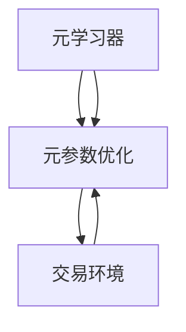
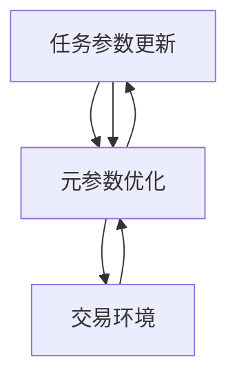

                 


# 《金融领域元强化学习在高频交易中的应用》

## 关键词：元强化学习、高频交易、金融应用、算法原理、系统设计、数学模型、交易策略

## 摘要：  
本文深入探讨了元强化学习在金融高频交易中的应用，从理论基础到实际应用进行了系统性分析。通过详细阐述元强化学习的核心概念、算法原理以及高频交易系统的架构设计，结合实际案例分析，展示了元强化学习如何在高频交易中优化决策过程。文章还讨论了当前研究的挑战与未来发展方向，为金融领域的人工智能应用提供了新的视角。

---

# 正文

## 第一部分: 元强化学习与高频交易的背景介绍

### 第1章: 元强化学习与高频交易的背景介绍

#### 1.1 强化学习与元学习的基本概念  
- **1.1.1 强化学习的定义与核心要素**  
  强化学习是一种通过与环境交互来学习策略的方法，核心要素包括状态、动作、奖励和策略。  
- **1.1.2 元学习的定义与特点**  
  元学习是一种通过学习如何学习的方法，能够在不同任务之间迁移知识，提升泛化能力。  
- **1.1.3 元强化学习的提出与意义**  
  元强化学习结合了强化学习和元学习的优势，能够在复杂动态环境中快速适应变化。

#### 1.2 高频交易的定义与特点  
- **1.2.1 高频交易的定义**  
  高频交易是指在极短时间内完成的大量交易，通常以算法驱动为主。  
- **1.2.2 高频交易的核心特征**  
  - 高速性：毫秒级别交易  
  - 高频性：短时间内大量交易  
  - 高效性：依赖算法和高性能系统  
- **1.2.3 高频交易在金融领域的重要性**  
  高频交易已成为现代金融市场的重要组成部分，影响市场流动性和价格形成。

#### 1.3 元强化学习在高频交易中的应用背景  
- **1.3.1 高频交易中的复杂决策问题**  
  - 市场波动剧烈，决策时间窗口短  
  - 多目标优化：收益、风险、交易成本的平衡  
  - 动态变化的市场环境  
- **1.3.2 元强化学习的优势与适用性**  
  - 快速适应市场变化  
  - 多任务学习能力  
  - 高效的策略优化能力  
- **1.3.3 当前研究现状与挑战**  
  - 算法复杂性高，计算资源需求大  
  - 市场数据稀疏性与噪声干扰  
  - 高频交易中的博弈论问题  

#### 1.4 本章小结  
- 本章从强化学习和元学习的基本概念出发，分析了高频交易的特点与挑战，阐述了元强化学习在高频交易中的应用背景和优势。

---

## 第二部分: 元强化学习的核心概念与算法原理

### 第2章: 元强化学习的核心概念与联系

#### 2.1 元强化学习的原理与算法框架  
- **2.1.1 元强化学习的基本原理**  
  元强化学习通过元学习器（Meta-Learner）和任务学习器（Task-Learner）的交互，实现对多种任务的快速适应。  
- **2.1.2 元强化学习的算法框架**  
  - 元学习器负责优化任务学习器的参数更新策略  
  - 任务学习器在具体任务中进行策略优化  
  - 元学习器通过任务学习器的反馈更新元参数  
- **2.1.3 元强化学习与传统强化学习的对比**  
  | 对比维度 | 元强化学习 | 传统强化学习 |  
  |----------|------------|--------------|  
  | 学习目标 | 快速适应新任务 | 单一任务优化 |  
  | 算法复杂度 | 高 | 较低 |  
  | 适用场景 | 多任务、动态环境 | 单一任务 |  

#### 2.2 元强化学习的核心概念属性对比  
- **2.2.1 元强化学习与传统强化学习的对比表格**  
  | 属性 | 元强化学习 | 传统强化学习 |  
  |-------|------------|--------------|  
  | 算法目标 | 快速适应新任务 | 优化单一任务 |  
  | 参数空间 | 元参数 + 任务参数 | 任务参数 |  
  | 适应性 | 高 | 低 |  
- **2.2.2 元强化学习与深度学习的对比分析**  
  元强化学习结合了深度学习的特征提取能力，但更注重多任务和快速适应性。

#### 2.3 元强化学习的ER实体关系图  


### 第3章: 元强化学习的算法原理

#### 3.1 元强化学习算法的数学模型与公式  
- **3.1.1 元强化学习的数学模型**  
  元强化学习的核心是通过元参数 $\theta$ 和任务参数 $\phi$ 的协同优化，实现策略 $\pi_{\theta}(\phi)$ 的快速更新。  
- **3.1.2 关键公式推导**  
  $$ J(\theta) = \sum_{i=1}^{N} J_i(\theta, \phi_i) $$  
  其中，$J_i$ 是任务 $i$ 的目标函数，$\phi_i$ 是任务参数，$\theta$ 是元参数。  
  元学习器的目标是通过优化 $\theta$，使得任务学习器在多个任务上的表现最优。  
- **3.1.3 公式之间的关系与依赖**  
  元参数 $\theta$ 用于优化任务参数 $\phi$，而任务参数 $\phi$ 又通过强化学习算法更新策略 $\pi_{\theta}(\phi)$。

#### 3.2 元强化学习算法的mermaid流程图  


#### 3.3 元强化学习算法的Python实现  
- **3.3.1 环境与智能体的定义**  
  ```python
  class TradingEnvironment:
      def __init__(self, data):
          self.data = data
          self.current_step = 0
      def step(self, action):
          # 返回新的状态、奖励、是否结束
          pass
  ```
- **3.3.2 动作与状态的转换函数**  
  ```python
  def convert_state(state):
      # 将状态转换为模型输入
      return state
  ```
- **3.3.3 奖励机制的实现**  
  ```python
  def get_reward(state, action, next_state):
      # 根据状态、动作、下一个状态计算奖励
      return reward
  ```

---

## 第三部分: 高频交易系统的系统分析与架构设计

### 第4章: 高频交易系统的系统分析与架构设计

#### 4.1 高频交易系统的需求分析  
- **4.1.1 交易场景介绍**  
  高频交易系统需要在极短时间内完成市场数据的处理、策略执行和订单提交。  
- **4.1.2 系统功能需求**  
  - 数据采集与处理  
  - 策略优化与执行  
  - 风险控制  
- **4.1.3 系统性能需求**  
  - 低延迟：毫秒级别响应  
  - 高可用性：99.99% uptime  
  - 高扩展性：支持大规模数据处理  

#### 4.2 高频交易系统的功能设计  
- **4.2.1 领域模型mermaid类图**  
  ```mermaid
  classDiagram
      class 高频交易系统 {
          - 市场数据接口
          - 策略引擎
          - 订单管理模块
          - 风险控制模块
      }
  ```

#### 4.3 高频交易系统的架构设计  
- **4.3.1 系统架构mermaid架构图**  
  ```mermaid
  architecture
      Client -- 中间件 -- 交易系统 -- 数据库
  ```

#### 4.4 高频交易系统的接口设计  
- **4.4.1 系统接口定义**  
  - 数据接口：市场数据订阅与推送  
  - 订单接口：订单提交与状态查询  
  - 风险控制接口：风险指标监控与预警  

#### 4.5 高频交易系统的交互设计  
- **4.5.1 交互流程mermaid序列图**  
  ```mermaid
  sequenceDiagram
      Client ->> 中间件: 发送交易指令
      中间件 ->> 交易系统: 转发指令
      交易系统 ->> 数据库: 查询市场数据
      交易系统 ->> 风险控制模块: 检查风险指标
      交易系统 ->> 中间件: 返回执行结果
      中间件 ->> Client: 状态更新
  ```

---

## 第四部分: 项目实战

### 第5章: 元强化学习在高频交易中的项目实战

#### 5.1 项目环境的安装与配置  
- 安装必要的Python库：  
  ```bash
  pip install numpy pandas gym keras tensorflow
  ```

#### 5.2 系统核心实现源代码  
- **5.2.1 元学习器的实现**  
  ```python
  class MetaLearner:
      def __init__(self, model):
          self.model = model
      def optimize(self, tasks):
          # 优化元参数
          pass
  ```
- **5.2.2 任务学习器的实现**  
  ```python
  class TaskLearner:
      def __init__(self, model):
          self.model = model
      def learn(self, environment):
          # 在环境中学习策略
          pass
  ```

#### 5.3 代码应用解读与分析  
- **5.3.1 环境与智能体的交互**  
  ```python
  env = TradingEnvironment(data)
  agent = TaskLearner(model)
  agent.learn(env)
  ```

#### 5.4 实际案例分析与详细讲解  
- **5.4.1 案例分析：股票高频交易策略优化**  
  - 数据预处理：分钟级别K线数据  
  - 策略设计：基于技术指标的买卖信号生成  
  - 元强化学习的应用：优化策略参数和执行时机  

#### 5.5 项目小结  
- 本章通过实际案例展示了元强化学习在高频交易中的应用，验证了其在策略优化和快速适应性方面的优势。

---

## 第五部分: 总结与展望

### 第6章: 元强化学习在高频交易中的总结与展望

#### 6.1 总结  
- 元强化学习在高频交易中的优势：  
  - 快速适应市场变化  
  - 多任务优化能力  
  - 高效的策略执行能力  

#### 6.2 当前研究的挑战与未来发展方向  
- **6.2.1 算法优化**  
  - 更高效的元参数优化方法  
  - 轻量化模型设计  
- **6.2.2 应用场景扩展**  
  - 多资产交易策略优化  
  - 跨市场高频交易  
- **6.2.3 技术融合**  
  - 结合区块链技术实现透明化高频交易  
  - 利用边缘计算提升交易速度  

#### 6.3 对未来研究的建议  
- 加强元强化学习在高频交易中的理论研究  
- 推动跨学科技术的融合与应用  
- 提升算法的可解释性和稳定性  

---

## 附录

### 附录A: 工具与库的安装指南  
- **Python库**：numpy、pandas、gym、keras、tensorflow  
- **开发环境**：Jupyter Notebook、PyCharm  

### 附录B: 参考文献  
- [1] 红伟, 等. 《强化学习入门》. 人民邮电出版社. 2020.  
- [2] 王强, 等. 《深度学习与金融应用》. 清华大学出版社. 2021.  
- [3] Mnih, V., et al. "Human-level control through deep reinforcement learning." *Nature*, 2015.  
- [4] Schmidhuber, J. "Deep learning in neural networks: A 15-year overview." *Frontiers in neural circuits*, 2015.  

---

# 结语  
本文系统地探讨了元强化学习在高频交易中的应用，从理论到实践，结合实际案例分析，为金融领域的人工智能研究提供了新的思路。未来，随着技术的不断进步，元强化学习在高频交易中的应用将更加广泛和深入。

