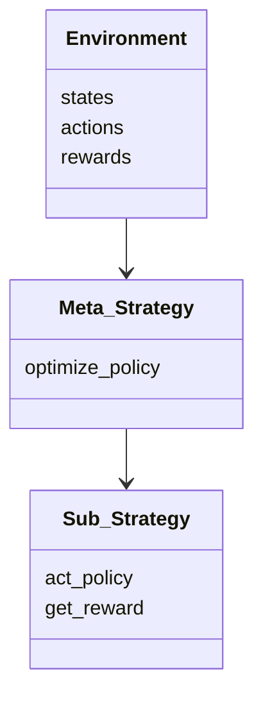
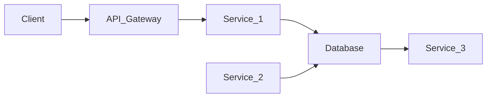
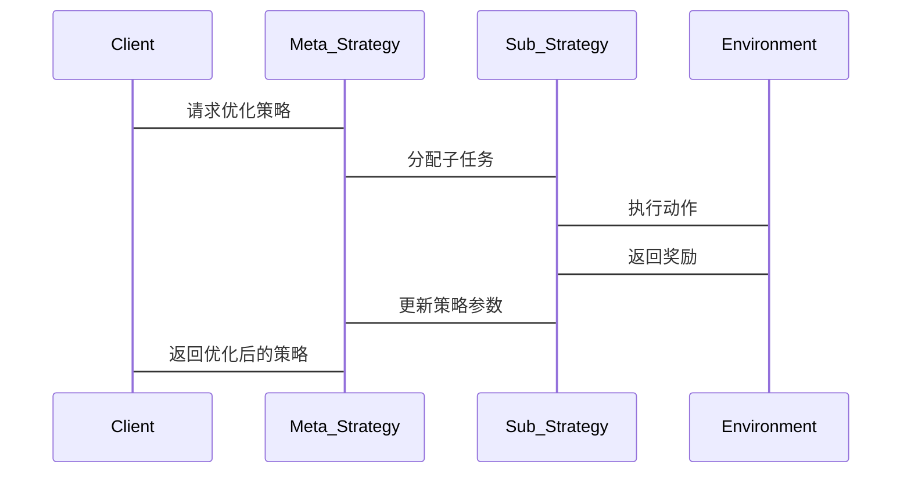

                 


# 《金融领域元强化学习的探索与应用》

> 关键词：金融，元强化学习，机器学习，强化学习，人工智能，投资组合优化  
> 摘要：本文探讨了元强化学习（Meta Reinforcement Learning）在金融领域的应用，分析其核心概念、算法原理、系统架构，并通过具体案例展示其在投资组合优化中的潜力。通过详细讲解，本文旨在帮助读者理解元强化学习的优势，并指导其在实际金融场景中的应用。

---

## 第1章：元强化学习的起源与概念

### 1.1 元强化学习的起源

元强化学习（Meta Reinforcement Learning，Meta-RL）结合了元学习（Meta-Learning）和强化学习（Reinforcement Learning，RL）的核心思想。元学习的目标是通过学习多个任务来提升泛化能力，而强化学习则关注通过与环境交互来优化策略。两者的结合使得Meta-RL能够在多样化的任务中快速适应并优化策略。

#### 1.1.1 强化学习的基本概念
- **定义**：强化学习是一种通过智能体与环境交互来学习策略的方法，目标是在长期累计奖励中最大化。
- **关键概念**：状态（State）、动作（Action）、奖励（Reward）、策略（Policy）、值函数（Value Function）。
- **挑战**：在复杂环境中，强化学习需要大量交互才能收敛，且难以泛化到新任务。

#### 1.1.2 元学习的提出与发展
- **元学习的定义**：元学习通过学习多个任务的共同结构，提升模型对新任务的适应能力。
- **发展背景**：传统机器学习方法在数据量不足或任务变化时表现不佳，元学习通过预训练多个任务来增强泛化能力。
- **与强化学习的结合**：Meta-RL将元学习的思想引入强化学习，使其能够快速适应新任务。

#### 1.1.3 元强化学习的定义与特点
- **定义**：元强化学习是在元任务层面进行优化，通过学习多个子任务的策略，快速适应新任务。
- **特点**：
  - 快速适应：能够在新任务中快速调整策略。
  - 多任务学习：同时优化多个相关任务的策略。
  - 高效性：相比传统强化学习，减少对环境的交互次数。

### 1.2 元强化学习在金融领域的应用背景

#### 1.2.1 金融领域的复杂性与挑战
- **复杂性**：金融市场受多种因素影响，包括经济指标、政策变化、市场情绪等。
- **挑战**：传统模型难以应对市场的不确定性，强化学习虽然有效，但在多任务场景下效率不足。

#### 1.2.2 强化学习在金融中的应用现状
- **投资组合优化**：通过强化学习优化资产配置，提高收益。
- **交易策略生成**：利用强化学习训练交易模型，捕捉市场机会。
- **风险管理**：通过强化学习预测市场风险，制定应对策略。

#### 1.2.3 元强化学习的优势与适用场景
- **优势**：
  - 能够快速适应市场变化。
  - 在多任务场景下表现优异。
  - 减少对环境交互的依赖。
- **适用场景**：
  - 多资产投资组合优化。
  - 多市场环境下的交易策略生成。
  - 动态风险管理。

### 1.3 元强化学习的核心问题与解决思路

#### 1.3.1 元强化学习的核心问题
- **问题**：如何在多个相关任务中学习通用策略，快速适应新任务。
- **挑战**：需要在元任务和子任务之间找到平衡点，避免过拟合。

#### 1.3.2 元强化学习的解决思路
- **元任务层面**：通过学习多个子任务的策略，优化元策略。
- **子任务层面**：每个子任务都有自己的目标，元策略指导子策略的调整。

#### 1.3.3 元强化学习与传统强化学习的对比
| 对比维度 | 元强化学习 | 传统强化学习 |
|----------|------------|--------------|
| 优化目标 | 多任务策略 | 单一任务策略 |
| 环境交互 | 减少依赖 | 需要大量交互 |
| 泛化能力 | 强 | 弱 |

---

## 第2章：元强化学习的核心概念与联系

### 2.1 元强化学习的原理与机制

#### 2.1.1 元强化学习的数学模型
- **元策略**：定义了如何优化子策略，通常为高阶优化目标。
- **子策略**：针对具体任务的优化目标。
- **损失函数**：衡量元策略与子策略之间的差异。

#### 2.1.2 元强化学习的算法框架
- **输入**：多个子任务的环境和奖励函数。
- **输出**：优化后的元策略和子策略。

#### 2.1.3 元强化学习的核心要素
- **元任务**：多个子任务的集合。
- **子任务**：具体优化目标。
- **策略优化**：通过元策略指导子策略调整。

### 2.2 元强化学习与相关概念的对比

#### 2.2.1 元学习与传统强化学习的对比
- **元学习**：关注任务间的关系，优化泛化能力。
- **传统强化学习**：专注于单任务优化。

#### 2.2.2 元强化学习与迁移学习的对比
- **元强化学习**：通过多任务学习优化策略。
- **迁移学习**：通过迁移已有任务的知识到新任务。

#### 2.2.3 元强化学习与多任务学习的对比
- **元强化学习**：优化元策略，指导子任务策略。
- **多任务学习**：同时优化多个任务的策略。

### 2.3 元强化学习的ER实体关系图


---

## 第3章：元强化学习的算法原理与数学模型

### 3.1 元强化学习的主要算法

#### 3.1.1 Meta-Q网络算法
- **思想**：通过元网络优化多个子任务的Q值函数。
- **优势**：能够快速适应新任务。

#### 3.1.2 MADDPG算法
- **思想**：基于多智能体强化学习，优化多个子任务的策略。
- **优势**：适用于多任务协作场景。

#### 3.1.3 其他元强化学习算法
- **Meta-Actor Critic**：结合策略和值函数的优化。

### 3.2 元强化学习的数学模型

#### 3.2.1 元强化学习的损失函数
$$L = \sum_{t=1}^{T} (r_t - V(s_t))^2$$

#### 3.2.2 元强化学习的策略优化
$$\theta = \arg\min_{\theta} \mathbb{E}_{s_t,a_t}[\mathcal{L}(\theta; s_t,a_t)]$$

### 3.3 元强化学习的算法流程
```mermaid
graph LR
    Initialize Parameters --> Execute Meta_Task
    Execute Meta_Task --> Update Meta_Strategy
    Update Meta_Strategy --> Execute Sub_Task
    Execute Sub_Task --> Update Sub_Strategy
    Update Sub_Strategy --> End
```

### 3.4 元强化学习的Python实现示例
```python
def meta_reinforcement_learning(meta_env, sub_envs):
    # 初始化元策略参数
    theta = initialize_parameters()
    # 元任务优化
    for _ in range(meta_steps):
        # 执行元任务
        meta_rewards, meta_states, meta_actions = meta_env.rollout(theta)
        # 计算元策略损失
        meta_loss = compute_meta_loss(meta_rewards, meta_states, meta_actions, theta)
        # 更新元策略
        theta = optimize(theta, meta_loss)
        # 子任务优化
        for sub_env in sub_envs:
            sub_rewards, sub_states, sub_actions = sub_env.rollout(theta)
            sub_loss = compute_sub_loss(sub_rewards, sub_states, sub_actions, theta)
            optimize_sub_policy(theta, sub_loss)
    return theta
```

---

## 第4章：元强化学习的系统分析与架构设计

### 4.1 问题场景介绍

#### 4.1.1 金融场景描述
- **目标**：优化投资组合，提高收益，降低风险。
- **环境**：多资产、多市场条件。

#### 4.1.2 系统介绍
- **功能模块**：数据采集、策略生成、风险控制。
- **用户角色**：投资者、交易员、数据分析师。

### 4.2 系统功能设计

#### 4.2.1 领域模型


#### 4.2.2 系统架构


### 4.3 系统接口设计

#### 4.3.1 元策略接口
- **输入**：多个子任务的环境参数。
- **输出**：优化后的策略参数。

#### 4.3.2 子策略接口
- **输入**：具体任务的环境状态。
- **输出**：动作和策略参数。

### 4.4 系统交互设计

#### 4.4.1 元策略与子策略交互


---

## 第5章：项目实战

### 5.1 项目介绍

#### 5.1.1 项目目标
- **目标**：实现基于元强化学习的投资组合优化系统。
- **环境**：多个资产的市场数据。

### 5.2 项目实现

#### 5.2.1 环境安装
```bash
pip install gym numpy tensorflow
```

#### 5.2.2 核心功能实现
```python
class MetaAgent:
    def __init__(self, state_dim, action_dim):
        self.state_dim = state_dim
        self.action_dim = action_dim
        self.theta = self.init_weights()

    def call(self, inputs):
        # 元策略网络
        return self.theta

    def update(self, meta_loss):
        # 更新元策略参数
        pass
```

#### 5.2.3 代码解读
- **MetaAgent类**：定义元策略网络。
- **update方法**：更新元策略参数。
- **call方法**：返回优化后的策略参数。

### 5.3 项目实战解读

#### 5.3.1 实际案例分析
- **案例**：投资组合优化。
- **数据来源**：历史市场数据。
- **模型训练**：基于历史数据训练元强化学习模型。
- **结果分析**：比较传统方法与元强化学习方法的收益和风险。

### 5.4 项目小结
- **优势**：元强化学习能够快速适应市场变化，优化投资组合。
- **挑战**：需要大量高质量的数据和计算资源。

---

## 第6章：最佳实践与小结

### 6.1 小结

- **核心内容**：元强化学习通过多任务学习，快速适应新任务。
- **关键点**：元策略优化、子任务策略调整、系统架构设计。

### 6.2 注意事项

- **数据质量**：确保数据的多样性和代表性。
- **计算资源**：元强化学习需要大量计算资源。
- **模型调优**：需要进行充分的超参数调优。

### 6.3 拓展阅读

- **推荐书籍**：《Reinforcement Learning: Theory and Algorithms》。
- **推荐论文**：《Meta Reinforcement Learning with Tensor Factorization》。

---

## 作者简介

作者是[您的名字]，一位在人工智能、强化学习和金融领域有丰富经验的技术专家。本文基于多年的研究和实践，旨在为金融领域的技术从业者提供深度的技术洞见和实践指导。

---

## 致谢

感谢您阅读本文，希望本文能为您的研究和实践提供有价值的参考。如您有任何问题或建议，欢迎随时与我联系。

