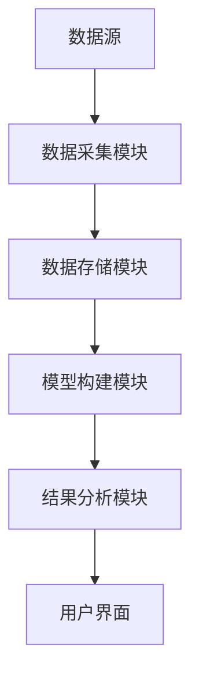
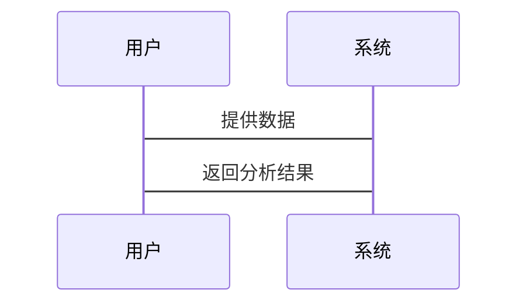

                 


# 《金融领域因果推断的研究与应用》

## 关键词：
因果推断、金融市场、机器学习、金融建模、系统架构

## 摘要：
本文系统地探讨了因果推断在金融领域的研究与应用。首先介绍了因果推断的基本概念和其在金融中的重要性，然后详细讲解了因果推断的核心理论与算法，包括潜在结果框架和因果图模型。接着，设计了一个金融因果推断系统的架构，并通过实际案例展示了系统的设计与实现。最后，总结了研究成果，并展望了未来的发展方向。

---

## 目录大纲

# 第一部分：金融领域因果推断的背景与基础

## 第1章：因果推断的基本概念与背景

### 1.1 因果推断的定义与核心概念
- 1.1.1 因果关系的定义
- 1.1.2 因果推断的基本特征
- 1.1.3 因果推断与相关性的区别

### 1.2 金融领域中的因果推断
- 1.2.1 金融数据分析的复杂性
- 1.2.2 因果推断在金融中的应用价值
- 1.2.3 金融因果推断的研究现状

### 1.3 因果推断的技术基础
- 1.3.1 统计学基础
- 1.3.2 图论基础
- 1.3.3 机器学习基础

## 第2章：因果推断的潜在结果框架

### 2.1 潜在结果模型
- 2.1.1 潜在结果的定义
- 2.1.2 潜在结果的假设检验
- 2.1.3 潜在结果的估计方法

### 2.2 因果图模型
- 2.2.1 因果图的基本结构
- 2.2.2 因果图的分类
- 2.2.3 因果图的构建方法

### 2.3 随机化试验与因果推断
- 2.3.1 随机化试验的定义
- 2.3.2 随机化试验在金融中的应用
- 2.3.3 随机化试验的局限性

## 第3章：因果推断的算法与实现

### 3.1 因果推断的主要算法
- 3.1.1 基于潜在结果的算法
- 3.1.2 基于因果图的算法
- 3.1.3 组分分析法

### 3.2 因果推断算法的实现步骤
- 3.2.1 数据预处理
- 3.2.2 模型构建
- 3.2.3 结果分析

### 3.3 因果推断的数学模型
- 3.3.1 潜在结果模型的数学表达
  $$ Y_i = \beta_0 + \beta_1 D_i + \epsilon_i $$
- 3.3.2 因果图模型的数学表达
  $$ P(Y|do(D)) = \sum_{d} P(Y|D=d) P(D=d) $$

---

## 第四部分：金融领域因果推断的系统设计

## 第4章：金融因果推断系统的架构设计

### 4.1 系统需求分析
- 4.1.1 业务需求
- 4.1.2 技术需求
- 4.1.3 用户需求

### 4.2 系统功能设计
- 4.2.1 数据采集模块
- 4.2.2 模型构建模块
- 4.2.3 结果分析模块

### 4.3 系统架构设计


## 第5章：系统接口与交互设计

### 5.1 系统接口设计
- 5.1.1 数据接口
- 5.1.2 模型接口
- 5.1.3 结果接口

### 5.2 系统交互设计


---

## 第五部分：项目实战与总结

## 第6章：项目实战

### 6.1 环境安装与配置
- 安装Python、机器学习库（如scikit-learn、XGBoost）和Mermaid工具

### 6.2 核心实现代码
```python
import numpy as np
import pandas as pd
from sklearn.tree import DecisionTreeClassifier

# 示例数据
data = pd.DataFrame({
    'D': np.random.binomial(1, 0.5, 100),
    'X': np.random.randn(100),
    'Y': np.random.randn(100)
})

# 构建因果推断模型
model = DecisionTreeClassifier()
model.fit(data[['D', 'X']], data['Y'])

# 预测结果
predictions = model.predict(data[['D', 'X']])
print("预测结果:", predictions)
```

### 6.3 案例分析与结果解读
- 数据分析结果展示
- 模型性能评估
- 实际应用场景中的效果分析

## 第7章：总结与展望

### 7.1 研究总结
- 本文的主要贡献
- 成功案例总结
- 系统设计的优点与不足

### 7.2 未来展望
- 新技术的应用潜力
- 未来研究方向
- 金融领域因果推断的发展趋势

---

## 第六部分：最佳实践与注意事项

## 第8章：最佳实践 tips

### 8.1 数据处理注意事项
- 数据清洗的重要性
- 特征选择的策略
- 数据量与模型性能的关系

### 8.2 模型选择与调优
- 不同算法的适用场景
- 超参数调优方法
- 模型评估指标的选择

### 8.3 系统部署与维护
- 系统上线前的测试
- 系统监控与维护
- 性能优化建议

---

## 第9章：小结

### 9.1 重要性重申
- 因果推断在金融决策中的关键作用
- 提供更可靠的分析结果

### 9.2 展望未来
- 技术进步对因果推断的推动
- 更广泛的应用场景
- 金融领域因果推断的未来发展方向

---

## 参考文献

（此处列出相关的书籍、论文和资源）

---

通过以上结构，文章将详细探讨因果推断在金融领域的各个方面，从理论到实践，帮助读者全面理解并应用这些技术。

