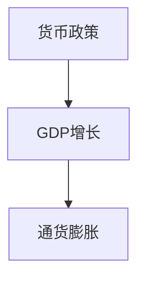
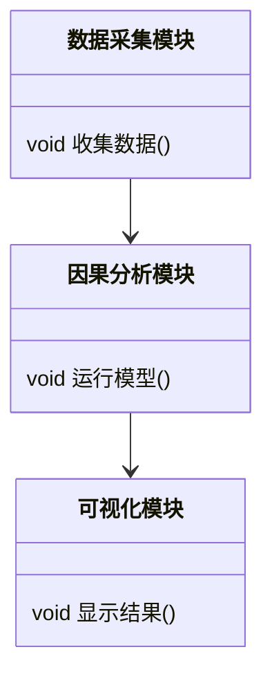
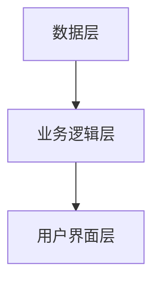

                 


# 《金融领域因果推理在宏观经济分析中的应用》

## 关键词：因果推理、宏观经济、金融分析、结构方程模型、Granger检验、因果图

## 摘要：本文深入探讨因果推理在宏观经济分析中的应用，特别是在金融领域的具体实践。通过分析宏观经济变量和金融市场数据，结合因果图和结构方程模型等方法，揭示变量间的因果关系，为政策制定和投资决策提供科学依据。本文不仅介绍了因果推理的基本概念和数学模型，还通过实际案例展示了其在GDP增长、货币政策效果、资产定价等领域的应用，帮助读者掌握因果推理的理论与实践技巧。

---

## 第一部分：背景与概述

### 第1章：因果推理的基本概念

#### 1.1 因果关系的定义与特征

因果关系是指一个事件（原因）导致另一个事件（结果）发生的必然联系。与相关性不同，因果关系强调的是“如果原因发生，结果必然发生”的逻辑关系。

- **定义**：因果关系是指在两个变量之间存在一种确定的联系，其中一个变量的变化会导致另一个变量的变化。
- **特征**：
  - **时间顺序**：原因发生在结果之前。
  - **内在关系**：因果关系基于变量之间的内在联系，而非偶然性。
  - **可操作性**：可以通过实验或观察来验证因果关系。

#### 1.2 宏观经济分析中的因果关系

在宏观经济分析中，因果关系帮助我们理解变量之间的相互作用。例如，货币政策如何影响GDP增长，通货膨胀如何影响就业率等。

- **问题背景**：宏观经济分析中，变量之间的关系往往复杂，需要区分相关性和因果关系。
- **问题描述**：如何准确识别变量之间的因果关系，避免混淆相关性带来的误导。
- **解决方法**：通过因果推理的方法，如结构方程模型、Granger因果检验等，识别变量间的因果关系。

#### 1.3 因果推理的重要性

- **理论意义**：因果推理帮助我们建立宏观经济模型，理解经济机制。
- **实践意义**：在政策制定和投资决策中，因果推理提供了科学依据。

---

## 第二部分：因果推理的核心概念

### 第2章：因果关系的数学模型

#### 2.1 因果图模型

因果图（Causal Graph）通过节点和边表示变量之间的因果关系。

- **定义**：因果图是一种有向图，节点代表变量，边代表因果关系。
- **Mermaid图示：因果图结构**



- **属性对比表**

| 属性 | 定义 | 示例 |
|------|------|------|
| 节点 | 变量 | 货币政策 |
| 边 | 因果关系 | 货币政策→GDP增长 |

#### 2.2 结构方程模型

结构方程模型（SEM）通过方程组描述变量之间的因果关系。

- **定义**：结构方程模型由多个方程组成，每个方程描述一个变量如何受其他变量影响。
- **方程组表示**

$$
\begin{cases}
GDP = \alpha \cdot 货币政策 + \beta \cdot 投资 + \epsilon_1 \\
投资 = \gamma \cdot 利率 + \delta \cdot 消费 + \epsilon_2 \\
\end{cases}
$$

- **与因果图的关系**：结构方程模型可以转化为因果图，反之亦然。

#### 2.3 干预与反事实推理

- **干预**：人为改变某个变量，观察其对其他变量的影响。
- **反事实推理**：假设某个变量被干预，推断其对结果的影响。

- **反事实推理公式**

$$
P(Y|do(X=x)) = P(Y|X=x)
$$

---

## 第三部分：宏观经济因果分析

### 第3章：宏观经济变量的因果关系分析

#### 3.1 GDP增长的因果分析

- **定义**：GDP是衡量经济活动的主要指标，其增长受多种因素影响。
- **因果关系**：货币政策、投资、消费、出口等变量对GDP增长的影响。

- **案例分析**：通过Granger因果检验分析货币政策对GDP的影响。


#### 3.2 通货膨胀的因果分析

- **定义**：通货膨胀是指物价水平持续上涨。
- **因果关系**：需求拉动型通胀、成本推动型通胀、货币供应增加等。

- **案例分析**：分析货币政策对通货膨胀的影响。

#### 3.3 货币政策效果的因果分析

- **定义**：货币政策通过调整利率和货币供应量影响经济。
- **因果关系**：利率下降可能导致投资增加，进而推动GDP增长。

- **案例分析**：通过结构方程模型分析货币政策对GDP和通货膨胀的双重影响。

---

## 第四部分：金融领域的因果分析

### 第4章：金融变量的因果关系分析

#### 4.1 资产定价的因果分析

- **定义**：资产定价是指确定资产的公允价值。
- **因果关系**：市场风险、流动性、宏观经济因素等影响资产价格。

- **案例分析**：分析宏观经济指标对股票价格的影响。

#### 4.2 风险管理的因果分析

- **定义**：风险管理是指识别、衡量和应对金融风险。
- **因果关系**：市场波动、信用风险、操作风险等。

- **案例分析**：通过因果图分析信用风险的驱动因素。

#### 4.3 市场预测的因果分析

- **定义**：市场预测是指预测金融市场未来走势。
- **因果关系**：历史价格、技术指标、宏观经济数据等。

- **案例分析**：分析历史价格和宏观经济指标对股票市场指数的影响。

---

## 第五部分：数学模型与算法

### 第5章：因果关系的数学模型

#### 5.1 因果关系的数学表达

- **定义**：因果关系可以通过概率分布和条件独立性来描述。
- **条件独立性公式**

$$
P(Y|X=x) = P(Y|X=x, Z=z) \quad \text{当} \quad Z \text{是} X \rightarrow Y \text{的调节变量}
$$

#### 5.2 Granger因果检验

- **定义**：Granger因果检验通过回归分析判断变量间是否存在因果关系。
- **检验步骤**：
  1. 对变量X和Y进行单位根检验，确定是否平稳。
  2. 构建VAR模型，引入滞后期数。
  3. 检验X是否是Y的Granger原因。

- **Granger检验公式**

$$
Y_t = \alpha Y_{t-1} + \beta X_{t-1} + \gamma \epsilon_t
$$

#### 5.3 结构方程模型的实现

- **定义**：结构方程模型通过方程组描述变量间的因果关系。
- **实现步骤**：
  1. 确定变量和因果关系，绘制因果图。
  2. 估计方程参数，使用最大似然估计。
  3. 检验模型拟合度和假设检验。

---

## 第六部分：系统设计与架构

### 第6章：宏观经济分析系统的架构设计

#### 6.1 系统功能设计

- **功能模块**：
  - 数据采集模块：收集宏观经济数据。
  - 因果分析模块：实现因果推理算法。
  - 可视化模块：展示因果关系图和分析结果。

- **领域模型**



#### 6.2 系统架构设计

- **分层架构**：
  - 数据层：存储宏观经济数据。
  - 业务逻辑层：实现因果推理算法。
  - 用户界面层：展示分析结果。

- **架构图**



#### 6.3 接口设计

- **数据接口**：定义数据输入和输出接口。
- **算法接口**：定义因果推理算法的调用接口。

---

## 第七部分：项目实战

### 第7章：货币政策对GDP影响的因果分析

#### 7.1 项目背景

- **目标**：分析货币政策对GDP的影响。
- **数据来源**：宏观经济数据库，如世界银行数据。

#### 7.2 数据采集与预处理

- **数据采集**：收集货币政策变量（如利率）、GDP数据。
- **数据预处理**：清洗数据，处理缺失值，标准化。

#### 7.3 模型实现

- **选择算法**：使用Granger因果检验。
- **代码实现**

```python
import pandas as pd
from statsmodels.tsa.vector_ar_model import VAR

# 数据加载
data = pd.read_csv('macroeconomic.csv')

# 构建VAR模型
model = VAR(data)
model_fit = model.fit()

# Granger因果检验
granger_test = model_fit.test_causality('GDP', '利率',显著性水平=0.05)
```

#### 7.4 结果分析

- **结果展示**：输出Granger检验结果，判断是否存在因果关系。
- **案例分析**：根据结果解释货币政策对GDP的具体影响。

---

## 第八部分：总结与展望

### 第8章：总结与展望

#### 8.1 最佳实践 tips

- **选择工具**：根据数据类型和问题需求选择合适的因果推理方法。
- **数据质量**：确保数据的完整性和准确性。
- **模型验证**：通过交叉验证和假设检验验证模型的可靠性。

#### 8.2 项目小结

- **成功经验**：通过因果推理准确识别了货币政策对GDP的影响。
- **不足之处**：部分变量之间的因果关系复杂，模型需要进一步优化。

#### 8.3 注意事项

- **避免混淆相关性与因果关系**：在分析中需谨慎区分。
- **数据偏差**：注意数据来源的偏差可能影响结果。

#### 8.4 拓展阅读

- 推荐书籍：《因果的发现与推理》
- 推荐论文：Granger Causality Testing in宏观经济分析

---

通过以上目录结构，本文系统地介绍了因果推理在宏观经济和金融领域的应用，从理论到实践，帮助读者掌握因果推理的核心概念和实际操作技巧。

