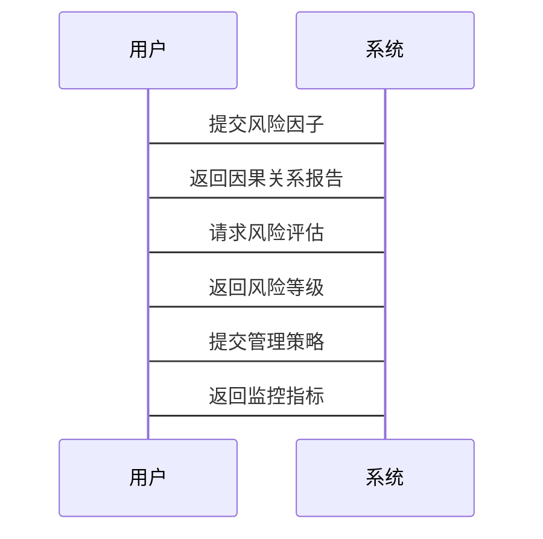

                 


# 金融领域因果推理在风险管理中的应用

**关键词**：因果推理、风险管理、金融、潜在结果、因果图、算法原理

**摘要**：本文系统地探讨了因果推理在金融风险管理中的应用，从基本概念到算法原理，再到实际应用，全面分析了因果推理在风险管理中的优势和挑战。通过详细讲解因果图、潜在结果和因果效应等核心概念，本文为读者提供了从理论到实践的完整指南，展示了如何利用因果推理构建更稳健的金融风险管理系统。

---

## 第1章：因果推理与风险管理概述

### 1.1 因果推理的基本概念

#### 1.1.1 因果关系的定义与特征
因果关系是理解世界的基本方式之一，指的是一个事件（原因）导致另一个事件（结果）发生的必然联系。在金融领域，因果关系帮助我们理解市场变量之间的相互作用机制。

#### 1.1.2 因果推理在金融风险管理中的应用背景
金融风险管理的核心在于识别和量化风险来源，传统的统计方法往往局限于相关性分析，无法捕捉变量之间的因果关系。因果推理能够揭示变量之间的因果关系，从而更准确地预测和管理风险。

#### 1.1.3 风险管理中的因果关系建模
通过因果图建模，可以将复杂的金融系统分解为多个因果关系明确的子系统，从而更好地理解风险传播机制和潜在风险源。

### 1.2 金融风险管理的传统方法与挑战

#### 1.2.1 传统统计方法的局限性
传统统计方法如回归分析只能揭示变量之间的相关性，无法区分因果关系，容易导致错误的结论。

#### 1.2.2 风险管理中的因果关系问题
金融市场中的许多风险因素（如市场波动、流动性风险）之间存在复杂的因果关系，传统方法难以捕捉这些关系。

#### 1.2.3 因果推理的优势与应用场景
因果推理能够识别变量间的因果关系，适用于信用风险、市场风险、操作风险等领域的管理，特别是在风险传染分析中具有独特优势。

### 1.3 本书的核心内容与目标

#### 1.3.1 本书的研究目标
系统探讨因果推理在金融风险管理中的应用，从理论到实践，构建一套基于因果推理的风险管理系统。

#### 1.3.2 本书的主要内容框架
涵盖因果推理的基本概念、算法原理、金融风险管理中的因果建模、系统设计与项目实战。

#### 1.3.3 本书的创新点与价值
将因果推理理论与金融风险管理实践相结合，提出一套适用于金融领域的因果推理方法论。

---

## 第2章：因果推理的核心概念与数学基础

### 2.1 因果关系的数学表示

#### 2.1.1 随机变量与条件概率
随机变量表示可能的数值及其概率分布，条件概率用于描述在给定条件下某事件发生的可能性。

#### 2.1.2 因果关系的图表示
因果关系可以通过有向图表示，节点代表变量，边代表因果关系。

#### 2.1.3 隐变量与观察变量的关系
隐变量是未观测到的变量，可能影响多个观察变量。理解隐变量有助于更准确地建模因果关系。

### 2.2 因果图的基本结构

#### 2.2.1 定向图与无向图的区别
定向图（如贝叶斯网络）通过有向边表示因果关系，无向图（如马尔可夫网络）表示变量之间的相关性。

#### 2.2.2 马尔可夫边界与因果边界
马尔可夫边界是变量在给定条件下独立的边界，因果边界则考虑了变量之间的因果关系。

#### 2.2.3 贝叶斯网络与因果网络的关系
贝叶斯网络是因果网络的一种形式，但因果网络更强调因果关系的方向性。

### 2.3 潜在结果与因果效应

#### 2.3.1 潜在结果的定义
潜在结果是在给定某些处理情况下，变量可能的结果。例如，如果处理变量为1，结果变量可能为Y(1)。

#### 2.3.2 平均因果效应的计算
平均因果效应（ATE）是所有个体在处理变量变化时结果变量的平均变化量。

#### 2.3.3 因果效应的识别与估计
通过观察数据和因果图结构，识别因果效应并进行估计，通常需要假设无干扰和正确建模。

---

## 第3章：因果推理算法原理

### 3.1 因果推理的基本算法

#### 3.1.1 D-separation算法
D-separation用于确定因果图中变量是否独立，通过遍历图结构判断是否存在路径。

#### 3.1.2 Backdoor准则
Backdoor准则用于识别后门调整，确保估计的因果效应无偏。

#### 3.1.3 Do-calculus的基本原理
Do-calculus用于推理干预效果，通过一系列代数操作推导因果关系。

### 3.2 非参数因果推理方法

#### 3.2.1 倒回归法
倒回归法通过反事实推理估计因果效应，适用于小样本数据。

#### 3.2.2 稳定性权重法
稳定性权重法通过数据的稳定性调整权重，估计因果效应。

#### 3.2.3 空间异质性方法
空间异质性方法考虑空间差异，适用于区域风险分析。

### 3.3 高维数据的因果推断

#### 3.3.1 前倾向评分方法
前倾向评分通过机器学习方法估计倾向评分，调整因果效应。

#### 3.3.2 稳定性权重法的扩展
扩展稳定性权重法到高维数据，考虑多个变量的共同影响。

#### 3.3.3 高维数据的因果图构建
通过特征选择和因果关系分析，构建高维数据的因果图。

---

## 第4章：金融风险管理中的因果模型构建

### 4.1 风险因子的因果关系建模

#### 4.1.1 风险因子的识别与选择
通过数据分析和理论指导，识别影响风险的关键因子。

#### 4.1.2 因果图的构建与验证
基于数据和理论构建因果图，并通过验证确保其准确性。

#### 4.1.3 风险因子的因果效应估计
通过因果推理算法，估计各风险因子的因果效应。

### 4.2 时间序列数据的因果分析

#### 4.2.1 时间序列因果关系的定义
时间序列的因果关系强调变量变化的时间顺序和影响。

#### 4.2.2 Granger因果检验
Granger因果检验通过统计方法判断变量间的因果关系。

#### 4.2.3 时间序列的因果图构建
结合时间序列数据和Granger检验结果，构建动态因果图。

### 4.3 风险传染的因果分析

#### 4.3.1 风险传染的定义与测量
风险传染指一个风险事件引发连锁反应，影响其他变量。

#### 4.3.2 网络因果关系的建模
通过网络分析和因果图，建模风险传染路径。

#### 4.3.3 风险传染的传播机制
分析风险传染的传播机制，识别关键传染路径和节点。

---

## 第5章：基于因果推理的金融风险管理系统设计

### 5.1 问题场景介绍
金融市场的复杂性要求风险管理系统具备因果推理能力，以应对不确定性。

### 5.2 系统功能设计（领域模型）

```mermaid
classDiagram
    class 风险因子 {
        id
        名称
        因果关系
    }
    class 风险评估 {
        id
        评估指标
        风险等级
    }
    class 风险管理 {
        id
        管理策略
        监控指标
    }
    risk_factor -> risk_assessment : 影响
    risk_assessment -> risk_management : 引发
```

### 5.3 系统架构设计


### 5.4 系统接口设计和交互设计



---

## 第6章：项目实战：基于Python的金融风险管理因果分析系统实现

### 6.1 环境安装
安装Python、pandas、numpy、sklearn、networkx、pymermaid。

### 6.2 核心代码实现

```python
import pandas as pd
import numpy as np
from sklearn import linear_model

# 示例数据：股票A和B的收益率
data = pd.DataFrame({
    'A': [1, 2, 3, 4, 5],
    'B': [2, 3, 4, 5, 6]
})

# 回归分析：B对A的影响
model = linear_model.LinearRegression()
model.fit(data[['A']], data['B'])
print('回归系数:', model.coef_[0])
```

### 6.3 案例分析与详细讲解
通过实际数据，展示因果推理在信用风险评估中的应用，计算因果效应并制定风险管理策略。

### 6.4 项目小结
总结项目实现过程，强调因果推理在风险管理中的实用价值。

---

## 第7章：最佳实践与总结

### 7.1 本章小结
回顾全文，总结因果推理在金融风险管理中的核心价值和应用前景。

### 7.2 注意事项
在实际应用中，需注意数据质量、模型假设和结果解释的准确性。

### 7.3 拓展阅读
推荐相关领域的书籍和论文，鼓励读者深入研究因果推理和风险管理的结合。

---

通过以上章节的详细讲解，本文为读者提供了一个从理论到实践的完整指南，帮助他们在金融风险管理中有效应用因果推理方法。

