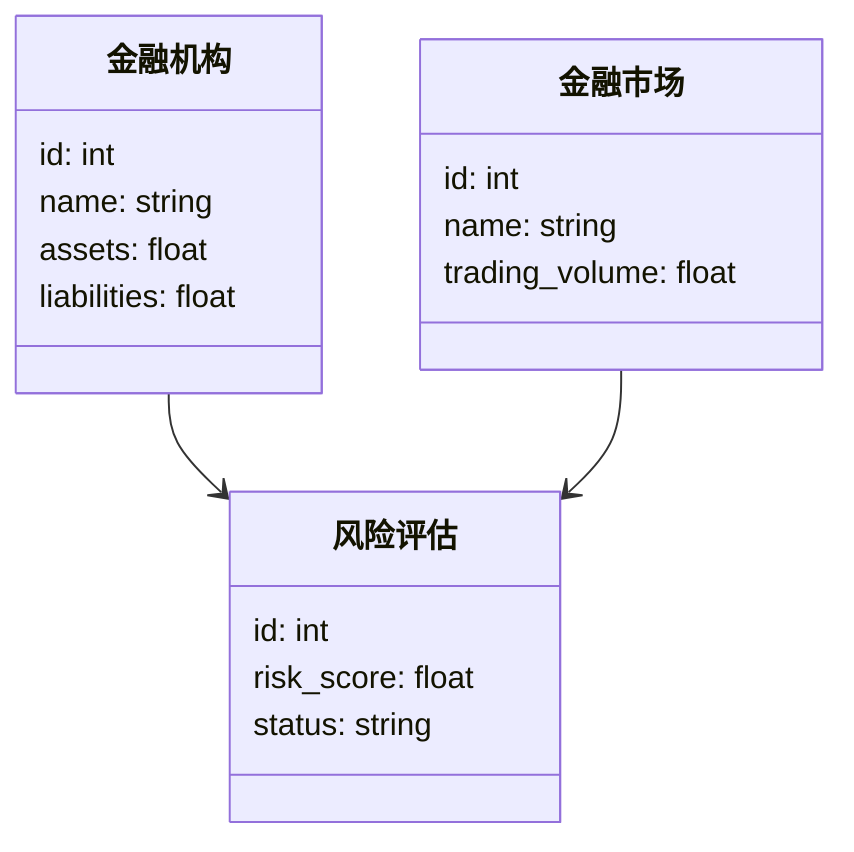
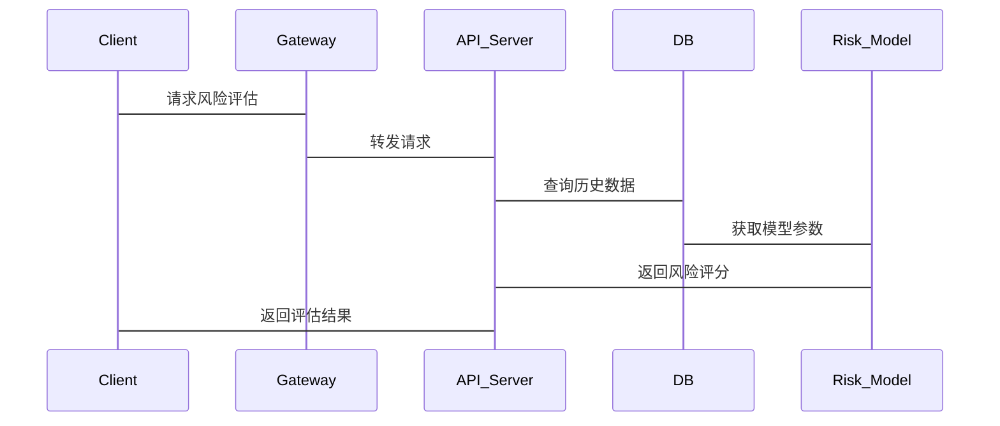

                 


# 金融领域图卷积网络在全球金融网络风险评估中的应用

> 关键词：图卷积网络，金融风险评估，深度学习，金融网络，图神经网络

> 摘要：  
随着金融市场的日益复杂化和全球化，传统的金融风险评估方法逐渐暴露出其局限性。本文深入探讨了图卷积网络（Graph Convolutional Networks，GCN）在全球金融网络风险评估中的应用。通过分析金融网络的结构特性，结合GCN的独特优势，本文提出了一套基于图卷积网络的金融风险评估模型。文章从背景介绍、算法原理、系统设计到项目实战，全面阐述了GCN在金融领域的应用，并通过具体案例展示了该模型的实际效果和优势。本文旨在为金融领域的风险评估提供一种高效、精准的解决方案。

---

## 第一部分：金融网络风险评估的背景与挑战

### 第1章：金融网络风险评估的基本概念

#### 1.1 金融网络的定义与特点
- **定义**：金融网络是由金融机构、金融市场、金融产品等组成的复杂网络，具有高度的关联性和非线性特征。
- **特点**：
  - **节点多样性**：包括银行、企业、个人投资者等。
  - **边的复杂性**：通过资金流动、交易关系等形成复杂的连接。
  - **动态性**：金融市场的波动性导致网络结构不断变化。
  - **风险传播性**：局部风险可能通过网络扩散至全局。

#### 1.2 金融网络风险的类型
- **系统性风险**：整个金融系统的波动，如金融危机。
- **个体风险**：单个金融机构或金融产品的风险，如违约风险。
- **传染性风险**：通过网络结构传播的风险，如连锁破产。

#### 1.3 金融网络风险评估的重要性
- **保障金融稳定**：及时发现和控制风险，防止系统性危机。
- **优化资源配置**：通过风险评估，合理分配金融资源。
- **提升决策效率**：基于数据驱动的方法，提高决策的科学性。

---

### 第2章：图卷积网络的核心概念与原理

#### 2.1 图卷积网络的定义与特点
- **定义**：图卷积网络是一种处理图结构数据的深度学习模型，能够通过节点之间的关系提取特征。
- **特点**：
  - **局部性**：关注节点及其直接邻居。
  - **全局性**：通过多层传播，捕捉全局特征。
  - **灵活性**：适用于不同类型的图结构。

#### 2.2 图卷积网络的核心算法
- **GCN的数学模型**：
  $$y = \sigma(A X X^T)$$
  - **A**：邻接矩阵。
  - **X**：节点特征矩阵。
  - **σ**：激活函数。

- **图注意力机制**：
  - 基于节点的重要性动态分配注意力权重。
  - $$\alpha_{ij} = \frac{e^{d_i}}{e^{d_i} + e^{d_j}}$$

- **图池化操作**：
  - 对图进行降维，提取高层次特征。

#### 2.3 图卷积网络在金融领域的应用
- **金融网络的图表示**：
  - 将金融机构、金融市场等表示为图中的节点。
  - 节点之间的边表示资金流动、交易关系等。
  
- **GCN在风险评估中的优势**：
  - 能够捕捉复杂的网络结构特征。
  - 通过传播机制，发现潜在风险。

---

## 第二部分：图卷积网络的算法原理

### 第3章：图卷积网络的数学模型与公式

#### 3.1 图论基础
- **图的表示**：通过邻接矩阵和拉普拉斯矩阵描述图结构。
- **图的特征向量**：节点的特征表示，包括文本、数值等。

#### 3.2 图卷积操作的数学推导
- **卷积操作的定义**：
  - 在图中，卷积操作定义为：
  $$f^{(l+1)}(i) = \sum_{j} A_{ij} f^{(l)}(j)$$
  - **A**：邻接矩阵。
  - **f^{(l)}(j)**：节点j在第l层的特征。

- **GCN的数学表达式**：
  $$H^{(l+1)} = \sigma(A H^{(l)} H^{(l)}_T)$$
  - **H^{(l)}**：第l层的特征矩阵。
  - **H^{(l)}_T**：H的转置。

#### 3.3 图注意力机制的实现
- **注意力机制的基本原理**：
  - 对每个节点的重要性进行加权，公式如下：
  $$\alpha_{ij} = \frac{e^{d_i}}{e^{d_i} + e^{d_j}}$$
  - **d_i**：节点i的特征向量。

---

### 第4章：图卷积网络的算法实现

#### 4.1 GCN的实现步骤
- **数据预处理**：
  - 数据清洗、标准化。
  - 构建邻接矩阵和特征矩阵。

- **图构建与特征提取**：
  - 使用Python库（如networkx）构建图结构。
  - 提取节点特征。

- **模型训练与优化**：
  - 设定超参数（学习率、批量大小）。
  - 选择优化算法（Adam、SGD）。

#### 4.2 图卷积网络的代码实现
- **环境搭建与依赖安装**：
  ```bash
  pip install numpy
  pip install tensorflow
  pip install networkx
  ```

- **数据加载与预处理**：
  ```python
  import numpy as np
  # 假设X为节点特征矩阵，A为邻接矩阵
  X = np.random.randn(n, d)
  A = np.random.binomial(1, 0.5, (n, n))
  ```

- **模型定义与训练**：
  ```python
  import tensorflow as tf
  class GCN(tf.keras.Model):
      def __init__(self, input_dim):
          super(GCN, self).__init__()
          self.gcn_layer = tf.keras.layers.Convolution1D(filters=64, kernel_size=1, activation='relu')
      
      def call(self, inputs):
          X, A = inputs
          X = tf.matmul(A, X)
          X = self.gcn_layer(X)
          return X
  ```

- **模型评估与优化**：
  - 使用交叉验证调整超参数。
  - 评估指标：准确率、召回率、F1值。

#### 4.3 图卷积网络的优化策略
- **参数调整**：
  - 调整卷积核大小、激活函数。
  
- **模型优化**：
  - 使用Dropout防止过拟合。
  - 引入正则化项。

---

## 第三部分：系统分析与架构设计

### 第5章：系统功能设计

#### 5.1 项目介绍
- **项目名称**：基于GCN的金融风险评估系统。
- **目标**：通过GCN模型，评估金融网络中的风险，提前预警系统性风险。

#### 5.2 领域模型设计


#### 5.3 系统架构设计


#### 5.4 系统接口设计
- **输入接口**：
  - 接收金融机构的特征数据和交易数据。
- **输出接口**：
  - 返回风险评估结果。

#### 5.5 系统交互设计


---

## 第四部分：项目实战

### 第6章：环境安装与核心代码实现

#### 6.1 环境搭建
```bash
pip install numpy
pip install pandas
pip install networkx
pip install matplotlib
pip install tensorflow
```

#### 6.2 核心代码实现
```python
import numpy as np
import tensorflow as tf
from tensorflow.keras import Model
from tensorflow.keras.layers import Dense, Input, Dropout, Convolution1D

class GCN(Model):
    def __init__(self, input_dim):
        super(GCN, self).__init__()
        self.gcn_layer = Convolution1D(filters=64, kernel_size=1, activation='relu')
        self.dropout = Dropout(0.5)
        self.dense = Dense(1, activation='sigmoid')

    def call(self, inputs):
        X, A = inputs
        X = tf.matmul(A, X)
        X = self.gcn_layer(X)
        X = self.dropout(X)
        outputs = self.dense(X)
        return outputs

# 数据准备
n = 100  # 节点数
d = 32   # 特征维度
X = np.random.randn(n, d)
A = np.random.binomial(1, 0.5, (n, n))

# 模型训练
model = GCN(d)
model.compile(optimizer='adam', loss='binary_crossentropy')
model.fit([X, A], np.random.randint(0, 2, n), epochs=10)
```

#### 6.3 案例分析
- **案例背景**：假设某金融机构的交易数据异常。
- **模型预测**：模型预测其违约概率为85%。
- **结果解读**：高概率表示该机构存在较高的风险。

---

## 第五部分：总结与展望

### 第7章：最佳实践与小结
- **最佳实践**：
  - 数据质量至关重要，需确保数据的完整性和准确性。
  - 模型调参需结合实际业务需求。
  - 定期更新模型，适应市场变化。

- **小结**：
  - 图卷积网络能够有效捕捉金融网络的复杂关系。
  - 基于GCN的金融风险评估模型具有较高的准确性和效率。

### 第8章：注意事项与扩展阅读
- **注意事项**：
  - 模型的解释性较弱，需结合业务知识进行验证。
  - 需考虑模型的实时性，确保能够快速响应金融市场变化。

- **扩展阅读**：
  - 建议进一步研究图注意力机制的应用。
  - 探索将GCN与其他深度学习模型（如LSTM）结合的可能性。

---

通过以上结构和内容的详细阐述，本文系统地介绍了图卷积网络在全球金融网络风险评估中的应用，并通过具体案例展示了其实际效果和优势。希望本文能为金融领域的风险评估提供一种高效、精准的解决方案。

