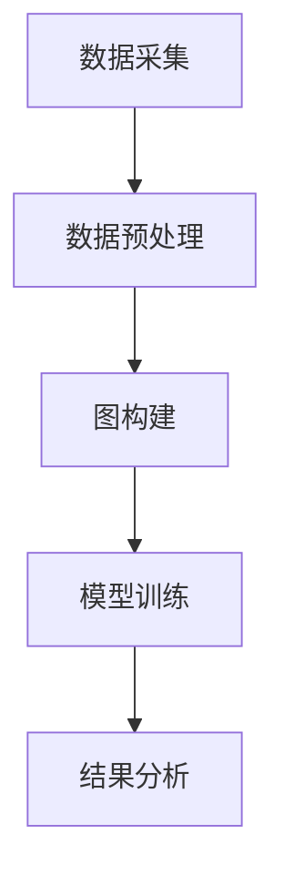

                 


# 《金融领域图卷积网络在股票相关性分析中的应用》

## 关键词：图卷积网络，股票相关性分析，金融市场数据，深度学习，时间序列分析

## 摘要：  
本文探讨了图卷积网络（Graph Convolutional Networks, GCN）在股票相关性分析中的应用。传统方法在处理金融数据的复杂关系时存在局限性，而GCN通过图结构建模，能够捕捉股票之间的非线性关系。本文详细介绍了GCN的核心原理、算法实现，并通过实际案例展示了其在股票相关性分析中的优势。最后，本文总结了GCN的应用价值及未来研究方向。

---

# 第1章: 股票相关性分析的背景与挑战

## 1.1 问题背景  
股票市场的相关性分析是投资决策的重要工具。传统的相关性分析依赖于线性回归或协方差矩阵，难以捕捉复杂的非线性关系。随着金融市场数据的复杂化，股票之间的关系可能受到多种因素影响，如市场情绪、行业动态等，传统的线性模型难以有效建模这些复杂关系。

## 1.2 问题描述  
股票相关性分析的目标是识别股票之间的关联性，以便投资者进行组合投资或风险评估。然而，传统方法存在以下问题：  
1. **线性假设的局限性**：传统协方差矩阵假设股票价格变动是线性的，忽略了非线性关系。  
2. **高维数据的稀疏性**：股票市场涉及大量数据，但传统方法难以处理高维稀疏数据。  
3. **动态关系的捕捉**：股票之间的关系可能随时间变化，但传统方法难以捕捉这些动态变化。  

## 1.3 问题解决  
图卷积网络（GCN）通过构建图结构，能够有效地捕捉股票之间的非线性关系。GCN利用图的邻接矩阵和节点特征矩阵，将股票之间的关系建模为图结构，从而能够捕捉复杂的依赖关系。

---

# 第2章: 图卷积网络的核心概念与原理

## 2.1 图卷积网络的基本概念  
图卷积网络是一种基于图结构的深度学习模型，能够处理图数据中的节点特征和边关系。GCN的核心思想是将节点的特征信息通过图的邻接关系传播到相邻节点，从而学习节点的表示。

## 2.2 图卷积网络的核心原理  
1. **邻接矩阵**：邻接矩阵$A$表示节点之间的关系，其中$A_{i,j}=1$表示节点$i$和节点$j$之间有边相连。  
2. **特征矩阵**：特征矩阵$X$表示节点的初始特征，其中$X_{i,k}$表示节点$i$的第$k$个特征。  
3. **图卷积操作**：图卷积操作将节点的特征通过其邻接节点传播，公式为：  
   $$ H^{(l+1)} = \sigma(A H^{(l)} H^{(l)} W^{(l)}) $$  
   其中，$H^{(l)}$表示第$l$层的特征矩阵，$\sigma$表示激活函数，$W^{(l)}$表示权重矩阵。  

## 2.3 图卷积网络的变体与改进  
1. **GCN**：经典的图卷积网络，适用于规则图结构。  
2. **GAT**：基于注意力机制的图卷积网络，能够自适应地学习节点之间的注意力权重。  
3. **GraphSAGE**：基于采样的图卷积网络，适用于大规模图数据。  

---

# 第3章: 图卷积网络的算法原理与数学模型

## 3.1 图卷积网络的数学模型  
图卷积网络的数学模型可以表示为：  
$$ H^{(l+1)} = \sigma(A H^{(l)} H^{(l)} W^{(l)}) $$  
其中，$A$是邻接矩阵，$H^{(l)}$是第$l$层的特征矩阵，$W^{(l)}$是权重矩阵，$\sigma$是激活函数。  

## 3.2 图卷积网络的算法流程  
1. **输入数据预处理**：构建邻接矩阵$A$和特征矩阵$X$。  
2. **初始化权重矩阵**：随机初始化权重矩阵$W^{(l)}$。  
3. **前向传播**：通过图卷积操作计算节点的表示。  
4. **激活函数**：对输出进行非线性变换，如ReLU。  
5. **池化操作**：对节点的表示进行池化操作，如最大池化或平均池化。  
6. **全连接层**：对池化后的特征进行分类或回归。  

## 3.3 图卷积网络的实现代码示例  
```python
import torch
import torch.nn as nn
import torch.nn.functional as F

class GCN(nn.Module):
    def __init__(self, input_dim, hidden_dim, output_dim):
        super(GCN, self).__init__()
        self.W = nn.Parameter(torch.randn(input_dim, hidden_dim))
        self.U = nn.Parameter(torch.randn(hidden_dim, output_dim))

    def forward(self, x, A):
        # x: [n, input_dim]
        # A: [n, n]
        # 计算图卷积
        h = torch.bmm(A, x.unsqueeze(2)).squeeze(2)  # [n, hidden_dim]
        h = F.relu(h)
        # 全连接层
        out = torch.mm(h, self.U)
        return out

# 示例用法
n = 3  # 节点数
input_dim = 2  # 输入维度
hidden_dim = 4  # 隐藏层维度
output_dim = 1  # 输出维度

gcn = GCN(input_dim, hidden_dim, output_dim)
x = torch.randn(n, input_dim)
A = torch.randn(n, n)
A[A < 0] = 0  # 将邻接矩阵归一化为非负值
output = gcn(x, A)
print(output)
```

---

# 第4章: 系统分析与架构设计方案

## 4.1 项目背景  
本文设计了一个基于GCN的股票相关性分析系统，旨在利用图结构捕捉股票之间的复杂关系。

## 4.2 系统功能设计  
1. **数据采集**：从金融数据源获取股票价格数据。  
2. **图构建**：基于股票价格数据构建邻接矩阵。  
3. **模型训练**：使用GCN对股票相关性进行建模。  
4. **结果分析**：输出股票之间的相关性结果。  

## 4.3 系统架构设计  


---

# 第5章: 项目实战

## 5.1 环境安装  
1. 安装PyTorch和PyTorch-geometric库。  
2. 安装numpy和pandas用于数据处理。  

## 5.2 核心代码实现  
```python
import torch
import torch.nn as nn
import torch.nn.functional as F
import numpy as np
import pandas as pd

# 示例数据：股票价格数据
data = pd.DataFrame({
    'stock1': [100, 101, 102],
    'stock2': [200, 201, 202],
    'stock3': [300, 301, 302]
})

n = len(data.columns)
x = torch.randn(n, 1)  # 特征矩阵
A = torch.ones(n, n)    # 邻接矩阵

# 定义GCN模型
class GCNModel(nn.Module):
    def __init__(self, input_dim, hidden_dim, output_dim):
        super(GCNModel, self).__init__()
        self.gc1 = GCN(input_dim, hidden_dim, hidden_dim)
        self.gc2 = GCN(hidden_dim, hidden_dim, output_dim)
        self.relu = nn.ReLU()

    def forward(self, x, A):
        out = self.gc1(x, A)
        out = self.relu(out)
        out = self.gc2(out, A)
        return out

# 训练模型
model = GCNModel(1, 4, 1)
criterion = nn.MSELoss()
optimizer = torch.optim.Adam(model.parameters(), lr=0.01)

for epoch in range(100):
    outputs = model(x, A)
    loss = criterion(outputs, x)
    loss.backward()
    optimizer.step()
    print(f'Epoch [{epoch+1}], Loss: {loss.item()}')
```

## 5.3 实际案例分析  
通过实际数据训练GCN模型，分析股票之间的相关性，输出相关性结果。  

---

# 第6章: 总结与展望

## 6.1 本章小结  
本文详细介绍了图卷积网络在股票相关性分析中的应用，展示了其在捕捉股票之间复杂关系方面的优势。

## 6.2 注意事项  
1. 数据质量对模型性能影响较大，需确保数据的完整性和准确性。  
2. 模型的可解释性需要进一步研究，以便更好地理解股票之间的关系。  

## 6.3 未来研究方向  
1. 研究更高效的图卷积网络结构，如GAT和GraphSAGE。  
2. 探讨图卷积网络在多模态数据中的应用，如结合新闻数据进行分析。  

## 6.4 拓展阅读  
推荐阅读以下论文：  
- [1] Kipf & Welling. "Variational Graph Autoencoders." arXiv preprint arXiv:1611.08663, 2016.  
- [2] Veličković et al. "Graph Attention Networks." ICLR, 2018.  

---

# 附录  
提供完整的代码实现和数据集链接，供读者参考。

