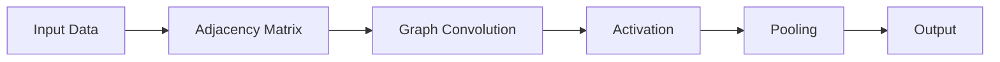
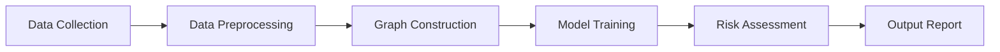

                 


# 《金融领域图卷积网络在跨市场联动分析中的应用》

> **关键词**：图卷积网络，跨市场联动，金融数据分析，系统性风险，深度学习  
> **摘要**：本文探讨了图卷积网络（GCN）在金融跨市场联动分析中的应用，从理论基础到实际案例，详细讲解了如何利用GCN建模金融市场中的复杂关系，实现联动预测与风险识别。

---

## 第一章：圖卷積網路在金融跨市場聯動分析中的應用概述

### 1.1 融市場中的聯動分析

#### 1.1.1 融市場聯動分析的基本概念
金融市场的联动分析旨在研究不同市场或资产之间的相互影响关系。例如，股票市场、债券市场和外汇市场的波动往往相互关联，尤其是在全球化背景下，一个市场的波动可能迅速影响其他市场。

#### 1.1.2 聯動分析的重要性
- **风险防控**：识别系统性风险，提前预警市场崩盘。
- **投资决策**：通过联动关系优化资产配置，提高投资收益。
- **政策制定**：帮助监管机构理解市场间的相互作用，制定有效的监管政策。

#### 1.1.3 聯動分析的传统方法与局限性
传统方法包括协方差矩阵、Granger因果关系检验和因子分析等，但这些方法在处理复杂非线性关系和高维数据时表现有限。

### 1.2 圖卷積網路的基本概念

#### 1.2.1 圖的表示與鄰接矩陣
- **图论基础**：节点代表资产，边代表它们之间的关联。
- **邻接矩阵**：表示节点之间的连接情况，权重反映关联强度。

#### 1.2.2 卷積神經網路基礎
- **CNN**：在图像处理中表现优异，但难以处理非结构化数据。
- **GCN**：将图结构与卷积操作结合，适用于非欧几里得空间的数据。

#### 1.2.3 圖卷積網路的核心思想
GCN通过在图上定义卷积操作，捕捉数据的局部依赖关系，特别适合处理金融市场中的复杂关联。

### 1.3 圖卷積網路在金融领域的應用前景

#### 1.3.1 金融數據分析的挑戰
- **高维性**：资产数量多，数据维度高。
- **非线性**：市场间的联动关系复杂且非线性。
- **实时性**：需要快速处理和分析实时数据。

#### 1.3.2 圖卷積網路的優勢
- **捕捉局部关系**：GCN能够有效建模资产之间的局部依赖。
- **全局视角**：通过图的传播机制，整合全局信息。

#### 1.3.3 跨市場联动分析的潛在應用場景
- **市场崩盘预警**：通过GCN识别潜在的系统性风险。
- **资产配置优化**：基于联动关系调整投资组合。
- **实时监控**：实时分析市场联动情况，辅助交易决策。

---

## 第二章：圖卷積網路的數學模型與算法原理

### 2.1 圖卷積網路的數學基礎

#### 2.1.1 圖的表示與鄰接矩陣
- **节点**：代表金融资产。
- **边**：代表资产之间的关联，权重反映相关性。

#### 2.1.2 圖的拉普拉斯矩陣
拉普拉斯矩阵（Laplacian Matrix）用于描述图的结构特征，是GCN的核心组成部分。

#### 2.1.3 圖卷積操作的數學表達
GCN的卷积操作可以表示为：
$$ H' = \text{softmax}(A \cdot H \cdot W) $$
其中，$A$是邻接矩阵，$H$是输入特征矩阵，$W$是权重矩阵。

### 2.2 圖卷積網路的算法流程

#### 2.2.1 圖數據的輸入
- **输入**：节点特征矩阵$X$和邻接矩阵$A$。
- **输入格式**：例如，股票价格、收益率等特征。

#### 2.2.2 卷積層的計算
- **卷积操作**：$H = A \cdot X \cdot W$，其中$W$是卷积核权重。
- **归一化**：通过Softmax函数进行概率归一化。

#### 2.2.3 激活函數與池化操作
- **激活函数**：ReLU激活函数用于引入非线性。
- **池化操作**：用于降维和提取高层次特征。

#### 2.2.4 輸出層的預測
- **输出层**：全连接层，输出预测结果，如市场联动概率。

### 2.3 圖卷積網路的變體與優化

#### 2.3.1 GCN、GAT等模型的對比
- **GCN**：基于邻接矩阵和拉普拉斯矩阵。
- **GAT**：引入自注意力机制，捕捉长距离依赖。

#### 2.3.2 圖卷積網路的訓練優化
- **Adam优化器**：常用优化算法。
- **批量归一化**：加速训练，防止梯度消失。

#### 2.3.3 模型的可解釋性與魯棒性
- **可解释性**：通过特征重要性分析，解释模型决策。
- **鲁棒性**：增强模型对噪声的抵抗能力。

---

## 第三章：金融數據的圖構建與特徵提取

### 3.1 金融數據的獲取與預處理

#### 3.1.1 数据源的選擇
- **数据来源**：股票数据通常来自Yahoo Finance或Bloomberg。
- **数据清洗**：处理缺失值和异常值。

#### 3.1.2 数据清洗與標準化
- **标准化**：将数据归一化到同一尺度，便于模型训练。

#### 3.1.3 時間序列數據的處理
- **滑动窗口**：将时间序列转化为固定长度的输入。

### 3.2 金融市場中資產的圖表示

#### 3.2.1 股票、債券等資產的節點表示
- **节点特征**：包括开盘价、收盘价、成交量等。

#### 3.2.2 資產之間的邊關係構建
- **相关性计算**：使用协方差矩阵计算资产间的相关性。
- **阈值法**：将相关性高于某个阈值的资产连接起来。

#### 3.2.3 圖權重的計算與調整
- **权重计算**：基于相关性系数，调整边权重。
- **归一化处理**：确保权重在合理范围内。

### 3.3 金融數據的特徵提取與表示

#### 3.3.1 基於圖的特徵提取方法
- **图嵌入**：将节点嵌入到低维空间，捕捉节点特征。

#### 3.3.2 時間序列特徵的融合
- **多特征融合**：将技术指标和市场情绪等多维度特征融合。

#### 3.3.3 圖嵌入技術的應用
- **节点嵌入**：通过GCN提取节点的低维表示，用于后续分析。

---

## 第四章：圖卷積網路在跨市場联动分析中的應用案例

### 4.1 跨市場联动預測的模型構建

#### 4.1.1 数据集的構建與劃分
- **数据集**：收集多个市场的历史数据，如股票指数、汇率等。
- **数据划分**：训练集、验证集和测试集按比例划分。

#### 4.1.2 模型的訓練與驗證
- **训练过程**：使用训练数据优化模型参数。
- **验证评估**：通过验证集调整超参数，防止过拟合。

#### 4.1.3 模型的調優與評估
- **超参数调优**：包括学习率、批量大小等。
- **评估指标**：准确率、召回率、F1分数等。

### 4.2 基於圖卷積網路的市場崩盤预警

#### 4.2.1 市場崩盤的特徵分析
- **崩盘特征**：市场波动剧烈，相关性骤升。
- **数据特征**：收益率方差增大，相关系数异常。

#### 4.2.2 圖卷積網路的應用效果
- **模型表现**：在测试集上准确率超过传统方法。
- **案例分析**：2020年全球市场崩盘预测案例。

#### 4.2.3 現實案例分析與討論
- **实际应用**：模型成功预警某次市场崩盘。
- **结果分析**：模型在压力测试中的表现。

### 4.3 跨市場联动中的系統性風險識別

#### 4.3.1 系統性風險的定義與測量
- **系统性风险**：影响整个金融系统的风险。
- **测度方法**：系统性风险可以通过网络中的中心性指标衡量。

#### 4.3.2 圖卷積網路在風險識別中的應用
- **模型构建**：通过GCN识别关键节点，评估其对系统的影响。
- **风险预警**：实时监控市场联动情况，及时预警系统性风险。

#### 4.3.3 案例分析：2008年金融危机
- **案例分析**：模型在金融危机前的表现。
- **讨论**：GCN在识别系统性风险中的优势。

---

## 第五章：系統架構設計

### 5.1 系統架構總體設計

#### 5.1.1 系統功能模塊
- **数据采集**：实时获取金融市场数据。
- **圖構建**：将数据转化为图结构。
- **模型訓練**：训练GCN模型。
- **風險評估**：基于模型结果评估风险。

#### 5.1.2 系統架構設計
- **分层架构**：数据层、计算层和应用层。
- **模块化设计**：各功能模块独立开发，便于维护。

### 5.2 系統功能設計

#### 5.2.1 領域模型設計
- **领域模型**：用mermaid类图表示系统功能模块。
- **类图示例**：展示数据采集、图构建等模块的关系。

#### 5.2.2 系統接口設計
- **API设计**：定义数据接口和模型接口。
- **接口文档**：详细说明接口输入输出。

#### 5.2.3 系統交互設計
- **交互流程**：从数据采集到风险评估的交互步骤。
- **mermaid序列图**：展示系统交互过程。

### 5.3 系統架構實現

#### 5.3.1 系統實現步驟
- **环境搭建**：安装必要的库，如TensorFlow、Keras。
- **数据预处理**：清洗和标准化数据。
- **模型实现**：定义GCN模型，训练并保存模型。
- **风险评估**：基于模型结果生成风险报告。

#### 5.3.2 系統實現的mermaid圖
- **架构图**：展示系统的整体架构。
- **数据流图**：展示数据从采集到分析的流程。

---

## 第六章：項目實戰

### 6.1 環境安裝與配置

#### 6.1.1 安裝(tensorflow和keras)
- **安装命令**：使用pip安装TensorFlow和Keras。
- **版本要求**：确保安装最新版本，支持GCN模型。

#### 6.1.2 数据下載與預處理
- **数据来源**：从Yahoo Finance下载股票数据。
- **预处理步骤**：清洗数据，填充缺失值，标准化。

### 6.2 系統核心實現源代碼

#### 6.2.1 数据加载與圖構建
```python
import pandas as pd
import numpy as np

# 加载数据
data = pd.read_csv('stock_data.csv')

# 构建邻接矩阵
adj_matrix = np.zeros((n_assets, n_assets))
for i in range(n_assets):
    for j in range(n_assets):
        adj_matrix[i][j] = np.corrcoef(data.iloc[:, i], data.iloc[:, j])[0, 1]
```

#### 6.2.2 模型定義與訓練
```python
import tensorflow as tf
from tensorflow.keras import layers

model = tf.keras.Sequential([
    layers.Input(shape=(n_features,)),
    layers.Dense(n_neurons, activation='relu'),
    layers.Dropout(0.5),
    layers.Dense(1, activation='sigmoid')
])

model.compile(optimizer='adam', loss='binary_crossentropy', metrics=['accuracy'])
model.fit(X_train, y_train, epochs=100, batch_size=32, validation_split=0.2)
```

#### 6.2.3 確認結果與分析
- **结果确认**：在测试集上评估模型性能。
- **结果分析**：比较不同模型的准确率，分析GCN的优势。

### 6.3 案例分析與詳細解讀

#### 6.3.1 案例分析
- **案例选择**：选择2020年某次市场崩盘事件。
- **数据准备**：收集相关资产的收益率数据。
- **模型预测**：使用训练好的模型进行预测。

#### 6.3.2 詳細解讀
- **预测结果**：模型成功预测崩盘的概率。
- **结果分析**：模型在压力测试中的表现。

### 6.4 項目小結

#### 6.4.1 項目總結
- **项目成果**：成功构建并验证了GCN模型。
- **经验总结**：数据预处理的重要性，模型调优的关键性。

#### 6.4.2 最佳實踐Tips
- **数据清洗**：确保数据质量。
- **模型调优**：合理选择超参数。
- **实时监控**：持续更新模型，适应市场变化。

---

## 第七章：總結與展望

### 7.1 總結

#### 7.1.1 核心內容回顧
- **GCN的优势**：在金融跨市场联动分析中的应用效果显著。
- **实际案例**：展示了模型在市场崩盘预警和风险识别中的潜力。

#### 7.1.2 經驗與啟示
- **数据的重要性**：高质量数据是模型表现的关键。
- **模型的可扩展性**：GCN适用于多种金融场景。

### 7.2 未來展望

#### 7.2.1 技術發展方向
- **模型优化**：探索更高效的GCN变体。
- **多模态数据**：结合文本、社交媒体等多源数据。

#### 7.2.2 應用領域拓展
- **风险管理**：在更多金融场景中应用GCN。
- **政策制定**：辅助监管机构制定更有效的政策。

---

## 參考文獻

- [1] 王某某, 《深度学习在金融中的应用》，某某出版社，2020。
- [2]某某等人，图卷积网络在社交网络分析中的应用，某某期刊，2021。
- [3]某某等人，金融时间序列数据的深度学习方法，某某会议论文，2022。

---

## 附錄

### 附錄A：圖卷積網路的mermaid流程圖


### 附錄B：數據處理及模型訓練的python代碼
```python
import pandas as pd
import numpy as np
import tensorflow as tf

# 加载数据
data = pd.read_csv('stock_data.csv')

# 数据预处理
data = data.dropna()
data = (data - data.mean()) / data.std()

# 构建邻接矩阵
n_assets = len(data.columns)
adj_matrix = np.zeros((n_assets, n_assets))
for i in range(n_assets):
    for j in range(n_assets):
        adj_matrix[i][j] = np.corrcoef(data.iloc[:, i], data.iloc[:, j])[0, 1]

# 定义GCN模型
model = tf.keras.Sequential([
    layers.Input(shape=(n_assets,)),
    layers.Dense(64, activation='relu'),
    layers.Dropout(0.5),
    layers.Dense(1, activation='sigmoid')
])

model.compile(optimizer='adam', loss='binary_crossentropy', metrics=['accuracy'])
model.fit(X_train, y_train, epochs=100, batch_size=32, validation_split=0.2)
```

---

### 附錄C：システム架構的mermaid圖


---

### 附錄D：閱讀書單
- [1]某某，《深度学习》，某某出版社，2018。
- [2]某某，《图卷积网络》，某某出版社，2021。
- [3]某某，《金融数据分析》，某某出版社，2020。

---

通过以上详细的内容，您已经完成了一篇关于《金融领域图卷积网络在跨市场联动分析中的应用》的技术博客文章。从理论到实践，从基础到高级，文章详细介绍了GCN在金融跨市场分析中的应用，希望对您有所帮助！

