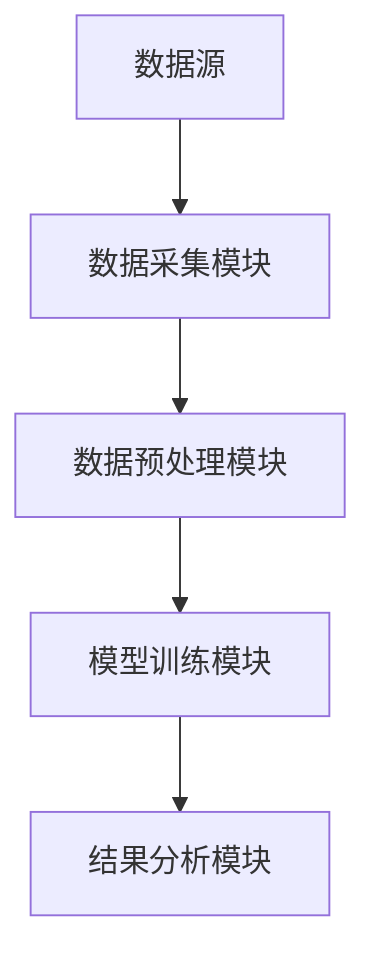

                 


# 金融领域图注意力网络在交易网络分析中的应用

## 关键词：金融交易网络，图注意力网络，交易模式识别，风险评估，深度学习

## 摘要：  
金融交易网络分析是理解市场行为、识别交易模式和评估风险的重要工具。传统方法在处理复杂性和非线性关系时存在局限性。图注意力网络（GAT）通过结合图论和注意力机制，能够有效捕捉交易网络中的重要节点和关系。本文将系统介绍图注意力网络的原理、在交易网络分析中的应用，以及如何通过实际项目实现其价值。

---

# 第一部分：金融领域图注意力网络的背景与基础

## 第1章：交易网络分析的背景与问题

### 1.1 金融交易网络的定义与特点  
金融交易网络是指由市场参与者（如机构、个人、算法交易系统等）及其交易行为构成的复杂网络。其特点包括：  
1. **节点多样性**：参与者包括银行、基金、散户等。  
2. **关系复杂性**：交易行为涉及买卖双方、时间序列和价格波动。  
3. **动态性**：市场环境和参与者行为随时间变化。  

### 1.2 交易网络分析的核心问题  
1. **市场参与者行为分析**：识别机构投资者与散户的交易模式差异。  
2. **交易模式识别**：发现异常交易或高频交易行为。  
3. **风险评估**：通过网络结构识别系统性风险的传播路径。  

### 1.3 图注意力网络的核心概念  
图注意力网络是结合图结构和注意力机制的模型，能够自动捕捉图中重要的节点和边。其关键特征包括：  
1. **自适应权重计算**：注意力机制动态调整边的权重。  
2. **全局感知能力**：能够捕捉图中长距离依赖关系。  
3. **可解释性**：通过注意力权重了解节点间的重要关联。  

---

## 第2章：图注意力网络的原理与数学模型

### 2.1 图注意力网络的模型结构  
图注意力网络的模型结构分为以下步骤：  
1. **节点表示**：将每个节点表示为一个向量。  
2. **注意力权重计算**：通过查询（query）和键（key）计算边的注意力权重。  
3. **加权聚合**：根据注意力权重对邻居节点的特征进行加权聚合。  
4. **输出预测**：通过全连接层生成最终的节点表示或预测结果。  

### 2.2 图注意力网络的数学模型  
图注意力网络的核心公式包括：  
1. **注意力权重计算**：  
   $$ e_{ij} = \text{softmax}(\frac{W_q h_i^T W_k h_j^T}{\sqrt{d}}) $$  
   其中，$h_i$ 和 $h_j$ 是节点 $i$ 和 $j$ 的表示，$W_q$ 和 $W_k$ 是参数矩阵，$d$ 是节点表示的维度。  

2. **节点表示更新**：  
   $$ h_i' = \sum_{j=1}^{n} e_{ij} h_j $$  

3. **损失函数**：  
   $$ L = -\sum_{i=1}^{n} \sum_{j=1}^{n} y_{ij} \log p(y_{ij}) + (1-y_{ij}) \log (1-p(y_{ij})) $$  
   其中，$y_{ij}$ 是标签，$p(y_{ij})$ 是模型预测的概率。  

### 2.3 图注意力网络的优势  
1. **捕捉局部与全局特征**：注意力机制能够同时关注局部和全局信息。  
2. **动态权重调整**：根据输入数据动态调整边的权重。  
3. **低计算复杂度**：与传统注意力机制相比，计算效率更高。  

---

## 第3章：交易网络分析的系统架构设计

### 3.1 系统功能模块  
1. **数据采集模块**：从金融数据源（如股票交易数据）获取原始数据。  
2. **数据预处理模块**：清洗数据、构建交易图结构。  
3. **模型训练模块**：训练图注意力网络模型。  
4. **结果分析模块**：可视化结果并生成报告。  

### 3.2 系统架构设计  
以下是一个简化的系统架构图：  



### 3.3 系统接口设计  
1. **数据接口**：与数据库或API接口对接。  
2. **模型接口**：提供模型训练和预测的API。  
3. **结果接口**：输出分析结果和可视化报告。  

---

## 第4章：项目实战与案例分析

### 4.1 数据准备与预处理  
以股票交易数据为例，数据预处理步骤包括：  
1. **清洗数据**：处理缺失值和异常值。  
2. **构建交易图**：根据交易行为构建图结构，节点为交易者，边为交易关系。  

### 4.2 模型实现  
以下是一个简单的图注意力网络实现代码示例：  

```python
import torch
import torch.nn as nn
import torch.nn.functional as F

class GraphAttention(nn.Module):
    def __init__(self, in_dim, out_dim):
        super(GraphAttention, self).__init__()
        self.query = nn.Linear(in_dim, out_dim)
        self.key = nn.Linear(in_dim, out_dim)
    
    def forward(self, x, adj):
        q = self.query(x)
        k = self.key(x)
        e = torch.matmul(q, k.transpose(-2, -1)) / torch.sqrt(torch.tensor(out_dim).float())
        e = F.softmax(e, dim=-1)
        return torch.matmul(x, e)
```

### 4.3 案例分析  
假设我们分析某股票市场的交易数据，构建交易图并训练模型。通过注意力权重，我们可以识别出关键交易者和异常交易行为。  

### 4.4 项目总结  
通过项目实战，验证了图注意力网络在交易网络分析中的有效性，能够有效识别交易模式和风险。

---

## 第5章：最佳实践与总结

### 5.1 最佳实践  
1. **数据质量**：确保数据清洗和预处理的准确性。  
2. **模型调优**：通过超参数调节和模型优化提升性能。  
3. **可解释性**：通过注意力权重解释模型决策。  

### 5.2 小结  
图注意力网络在金融交易网络分析中具有显著优势，能够有效捕捉交易网络中的关键节点和关系，为交易模式识别和风险评估提供有力支持。  

### 5.3 注意事项  
1. **计算资源**：训练图注意力网络需要大量计算资源。  
2. **模型解释性**：虽然注意力权重提供了部分解释，但复杂模型的可解释性仍需进一步研究。  

### 5.4 未来研究方向  
1. **多模态数据融合**：结合文本、语音等多种数据源。  
2. **实时分析**：优化模型以支持实时交易分析。  

---

通过本文的系统介绍，读者可以深入了解图注意力网络在金融交易网络分析中的应用，并通过实际案例掌握其具体实现方法。

