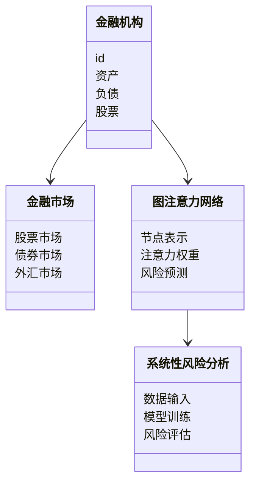

                 


# 《金融领域图注意力网络在系统性风险传导分析中的应用》

---

## 关键词：  
系统性风险，图注意力网络，金融网络，风险传导，深度学习

---

## 摘要：  
本文探讨了图注意力网络在金融领域中的应用，特别是在系统性风险传导分析中的创新方法。通过结合图论和深度学习技术，图注意力网络能够有效捕捉金融系统中的复杂关联关系，为系统性风险的早期预警和管理提供新的思路。文章从系统性风险的基本概念出发，逐步分析图注意力网络的核心原理、算法实现及其在金融领域的具体应用，最后通过实际案例验证了该方法的有效性。

---

# 第一章: 系统性风险与图注意力网络概述

## 1.1 系统性风险的基本概念

### 1.1.1 系统性风险的定义与特征  
系统性风险是指由于金融系统中某一环节的冲击导致整个系统发生连锁反应，进而引发系统性危机的风险。其主要特征包括：  
- **系统性**：风险影响范围广，涉及金融系统中的多个主体和市场。  
- **传染性**：风险在不同机构和市场之间的传播路径复杂。  
- **非局部性**：某一局部的负面事件可能引发全局性危机。  

### 1.1.2 金融领域的复杂性  
金融系统是一个复杂的网络系统，由银行、保险公司、基金公司、企业等实体组成，这些实体之间通过资金流动、投资关联等方式形成复杂的网络结构。传统的线性模型难以捕捉这种复杂的非线性关系。  

### 1.1.3 图注意力网络的基本原理  
图注意力网络（Graph Attention Network，GAT）是一种结合了图结构和注意力机制的深度学习模型。其核心思想是通过注意力机制动态地捕捉节点之间的关联关系，从而更好地建模复杂的金融网络。  

---

## 1.2 图注意力网络的核心概念

### 1.2.1 图结构与金融网络  
金融网络可以通过图结构表示，其中节点代表金融机构或市场，边代表它们之间的关联关系。图注意力网络能够有效地建模这些关联关系，从而发现系统性风险的潜在传播路径。  

### 1.2.2 注意力机制的作用  
注意力机制是一种动态权重分配机制，能够在模型中根据输入数据的重要性动态调整权重。在金融网络中，注意力机制可以帮助模型关注对系统性风险影响较大的关键节点或边。  

### 1.2.3 图注意力网络的优势  
- **非线性建模能力**：能够捕捉复杂的金融网络结构。  
- **动态权重分配**：通过注意力机制，模型可以自动关注重要的节点或边。  
- **可解释性**：注意力权重可以解释为节点之间的关联强度。  

---

## 1.3 本章小结  
本章介绍了系统性风险的基本概念及其在金融领域的复杂性，重点阐述了图注意力网络的核心原理及其在金融网络中的应用优势。  

---

# 第二章: 图注意力网络的核心概念与联系

## 2.1 图注意力网络的核心原理

### 2.1.1 图结构与节点表示  
图结构由节点和边组成，节点代表金融机构，边代表它们之间的关联关系。节点表示是将节点特征映射到低维空间，以便模型能够更好地建模节点之间的关系。  

### 2.1.2 注意力机制的数学表达  
注意力机制的核心公式为：  
$$
\alpha_{ij} = \frac{\exp(e_{ij})}{\sum_{k \neq j} \exp(e_{ik})}
$$  
其中，$e_{ij}$是节点$i$和节点$j$之间的注意力得分。  

### 2.1.3 图注意力网络的模型框架  
图注意力网络的模型框架包括以下几个步骤：  
1. 对图进行节点嵌入表示。  
2. 计算节点之间的注意力权重。  
3. 聚合注意力权重后的特征。  
4. 输出最终的节点表示或预测结果。  

---

## 2.2 图注意力网络与传统图模型的对比

### 2.2.1 传统图模型的局限性  
传统的图模型（如Laplacian矩阵）难以捕捉复杂的非线性关系，且无法动态调整节点之间的权重。  

### 2.2.2 图注意力网络的改进与创新  
图注意力网络通过引入注意力机制，能够动态调整节点之间的权重，从而更好地捕捉金融网络中的复杂关联关系。  

---

## 2.3 图注意力网络在金融领域的应用案例

### 2.3.1 金融网络中的节点关系分析  
通过图注意力网络，可以识别金融网络中哪些节点对系统性风险的传播具有更大的影响。  

### 2.3.2 系统性风险的早期预警  
图注意力网络可以通过对节点表示的分析，提前发现潜在的系统性风险。  

---

## 2.4 本章小结  
本章详细阐述了图注意力网络的核心原理及其在金融领域的应用优势，并通过对比传统图模型，突出了图注意力网络的独特价值。  

---

# 第三章: 系统性风险传导分析的理论基础

## 3.1 系统性风险的理论框架

### 3.1.1 系统性风险的定义与分类  
系统性风险可以分为市场风险、流动性风险、信用风险等。  

### 3.1.2 系统性风险的传播路径  
系统性风险的传播路径包括直接传播和间接传播两种方式。  

### 3.1.3 系统性风险的测度指标  
常用的测度指标包括系统性风险指数（SRI）和系统性风险贡献度（SRC）。  

---

## 3.2 金融网络的构建与分析

### 3.2.1 金融网络的构建方法  
金融网络可以通过收集金融机构之间的关联数据（如资产重叠、负债重叠等）构建。  

### 3.2.2 金融网络的拓扑特征  
金融网络的拓扑特征包括度分布、聚类系数、网络直径等。  

### 3.2.3 金融网络中的系统性风险分析  
通过分析金融网络的拓扑特征，可以识别系统性风险的关键节点和传播路径。  

---

## 3.3 本章小结  
本章从理论角度探讨了系统性风险的定义、传播路径和测度方法，并介绍了金融网络的构建与分析方法。  

---

# 第四章: 图注意力网络的算法原理与实现

## 4.1 图注意力网络的模型结构

### 4.1.1 图卷积网络（GCN）基础  
图卷积网络（GCN）是一种基于图结构的卷积模型，其核心公式为：  
$$
H^{(l+1)} = \text{ReLU}(H^{(l)} A H^{(l)})
$$  
其中，$A$是图的邻接矩阵。  

### 4.1.2 图注意力网络（GAT）的改进  
图注意力网络（GAT）通过引入注意力机制，改进了GCN的权重固定问题。其核心公式为：  
$$
H^{(l+1)} = \text{ReLU}(\sum_{j \in N(i)} \alpha_{ij} H_j^{(l)})
$$  
其中，$\alpha_{ij}$是节点$i$和节点$j$之间的注意力权重。  

---

## 4.2 图注意力网络的算法实现

### 4.2.1 算法流程  
1. 对图进行节点嵌入表示。  
2. 计算节点之间的注意力权重。  
3. 聚合注意力权重后的特征。  
4. 输出最终的节点表示或预测结果。  

### 4.2.2 算法实现的代码示例  
```python
import torch
import torch.nn as nn
import torch.nn.functional as F

class GATLayer(nn.Module):
    def __init__(self, in_dim, out_dim):
        super(GATLayer, self).__init__()
        self.W = nn.Parameter(torch.randn(in_dim, out_dim))
        self.b = nn.Parameter(torch.randn(out_dim))
        
    def forward(self, x, adj):
        x = x.mm(self.W)
        x = x + self.b
        x = F.relu(x)
        return x

class GAT(nn.Module):
    def __init__(self, input_dim, hidden_dim):
        super(GAT, self).__init__()
        self.layer1 = GATLayer(input_dim, hidden_dim)
        
    def forward(self, x, adj):
        return self.layer1(x, adj)
```

---

## 4.3 本章小结  
本章详细阐述了图注意力网络的模型结构和算法实现，并通过代码示例展示了其具体实现方法。  

---

# 第五章: 系统性风险传导的系统分析与架构设计

## 5.1 系统性风险传导的系统分析

### 5.1.1 项目背景  
本项目旨在通过图注意力网络模型，分析金融系统中的系统性风险传导机制。  

### 5.1.2 系统功能设计  
系统功能包括：数据预处理、模型训练、风险识别和结果分析。  

---

## 5.2 系统架构设计

### 5.2.1 领域模型（Mermaid 类图）  


---

## 5.3 本章小结  
本章通过系统分析和架构设计，展示了图注意力网络在系统性风险传导分析中的具体应用。  

---

# 第六章: 项目实战

## 6.1 环境配置

### 6.1.1 安装依赖  
```bash
pip install torch networkx matplotlib
```

---

## 6.2 数据收集

### 6.2.1 数据来源  
数据来源包括金融机构的资产负债表和市场数据。  

---

## 6.3 特征工程

### 6.3.1 特征提取  
提取金融机构的资产、负债、股票等特征。  

---

## 6.4 模型实现

### 6.4.1 图注意力网络的实现  
```python
import torch
import torch.nn as nn
import torch.nn.functional as F

class GATLayer(nn.Module):
    def __init__(self, in_dim, out_dim):
        super(GATLayer, self).__init__()
        self.W = nn.Parameter(torch.randn(in_dim, out_dim))
        self.b = nn.Parameter(torch.randn(out_dim))
        
    def forward(self, x, adj):
        x = x.mm(self.W)
        x = x + self.b
        x = F.relu(x)
        return x

class GAT(nn.Module):
    def __init__(self, input_dim, hidden_dim):
        super(GAT, self).__init__()
        self.layer1 = GATLayer(input_dim, hidden_dim)
        
    def forward(self, x, adj):
        return self.layer1(x, adj)
```

---

## 6.5 结果分析

### 6.5.1 模型输出  
模型输出包括各个金融机构的风险评分和系统性风险指数。  

### 6.5.2 案例分析  
通过具体案例分析，验证模型在系统性风险传导分析中的有效性。  

---

## 6.6 本章小结  
本章通过实际项目案例，详细展示了图注意力网络在系统性风险传导分析中的具体实现和应用。  

---

# 第七章: 图注意力网络的扩展与展望

## 7.1 图注意力网络的前沿研究  
当前研究的前沿方向包括多层图注意力网络、图注意力网络与强化学习的结合等。  

## 7.2 图注意力网络与其他技术的结合  
图注意力网络可以与自然语言处理、推荐系统等技术结合，拓展其应用范围。  

## 7.3 未来研究方向  
未来的研究方向包括优化图注意力网络的计算效率、提升模型的可解释性等。  

---

## 7.4 本章小结  
本章展望了图注意力网络的未来发展，并提出了未来研究的方向。  

---

# 结语  
本文通过系统性风险与图注意力网络的结合，展示了图注意力网络在金融领域中的广泛应用潜力。随着深度学习技术的不断发展，图注意力网络有望成为系统性风险分析的重要工具。

---

# 参考文献  
（此处列出相关文献）  

---

通过以上目录和内容的设计，我们可以看到，图注意力网络在金融领域中的应用具有广阔的发展前景，也为系统性风险的分析提供了新的思路和方法。

