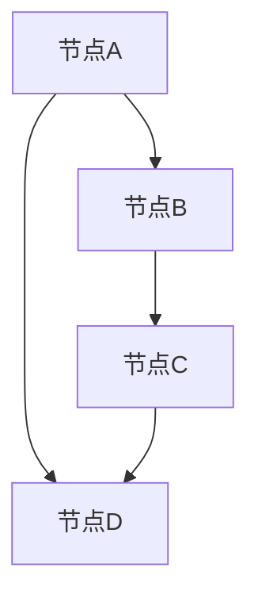
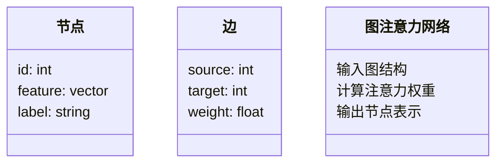
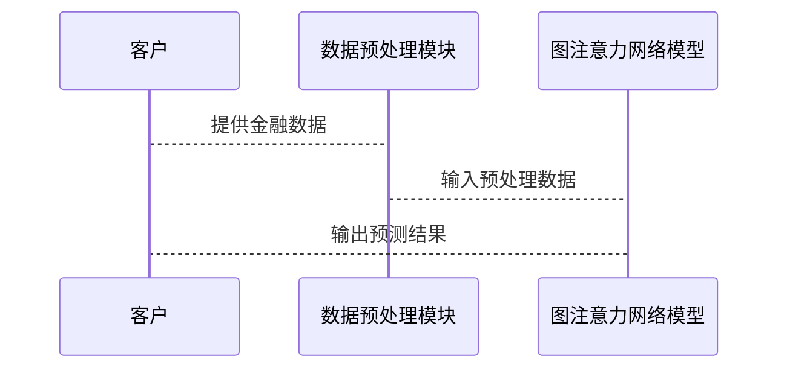

                 


# 《金融领域图注意力网络的创新应用》

---

## 关键词  
- 图注意力网络  
- 金融应用  
- 复杂网络  
- 深度学习  
- 金融预测  

---

## 摘要  
本文围绕金融领域的图注意力网络创新应用展开，重点介绍了图注意力网络在金融数据分析中的优势与核心原理。通过详细分析图结构与注意力机制的结合，本文揭示了该技术在金融风险评估、股票预测和信用评估等场景中的潜在价值。文章从背景、概念、算法、系统架构到实际案例进行了全面解析，为读者提供了从理论到实践的深度洞察。

---

## 目录大纲  

---

### 第一部分：背景与核心概念  

#### 第1章：图注意力网络与金融应用的背景  

##### 1.1 问题背景  
- 1.1.1 传统金融数据分析的局限性  
- 1.1.2 图注意力网络的提出与技术优势  
- 1.1.3 金融领域的复杂性与图模型的适用性  

##### 1.2 问题描述  
- 1.2.1 金融数据的多维度关联性  
- 1.2.2 非线性关系与复杂模式识别  
- 1.2.3 传统方法在金融预测中的不足  

##### 1.3 问题解决与边界  
- 1.3.1 图注意力网络的核心目标  
- 1.3.2 问题的边界与适用场景  
- 1.3.3 概念结构与核心要素的组成  

##### 1.4 本章小结  
- 1.4.1 图注意力网络在金融领域的创新性  
- 1.4.2 本章内容的总结与展望  

---

#### 第2章：图注意力网络的核心概念与原理  

##### 2.1 图注意力网络的定义与属性  
- 2.1.1 图结构的基本概念  
- 2.1.2 注意力机制的原理  
- 2.1.3 图注意力网络的核心属性对比  

##### 2.2 图注意力网络的实体关系图  


##### 2.3 本章小结  
- 2.3.1 核心概念的总结  
- 2.3.2 实体关系图的意义  

---

### 第二部分：算法原理与数学模型  

#### 第3章：图注意力网络的算法原理  

##### 3.1 注意力机制的数学模型  
- 3.1.1 注意力权重的计算公式  
$$ a_{ij} = \text{softmax}(W_q q^T W_k k) $$  
- 3.1.2 节点表示的聚合过程  
$$ h_i = \sum_{j} a_{ij} h_j $$  

##### 3.2 图注意力网络的流程图  


##### 3.3 本章小结  
- 3.3.1 算法流程的总结  
- 3.3.2 关键步骤的解析与优化  

---

### 第三部分：系统分析与架构设计  

#### 第4章：金融领域图注意力网络的系统架构  

##### 4.1 问题场景介绍  
- 4.1.1 金融数据的特征分析  
- 4.1.2 图注意力网络的适用场景  

##### 4.2 系统功能设计  
- 4.2.1 领域模型设计  


##### 4.3 系统架构设计  


##### 4.4 系统接口设计与交互流程  


##### 4.5 本章小结  
- 4.5.1 系统架构的总结  
- 4.5.2 关键接口设计的优化建议  

---

### 第四部分：项目实战与案例分析  

#### 第5章：基于图注意力网络的金融项目实战  

##### 5.1 环境安装与配置  
- 5.1.1 Python环境搭建  
- 5.1.2 相关库的安装（如：NetworkX、PyTorch、Scikit-learn）  

##### 5.2 核心代码实现  
```python
import torch
import torch.nn as nn
import torch.nn.functional as F

class GraphAttention(nn.Module):
    def __init__(self, in_features, out_features):
        super(GraphAttention, self).__init__()
        self.W_q = nn.Linear(in_features, out_features)
        self.W_k = nn.Linear(in_features, out_features)
    
    def forward(self, x, adj):
        q = self.W_q(x)
        k = self.W_k(x)
        attention_weights = F.softmax((q @ k.T), dim=-1)
        return (attention_weights @ x).sum(dim=-1)
```

##### 5.3 实际案例分析  
- 5.3.1 股票价格预测案例  
- 5.3.2 信用评分评估案例  

##### 5.4 本章小结  
- 5.4.1 项目实现的关键点总结  
- 5.4.2 案例分析的启示  

---

### 第五部分：最佳实践与总结  

#### 第6章：图注意力网络的金融应用总结  

##### 6.1 本章小结  
- 6.1.1 图注意力网络的优势与不足  
- 6.1.2 未来研究方向与潜在应用  

##### 6.2 注意事项与建议  
- 6.2.1 模型调优的建议  
- 6.2.2 数据预处理的关键点  

##### 6.3 拓展阅读  
- 6.3.1 图神经网络的前沿技术  
- 6.3.2 金融领域中的其他创新算法  

---

## 附录：完整代码与数据集  

---

通过以上目录结构，本文系统地介绍了图注意力网络在金融领域的创新应用，从理论到实践，为读者提供了全面的指导与参考。

