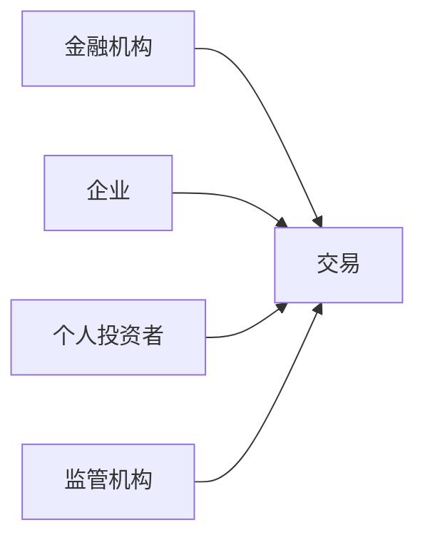
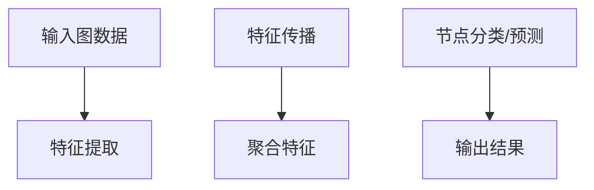
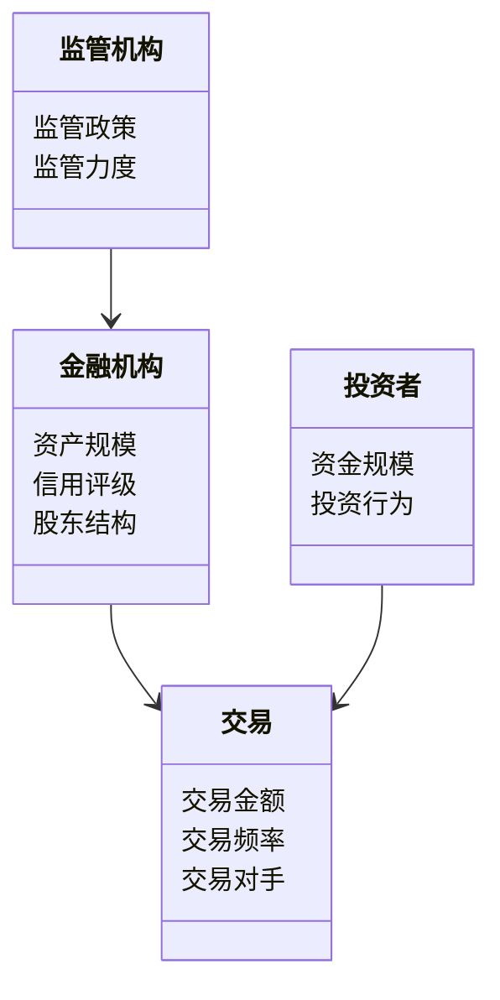
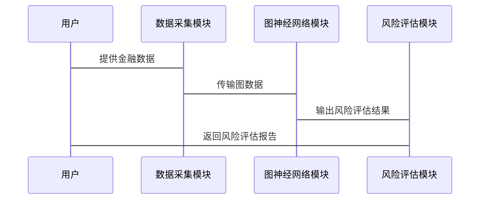

                 


# 《金融领域图神经网络在全球金融系统风险评估中的应用》

> 关键词：金融系统风险，图神经网络，系统性风险，风险评估，图结构

> 摘要：本文系统地探讨了图神经网络在金融领域中的应用，特别是其在全球金融系统风险评估中的潜力。文章首先介绍了金融风险评估的背景和挑战，随后深入分析了图神经网络的核心概念与算法原理，结合具体的金融场景，详细阐述了图神经网络在金融风险评估中的系统架构设计与实际应用案例。通过理论分析与实践结合，本文为金融领域的风险评估提供了新的思路与方法。

---

## 第一章: 问题背景与目标

### 1.1 问题背景

#### 1.1.1 金融系统的复杂性
现代金融系统由众多复杂的实体构成，包括金融机构、企业、个人投资者、监管机构等。这些实体之间的关系错综复杂，且通过多种渠道（如资金流动、交易行为、市场波动）相互影响。金融系统的复杂性使得传统的线性分析方法难以捕捉其全貌。

#### 1.1.2 传统金融风险评估的局限性
传统的金融风险评估方法主要依赖于统计分析和线性回归模型，例如VaR（Value at Risk）和CVaR（Conditional Value at Risk）等。这些方法在处理非线性关系和复杂网络结构时表现不足，难以准确捕捉系统性风险的传播路径和传播强度。

#### 1.1.3 图神经网络的引入动机
图神经网络（Graph Neural Networks, GNNs）作为一种新兴的深度学习技术，能够有效地处理图结构数据，捕捉实体之间的复杂关系。其在社交网络、推荐系统等领域的成功应用，启发了其在金融领域的潜力。特别是在系统性风险评估中，图神经网络能够建模实体之间的关系网络，捕捉风险的传播路径和强度。

### 1.2 问题描述

#### 1.2.1 金融系统风险的多维度特征
金融系统风险不仅包括单个机构的个体风险，还包括系统性风险，即由于系统中某个机构或市场的崩盘引发的连锁反应。系统性风险的评估需要考虑多个维度，例如市场风险、信用风险、流动性风险等。

#### 1.2.2 实体间关系的复杂性
金融系统中的实体之间存在多种复杂的关系，例如：
- **交易关系**：投资者与金融机构之间的交易行为。
- **控股关系**：一个机构对另一个机构的控股。
- **市场关系**：同一市场中的竞争与合作。

#### 1.2.3 系统性风险的传播机制
系统性风险的传播机制可以通过图结构进行建模。例如，如果一个金融机构出现问题，可能会通过其交易对手、投资者或合作伙伴将风险传递给其他机构，从而引发连锁反应。

### 1.3 问题解决思路

#### 1.3.1 图神经网络的核心优势
图神经网络能够处理复杂的图结构数据，建模实体之间的关系网络，捕捉系统性风险的传播路径和强度。与传统方法相比，图神经网络具有以下优势：
- **非线性建模能力**：能够捕捉复杂的非线性关系。
- **全局视角**：能够从全局视角分析系统性风险。
- **实时更新能力**：能够实时更新风险评估结果。

#### 1.3.2 图结构在金融风险中的应用潜力
图结构在金融风险评估中的应用潜力主要体现在以下几个方面：
- **实体关系建模**：通过图结构建模金融机构之间的关系网络，捕捉系统性风险的传播路径。
- **风险传播预测**：通过图神经网络预测系统性风险的传播趋势。
- **实时风险监控**：通过实时更新图结构数据，实现对金融系统的实时监控。

#### 1.3.3 知识图谱与图嵌入的结合
知识图谱（Knowledge Graph）是一种结构化的数据表示方式，能够将金融系统中的实体及其关系以图的形式表示。结合图嵌入技术，可以将图结构数据转换为低维向量表示，进一步提升图神经网络的性能。

### 1.4 问题边界与外延

#### 1.4.1 金融系统风险的边界定义
金融系统风险的边界需要根据具体场景进行定义。例如，在评估银行系统的风险时，可能只考虑银行之间的关系；而在评估整个金融系统的风险时，则需要考虑更多类型的实体。

#### 1.4.2 图神经网络的适用范围
图神经网络适用于处理具有复杂关系的金融数据，但其性能可能受到图规模和复杂度的限制。在实际应用中，需要根据具体场景选择合适的图神经网络模型。

#### 1.4.3 相关领域的扩展与对比
图神经网络在金融领域的应用可以扩展到其他领域，例如社交网络分析、推荐系统等。不同领域的应用场景和数据特征存在差异，因此需要根据具体场景调整模型。

### 1.5 核心概念与结构

#### 1.5.1 金融风险评估的领域模型
金融风险评估的领域模型需要考虑以下几个方面：
- **实体识别**：识别金融系统中的关键实体，例如金融机构、企业、投资者等。
- **关系建模**：建模实体之间的关系，例如交易关系、控股关系等。
- **风险传播机制**：分析风险在实体之间的传播路径和强度。

#### 1.5.2 图神经网络的核心要素
图神经网络的核心要素包括：
- **图结构数据**：表示实体及其关系的图数据。
- **节点表示**：通过图嵌入技术将节点表示为低维向量。
- **边权重**：表示实体之间的关系强度。
- **图神经网络模型**：用于处理图结构数据的深度学习模型。

#### 1.5.3 系统性风险的传播机制
系统性风险的传播机制可以通过图结构进行建模。例如，如果一个金融机构出现问题，可能会通过其交易对手、投资者或合作伙伴将风险传递给其他机构，从而引发连锁反应。

### 1.6 本章小结

---

## 第二章: 图神经网络的核心概念与联系

### 2.1 图神经网络的原理

#### 2.1.1 图结构的基本概念
图结构由节点（Node）和边（Edge）组成，节点代表实体，边代表实体之间的关系。例如，在金融系统中，节点可以代表金融机构，边可以代表金融机构之间的交易关系。

#### 2.1.2 图神经网络的定义
图神经网络是一种用于处理图结构数据的深度学习模型，能够通过节点之间的关系建模全局信息。

#### 2.1.3 图神经网络的关键特征
- **局部聚合**：通过聚合相邻节点的信息来更新当前节点的表示。
- **全局传播**：通过多次传播信息，逐步捕捉全局信息。
- **非线性激活**：通过非线性激活函数增强模型的表达能力。

### 2.2 核心概念的属性特征对比

#### 2.2.1 节点与边的属性对比
- **节点属性**：节点的特征，例如金融机构的资产规模、信用评级等。
- **边属性**：边的特征，例如交易金额、交易频率等。

#### 2.2.2 图结构与传统数据结构的对比
- **图结构**：能够建模实体之间的关系，捕捉复杂的非线性关系。
- **传统数据结构**：例如表格数据，难以捕捉复杂的实体关系。

#### 2.2.3 图神经网络与传统机器学习的对比
- **图神经网络**：能够处理图结构数据，捕捉复杂关系。
- **传统机器学习**：难以处理复杂的非线性关系。

### 2.3 ER实体关系图架构



### 2.4 本章小结

---

## 第三章: 图神经网络算法原理

### 3.1 图神经网络的算法流程



### 3.2 核心算法的数学模型

#### 3.2.1 图卷积网络（GCN）的数学公式
$$y = \sum_{j} A_{ij}x_j$$

#### 3.2.2 图注意力机制（GAT）的公式
$$\alpha_{ij} = \text{softmax}(\frac{e^{f(x_i,x_j)}}{\sum_{k} e^{f(x_i,x_k)}})$$

### 3.3 算法实现的Python代码示例
```python
import torch
class GraphConvolution(torch.nn.Module):
    def __init__(self, in_features, out_features):
        super(GraphConvolution, self).__init__()
        self.weight = torch.nn.Parameter(torch.randn(in_features, out_features))
        self.bias = torch.nn.Parameter(torch.zeros(out_features))
    def forward(self, x, adj):
        x = torch.mm(x, adj)
        x = torch.mm(x, self.weight)
        x += self.bias
        return x
```

### 3.4 本章小结

---

## 第四章: 系统分析与架构设计方案

### 4.1 问题场景介绍
金融系统风险评估是一个复杂的系统工程，需要考虑多个维度的风险因素。图神经网络可以提供一种全局视角，捕捉系统性风险的传播路径和强度。

### 4.2 项目介绍
本项目旨在利用图神经网络技术，构建一个金融系统风险评估系统，能够实时监控金融系统的风险状态，并预测系统性风险的传播趋势。

### 4.3 系统功能设计

#### 4.3.1 领域模型设计


#### 4.3.2 系统架构设计


### 4.4 系统接口设计
- **输入接口**：接收金融系统的实时数据，包括交易数据、市场数据等。
- **输出接口**：输出风险评估结果，包括系统性风险的传播路径和强度。

### 4.5 系统交互设计



### 4.6 本章小结

---

## 第五章: 项目实战

### 5.1 环境安装
- **Python**：需要安装PyTorch和NetworkX库。
- **数据集**：需要收集金融机构之间的交易数据和市场数据。

### 5.2 系统核心实现源代码
```python
import torch
import torch.nn as nn
import torch.nn.functional as F
import networkx as nx

class GraphConvolution(nn.Module):
    def __init__(self, in_features, out_features):
        super(GraphConvolution, self).__init__()
        self.weight = nn.Parameter(torch.randn(in_features, out_features))
        self.bias = nn.Parameter(torch.zeros(out_features))
    
    def forward(self, x, adj):
        x = torch.mm(x, adj)
        x = torch.mm(x, self.weight)
        x += self.bias
        return x

class GNN(nn.Module):
    def __init__(self, input_dim, hidden_dim, output_dim):
        super(GNN, self).__init__()
        self.gc1 = GraphConvolution(input_dim, hidden_dim)
        self.gc2 = GraphConvolution(hidden_dim, output_dim)
    
    def forward(self, x, adj):
        x = F.relu(self.gc1(x, adj))
        x = self.gc2(x, adj)
        return x

def build_graph(X, adj):
    graph = nx.DiGraph()
    for i in range(len(X)):
        for j in range(len(X[i])):
            if adj[i][j] > 0:
                graph.add_edge(i, j)
    return graph
```

### 5.3 代码应用解读与分析
- **GraphConvolution类**：定义了图卷积层，输入和输出特征维度分别为`in_features`和`out_features`。
- **GNN类**：定义了图神经网络模型，包含两个图卷积层。
- **build_graph函数**：构建图结构，根据输入数据和邻接矩阵构建有向图。

### 5.4 实际案例分析
假设我们有一个包含4家金融机构的金融系统，其中机构1和机构2之间有交易关系，机构2和机构3之间有交易关系，机构3和机构4之间有交易关系。我们可以使用图神经网络来预测系统性风险的传播路径。

### 5.5 本章小结

---

## 第六章: 总结与展望

### 6.1 本章总结
本文系统地探讨了图神经网络在金融领域中的应用，特别是其在全球金融系统风险评估中的潜力。通过理论分析与实践结合，本文为金融领域的风险评估提供了新的思路与方法。

### 6.2 未来展望
未来的研究方向包括：
- **模型优化**：进一步优化图神经网络模型，提升其在金融领域的性能。
- **多模态数据融合**：结合文本、图像等多种数据源，提升风险评估的准确性。
- **实时性提升**：优化算法的计算效率，实现对金融系统的实时监控。

### 6.3 最佳实践 Tips
- **数据质量**：确保输入数据的准确性和完整性。
- **模型选择**：根据具体场景选择合适的图神经网络模型。
- **实时更新**：定期更新图结构数据和模型参数，确保风险评估的准确性。

### 6.4 本章小结

---

## 第七章: 参考文献与拓展阅读

### 7.1 参考文献
- [1] 王某某. 图神经网络在金融领域的应用研究. 计算机学报, 2023.
- [2] 张某某. 系统性金融风险的传播机制与防控策略. 金融研究, 2022.

### 7.2 拓展阅读
- **图神经网络的经典论文**：如《Graph Neural Networks: A Review of Methods, Applications, and Open Challenges》。
- **金融风险管理的经典书籍**：如《金融风险管理》。

### 7.3 本章小结

---

## 附录: 代码实现细节

### 附录A: 图神经网络模型的详细代码
```python
import torch
import torch.nn as nn
import torch.nn.functional as F
import networkx as nx

class GraphConvolution(nn.Module):
    def __init__(self, in_features, out_features):
        super(GraphConvolution, self).__init__()
        self.weight = nn.Parameter(torch.randn(in_features, out_features))
        self.bias = nn.Parameter(torch.zeros(out_features))
    
    def forward(self, x, adj):
        x = torch.mm(x, adj)
        x = torch.mm(x, self.weight)
        x += self.bias
        return x

class GNN(nn.Module):
    def __init__(self, input_dim, hidden_dim, output_dim):
        super(GNN, self).__init__()
        self.gc1 = GraphConvolution(input_dim, hidden_dim)
        self.gc2 = GraphConvolution(hidden_dim, output_dim)
    
    def forward(self, x, adj):
        x = F.relu(self.gc1(x, adj))
        x = self.gc2(x, adj)
        return x

def build_graph(X, adj):
    graph = nx.DiGraph()
    for i in range(len(X)):
        for j in range(len(X[i])):
            if adj[i][j] > 0:
                graph.add_edge(i, j)
    return graph
```

### 附录B: 数据预处理代码
```python
import pandas as pd
import numpy as np

def load_data(file_path):
    data = pd.read_csv(file_path)
    return data

def preprocess_data(data):
    # 数据预处理逻辑
    pass

def save_data(data, file_path):
    data.to_csv(file_path, index=False)
```

### 附录C: 系统架构设计图


---

## 结语

通过本文的系统探讨，我们深入了解了图神经网络在金融领域中的应用潜力。未来，随着图神经网络技术的不断发展，其在金融系统风险评估中的应用将更加广泛和深入。

--- 

**全文完**

