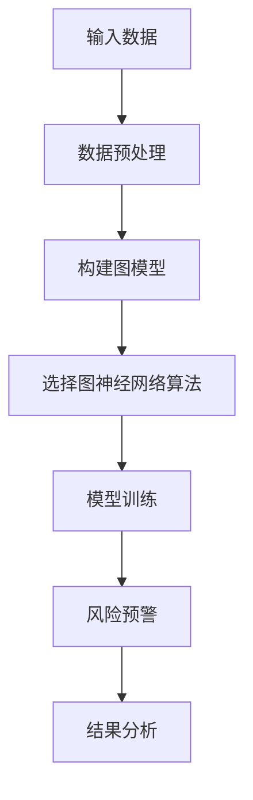

                 


# 金融领域图神经网络在系统性风险传导中的应用

## 关键词
系统性风险, 图神经网络, 金融网络, 风险传导, 系统性风险预警

## 摘要
系统性风险是金融系统中的一个重要问题，其传导机制复杂且难以预测。传统的金融分析方法在处理系统性风险时存在诸多局限性，而图神经网络作为一种新兴的人工智能技术，展现了在金融网络分析中的巨大潜力。本文旨在探讨图神经网络在系统性风险传导中的应用，分析其核心算法、系统架构，并通过实际案例展示其在风险预警和管理中的实际效果。

---

# 第一部分: 金融领域系统性风险与图神经网络基础

## 第1章: 系统性风险与金融网络概述

### 1.1 系统性风险的基本概念

#### 1.1.1 系统性风险的定义
系统性风险是指由于金融系统中某些关键因素的波动或失败，导致整个金融系统发生系统性崩溃的风险。与非系统性风险不同，系统性风险具有传染性和广泛性，可能引发连锁反应，影响整个金融体系的稳定性。

#### 1.1.2 系统性风险的特征
- 传染性：系统性风险可以通过金融网络中的关联性从一个机构传导到另一个机构。
- 广泛性：系统性风险可能影响整个金融体系，而不仅仅是单个机构或资产。
- 不可控性：系统性风险往往难以预测和控制，尤其是在复杂的金融网络中。

#### 1.1.3 系统性风险的分类与来源
系统性风险的来源主要包括市场风险、流动性风险、信用风险、操作风险和法律风险等。这些风险在金融网络中通过复杂的关联性相互作用，进一步放大了系统性风险的影响。

### 1.2 金融网络的构建与分析

#### 1.2.1 金融网络的定义
金融网络是指由金融机构、金融市场、金融产品及其相互关系构成的复杂网络。金融网络中的节点可以是银行、保险公司、资产管理公司等金融机构，也可以是债券、股票等金融资产。

#### 1.2.2 金融网络的构建方法
- 数据收集：收集金融机构之间的交易数据、资产负债表数据等。
- 数据清洗：处理缺失数据、异常数据等。
- 数据建模：通过图论方法构建金融网络，定义节点和边的关系。

#### 1.2.3 金融网络的分析工具
常用的金融网络分析工具包括网络分析软件（如NetworkX）、可视化工具（如Gephi）和编程语言（如Python、R）。

### 1.3 图神经网络的基本概念

#### 1.3.1 图论基础
图论是图神经网络的基础，图论中的概念包括节点、边、路径、连通性等。在金融网络中，节点代表金融机构，边代表金融机构之间的关联性。

#### 1.3.2 神经网络基础
神经网络是一种模仿人脑结构和功能的数学模型，由输入层、隐藏层和输出层组成。神经网络能够通过学习数据中的特征，进行分类、回归等任务。

#### 1.3.3 图神经网络的定义与特点
图神经网络是结合图论和神经网络的一种深度学习模型，能够处理图结构数据。其特点包括：节点间的关系可以被有效捕捉，模型具有良好的可扩展性等。

## 第2章: 系统性风险传导机制

### 2.1 系统性风险传导的路径分析

#### 2.1.1 直接传导路径
直接传导路径是指一个金融机构的失败直接导致其他金融机构的损失。例如，一家银行的破产可能直接导致与其有业务往来的其他银行的损失。

#### 2.1.2 间接传导路径
间接传导路径是指一个金融机构的失败通过多个中间机构传导到其他金融机构。例如，A银行破产导致B银行损失，B银行又导致C银行损失。

#### 2.1.3 网络效应传导
网络效应传导是指系统性风险在金融网络中的扩散过程。金融网络的结构特征，如节点的度数、中心性等，会影响系统性风险的传导速度和范围。

### 2.2 金融网络中的系统性风险传播模型

#### 2.2.1 最早的系统性风险传播模型
早期的系统性风险传播模型主要包括Threshold模型和 contagious模型。这些模型假设每个金融机构的破产概率与其邻居的破产概率相关。

#### 2.2.2 现代系统性风险传播模型
现代系统性风险传播模型主要包括基于Agent的模型和基于网络的模型。这些模型能够更好地捕捉金融网络中的复杂关系。

#### 2.2.3 图模型在系统性风险传播中的应用
图模型在系统性风险传播中的应用主要包括构建金融网络、分析网络结构、模拟风险传导过程等。

### 2.3 系统性风险传导的关键因素

#### 2.3.1 金融机构之间的关联性
金融机构之间的关联性是系统性风险传导的重要因素。金融网络中节点的度数越高，其在系统性风险中的作用越大。

#### 2.3.2 市场波动性
市场波动性是系统性风险传导的另一个重要因素。市场波动性越大，金融网络中的风险传导速度越快。

#### 2.3.3 政策干预的影响
政策干预是影响系统性风险传导的重要因素。政府可以通过注资、接管等方式，减缓系统性风险的传导。

## 第3章: 图神经网络在金融领域的应用潜力

### 3.1 图神经网络在金融分析中的优势

#### 3.1.1 处理复杂关系的能力
图神经网络能够有效地捕捉金融网络中的复杂关系，如金融机构之间的关联性等。

#### 3.1.2 高维数据的降维能力
金融数据通常具有高维性，图神经网络可以通过降维，简化数据的复杂性。

#### 3.1.3 实时分析能力
图神经网络能够实时分析金融网络中的动态关系，从而实现实时风险预警。

### 3.2 图神经网络在系统性风险中的应用

#### 3.2.1 系统性风险的早期预警
图神经网络可以通过分析金融网络中的异常行为，实现系统性风险的早期预警。

#### 3.2.2 系统性风险的传播路径预测
图神经网络可以预测系统性风险在金融网络中的传播路径，从而为政策制定者提供参考。

#### 3.2.3 系统性风险的缓解策略
图神经网络可以模拟不同政策干预措施的效果，从而制定有效的系统性风险缓解策略。

### 3.3 图神经网络的挑战与未来发展方向

#### 3.3.1 数据隐私问题
金融数据的隐私性要求较高，如何在保护隐私的前提下，利用图神经网络进行分析，是一个重要的挑战。

#### 3.3.2 模型的可解释性
图神经网络的黑箱特性使得其在金融领域的应用中，模型的可解释性是一个重要的问题。

#### 3.3.3 多模态数据的融合
金融数据通常具有多模态特征，如何在图神经网络中有效地融合多模态数据，是未来的一个重要研究方向。

---

# 第二部分: 图神经网络算法原理与系统性风险建模

## 第4章: 图神经网络的核心算法

### 4.1 图卷积网络（Graph Convolutional Networks, GCN）

#### 4.1.1 GCN的基本原理
图卷积网络是一种基于图结构的卷积方法，其基本思想是将传统的卷积操作扩展到图结构数据上。

#### 4.1.2 GCN的数学模型
图卷积网络的数学模型可以表示为：

$$
H^{(l+1)} = \text{softmax}(A H^{(l)} W^{(l)} + b^{(l)})
$$

其中，\(A\) 是图的邻接矩阵，\(H^{(l)}\) 是第 \(l\) 层的节点表示，\(W^{(l)}\) 是权重矩阵，\(b^{(l)}\) 是偏置项。

#### 4.1.3 GCN的变体与优化
GCN的变体包括GraphSAGE、GAT等。这些变体通过不同的方式改进了GCN的性能。

### 4.2 图注意力网络（Graph Attention Networks, GAT）

#### 4.2.1 GAT的基本原理
图注意力网络是一种基于注意力机制的图神经网络，其核心思想是通过注意力机制，动态地调整节点之间的连接权重。

#### 4.2.2 GAT的数学模型
图注意力网络的数学模型可以表示为：

$$
\alpha_{ij} = \text{softmax}(\frac{W e_i^T e_j}{\|W e_i^T e_j\|})
$$

其中，\(e_i\) 和 \(e_j\) 是节点 \(i\) 和 \(j\) 的嵌入向量，\(W\) 是权重矩阵。

#### 4.2.3 GAT在金融网络中的应用
图注意力网络在金融网络中的应用主要包括风险评估、欺诈检测等。

### 4.3 图嵌入方法（Graph Embedding）

#### 4.3.1 Node2Vec
Node2Vec是一种基于随机游走的图嵌入方法，其核心思想是通过生成节点的上下文表示，学习节点的嵌入向量。

#### 4.3.2 GraphSAGE
GraphSAGE是一种基于归纳式图嵌入方法，其核心思想是通过聚合邻居节点的信息，生成节点的嵌入向量。

#### 4.3.3 图神经网络的嵌入方法
图神经网络的嵌入方法包括节点嵌入、边嵌入、图嵌入等。

---

## 第5章: 系统性风险传导的图神经网络建模

### 5.1 系统性风险传导的图模型

#### 5.1.1 系统性风险传导的网络模型
系统性风险传导的网络模型主要包括Threshold模型、contagious模型等。

#### 5.1.2 系统性风险传导的动态模型
系统性风险传导的动态模型主要包括基于Agent的模型、基于网络的模型等。

### 5.2 系统性风险传导的图神经网络模型

#### 5.2.1 图神经网络在系统性风险传导中的应用
图神经网络在系统性风险传导中的应用主要包括风险传播路径预测、风险影响范围分析等。

#### 5.2.2 系统性风险传导的图神经网络模型设计
系统性风险传导的图神经网络模型设计主要包括数据输入、模型训练、结果输出等。

### 5.3 系统性风险传导的图神经网络实现

#### 5.3.1 系统性风险传导的图神经网络实现步骤
系统性风险传导的图神经网络实现步骤主要包括数据收集、数据预处理、模型训练、结果分析等。

#### 5.3.2 系统性风险传导的图神经网络实现代码
以下是系统性风险传导的图神经网络实现代码示例：

```python
import networkx as nx
import tensorflow as tf
from tensorflow.keras import layers

# 定义图卷积层
class GraphConvolution(layers.Layer):
    def __init__(self, input_dim, output_dim, use_bias=True):
        super(GraphConvolution, self).__init__()
        self.input_dim = input_dim
        self.output_dim = output_dim
        self.use_bias = use_bias
        self.kernel = self.add_weight(shape=(input_dim, output_dim),
                                      initializer='glorot_uniform',
                                      name='kernel')
        if self.use_bias:
            self.bias = self.add_weight(shape=(output_dim,),
                                      initializer='zeros',
                                      name='bias')

    def call(self, inputs, training=None):
        support = tf.matmul(inputs, self.kernel)
        if self.use_bias:
            support += self.bias
        return support

# 构建金融网络
G = nx.erdos_renyi_graph(n=100, p=0.1)

# 图卷积网络模型
model = tf.keras.Sequential()
model.add(GraphConvolution(input_dim=100, output_dim=64, use_bias=True))
model.add(layers.ReLU())
model.add(layers.Dense(1, activation='sigmoid'))
model.compile(optimizer='adam', loss='binary_crossentropy', metrics=['accuracy'])
model.fit(...)
```

---

## 第6章: 系统性风险传导的图神经网络应用系统设计

### 6.1 项目介绍

#### 6.1.1 系统目标
本项目旨在利用图神经网络技术，构建一个系统性风险传导的预警系统，实现风险的早期预警和传播路径预测。

#### 6.1.2 系统功能设计
系统功能设计包括数据输入、模型训练、风险预警、结果分析等模块。

#### 6.1.3 系统架构设计
系统架构设计包括数据预处理模块、模型训练模块、风险预警模块和结果分析模块。

### 6.2 系统实现

#### 6.2.1 环境安装
需要安装的环境包括Python、TensorFlow、NetworkX等。

#### 6.2.2 系统核心实现
系统核心实现包括数据预处理、模型训练、风险预警、结果分析等部分。

#### 6.2.3 代码实现
以下是系统核心实现的代码示例：

```python
import networkx as nx
import tensorflow as tf
from tensorflow.keras import layers

# 数据预处理
def preprocess_data(G):
    # G是金融网络图
    # 这里需要根据具体数据进行预处理
    pass

# 模型训练
def train_model(G, X_train, y_train):
    model = tf.keras.Sequential()
    model.add(GraphConvolution(input_dim=G.number_of_nodes(), output_dim=64, use_bias=True))
    model.add(layers.ReLU())
    model.add(layers.Dense(1, activation='sigmoid'))
    model.compile(optimizer='adam', loss='binary_crossentropy', metrics=['accuracy'])
    model.fit(X_train, y_train, epochs=10, batch_size=32)
    return model

# 风险预警
def risk预警(model, G):
    # 输入金融网络图G和训练好的模型model
    # 这里需要根据具体数据进行风险预警
    pass

# 结果分析
def analyze_results(results):
    # 分析模型的预测结果
    pass

# 主函数
def main():
    G = preprocess_data(...)
    model = train_model(G, ...)
    results = risk_预警(model, G)
    analyze_results(results)

if __name__ == '__main__':
    main()
```

### 6.3 系统测试与优化

#### 6.3.1 系统测试
系统测试包括单元测试、集成测试和系统测试。

#### 6.3.2 系统优化
系统优化包括模型优化、算法优化、性能优化等。

### 6.4 系统应用与案例分析

#### 6.4.1 系统应用
系统应用包括风险预警、风险传播路径预测等。

#### 6.4.2 案例分析
案例分析包括实际金融数据的分析、风险预警结果的展示等。

---

## 第7章: 图神经网络在系统性风险传导中的应用总结

### 7.1 研究总结

#### 7.1.1 图神经网络的优势
图神经网络在系统性风险传导中的应用具有以下优势：能够捕捉金融网络中的复杂关系、能够实现实时风险预警、能够模拟风险传播路径等。

#### 7.1.2 研究的局限性
研究的局限性包括数据隐私问题、模型的可解释性问题、多模态数据的融合问题等。

### 7.2 未来研究方向

#### 7.2.1 数据隐私保护
未来研究方向包括如何在保护数据隐私的前提下，利用图神经网络进行系统性风险分析。

#### 7.2.2 模型的可解释性
未来研究方向包括如何提高图神经网络的可解释性，以便更好地应用于金融领域。

#### 7.2.3 多模态数据的融合
未来研究方向包括如何在图神经网络中有效地融合多模态数据，以提高系统的准确性和鲁棒性。

---

## 第8章: 最佳实践与小结

### 8.1 最佳实践

#### 8.1.1 数据预处理
在数据预处理阶段，需要注意数据的完整性、准确性、一致性等。

#### 8.1.2 模型选择
在模型选择阶段，需要根据具体问题选择合适的图神经网络模型。

#### 8.1.3 模型调优
在模型调优阶段，需要通过交叉验证等方法，优化模型的参数和结构。

### 8.2 小结

#### 8.2.1 本文的总结
本文系统性地探讨了图神经网络在系统性风险传导中的应用，分析了其核心算法、系统架构，并通过实际案例展示了其在风险预警和管理中的实际效果。

#### 8.2.2 本文的局限性
本文的局限性包括数据隐私问题、模型的可解释性问题、多模态数据的融合问题等。

#### 8.2.3 本文的未来研究方向
本文的未来研究方向包括如何在保护数据隐私的前提下，利用图神经网络进行系统性风险分析，如何提高图神经网络的可解释性，如何在图神经网络中有效地融合多模态数据等。

---

# 附录

## 附录A: 图神经网络相关工具与库

### A.1 NetworkX
NetworkX是一个用于构建和分析复杂网络的Python库，提供了丰富的图算法和工具。

### A.2 Gephi
Gephi是一个用于可视化和分析复杂网络的工具，支持多种图分析方法和可视化效果。

### A.3 TensorFlow
TensorFlow是谷歌开发的深度学习框架，支持图神经网络的实现。

---

## 附录B: 图神经网络实现代码

### B.1 图卷积网络实现代码

```python
import networkx as nx
import tensorflow as tf
from tensorflow.keras import layers

class GraphConvolution(layers.Layer):
    def __init__(self, input_dim, output_dim, use_bias=True):
        super(GraphConvolution, self).__init__()
        self.input_dim = input_dim
        self.output_dim = output_dim
        self.use_bias = use_bias
        self.kernel = self.add_weight(shape=(input_dim, output_dim),
                                      initializer='glorot_uniform',
                                      name='kernel')
        if self.use_bias:
            self.bias = self.add_weight(shape=(output_dim,),
                                      initializer='zeros',
                                      name='bias')

    def call(self, inputs, training=None):
        support = tf.matmul(inputs, self.kernel)
        if self.use_bias:
            support += self.bias
        return support

def main():
    G = nx.erdos_renyi_graph(n=100, p=0.1)
    model = tf.keras.Sequential()
    model.add(GraphConvolution(input_dim=G.number_of_nodes(), output_dim=64, use_bias=True))
    model.add(layers.ReLU())
    model.add(layers.Dense(1, activation='sigmoid'))
    model.compile(optimizer='adam', loss='binary_crossentropy', metrics=['accuracy'])
    model.fit(...)
    return model

if __name__ == '__main__':
    main()
```

### B.2 图注意力网络实现代码

```python
import networkx as nx
import tensorflow as tf
from tensorflow.keras import layers

class GraphAttention(layers.Layer):
    def __init__(self, input_dim, output_dim, use_bias=True):
        super(GraphAttention, self).__init__()
        self.input_dim = input_dim
        self.output_dim = output_dim
        self.use_bias = use_bias
        self.kernel = self.add_weight(shape=(input_dim, output_dim),
                                      initializer='glorot_uniform',
                                      name='kernel')
        if self.use_bias:
            self.bias = self.add_weight(shape=(output_dim,),
                                      initializer='zeros',
                                      name='bias')

    def call(self, inputs, training=None):
        attention = tf.matmul(inputs, self.kernel)
        attention = tf.nn.softmax(attention, axis=-1)
        output = tf.matmul(attention, inputs)
        if self.use_bias:
            output += self.bias
        return output

def main():
    G = nx.erdos_renyi_graph(n=100, p=0.1)
    model = tf.keras.Sequential()
    model.add(GraphAttention(input_dim=G.number_of_nodes(), output_dim=64, use_bias=True))
    model.add(layers.ReLU())
    model.add(layers.Dense(1, activation='sigmoid'))
    model.compile(optimizer='adam', loss='binary_crossentropy', metrics=['accuracy'])
    model.fit(...)
    return model

if __name__ == '__main__':
    main()
```

---

## 附录C: 图神经网络算法流程图



---

通过以上内容，我们系统性地探讨了图神经网络在系统性风险传导中的应用，从理论基础到实际应用，从算法实现到系统设计，为读者提供了一个全面的视角。未来，随着图神经网络技术的不断发展，其在金融领域的应用潜力将更加广阔。

