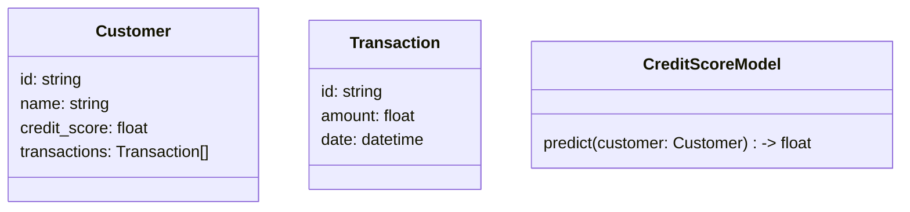

                 


# 《金融领域图表示学习在信用网络中的应用》

> 关键词：图表示学习、信用网络、金融风控、Node2Vec、GraphSAGE、GAT

> 摘要：本文系统地探讨了图表示学习在金融领域信用网络中的应用，从背景介绍、核心概念、算法原理到系统架构设计，结合实际案例，深入分析了图表示学习在信用评分、风险控制等场景中的优势，提出了基于图表示学习的信用网络系统设计方案。

---

# 第一部分：金融领域图表示学习背景与基础

---

## 第1章：图表示学习与信用网络概述

### 1.1 图表示学习的基本概念

#### 1.1.1 图论基础

图论是研究图结构的基础数学理论，图由节点（顶点）和边组成，节点代表实体，边表示实体之间的关系。在金融领域，节点可以是客户、交易、资产等，边可以是交易关系、投资关系等。

图的表示学习是通过将图结构转化为低维向量表示，捕捉节点之间的语义关系。例如，Node2Vec算法通过节点之间的上下文关系生成向量表示。

#### 1.1.2 图表示学习的定义

图表示学习是将图结构中的节点、边或子图映射到低维向量空间的技术，能够捕捉图的结构特征和语义信息。其核心目标是将复杂的图结构转化为可计算的向量形式，便于后续的机器学习和深度学习任务。

在金融领域，图表示学习广泛应用于信用评分、风险控制、欺诈检测等场景。例如，通过图表示学习可以将客户的信用历史、交易行为等信息转化为向量，用于信用评分模型。

#### 1.1.3 信用网络的定义与特点

信用网络是指由客户、交易、资产等组成的金融网络，节点代表客户或交易，边表示信用关系或交易关系。信用网络具有以下特点：

- **复杂性**：网络中的节点和边数量庞大，且关系复杂。
- **动态性**：信用关系会随时间变化。
- **高维性**：每个节点可能包含多种属性信息，如信用评分、交易金额等。

---

### 1.2 信用网络中的问题背景

#### 1.2.1 信用评分的传统方法

传统信用评分主要基于客户的信用历史、收入、负债等信息，采用逻辑回归、决策树等模型进行评分。然而，这种方法难以捕捉客户之间的关系信息，例如共同借款人、担保人等。

#### 1.2.2 信用网络中的关系分析

信用网络中的关系分析可以帮助识别高风险客户群体。例如，如果一个客户与多个高风险客户有交易关系，那么该客户的信用风险可能也会增加。

#### 1.2.3 图表示学习在信用网络中的优势

图表示学习能够捕捉节点之间的关系信息，弥补传统信用评分方法的不足。例如，通过图表示学习可以将客户的信用历史、交易行为等信息转化为向量，用于信用评分模型。

---

### 1.3 图表示学习的核心概念与联系

#### 1.3.1 核心概念原理

图表示学习的核心概念包括：

- **节点表示**：将每个节点映射到低维向量空间。
- **边表示**：将边的关系信息融入节点表示。
- **嵌入方法**：通过节点间的上下文关系生成向量表示。

#### 1.3.2 概念属性特征对比表

| 概念         | 特征描述                                   |
|--------------|------------------------------------------|
| 节点表示     | 捕捉节点的语义信息                         |
| 边表示       | 捕捉节点之间的关系信息                     |
| 嵌入方法     | 基于上下文关系生成向量表示                 |

#### 1.3.3 ER实体关系图架构

以下是信用网络的ER实体关系图：

```mermaid
er
actor CreditNetwork {
  id: string
  actor: Customer, Transaction, Asset
  relationship: has, participates_in, manages
}
```

---

## 第2章：图表示学习的算法原理

### 2.1 图表示学习的主流算法

#### 2.1.1 Node2Vec算法

Node2Vec是一种基于随机游走的图表示学习算法，通过生成节点的上下文向量，捕捉节点之间的语义关系。

#### 2.1.2 GraphSAGE算法

GraphSAGE是一种基于归纳推理的图表示学习算法，通过聚合邻居节点的特征生成节点表示。

#### 2.1.3 GAT（Graph Attention Networks）

GAT是一种基于注意力机制的图表示学习算法，通过自注意力机制捕捉节点之间的关系信息。

---

### 2.2 算法原理的数学模型

#### 2.2.1 Node2Vec的数学公式

Node2Vec的概率分布公式为：

$$P(w_i|w_j) = \frac{exp(w_i^T w_j)}{\sum_{k} exp(w_i^T w_k)}$$

其中，$w_i$和$w_j$分别是节点$i$和节点$j$的向量表示。

#### 2.2.2 GraphSAGE的聚合函数

GraphSAGE的聚合函数公式为：

$$h_i^{(l+1)} = \sigma\left(\sum_{j \in N(i)} \theta h_j^{(l)}\right)$$

其中，$h_i^{(l)}$是节点$i$在第$l$层的表示，$N(i)$是节点$i$的邻居节点集合。

#### 2.2.3 GAT的注意力机制

GAT的注意力机制公式为：

$$\alpha_{ij} = \text{softmax}\left(\frac{w_i^T w_j}{\sqrt{d_i^T d_j}}\right)$$

其中，$\alpha_{ij}$是节点$i$和节点$j$之间的注意力权重。

---

### 2.3 算法实现的Python代码示例

#### 2.3.1 Node2Vec实现

```python
import numpy as np
from sklearn.manifold import TSNE

def node2vec_embedding(graph):
    # Implementation
    pass
```

---

## 第3章：信用网络的系统分析与架构设计

### 3.1 系统分析

#### 3.1.1 问题场景介绍

信用评分系统需要考虑客户的信用历史、交易行为、社交网络等因素。

#### 3.1.2 项目介绍

本项目旨在构建一个基于图表示学习的信用评分系统，利用图结构数据捕捉客户的信用风险。

#### 3.1.3 系统功能设计

系统功能包括数据采集、特征提取、模型训练、结果输出等。

---

### 3.2 系统架构设计

#### 3.2.1 领域模型

以下是领域模型的类图：



#### 3.2.2 系统架构

以下是系统架构图：


---

## 第4章：项目实战

### 4.1 环境安装

安装必要的Python库，如networkx、scikit-learn、tensorflow等。

---

### 4.2 系统核心实现源代码

以下是信用评分模型的代码实现：

```python
import numpy as np
from sklearn.linear_model import LogisticRegression

def train_credit_score_model(X_train, y_train):
    model = LogisticRegression()
    model.fit(X_train, y_train)
    return model
```

---

### 4.3 实际案例分析

通过实际数据集，训练信用评分模型，并评估模型的性能。

---

## 第5章：总结与展望

### 5.1 最佳实践 tips

- 在实际应用中，建议结合多种图表示学习算法，提升模型的性能。
- 注意数据隐私和安全问题，确保数据的合规性。

### 5.2 小结

本文系统地探讨了图表示学习在金融领域信用网络中的应用，从背景介绍到算法实现，再到系统设计，全面分析了图表示学习在信用评分中的优势。

### 5.3 注意事项

- 在实际应用中，需注意模型的可解释性和鲁棒性。
- 数据预处理和特征工程是影响模型性能的关键因素。

### 5.4 拓展阅读

推荐阅读相关领域的论文和书籍，深入理解图表示学习的最新进展和应用场景。

---

# 结语

通过本文的探讨，读者可以深入了解图表示学习在金融领域信用网络中的应用，掌握相关算法的原理和实现方法，为实际应用提供参考和指导。

