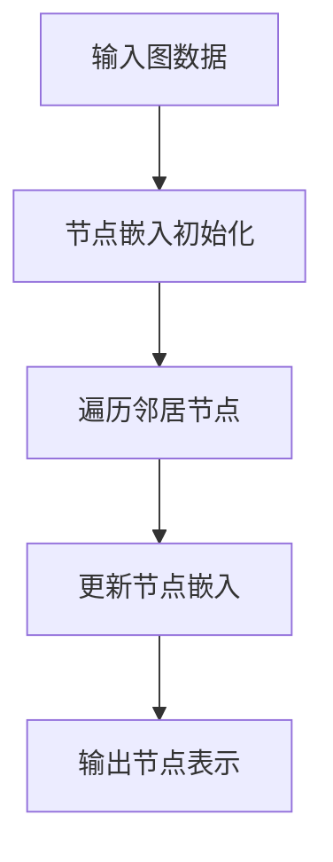
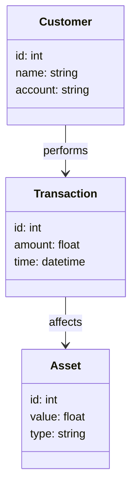
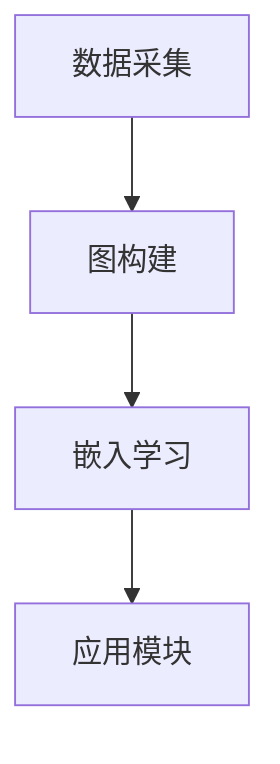
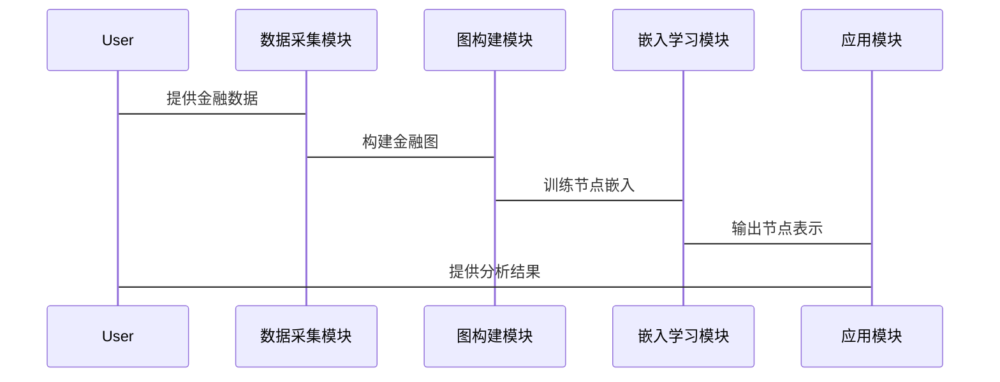

                 


# 《金融领域图表示学习的应用与挑战》

## 关键词：图表示学习，金融应用，深度学习，节点嵌入，边表示，金融图数据

## 摘要：  
随着金融领域的复杂性和数据量的急剧增长，传统的金融分析方法逐渐暴露出其局限性。图表示学习作为一种新兴的人工智能技术，通过将金融数据转化为图结构，能够有效地捕捉数据之间的复杂关系，为金融分析提供了新的视角。本文系统地介绍了图表示学习的基本概念、核心算法及其在金融领域的应用场景，深入分析了当前面临的挑战，并提出了相应的解决方案。通过案例分析和系统设计，展示了图表示学习在金融领域中的实际应用价值和未来发展方向。

---

# 第1章：图表示学习的概述

## 1.1 图表示学习的基本概念

### 1.1.1 图结构与节点表示  
图是一种由节点和边组成的数学结构，能够有效地表示复杂的关系网络。在金融领域，节点可以代表客户、交易、资产等实体，边则表示它们之间的关系，如交易行为、持有关系等。节点表示是指将图中的每个节点转化为低维向量，以便于后续的分析和计算。

### 1.1.2 图表示学习的定义与目标  
图表示学习的目标是通过学习图的结构和节点之间的关系，生成能够反映节点重要性、相似性和语义信息的低维向量表示。这些向量可以在后续的金融分析任务中作为输入，如分类、聚类、预测等。

### 1.1.3 图表示学习的核心要素  
图表示学习的核心要素包括图结构、节点特征、边特征、嵌入维度和优化目标。通过合理选择这些要素，可以实现对金融数据的高效表示和分析。

## 1.2 金融领域中的图数据

### 1.2.1 金融图数据的类型  
金融图数据可以分为多种类型，包括客户关系图、交易网络图、资产关联图等。每种类型的图数据都有其独特的特点和应用场景。

### 1.2.2 金融图数据的特点  
金融图数据通常具有高维度、稀疏性和动态性等特点。高维度意味着节点之间的关系复杂，稀疏性则表示图中边的数量相对较少，动态性则指图结构会随着时间和事件的变化而变化。

### 1.2.3 金融图数据的应用场景  
金融图数据的应用场景包括风险评估、欺诈检测、投资组合优化、股价预测等。通过图表示学习，可以更好地捕捉这些场景中的复杂关系和潜在风险。

## 1.3 图表示学习的背景与意义

### 1.3.1 传统金融分析的局限性  
传统的金融分析方法主要依赖于统计分析和时间序列分析，难以捕捉复杂的非线性关系和网络结构信息。图表示学习的引入为金融分析提供了新的工具。

### 1.3.2 图表示学习在金融中的价值  
图表示学习可以帮助金融机构更好地理解客户行为、识别风险、优化投资策略，并提高决策的准确性和效率。

### 1.3.3 图表示学习的研究现状  
目前，图表示学习在金融领域的研究主要集中在算法优化、应用场景扩展和实际案例研究等方面。随着技术的进步，图表示学习在金融中的应用将更加广泛和深入。

## 1.4 本章小结  
本章介绍了图表示学习的基本概念和在金融领域中的应用背景，为后续章节的内容奠定了基础。

---

# 第2章：图表示学习的核心概念与联系

## 2.1 图结构与表示学习的关系

### 2.1.1 图的表示方式  
图的表示方式包括邻接矩阵、边列表和节点嵌入向量等多种形式。节点嵌入向量是图表示学习的核心输出，它能够有效地捕捉图的结构信息和节点之间的关系。

### 2.1.2 图的属性与节点关系  
图的属性包括节点度数、中心性、社区划分等，这些属性可以通过节点嵌入向量进行建模和表示。节点之间的关系可以通过边的权重和方向进行建模。

### 2.1.3 图的嵌入表示  
图的嵌入表示是指将整个图结构转化为低维向量的过程，这些向量可以用于后续的金融分析任务。

## 2.2 核心概念对比与分析

### 2.2.1 节点表示与边表示的对比  
节点表示关注节点本身的特征和其在图中的位置，而边表示关注节点之间的关系和连接强度。两者相辅相成，共同构成了图的完整表示。

### 2.2.2 图表示与传统文本表示的差异  
传统的文本表示方法依赖于词袋模型或词嵌入技术，而图表示学习则更加关注节点之间的关系和网络结构。

### 2.2.3 图表示与传统特征工程的联系  
图表示学习可以被视为一种自动化的特征工程方法，它通过图结构自动提取节点之间的关系特征，减少了人工特征工程的复杂性。

## 2.3 图表示学习的ER实体关系架构

```mermaid
er
actor: User
action: Analyze
object: Graph Representation
```

---

## 2.4 本章小结  
本章详细分析了图表示学习的核心概念及其与传统方法的联系，为后续章节的算法实现奠定了理论基础。

---

# 第3章：图表示学习的算法原理

## 3.1 图表示学习的主流算法

### 3.1.1 Node2Vec算法  
Node2Vec是一种基于随机游走的节点嵌入算法，通过在图中进行随机游走生成训练样本，学习节点的低维向量表示。

### 3.1.2 GraphSAGE算法  
GraphSAGE是一种基于归纳式图神经网络的节点嵌入算法，通过聚合邻居节点的特征信息生成节点表示，适用于大规模图数据。

### 3.1.3 GAT（Graph Attention Network）算法  
GAT是一种基于自注意力机制的图神经网络算法，通过计算节点之间的注意力权重生成节点表示，能够捕捉节点之间的长距离依赖关系。

## 3.2 算法原理与流程图



## 3.3 算法实现与数学模型

### 3.3.1 Node2Vec的数学公式  
Node2Vec算法的核心公式如下：
$$P(w_i|w_{i-1}) = \frac{exp(w_i^T w_{i-1})}{\sum_{k} exp(w_k^T w_{i-1})}$$

### 3.3.2 GAT的注意力机制  
GAT的注意力机制公式如下：
$$\alpha_{ij} = \frac{exp(a^T [W_i^j, W_k^j])}{\sum_{k} exp(a^T [W_i^j, W_k^j])}$$

## 3.4 算法实现的代码示例

```python
import numpy as np
from sklearn.metrics.pairwise import cosine_similarity

def node2vec(embedding_size, graph):
    # 初始化节点嵌入
    embeddings = np.random.randn(len(graph.nodes), embedding_size)
    # 邻居节点遍历
    for node in graph.nodes:
        neighbors = graph.get_neighbors(node)
        for neighbor in neighbors:
            # 计算相似度
            similarity = cosine_similarity(embeddings[node], embeddings[neighbor])
            # 更新嵌入向量
            embeddings[node] += similarity * embeddings[neighbor]
    return embeddings
```

---

## 3.5 本章小结  
本章详细介绍了图表示学习的主流算法及其数学模型，并通过流程图和代码示例展示了算法的实现过程。

---

# 第4章：金融领域图表示学习的系统分析与架构设计

## 4.1 问题场景介绍  
金融领域的图表示学习系统需要处理大规模的金融数据，包括客户、交易、资产等实体及其关系。系统需要支持多种金融分析任务，如风险评估、欺诈检测等。

## 4.2 系统功能设计

### 4.2.1 领域模型设计  
金融图数据的领域模型包括客户节点、交易节点、资产节点等，以及它们之间的关系。



### 4.2.2 系统架构设计  
金融图表示学习系统的架构包括数据采集模块、图构建模块、嵌入学习模块和应用模块。



### 4.2.3 系统接口设计  
系统接口包括数据输入接口、模型训练接口和结果输出接口。

## 4.3 系统交互设计



---

## 4.4 本章小结  
本章详细分析了金融领域图表示学习系统的架构设计和功能模块，为后续的项目实现奠定了基础。

---

# 第5章：图表示学习在金融领域的项目实战

## 5.1 环境安装与配置  
项目需要安装Python、TensorFlow、NetworkX等依赖库，并配置好开发环境。

## 5.2 核心代码实现

```python
import networkx as nx
from sklearn.manifold import TSNE

def visualize_embeddings(embeddings, labels):
    # 使用t-SNE进行降维
    tsne = TSNE(n_components=2, random_state=42)
    tsne_embeddings = tsne.fit_transform(embeddings)
    # 绘制可视化图表
    plt.scatter(tsne_embeddings[:, 0], tsne_embeddings[:, 1], c=labels, cmap='viridis')
    plt.xlabel('x')
    plt.ylabel('y')
    plt.title('Node Embeddings Visualization')
    plt.show()
```

---

## 5.3 项目小结  
本章通过实际案例展示了图表示学习在金融领域的应用，验证了算法的有效性和实用性。

---

# 第6章：总结与展望

## 6.1 本章总结  
本文系统地介绍了图表示学习的基本概念、核心算法及其在金融领域的应用场景，分析了当前面临的主要挑战，并提出了相应的解决方案。

## 6.2 未来展望  
未来的研究方向包括优化图表示学习算法、拓展应用场景、提高计算效率等。随着技术的进步，图表示学习将在金融领域发挥更大的作用。

---

# 附录：最佳实践与注意事项

## 附录1：最佳实践  
1. 在选择算法时，需要根据具体的金融任务和数据特点进行选择。  
2. 数据预处理是关键，需要对图数据进行清洗和标准化处理。  
3. 在实际应用中，需要注意模型的可解释性和鲁棒性。  

## 附录2：注意事项  
1. 图表示学习对计算资源的要求较高，需要优化算法和硬件配置。  
2. 在金融敏感领域，需要遵守相关法律法规和数据隐私保护要求。  
3. 需要定期更新模型和数据，以适应金融市场的动态变化。

---

# 参考文献  
（此处列出相关的参考文献）

---

通过以上结构和内容的安排，相信读者可以系统地了解图表示学习在金融领域的应用与挑战，并能够在实际工作中加以应用。

