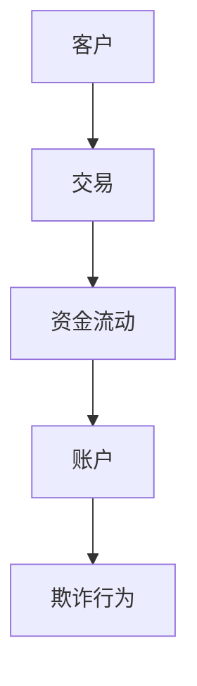
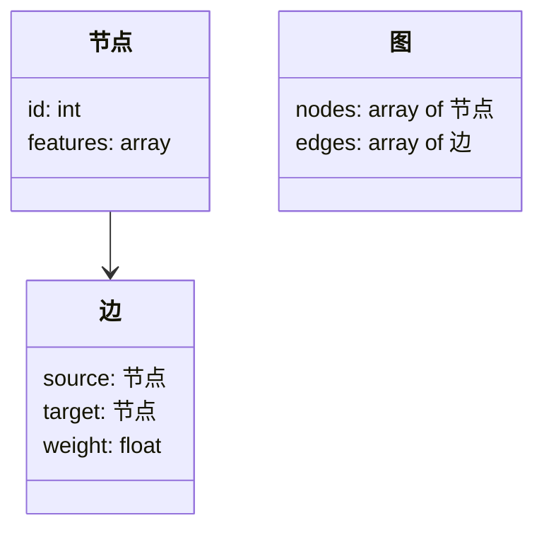
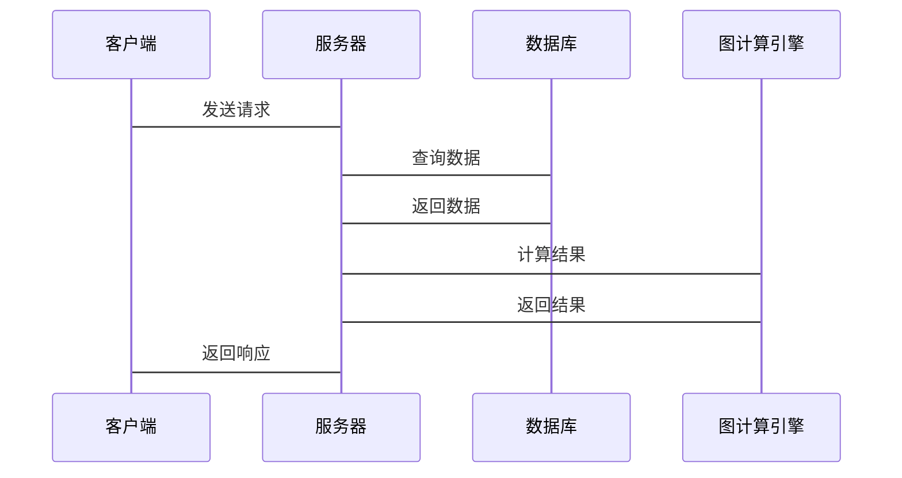

                 


# 《金融领域图计算技术的创新应用》

## 关键词：
金融、图计算、图神经网络、PageRank算法、LDA主题模型、GCN、风险控制

## 摘要：
本文深入探讨了图计算技术在金融领域的创新应用，涵盖图计算的基本概念、核心算法、系统设计和项目实战。通过分析PageRank、LDA和GCN等算法，结合金融风险控制系统的案例，展示了图计算在金融数据处理中的优势和潜力。

---

# 第一部分：金融领域图计算技术的背景与核心概念

## 第1章：图计算技术概述

### 1.1 图计算的基本概念

#### 1.1.1 图的基本定义与属性
图是一种数据结构，由节点（顶点）和边（边）组成。节点表示数据中的实体，边表示实体之间的关系。例如，在金融领域，节点可以是客户、交易，边可以是交易行为或资金流动。

#### 1.1.2 图计算的核心概念与特点
图计算通过分析节点之间的关系，发现隐藏的模式和关联。其特点包括全局性、动态性、高维性和复杂性。例如，通过图计算可以识别欺诈交易网络中的异常行为。

#### 1.1.3 图计算在金融领域的应用背景
金融数据具有高度的复杂性和关联性，传统的基于表的关系型数据库难以处理复杂的关联关系。图计算能够有效处理金融领域的复杂数据，帮助识别风险、欺诈和市场趋势。

---

## 第2章：图计算的核心概念与联系

### 2.1 图计算的核心原理

#### 2.1.1 图的基本结构
图由节点和边组成，节点代表实体，边代表关系。例如，在金融领域，节点可以是客户、交易，边可以是交易行为或资金流动。

#### 2.1.2 图的表示与编码
图的表示可以通过邻接矩阵或邻接列表实现。邻接矩阵适用于稠密图，邻接列表适用于稀疏图。例如，在金融领域，可以使用邻接矩阵表示客户之间的交易关系。

#### 2.1.3 图的遍历算法
图的遍历算法包括深度优先搜索（DFS）和广度优先搜索（BFS）。DFS适用于发现图中的路径，BFS适用于发现最短路径。例如，在金融领域，可以使用DFS识别欺诈交易网络中的路径。

### 2.2 图计算的核心概念对比

#### 2.2.1 图计算与其他计算技术的对比
与传统计算技术相比，图计算能够更好地处理复杂的关系数据，适用于社交网络分析、推荐系统等领域。

#### 2.2.2 图计算与传统数据库的对比
传统数据库基于表格结构，难以处理复杂的关联关系。图数据库通过节点和边直接建模，能够高效处理复杂关系。

#### 2.2.3 图计算与机器学习的结合
图计算可以为机器学习提供结构化的特征，增强模型的表达能力。例如，在金融领域，图神经网络可以用于风险评估和欺诈检测。

### 2.3 图计算的实体关系图



---

# 第二部分：图计算技术的核心算法与数学模型

## 第3章：图计算的经典算法

### 3.1 PageRank算法

#### 3.1.1 PageRank算法的原理
PageRank算法用于评估网页的重要性，核心思想是通过计算网页的入链数量和权重，确定网页的排名。在金融领域，可以用于评估客户或交易的重要性。

#### 3.1.2 PageRank算法的数学模型
$$ PR(i) = \alpha \frac{1}{N} + (1-\alpha) \sum_{j} \frac{PR(j)}{OutDegree(j)} $$

其中，$PR(i)$表示节点i的PageRank值，$\alpha$是阻尼因子，$OutDegree(j)$是节点j的出度。

#### 3.1.3 PageRank算法的实现步骤
1. 初始化所有节点的PageRank值为1/N。
2. 迭代计算每个节点的PageRank值，直到收敛。
3. 输出节点的PageRank值。

#### 3.1.4 PageRank算法的优化
通过并行计算和稀疏矩阵优化，提升算法的计算效率。

### 3.2 LDA主题模型

#### 3.2.1 LDA模型的原理
LDA是一种主题建模方法，用于从文本数据中提取主题。在金融领域，可以用于分析新闻文章或报告的主题。

#### 3.2.2 LDA模型的数学公式
$$ p(\text{文档}|\text{主题}) = \prod_{i=1}^{n} \text{Multinomial}(\theta_i) $$

其中，$\theta_i$是主题在文档中的分布。

#### 3.2.3 LDA模型的训练过程
1. 初始化主题分配。
2. 迭代更新主题分配，直到收敛。
3. 输出主题分布。

#### 3.2.4 LDA模型在金融中的应用
用于金融文本挖掘，分析市场情绪和趋势。

### 3.3 GCN图神经网络

#### 3.3.1 GCN的基本原理
GCN是一种图神经网络，通过聚合邻居节点的信息，计算节点的表示。

#### 3.3.2 GCN的数学公式
$$ Z = A X X^T $$

其中，$A$是邻接矩阵，$X$是节点特征矩阵，$Z$是节点的表示。

#### 3.3.3 GCN的实现步骤
1. 构建图的邻接矩阵。
2. 初始化节点特征。
3. 迭代聚合邻居信息，更新节点表示。
4. 输出节点表示。

#### 3.3.4 GCN在金融中的应用
用于风险评估和欺诈检测。

---

## 第4章：图计算的系统分析与架构设计

### 4.1 问题场景介绍

#### 4.1.1 金融风险控制系统
设计一个基于图计算的金融风险控制系统，用于识别潜在的欺诈交易和风险节点。

### 4.2 系统功能设计

#### 4.2.1 领域模型


#### 4.2.2 系统架构设计


#### 4.2.3 接口设计


---

## 第5章：图计算的项目实战

### 5.1 环境安装

#### 5.1.1 安装Python和相关库
```bash
pip install numpy
pip install networkx
pip install matplotlib
pip install pymermaid
```

### 5.2 核心代码实现

#### 5.2.1 PageRank算法实现
```python
import numpy as np

def pagerank(matrix, alpha=0.85):
    n = matrix.shape[0]
    ones = np.ones((n, 1))
    transition = alpha * matrix + (1 - alpha) * ones
    pr = np.ones((n, 1))
    while True:
        new_pr = transition.dot(pr)
        if np.allclose(pr, new_pr, atol=1e-6):
            break
        pr = new_pr
    return pr
```

#### 5.2.2 LDA主题模型实现
```python
from sklearn.decomposition import LatentDirichletAllocation

def lda_model(documents, n_topics=5):
    lda = LatentDirichletAllocation(n_components=n_topics, random_state=42)
    lda.fit(documents)
    return lda
```

#### 5.2.3 GCN图神经网络实现
```python
import torch
import torch.nn as nn

class GCN(nn.Module):
    def __init__(self, in_features, out_features):
        super(GCN, self).__init__()
        self.weight = nn.Parameter(torch.randn(in_features, out_features))
    
    def forward(self, x, adj):
        return torch.mm(x, self.weight) * adj
```

### 5.3 案例分析

#### 5.3.1 金融风险控制系统案例
使用PageRank算法识别高风险交易节点，使用LDA主题模型分析市场情绪，使用GCN图神经网络进行风险评估。

---

## 第6章：总结与展望

### 6.1 全文总结
图计算技术在金融领域的应用具有广阔前景，能够有效处理复杂的数据关系，提升分析效率和准确性。

### 6.2 未来展望
未来，图计算将与人工智能、大数据技术深度融合，推动金融领域的创新应用。

---

通过以上步骤，您可以撰写一篇详细的技术博客文章，涵盖金融领域图计算技术的背景、核心概念、算法原理、系统设计、项目实战和总结。希望对您有所帮助！

