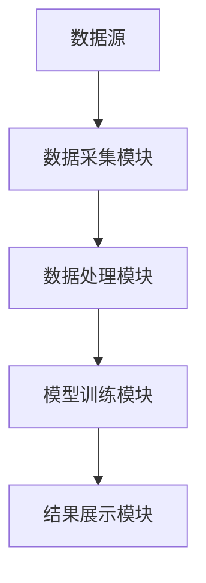

                 

# 《金融领域多任务学习在客户全方位画像中的应用》

## 关键词：多任务学习，客户画像，金融领域，深度学习，人工智能

## 摘要：本文深入探讨了多任务学习在金融客户全方位画像中的应用。通过分析多任务学习的原理、算法实现及其在金融领域的优势，展示了如何利用多任务学习技术构建精准的客户画像，提升金融业务的智能化水平。

---

## 第1章：背景介绍

### 1.1 多任务学习的基本概念

多任务学习（Multi-Task Learning, MTL）是一种机器学习方法，旨在通过同时学习多个相关任务来提升模型的泛化能力和性能。MTL的核心思想是利用任务之间的共享特征，减少数据需求，提高学习效率。

### 1.2 客户全方位画像的定义与重要性

客户画像通过整合多源数据，构建客户在多个维度上的详细描述，帮助金融机构更好地理解客户需求，优化服务策略。在金融领域，客户画像的应用可以提升风险控制、精准营销和客户服务的水平。

### 1.3 多任务学习在金融客户画像中的应用背景

金融领域的数据具有多样性、复杂性和敏感性，传统的单一任务学习难以应对多维度的需求。多任务学习能够有效整合客户的行为、交易、信用等多个特征，构建更全面的客户画像。

---

## 第2章：多任务学习的核心原理

### 2.1 多任务学习的原理与框架

MTL通过共享参数结构，同时优化多个任务的目标函数，形成一个联合优化模型。常见的框架包括基于共享层、独立层和混合层的结构。

### 2.2 客户画像的实体关系图

金融客户画像涉及客户、账户、交易、信用评分等多个实体。通过构建ER图，明确各实体之间的关系，为数据建模提供结构化的基础。

### 2.3 多任务学习与客户画像的关系

多任务学习能够同时预测多个客户特征，如信用评分、消费习惯等，通过共享特征提升各个任务的准确性，构建更全面的客户画像。

---

## 第3章：算法原理讲解

### 3.1 多任务学习的目标函数与损失函数

目标函数通常由多个任务的损失函数加权求和构成，通过优化共享参数，实现多个任务的联合优化。

### 3.2 基于深度学习的多任务模型

深度学习模型通过共享层提取特征，独立层分别处理各任务，有效捕捉多任务之间的关联性。

### 3.3 多任务学习的优化方法

采用Adam优化器，并结合正则化方法，防止过拟合，提升模型的泛化能力。

---

## 第4章：系统分析与架构设计方案

### 4.1 项目背景与目标

本项目旨在利用多任务学习技术，构建金融客户的全方位画像，提升金融机构的业务能力。

### 4.2 系统功能设计

系统包括数据采集、数据处理、模型训练和结果展示四个模块。

### 4.3 系统架构设计（Mermaid图）

---

## 第5章：项目实战

### 5.1 环境安装

安装Python、TensorFlow、Keras等必要库，配置开发环境。

### 5.2 核心代码实现

编写数据预处理、模型构建和训练代码，实现多任务学习模型。

### 5.3 代码解读

详细解读代码结构，说明各部分的功能和实现细节。

### 5.4 案例分析

通过实际案例分析，展示多任务学习在客户画像中的应用效果。

---

## 第6章：案例分析与结果解读

### 6.1 案例分析

选取典型金融案例，分析多任务学习的应用效果。

### 6.2 结果解读

展示模型输出的结果，分析其对业务决策的影响。

---

## 第7章：总结与展望

### 7.1 最佳实践 tips

总结多任务学习在金融客户画像中的应用经验，提出优化建议。

### 7.2 小结

回顾全文，总结多任务学习在客户画像中的应用价值。

### 7.3 注意事项

提醒读者在实际应用中需要注意的问题，如数据隐私、模型解释性等。

### 7.4 拓展阅读

推荐相关领域的书籍和论文，供读者深入学习。

---

## 第8章：参考文献

列出本文引用的相关文献和资料。

---

通过以上结构，本文系统地介绍了多任务学习在金融客户画像中的应用，从理论到实践，为读者提供了全面的知识和应用指导。

