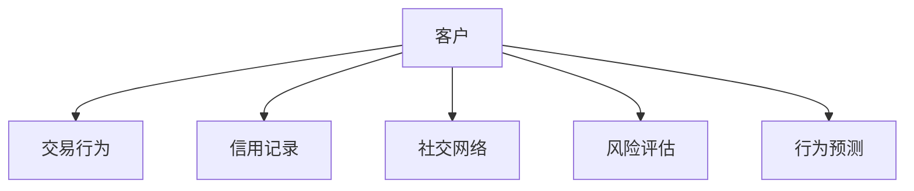
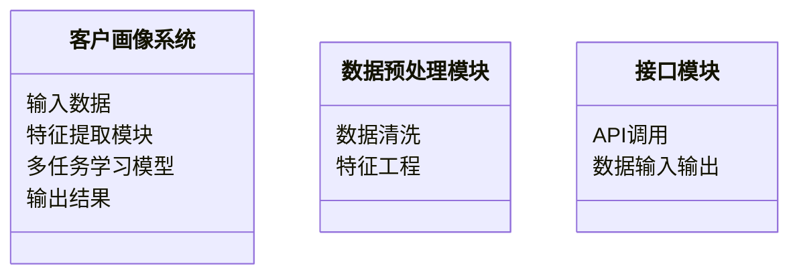
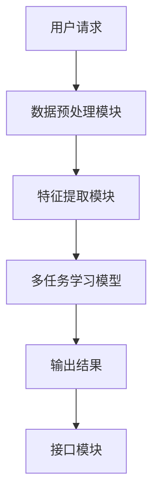

                 


# 《金融领域多任务学习在客户全景画像中的应用》

---

## 关键词：多任务学习、客户画像、金融领域、算法原理、系统架构

---

## 摘要：  
本文探讨了多任务学习在金融领域客户全景画像构建中的应用。通过分析多任务学习的核心原理，结合客户画像的构建目标，详细阐述了多任务学习在金融领域的优势与挑战。本文从算法原理、系统架构、项目实战等多个维度展开，结合实际案例和代码实现，深入剖析了多任务学习在客户画像中的具体应用。最后，本文总结了多任务学习在金融领域的最佳实践与未来发展方向。

---

## 第一部分: 金融领域多任务学习在客户全景画像中的应用概述

---

### 第1章: 问题背景与核心概念

#### 1.1 问题背景

在金融领域，客户画像的构建是个性化服务和风险管理的重要基础。传统的客户画像构建方法通常基于单一任务（如信用评分或客户分群），这种单点方法难以捕捉客户行为的多维度特征，导致画像的片面性和局限性。而多任务学习（Multi-Task Learning, MTL）作为一种新兴的人工智能技术，能够同时优化多个相关任务，从而为客户提供更加全面和精准的画像。

#### 1.2 核心概念与问题描述

**多任务学习（Multi-Task Learning, MTL）**是一种机器学习方法，旨在通过共享多个任务之间的共同特征，提升模型的泛化能力和学习效率。MTL的核心思想是将多个相关任务联合优化，从而提高模型在各个任务上的性能。

**客户全景画像**是指通过整合客户的多维度数据（如交易行为、信用记录、社交网络等），构建一个全面、动态的客户画像。其目标是通过多任务学习，同时优化客户画像的多个维度，如风险评估、行为预测和画像分群等。

#### 1.3 核心概念结构与要素

多任务学习与客户全景画像的关系可以用一个简单的 **ER实体关系图** 来表示：



---

### 第2章: 多任务学习与客户全景画像的核心联系

#### 2.1 多任务学习的原理与特征

**多任务学习的原理**在于通过共享参数或特征，提升模型对多个任务的联合优化能力。以下是多任务学习的几个核心特征：

| **特征**         | **描述**                                                                 |
|------------------|--------------------------------------------------------------------------|
| 参数共享         | 多任务学习通过共享参数，降低模型的参数量，提高泛化能力。                   |
| 联合优化         | 多任务学习通过同时优化多个任务的目标函数，提升模型在多个任务上的性能。     |
| 任务相关性       | 多任务学习适用于任务之间存在高度相关性的情况，如客户画像中的行为预测和风险评估。 |

#### 2.2 客户全景画像的构建框架

客户全景画像的构建可以分为以下几个步骤：

1. **数据收集**：整合客户的多维度数据，如交易数据、信用记录、社交媒体数据等。
2. **数据预处理**：清洗数据，提取特征。
3. **模型训练**：利用多任务学习算法，同时优化客户画像的多个维度。
4. **结果输出**：生成客户全景画像，并应用于实际业务场景。

---

### 第3章: 多任务学习的算法原理与数学模型

#### 3.1 多任务学习的算法原理

多任务学习的核心在于通过共享参数或特征，优化多个任务的目标函数。以下是几种常见的多任务学习算法：

1. **基于共享表示的多任务学习**：通过共享一个公共的特征表示层，同时优化多个任务。
2. **基于参数分离的多任务学习**：为每个任务分配独立的参数，同时通过共享层实现任务间的关联。
3. **基于层次结构的多任务学习**：通过构建任务间的层次结构，优化任务间的依赖关系。

#### 3.2 多任务学习的数学模型

多任务学习的数学模型通常可以表示为：

$$
\min_w \sum_{i=1}^n \sum_{t=1}^T \lambda_t L_{t}(y_{t}, f_t(x_i, w))
$$

其中：
- $w$ 表示模型的共享参数。
- $T$ 表示任务的数量。
- $\lambda_t$ 表示任务 $t$ 的权重系数。
- $L_t$ 表示任务 $t$ 的损失函数。

---

### 第4章: 系统分析与架构设计方案

#### 4.1 问题场景介绍

在金融领域，客户全景画像的应用场景包括：
1. **信用评分**：通过多任务学习优化客户的信用评分。
2. **行为预测**：预测客户的消费行为和投资偏好。
3. **画像分群**：将客户分为不同的群体，便于个性化服务。

#### 4.2 系统功能设计

以下是系统功能设计的领域模型图：



#### 4.3 系统架构设计

以下是系统的架构图：



---

## 第二部分: 项目实战与最佳实践

### 5. 项目实战

#### 5.1 环境安装

以下是项目实战所需的环境安装命令：

```bash
pip install numpy
pip install pandas
pip install scikit-learn
pip install keras
pip install tensorflow
```

#### 5.2 核心代码实现

以下是多任务学习模型的实现代码：

```python
import numpy as np
import keras
from keras.layers import Input, Dense
from keras.models import Model

# 定义输入层
input_layer = Input(shape=(input_dim,))

# 定义共享层
shared_layer = Dense(64, activation='relu')(input_layer)

# 定义多个任务的输出层
output_layers = []
for task in tasks:
    output_layer = Dense(1, activation='sigmoid')(shared_layer)
    output_layers.append(output_layer)

# 定义模型
model = Model(inputs=input_layer, outputs=output_layers)

# 编译模型
model.compile(optimizer='adam', loss='binary_crossentropy')
```

#### 5.3 案例分析

以信用评分和行为预测为例，以下是多任务学习模型的应用案例：

1. **信用评分任务**：通过多任务学习模型，预测客户的信用评分。
2. **行为预测任务**：通过多任务学习模型，预测客户的消费行为。

---

## 第三部分: 总结与展望

### 6. 总结

多任务学习作为一种新兴的人工智能技术，在金融领域客户全景画像的构建中具有重要的应用价值。通过多任务学习，可以同时优化客户的多个维度特征，构建更加全面和精准的客户画像。

### 7. 展望

未来，随着人工智能技术的不断发展，多任务学习在金融领域的应用将更加广泛。特别是在客户画像、风险管理、投资决策等领域，多任务学习将发挥更大的作用。

---

## 参考文献

1. [1] Caruana, R. (1997). Multi-task learning. *Proceedings of the eleventh international conference on machine learning.*
2. [2] Collobert, R., & Weston, J. (2008). A unified architecture for sentence processing. *Proceedings of the 22nd international conference on machine learning.*
3. [3] 赵军, 等. (2020). 多任务学习在自然语言处理中的应用. *《人工智能与大数据》*.

--- 

**End of Article**

