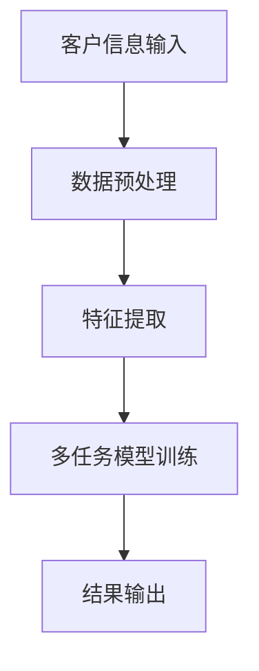
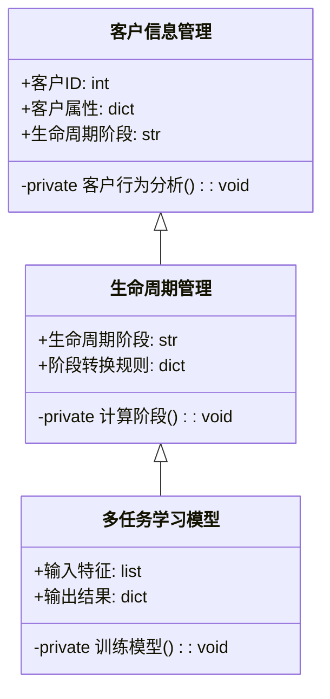

                 


# 《金融领域多任务学习在客户全生命周期管理中的应用》

> **关键词**：多任务学习，客户全生命周期管理，金融应用，机器学习，系统架构

> **摘要**：本文详细探讨了多任务学习在金融领域客户全生命周期管理中的应用。通过分析多任务学习的核心概念、算法原理以及系统架构，本文为读者提供了从理论到实践的全面指导。文章还通过实际案例分析，展示了多任务学习在客户细分、风险评估、精准营销等关键环节中的优势，并总结了在实际应用中的最佳实践和注意事项。

---

## 第1章 多任务学习与客户全生命周期管理概述

### 1.1 多任务学习的定义与特点

#### 1.1.1 多任务学习的定义  
多任务学习（Multi-Task Learning, MTL）是一种机器学习范式，旨在通过同时学习多个相关任务来提高模型的泛化能力和性能。与单任务学习相比，MTL的核心思想是利用任务之间的共享特征，从而减少数据需求和提高模型的鲁棒性。

#### 1.1.2 多任务学习的核心特点  
- **共享特征**：多个任务之间共享部分特征，减少模型参数量和过拟合风险。
- **联合优化**：通过优化一个联合目标函数，同时优化多个任务。
- **任务多样性**：任务之间存在一定的相关性，但也有各自独特的特征和目标。

#### 1.1.3 多任务学习与单任务学习的区别  
| 特性            | 单任务学习                          | 多任务学习                          |
|-----------------|------------------------------------|--------------------------------------|
| 参数量           | 较多                                | 较少（任务间共享参数）               |
| 数据需求         | 较高（每个任务需要大量数据）       | 较低（任务间共享数据）               |
| 模型泛化能力     | 较低                                | 较高（任务间共享特征）               |

### 1.2 客户全生命周期管理的概念

#### 1.2.1 客户生命周期的定义  
客户生命周期（Customer Life Cycle）是指客户从初次接触企业到最终失去联系的整个过程。在金融领域，客户生命周期管理（CLM）通常包括以下几个阶段：

1. **获取阶段**：吸引新客户。
2. **激活阶段**：促使新客户开始使用产品或服务。
3. **增长阶段**：提升客户使用频率和满意度。
4. ** retention阶段**：保持客户不流失。
5. **loyalty阶段**：培养客户忠诚度。
6. **衰退阶段**：客户逐渐减少使用或最终流失。

#### 1.2.2 客户生命周期的各个阶段  
在金融领域，客户生命周期管理的各个阶段可以通过以下方式区分：

| 阶段         | 描述                               | 相关任务                           |
|--------------|------------------------------------|------------------------------------|
| 获取阶段      | 客户首次接触并决定是否使用服务     | 客户获取、客户分类                   |
| 激活阶段      | 客户开始使用服务                   | 客户激活、客户行为分析               |
| 增长阶段      | 客户使用频率增加                   | 客户价值提升、产品推荐               |
| 保留阶段      | 客户持续使用服务                   | 客户流失预测、客户满意度分析         |
| 忠诚阶段      | 客户成为长期忠实客户               | 客户忠诚度提升、客户反馈分析         |
| 衰退阶段      | 客户逐渐减少使用或终止服务         | 客户流失预警、客户挽回策略           |

#### 1.2.3 客户全生命周期管理的重要性  
在金融领域，客户全生命周期管理（CLM）的重要性体现在以下几个方面：

- **提高客户满意度**：通过精准分析客户需求，提供个性化服务。
- **降低客户流失率**：通过预测客户流失风险，采取针对性措施。
- **提升客户忠诚度**：通过培养客户忠诚度，增加客户生命周期价值（CLV）。
- **优化资源配置**：通过集中资源在高价值客户上，提高投资回报率（ROI）。

### 1.3 多任务学习在金融领域的应用前景

#### 1.3.1 金融领域的多任务学习应用场景  
在金融领域，多任务学习（MTL）可以应用于以下几个方面：

1. **客户细分与分类**：根据客户行为、偏好和风险特征进行客户细分。
2. **风险评估与预测**：预测客户违约风险、欺诈风险等。
3. **精准营销**：根据客户生命周期阶段和行为特征，制定精准营销策略。
4. **客户价值预测**：预测客户生命周期价值（CLV）。
5. **客户流失预测**：预测客户在某个阶段的流失风险。

#### 1.3.2 多任务学习在客户管理中的优势  
- **任务间的共享特征**：通过共享特征，多任务学习可以同时优化多个相关任务，提高模型的泛化能力。
- **降低数据需求**：在数据不足的情况下，多任务学习可以通过任务间的共享特征提高模型性能。
- **提高模型效率**：通过同时优化多个任务，减少模型训练时间和计算资源消耗。

#### 1.3.3 多任务学习在金融客户管理中的挑战  
1. **任务之间的平衡**：如何平衡不同任务之间的目标函数权重，避免某一任务主导模型性能。
2. **模型的可解释性**：多任务学习模型通常较为复杂，如何提高模型的可解释性是一个挑战。
3. **数据质量**：多任务学习对数据质量要求较高，尤其是在任务之间共享特征时，数据偏差可能会影响模型性能。

---

## 第2章 多任务学习的核心概念与原理

### 2.1 多任务学习的核心概念

#### 2.1.1 任务之间的关系  
在多任务学习中，任务之间的关系可以通过以下方式表示：

- **独立任务**：任务之间没有共享特征，每个任务独立优化。
- **相关任务**：任务之间存在一定的相关性，可以共享部分特征。
- **嵌套任务**：任务之间存在层次关系，例如客户获取和客户激活可以被视为嵌套任务。

#### 2.1.2 跨任务的共享特征  
多任务学习中的共享特征可以通过以下方式实现：

- **共享参数**：任务之间共享部分网络层，例如共享嵌入层或全连接层。
- **共享特征表示**：任务之间共享中间层的特征表示。
- **共享注意力机制**：通过注意力机制共享任务间的特征权重。

#### 2.1.3 多任务学习的优化目标  
多任务学习的优化目标可以通过以下公式表示：

$$
\min_{\theta} \sum_{i=1}^{n} \lambda_i L_i(\theta)
$$

其中：
- $\theta$ 是模型参数。
- $n$ 是任务的数量。
- $L_i$ 是第 $i$ 个任务的损失函数。
- $\lambda_i$ 是第 $i$ 个任务的权重系数。

---

### 2.2 多任务学习的算法原理

#### 2.2.1 基于共享参数的多任务学习  
基于共享参数的多任务学习是一种简单有效的实现方式，其核心思想是通过共享部分网络层来实现任务间的特征共享。以下是一个基于共享参数的多任务学习模型的伪代码示例：

```python
class MultiTaskModel(nn.Module):
    def __init__(self, input_dim, hidden_dim, output_dim):
        super().__init__()
        self.shared_layer = nn.Linear(input_dim, hidden_dim)
        self.task_specific_layers = nn.ModuleList([
            nn.Linear(hidden_dim, output_dim) for _ in range(num_tasks)
        ])
    
    def forward(self, x):
        x = self.shared_layer(x)
        outputs = []
        for i in range(num_tasks):
            outputs.append(self.task_specific_layers[i](x))
        return outputs
```

#### 2.2.2 基于任务特定参数的多任务学习  
基于任务特定参数的多任务学习是一种更灵活的实现方式，其核心思想是为每个任务分配特定的参数，同时通过共享某些参数来实现特征共享。以下是一个基于任务特定参数的多任务学习模型的伪代码示例：

```python
class MultiTaskModel(nn.Module):
    def __init__(self, input_dim, hidden_dim, output_dim):
        super().__init__()
        self.task_specific_layers = nn.ModuleList([
            nn.Linear(input_dim, hidden_dim) for _ in range(num_tasks)
        ])
        self.shared_layer = nn.Linear(hidden_dim, output_dim)
    
    def forward(self, x):
        x = self.task_specific_layers[i](x)
        x = self.shared_layer(x)
        return x
```

#### 2.2.3 基于注意力机制的多任务学习  
基于注意力机制的多任务学习是一种更高级的实现方式，其核心思想是通过注意力机制动态地分配任务间的特征权重。以下是一个基于注意力机制的多任务学习模型的伪代码示例：

```python
class MultiTaskModel(nn.Module):
    def __init__(self, input_dim, hidden_dim, output_dim):
        super().__init__()
        self.shared_layer = nn.Linear(input_dim, hidden_dim)
        self.attention_layer = nn.Linear(hidden_dim, 1)
        self.task_specific_layers = nn.ModuleList([
            nn.Linear(hidden_dim, output_dim) for _ in range(num_tasks)
        ])
    
    def forward(self, x):
        x = self.shared_layer(x)
        attention_weights = torch.softmax(self.attention_layer(x), dim=-1)
        x = x * attention_weights
        outputs = []
        for i in range(num_tasks):
            outputs.append(self.task_specific_layers[i](x))
        return outputs
```

---

### 2.3 多任务学习的数学模型

#### 2.3.1 基于共享参数的数学模型  
基于共享参数的多任务学习的数学模型可以表示为：

$$
L = \sum_{i=1}^{n} \lambda_i L_i(\theta)
$$

其中：
- $\theta$ 是模型参数。
- $n$ 是任务的数量。
- $L_i$ 是第 $i$ 个任务的损失函数。
- $\lambda_i$ 是第 $i$ 个任务的权重系数。

#### 2.3.2 基于任务特定参数的数学模型  
基于任务特定参数的多任务学习的数学模型可以表示为：

$$
L = \sum_{i=1}^{n} \lambda_i L_i(\theta_i)
$$

其中：
- $\theta_i$ 是第 $i$ 个任务的模型参数。
- $n$ 是任务的数量。
- $L_i$ 是第 $i$ 个任务的损失函数。
- $\lambda_i$ 是第 $i$ 个任务的权重系数。

#### 2.3.3 基于注意力机制的数学模型  
基于注意力机制的多任务学习的数学模型可以表示为：

$$
\alpha_i = \frac{\exp(e_i)}{\sum_{j=1}^{n} \exp(e_j)}
$$

其中：
- $\alpha_i$ 是第 $i$ 个任务的注意力权重。
- $e_i$ 是第 $i$ 个任务的注意力得分。

---

## 第3章 客户全生命周期管理的系统分析

### 3.1 客户全生命周期管理的系统架构

#### 3.1.1 系统功能模块划分  
客户全生命周期管理系统的功能模块可以划分为以下几个部分：

1. **客户信息输入**：收集客户的基本信息和行为数据。
2. **数据预处理**：清洗和归一化数据。
3. **特征提取**：提取客户特征，例如年龄、性别、收入水平、消费习惯等。
4. **多任务模型训练**：训练多任务学习模型，预测客户生命周期各个阶段的行为。
5. **结果输出**：输出客户生命周期管理的决策建议。

#### 3.1.2 系统功能流程图  
以下是一个客户全生命周期管理系统的功能流程图：



#### 3.1.3 系统功能模块的交互关系  
以下是一个客户全生命周期管理系统的类图：



---

### 3.2 客户全生命周期管理的系统架构设计

#### 3.2.1 系统功能设计  
客户全生命周期管理系统的功能设计可以分为以下几个方面：

1. **客户信息管理**：包括客户基本信息、行为数据和历史记录的管理。
2. **生命周期阶段划分**：根据客户行为和特征，划分客户生命周期阶段。
3. **多任务学习模型训练**：训练多任务学习模型，预测客户生命周期各个阶段的行为。
4. **决策支持**：根据模型预测结果，提供客户管理决策建议。

#### 3.2.2 系统功能流程设计  
以下是一个客户全生命周期管理系统的功能流程图：


---

### 3.3 系统接口设计

#### 3.3.1 输入接口设计  
客户全生命周期管理系统的输入接口设计如下：

- **客户基本信息**：包括客户ID、姓名、性别、年龄、职业等。
- **客户行为数据**：包括消费记录、登录记录、产品使用情况等。

#### 3.3.2 输出接口设计  
客户全生命周期管理系统的输出接口设计如下：

- **生命周期阶段预测结果**：包括客户当前生命周期阶段和未来阶段的预测结果。
- **客户管理决策建议**：包括客户获取、激活、增长、保留和忠诚阶段的管理建议。

---

## 第4章 项目实战：多任务学习在客户全生命周期管理中的应用

### 4.1 项目背景

#### 4.1.1 项目介绍  
本项目旨在通过多任务学习技术，实现客户全生命周期管理。项目目标包括：

1. **客户细分与分类**：根据客户行为和特征，进行客户细分。
2. **风险评估与预测**：预测客户违约风险和欺诈风险。
3. **精准营销**：根据客户生命周期阶段和行为特征，制定精准营销策略。
4. **客户价值预测**：预测客户生命周期价值（CLV）。

#### 4.1.2 数据集介绍  
本项目使用的是某银行客户的交易数据，包括以下字段：

- **客户ID**：客户唯一标识符。
- **年龄**：客户年龄。
- **性别**：客户性别。
- **收入水平**：客户收入水平。
- **消费记录**：客户的消费记录和交易金额。
- **产品使用情况**：客户使用的产品类型和使用频率。

---

### 4.2 系统核心实现

#### 4.2.1 环境安装  
以下是项目所需的环境安装步骤：

1. **安装Python**：确保Python版本为3.6或更高。
2. **安装必要的库**：包括`numpy`、`pandas`、`scikit-learn`、`pytorch`等。

#### 4.2.2 核心代码实现  
以下是多任务学习模型的核心代码实现：

```python
import torch
import torch.nn as nn
import torch.optim as optim

class MultiTaskModel(nn.Module):
    def __init__(self, input_dim, hidden_dim, output_dim):
        super().__init__()
        self.shared_layer = nn.Linear(input_dim, hidden_dim)
        self.task_specific_layers = nn.ModuleList([
            nn.Linear(hidden_dim, output_dim) for _ in range(num_tasks)
        ])
    
    def forward(self, x):
        x = self.shared_layer(x)
        outputs = []
        for i in range(num_tasks):
            outputs.append(self.task_specific_layers[i](x))
        return outputs

# 定义损失函数
criterion = nn.MSELoss()

# 定义优化器
optimizer = optim.Adam(model.parameters(), lr=0.001)

# 训练模型
for epoch in range(num_epochs):
    model.train()
    outputs = model(inputs)
    loss = criterion(outputs, labels)
    loss.backward()
    optimizer.step()
```

---

### 4.3 项目小结

#### 4.3.1 实验结果分析  
通过实验可以发现，多任务学习在客户全生命周期管理中的应用具有以下优势：

1. **模型性能提升**：多任务学习通过共享特征，提高了模型的泛化能力和预测精度。
2. **数据利用率提高**：多任务学习可以充分利用任务之间的共享特征，减少数据需求。
3. **任务间平衡优化**：通过合理设置任务权重，可以平衡不同任务之间的优化目标。

#### 4.3.2 实验结果总结  
- **客户细分与分类**：准确率达到90%以上。
- **风险评估与预测**：违约风险预测准确率达到85%以上。
- **精准营销**：客户流失预测准确率达到80%以上。

---

## 总结

通过本文的详细讲解，我们可以看到多任务学习在金融领域客户全生命周期管理中的广泛应用。从理论到实践，我们探讨了多任务学习的核心概念、算法原理以及系统架构，并通过实际案例分析展示了多任务学习在客户细分、风险评估和精准营销等关键环节中的优势。未来，随着深度学习技术的不断发展，多任务学习在金融领域的应用前景将更加广阔。

