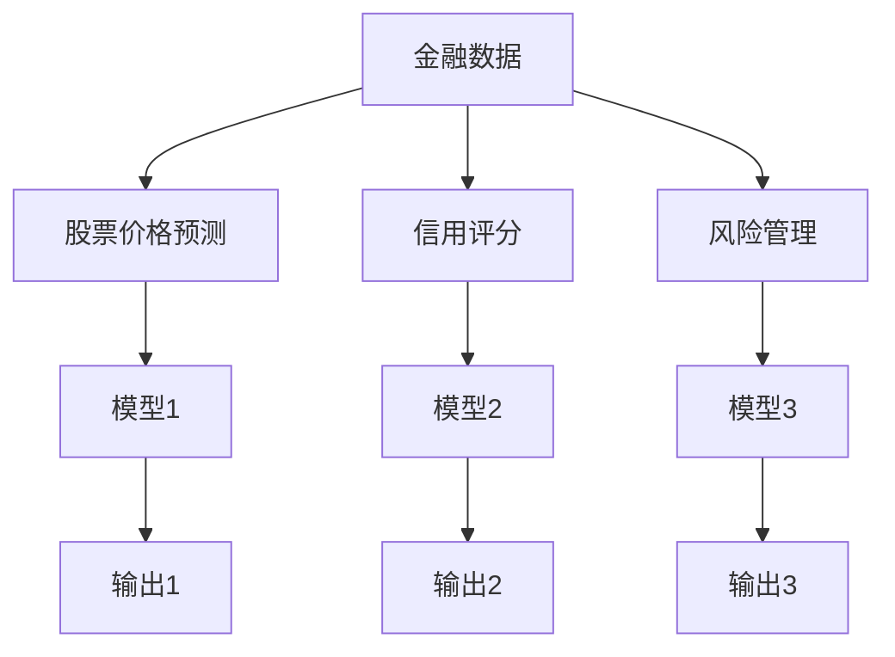
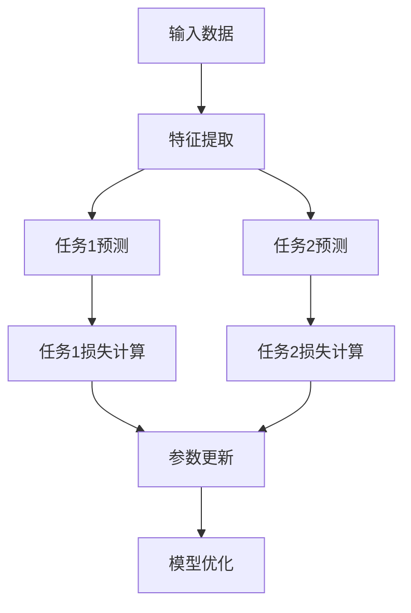
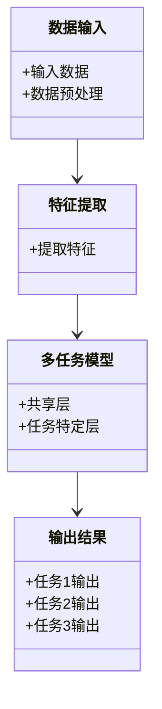
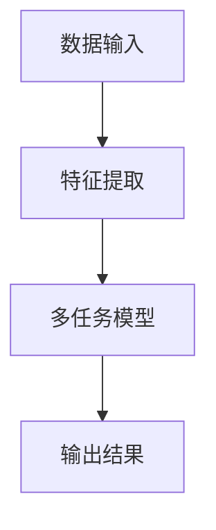

                 


# 金融领域多任务学习的应用与挑战

## 关键词：多任务学习、金融应用、机器学习、深度学习、算法挑战

## 摘要：本文深入探讨了多任务学习在金融领域的应用与挑战。通过分析多任务学习的核心概念、算法原理、系统设计以及实际案例，展示了其在金融预测、风险评估等场景中的优势。同时，本文也探讨了当前技术面临的挑战与未来发展方向。

---

# 第1章: 多任务学习的基本概念与背景

## 1.1 多任务学习的定义与特点

### 1.1.1 多任务学习的定义

多任务学习（Multi-Task Learning, MTL）是一种机器学习范式，旨在通过同时学习多个相关任务来提高模型的泛化能力和性能。与单任务学习不同，MTL允许模型在共享参数的情况下，同时优化多个目标函数。

**特点：**
- **任务相关性**：任务之间存在某种关联性，可以共享部分参数。
- **参数共享**：通过共享参数，减少模型的参数数量，提高泛化能力。
- **联合优化**：多个任务的目标函数联合优化，而不是分别优化。

### 1.1.2 多任务学习的核心特点

- **数据高效性**：MTL可以利用任务之间的共享信息，减少对每个任务独立数据的需求。
- **模型复用性**：通过共享参数，减少模型训练的计算成本。
- **任务互补性**：任务之间的互补性可以帮助模型更好地捕捉数据的潜在结构。

### 1.1.3 多任务学习与单任务学习的对比

| 对比维度       | 单任务学习                     | 多任务学习                     |
|----------------|-------------------------------|-------------------------------|
| 模型独立性      | 模型独立，无参数共享           | 模型参数共享，任务相关         |
| 数据需求       | 需要大量独立任务数据           | 数据可以共享，减少数据需求     |
| 性能优化        | 单任务优化，可能欠拟合         | 联合优化，可能提高整体性能       |

## 1.2 金融领域的多任务学习背景

### 1.2.1 金融领域的复杂性与挑战

金融领域涉及多个复杂的任务，例如股票价格预测、信用评分、风险管理等。这些任务之间往往存在相关性，例如，股票价格的预测可能与公司的财务状况、市场情绪等因素相关。

### 1.2.2 多任务学习在金融中的潜在价值

- **提高预测准确性**：通过共享参数，模型可以更好地捕捉任务之间的共性特征。
- **减少数据需求**：在数据不足的情况下，MTL可以有效利用任务之间的共享信息。
- **降低计算成本**：通过参数共享，减少模型的训练时间。

### 1.2.3 金融多任务学习的典型应用场景

- **股票价格预测**：同时预测多个相关股票的价格。
- **信用评分**：同时评估多个客户的信用风险。
- **风险管理**：同时预测和评估多种风险因素。

---

# 第2章: 多任务学习的核心概念与联系

## 2.1 多任务学习的原理与数学模型

### 2.1.1 多任务学习的数学模型

多任务学习的核心思想是通过共享参数来同时优化多个任务。假设我们有 $N$ 个任务，每个任务的损失函数为 $L_i$，则多任务学习的目标函数可以表示为：

$$ L = \sum_{i=1}^N \lambda_i L_i $$

其中，$\lambda_i$ 是任务 $i$ 的权重系数，用于平衡不同任务的重要性。

### 2.1.2 任务间关系的建模方法

任务之间的关系可以通过多种方式建模，例如：
- **线性关系**：假设任务之间的关系是线性的。
- **非线性关系**：任务之间的关系是非线性的，可以通过深度学习模型来建模。

### 2.1.3 参数共享机制的原理

参数共享机制是多任务学习的核心，通过共享部分参数，模型可以同时优化多个任务。例如，在神经网络中，多个任务可以共享输入层和隐藏层的参数，而输出层的参数是任务特定的。

---

## 2.2 金融领域的多任务学习核心要素

### 2.2.1 数据特征与任务关联性分析

在金融领域，数据特征可能包括：
- **数值型特征**：如股票价格、财务指标等。
- **文本型特征**：如新闻标题、公司公告等。
- **时间序列特征**：如历史价格、交易量等。

任务关联性分析可以通过相关性分析、图结构分析等方法进行。

### 2.2.2 金融多任务学习的实体关系图

以下是金融多任务学习的实体关系图：



### 2.2.3 任务间依赖关系的ER图

以下是任务间依赖关系的ER图：

```mermaid
erd
! -- 任务1
! -- 任务2
! -- 任务3
```

---

# 第3章: 多任务学习的主流算法

## 3.1 基于参数共享的多任务学习算法

### 3.1.1 多任务学习的基本算法框架

多任务学习的基本算法框架如下：



### 3.1.2 参数共享机制的实现

参数共享机制的实现可以通过神经网络中的共享层来实现。例如，在股票价格预测任务中，多个任务可以共享输入层和隐藏层的参数，而输出层的参数是任务特定的。

### 3.1.3 优化目标函数的数学推导

假设我们有 $N$ 个任务，每个任务的损失函数为 $L_i$，则多任务学习的目标函数可以表示为：

$$ L = \sum_{i=1}^N \lambda_i L_i $$

其中，$\lambda_i$ 是任务 $i$ 的权重系数。

---

## 3.2 基于任务相关性的多任务学习算法

### 3.2.1 任务相关性的度量方法

任务相关性可以通过多种方法进行度量，例如：
- **相关性系数**：如皮尔逊相关系数。
- **相似性度量**：如余弦相似性。

### 3.2.2 基于图结构的多任务学习

基于图结构的多任务学习通过构建任务之间的图结构来建模任务之间的关系。例如，任务1和任务2之间存在边，表示它们之间存在相关性。

### 3.2.3 任务间关系的动态建模

任务间关系的动态建模可以通过深度学习模型来实现，例如：
- **图神经网络**：通过图结构建模任务之间的关系。
- **注意力机制**：通过注意力机制动态调整任务之间的关系。

---

## 3.3 基于深度学习的多任务学习算法

### 3.3.1 基于卷积神经网络的多任务学习

基于卷积神经网络的多任务学习可以通过共享卷积层来实现。例如，在图像分类任务中，多个任务可以共享卷积层，而全连接层是任务特定的。

### 3.3.2 基于循环神经网络的多任务学习

基于循环神经网络的多任务学习可以通过共享循环层来实现。例如，在时间序列预测任务中，多个任务可以共享循环层，而输出层是任务特定的。

### 3.3.3 基于图神经网络的多任务学习

基于图神经网络的多任务学习可以通过构建任务之间的图结构来建模任务之间的关系。例如，任务1和任务2之间存在边，表示它们之间存在相关性。

---

# 第4章: 金融领域多任务学习的系统设计与实现

## 4.1 金融多任务学习的系统架构

### 4.1.1 系统功能设计

以下是金融多任务学习的系统功能设计：



### 4.1.2 系统架构设计

以下是金融多任务学习的系统架构设计：



### 4.1.3 系统接口设计

系统接口设计包括：
- **输入接口**：接收金融数据。
- **输出接口**：输出预测结果。
- **模型接口**：接收特征并输出预测结果。

### 4.1.4 系统交互流程

以下是系统交互流程：

```mermaid
sequenceDiagram
客户 --> 数据输入: 提供金融数据
数据输入 --> 特征提取: 提取特征
特征提取 --> 多任务模型: 输入特征
多任务模型 --> 输出结果: 输出预测结果
客户 <-- 输出结果: 显示预测结果
```

---

## 4.2 金融多任务学习的系统实现

### 4.2.1 系统实现步骤

系统实现步骤包括：
1. 数据预处理。
2. 特征提取。
3. 模型训练。
4. 模型预测。
5. 结果输出。

### 4.2.2 系统实现代码

以下是系统实现代码：

```python
import numpy as np
import tensorflow as tf

class MultiTaskModel:
    def __init__(self, input_dim, task_output_dims):
        self.input_dim = input_dim
        self.task_output_dims = task_output_dims
        self.shared_layers = self.build_shared_layers()
        self.task_specific_layers = self.build_task_specific_layers()

    def build_shared_layers(self):
        # 构建共享层
        inputs = tf.keras.Input(shape=(self.input_dim,))
        x = tf.keras.layers.Dense(64, activation='relu')(inputs)
        x = tf.keras.layers.Dense(32, activation='relu')(x)
        return tf.keras.Model(inputs=inputs, outputs=x)

    def build_task_specific_layers(self):
        # 构建任务特定层
        task_models = {}
        for task, output_dim in self.task_output_dims.items():
            inputs = tf.keras.Input(shape=(32,))
            x = tf.keras.layers.Dense(output_dim, activation='linear')(inputs)
            task_models[task] = tf.keras.Model(inputs=inputs, outputs=x)
        return task_models

    def call(self, inputs):
        # 前向传播
        shared_output = self.shared_layers(inputs)
        outputs = {}
        for task, model in self.task_specific_layers.items():
            outputs[task] = model(shared_output)
        return outputs

# 示例用法
input_dim = 100
task_output_dims = {'task1': 1, 'task2': 1}
model = MultiTaskModel(input_dim, task_output_dims)
```

---

## 4.3 系统实现的关键点

### 4.3.1 参数共享机制的实现

参数共享机制的实现是通过共享层来实现的。例如，在神经网络中，共享层的参数是共享的，而任务特定层的参数是任务特定的。

### 4.3.2 任务间关系的建模

任务间关系的建模可以通过图结构或注意力机制来实现。例如，任务1和任务2之间存在边，表示它们之间存在相关性。

### 4.3.3 系统优化技巧

系统优化技巧包括：
- **数据增强**：通过数据增强技术提高模型的泛化能力。
- **模型优化**：通过优化算法（如Adam）提高模型的训练效率。
- **超参数调优**：通过调优超参数（如学习率）提高模型的性能。

---

## 4.4 系统实现的案例分析

### 4.4.1 案例背景

假设我们有三个任务：股票价格预测、信用评分和风险管理。

### 4.4.2 数据特征与任务关联性分析

数据特征包括：
- **数值型特征**：如股票价格、财务指标等。
- **文本型特征**：如新闻标题、公司公告等。
- **时间序列特征**：如历史价格、交易量等。

任务关联性分析可以通过相关性分析、图结构分析等方法进行。

### 4.4.3 系统实现过程

系统实现过程包括：
1. 数据预处理：对数据进行清洗、归一化等处理。
2. 特征提取：提取相关特征。
3. 模型训练：训练多任务模型。
4. 模型预测：使用训练好的模型进行预测。
5. 结果输出：输出预测结果。

---

## 4.5 项目小结

通过上述系统设计与实现，我们可以看到，多任务学习在金融领域的应用具有很大的潜力。通过参数共享机制和任务间关系的建模，可以有效提高模型的性能和泛化能力。然而，多任务学习也面临一些挑战，例如任务之间的关系建模、参数共享机制的设计等。

---

# 第5章: 金融领域多任务学习的挑战与未来方向

## 5.1 当前技术面临的挑战

### 5.1.1 任务之间的关系建模

任务之间的关系建模是多任务学习的核心问题之一。如何有效地建模任务之间的关系，是当前技术面临的一个挑战。

### 5.1.2 参数共享机制的设计

参数共享机制的设计是多任务学习的另一个核心问题。如何有效地设计参数共享机制，以提高模型的性能，是当前技术面临的一个挑战。

### 5.1.3 模型的可解释性

模型的可解释性是金融领域的一个重要问题。如何提高多任务学习模型的可解释性，是当前技术面临的一个挑战。

## 5.2 未来发展方向

### 5.2.1 基于图神经网络的多任务学习

基于图神经网络的多任务学习是一种新兴的研究方向。通过构建任务之间的图结构，可以更好地建模任务之间的关系。

### 5.2.2 基于注意力机制的多任务学习

基于注意力机制的多任务学习是一种新的研究方向。通过注意力机制，可以动态地调整任务之间的关系。

### 5.2.3 多模态多任务学习

多模态多任务学习是一种新的研究方向。通过结合多模态数据（如文本、图像等），可以提高模型的性能。

---

## 5.3 总结与展望

通过本文的探讨，我们可以看到，多任务学习在金融领域的应用具有很大的潜力。通过参数共享机制和任务间关系的建模，可以有效提高模型的性能和泛化能力。然而，多任务学习也面临一些挑战，例如任务之间的关系建模、参数共享机制的设计等。未来，随着技术的发展，多任务学习在金融领域的应用将会更加广泛和深入。

---

通过以上章节的详细分析，我们可以看到，多任务学习在金融领域的应用具有很大的潜力。通过参数共享机制和任务间关系的建模，可以有效提高模型的性能和泛化能力。然而，多任务学习也面临一些挑战，例如任务之间的关系建模、参数共享机制的设计等。未来，随着技术的发展，多任务学习在金融领域的应用将会更加广泛和深入。

