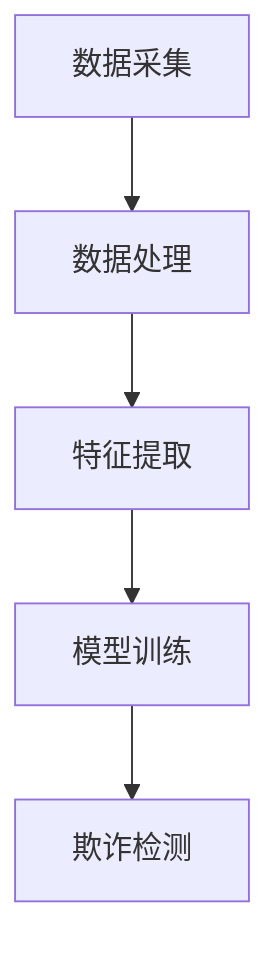
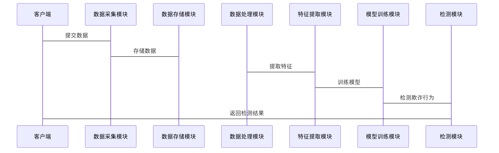
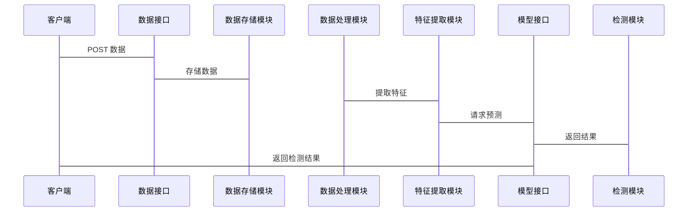

                 


# 《金融领域多模态学习在全方位反欺诈中的应用》

---

## 关键词：
金融反欺诈，多模态学习，数据融合，深度学习，实体关系图，系统架构，项目实战

---

## 摘要：
在金融领域，欺诈行为日益复杂化和多样化，传统的单模态反欺诈方法已难以应对新型威胁。本文深入探讨多模态学习在金融反欺诈中的应用，从背景、核心概念到算法原理、系统架构，再到项目实战，全面解析多模态学习如何提升反欺诈能力。通过详细分析多模态数据的融合方式、典型算法及其数学模型，结合实际案例，展示如何构建高效的反欺诈系统。

---

# 第1章: 金融领域反欺诈背景

## 1.1 金融领域反欺诈的背景与挑战

### 1.1.1 金融欺诈的现状与趋势
近年来，金融欺诈手段不断升级，从传统的信用卡欺诈扩展到复杂的网络诈骗、洗钱等行为。欺诈者利用技术漏洞和数据不足，规避传统检测系统。例如，2020年全球金融欺诈损失高达数千亿美元，凸显了反欺诈技术升级的迫切需求。

### 1.1.2 传统反欺诈方法的局限性
传统反欺诈方法主要依赖单一模态数据（如交易记录或身份验证），难以捕捉复杂欺诈行为的全貌。例如，仅依赖交易金额和时间的检测系统，无法识别涉及多模态数据的欺诈行为，导致漏检和误检。

### 1.1.3 多模态学习在反欺诈中的优势
多模态学习通过整合文本、图像、音频等多种数据，能够更全面地识别欺诈模式。例如，结合交易记录和用户行为数据，可以发现异常交易模式，提升检测准确率。

## 1.2 多模态学习的核心概念

### 1.2.1 多模态学习的定义
多模态学习指利用多种数据模态（如文本、图像、音频）进行信息融合，以提高模型的表达能力。例如，结合客户行为数据和交易记录，构建更全面的用户画像。

### 1.2.2 多模态学习的关键特征
- **多维度信息整合**：利用多种数据源，提高模型鲁棒性。
- **跨模态关联**：挖掘不同模态数据之间的关联，识别潜在欺诈模式。

### 1.2.3 多模态学习与单模态学习的对比
| 特性      | 单模态学习      | 多模态学习      |
|-----------|----------------|----------------|
| 数据来源  | 单一数据源      | 多个数据源      |
| 表达能力  | 较低            | 较高            |
| 检测精度  | 易受数据限制     | 更高            |

---

# 第2章: 多模态学习在反欺诈中的应用

## 2.1 多模态学习的基本原理

### 2.1.1 多模态数据的融合方式
多模态数据融合包括特征级融合和决策级融合。特征级融合通过将不同模态的特征向量进行拼接或加权，构建联合特征向量；决策级融合则将各模态的分类结果进行综合，输出最终决策。

### 2.1.2 多模态学习的典型算法
- **DAM（Deep Audio Model）**：用于音频数据处理。
- **CNN（卷积神经网络）**：常用于图像数据处理。
- **Transformer**：用于文本数据处理。

### 2.1.3 多模态学习的优势与挑战
优势包括提高检测精度和降低误报率；挑战在于多模态数据的异构性和计算复杂度。

## 2.2 金融领域多模态数据的特征分析

### 2.2.1 文本数据的特征
文本数据包括交易记录、客户评论等，特征包括关键词出现频率、句式复杂度等。

### 2.2.2 图像数据的特征
图像数据包括身份证照片、交易截图等，特征包括颜色分布、纹理特征等。

### 2.2.3 音频数据的特征
音频数据包括语音通话录音，特征包括声调、语速、语调等。

## 2.3 本章小结
本章介绍了多模态学习的基本原理及其在金融反欺诈中的应用，强调了多模态数据融合的优势和挑战。

---

# 第3章: 多模态学习算法原理与数学模型

## 3.1 多模态学习的算法框架

### 3.1.1 多模态融合的层次结构
多模态融合分为特征级、决策级和混合级融合，每种融合方式对应不同的算法流程。

### 3.1.2 多模态学习的典型算法流程
1. 数据预处理：对各模态数据进行标准化和归一化。
2. 特征提取：利用CNN、RNN等模型提取各模态特征。
3. 模态对齐：通过相似性度量对齐不同模态特征。
4. 联合学习：将对齐后的特征输入到联合模型中进行分类或回归。

## 3.2 多模态学习的数学模型

### 3.2.1 多模态数据表示的数学形式
设文本、图像、音频数据分别表示为$T$、$I$、$A$，则联合特征向量为：
$$
F = [T, I, A]
$$

### 3.2.2 跨模态对齐的数学模型
通过计算余弦相似度对齐不同模态数据：
$$
sim(T, I) = \frac{T \cdot I}{\|T\| \|I\|}
$$

### 3.2.3 联合学习的数学表达
联合学习模型可以表示为：
$$
P(y|x) = f(F)
$$
其中，$F$为联合特征向量。

---

# 第4章: 金融领域反欺诈系统的系统分析与架构设计

## 4.1 项目背景与目标

### 4.1.1 项目背景介绍
项目旨在构建一个基于多模态学习的反欺诈系统，提升检测精度和效率。

### 4.1.2 项目目标与范围
目标包括：提高检测准确率，降低误报率，实现多模态数据融合。

## 4.2 系统功能设计

### 4.2.1 系统功能模块划分
- 数据采集模块：负责收集文本、图像、音频数据。
- 数据处理模块：对数据进行预处理和特征提取。
- 模型训练模块：训练多模态学习模型。
- 检测模块：实时检测欺诈行为。

### 4.2.2 系统功能流程图


## 4.3 系统架构设计

### 4.3.1 系统架构的分层设计
系统分为数据层、特征层、模型层和应用层。

### 4.3.2 系统架构的模块划分
- 数据层：存储多模态数据。
- 特征层：提取特征向量。
- 模型层：训练和部署模型。
- 应用层：提供API接口供其他系统调用。

### 4.3.3 系统架构的交互设计


## 4.4 系统接口设计

### 4.4.1 系统接口的定义
- 数据接口：提供REST API用于数据上传。
- 模型接口：提供预测API用于欺诈检测。

### 4.4.2 系统接口的交互流程


---

# 第5章: 项目实战——基于多模态学习的反欺诈系统实现

## 5.1 环境安装与配置

### 5.1.1 开发环境的搭建
建议使用Python 3.8及以上版本，安装必要的库如TensorFlow、Keras、OpenCV等。

### 5.1.2 依赖库的安装
运行以下命令安装依赖：
```bash
pip install numpy tensorflow keras opencv-python
```

## 5.2 系统核心功能实现

### 5.2.1 数据预处理与特征提取
1. 文本数据预处理：
   ```python
   import tensorflow as tf
   from tensorflow.keras.preprocessing.text import Tokenizer

   tokenizer = Tokenizer()
   tokenizer.fit_on_texts(texts)
   text_sequences = tokenizer.texts_to_sequences(texts)
   ```
2. 图像数据预处理：
   ```python
   import cv2

   def preprocess_image(image_path):
       img = cv2.imread(image_path)
       img = cv2.resize(img, (224, 224))
       return img
   ```
3. 音频数据预处理：
   ```python
   import numpy as np

   def preprocess_audio(audio_path):
       audio_data = np.load(audio_path)
       return audio_data
   ```

### 5.2.2 多模态数据融合算法实现
1. 特征拼接：
   ```python
   def concatenate_features(text, image, audio):
       text_embedding = model_text.predict(text)
       image_embedding = model_image.predict(image)
       audio_embedding = model_audio.predict(audio)
       return np.concatenate([text_embedding, image_embedding, audio_embedding], axis=1)
   ```
2. 联合学习模型：
   ```python
   from tensorflow.keras import layers

   input_text = layers.Input(shape=(text_length,))
   input_image = layers.Input(shape=(image_shape,))
   input_audio = layers.Input(shape=(audio_shape,))

   embedding_text = layers.Dense(64, activation='relu')(input_text)
   embedding_image = layers.Dense(64, activation='relu')(input_image)
   embedding_audio = layers.Dense(64, activation='relu')(input_audio)

   concatenated = layers.concatenate([embedding_text, embedding_image, embedding_audio])
   output = layers.Dense(1, activation='sigmoid')(concatenated)
   model = Model(inputs=[input_text, input_image, input_audio], outputs=output)
   model.compile(optimizer='adam', loss='binary_crossentropy', metrics=['accuracy'])
   ```

## 5.3 项目小结
通过本章的实战，读者可以掌握多模态反欺诈系统的实现方法，包括数据预处理、特征提取和模型训练等关键步骤。

---

# 第6章: 总结与展望

## 6.1 本章总结
本文全面介绍了多模态学习在金融反欺诈中的应用，从背景、核心概念到算法原理和系统架构，再到项目实战，为读者提供了系统的知识体系。

## 6.2 最佳实践 Tips
- 数据预处理是关键，确保数据质量和一致性。
- 模型选择要根据实际需求，合理平衡准确率和计算效率。
- 模型部署要考虑实时性和可扩展性。

## 6.3 未来展望
未来，多模态学习将在金融反欺诈中发挥更大的作用，特别是在实时检测和个性化风控方面。

---

# 关键词：
金融反欺诈，多模态学习，数据融合，深度学习，实体关系图，系统架构，项目实战

---

通过以上内容，希望对您有所帮助！如果需要进一步优化，请随时告诉我。

