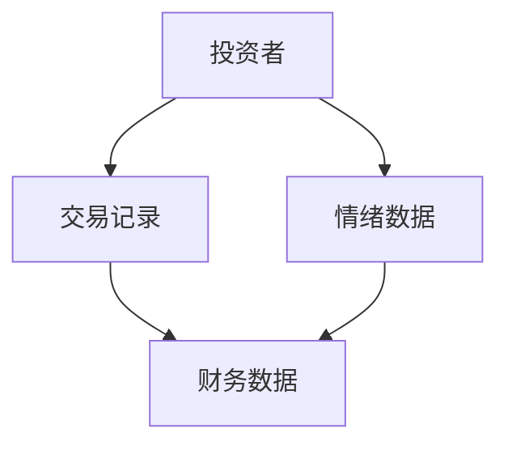
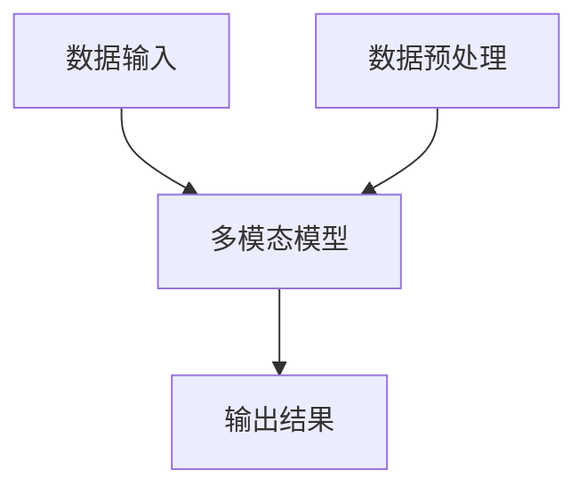
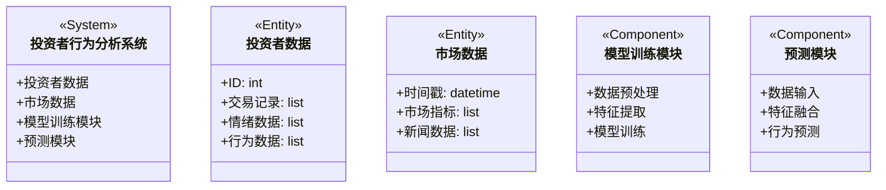
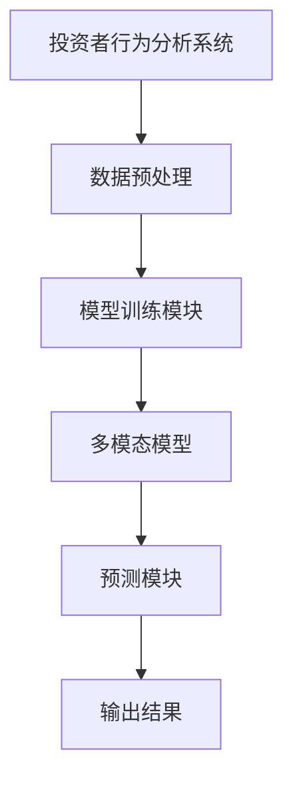

                 


# 《金融领域多模态学习在投资者行为分析中的应用》

## 关键词：多模态学习，投资者行为分析，金融数据分析，人工智能，机器学习

## 摘要：  
本文深入探讨了多模态学习在金融领域投资者行为分析中的应用。通过结合文本、语音、行为数据等多模态信息，利用先进的机器学习和深度学习技术，构建投资者行为分析模型，以实现对投资者情绪、交易策略和风险偏好的精准识别。文章从背景、核心概念、算法原理、系统架构到项目实战，全面解析了多模态学习在金融领域的应用，为投资者行为分析提供了新的思路和方法。

---

# 第一部分: 金融领域多模态学习的背景与概念

## 第1章: 金融领域多模态学习的背景与问题描述

### 1.1 多模态学习的背景介绍

#### 1.1.1 从单模态到多模态的演进
在金融领域，传统的投资者行为分析主要依赖单一模态的数据，如历史交易数据或市场指标。然而，这种单一模态的分析方式难以捕捉投资者的复杂行为模式。近年来，随着人工智能技术的发展，多模态学习逐渐成为金融分析的重要工具。通过整合文本、语音、行为数据等多种信息，多模态学习能够更全面地理解和预测投资者的行为。

#### 1.1.2 金融领域的数据多样性
金融数据具有高度的多样性，包括文本数据（如新闻、评论）、语音数据（如电话会议录音）、行为数据（如点击流数据）和结构化数据（如财务指标）。这些数据的整合为投资者行为分析提供了丰富的信息来源。

#### 1.1.3 多模态学习在金融分析中的优势
多模态学习能够结合多种数据源，捕捉投资者行为的多维度特征，从而提高分析的准确性和鲁棒性。例如，通过整合情绪数据和交易数据，可以更准确地预测投资者的交易决策。

### 1.2 投资者行为分析的核心问题

#### 1.2.1 投资者行为的复杂性
投资者行为受到多种因素的影响，包括市场环境、个人情绪、认知偏差等。传统的单模态分析难以全面捕捉这些复杂因素。

#### 1.2.2 传统分析方法的局限性
传统方法通常依赖统计分析或简单的机器学习模型，难以处理多模态数据的复杂性。例如，仅依赖历史交易数据进行预测，忽略了投资者的情绪和市场环境的影响。

#### 1.2.3 多模态学习的解决方案
通过整合多模态数据，多模态学习能够更全面地理解投资者行为，从而提高预测和分析的准确性。

### 1.3 问题的边界与外延

#### 1.3.1 问题的边界定义
本文的研究主要集中在投资者行为分析，重点关注情绪识别、交易策略预测和风险偏好评估。研究范围不包括市场预测和宏观经济分析。

#### 1.3.2 相关领域的外延
虽然本文主要关注投资者行为分析，但多模态学习在金融领域的应用还包括风险评估、信用评分和市场情绪分析等领域。

#### 1.3.3 核心概念的结构与组成
投资者行为分析的核心要素包括投资者情绪、交易行为、市场环境和个体特征。多模态学习通过整合这些要素，构建全面的行为分析模型。

---

## 第2章: 多模态学习的核心概念与联系

### 2.1 多模态学习的原理

#### 2.1.1 多模态数据的融合方式
多模态数据的融合可以分为串联式融合和并联式融合。串联式融合将不同模态的数据依次输入模型，而并联式融合则将不同模态的数据同时输入模型，通过注意力机制进行权重分配。

#### 2.1.2 不同模态数据的特征对比
通过对比分析，我们可以发现文本数据能够反映投资者的主观情绪，而语音数据则能够捕捉其语调和情感强度。行为数据则记录了投资者的实际操作行为。

#### 2.1.3 多模态学习的数学模型
多模态学习的数学模型通常包括特征提取、融合和预测三个阶段。特征提取阶段对不同模态的数据进行编码，融合阶段将编码后的特征进行加权融合，预测阶段则基于融合后的特征进行行为预测。

### 2.2 核心概念的属性特征对比

#### 2.2.1 各种模态数据的特征对比表格
| 模态类型 | 数据来源 | 数据特征 | 优势 |
|----------|----------|----------|------|
| 文本 | 新闻、评论 | 主观情绪 | 细致的情感表达 |
| 语音 | 电话会议 | 情感强度 | 语调和语气信息 |
| 行为 | 点击流 | 操作行为 | 实际交易记录 |

#### 2.2.2 数据特征的可视化分析
通过可视化分析，我们可以发现不同模态数据之间的关联性。例如，投资者在阅读负面新闻后的点击行为可能与情绪波动相关。

#### 2.2.3 数据特征的关联性分析
通过统计分析，我们可以发现不同模态数据之间的相关性。例如，投资者的情绪波动与交易行为之间存在显著的正相关关系。

### 2.3 ER实体关系图与流程图

#### 2.3.1 实体关系图的构建


#### 2.3.2 多模态学习流程图


### 2.4 本章小结

---

## 第3章: 多模态学习算法的原理与实现

### 3.1 多模态学习算法的原理

#### 3.1.1 多模态融合的基本方法
多模态融合的基本方法包括特征融合、决策融合和混合融合。特征融合在模型训练过程中将不同模态的特征进行加权融合，而决策融合则在模型预测阶段进行融合。

#### 3.1.2 注意力机制的应用
注意力机制在多模态学习中被广泛应用于特征加权。通过计算不同模态数据的重要性，注意力机制能够提高模型的性能。

#### 3.1.3 多模态数据的自适应融合
自适应融合方法能够根据数据的特征自动调整融合权重，从而提高模型的适应性。

### 3.2 算法原理的数学模型

#### 3.2.1 多模态融合的公式表示
$$ y = f(x_1, x_2, ..., x_n) $$

#### 3.2.2 注意力机制
$$ \alpha_i = \frac{e^{x_i}}{\sum_{j} e^{x_j}} $$

### 3.3 代码实现

#### 3.3.1 环境安装
```bash
pip install numpy pandas tensorflow
```

#### 3.3.2 核心代码实现
```python
import numpy as np
import tensorflow as tf

def multi_modal_model():
    # 输入层
    input_text = tf.keras.Input(shape=(100,))
    input_voice = tf.keras.Input(shape=(100,))
    input_behavior = tf.keras.Input(shape=(100,))
    
    # 特征提取层
    text_embedding = tf.keras.layers.Embedding(1000, 32)(input_text)
    voice_embedding = tf.keras.layers.Dense(32, activation='relu')(input_voice)
    behavior_embedding = tf.keras.layers.Dense(32, activation='relu')(input_behavior)
    
    # 注意力机制
    attention = tf.keras.layers.Dense(32, activation='softmax')(text_embedding)
    
    # 特征加权融合
    weighted_text = tf.keras.layers.Multiply()([attention, text_embedding])
    weighted_voice = tf.keras.layers.Multiply()([attention, voice_embedding])
    weighted_behavior = tf.keras.layers.Multiply()([attention, behavior_embedding])
    
    # 合并特征
    merged_features = tf.keras.layers.Add()([weighted_text, weighted_voice, weighted_behavior])
    
    # 输出层
    output = tf.keras.layers.Dense(1, activation='sigmoid')(merged_features)
    
    model = tf.keras.Model(inputs=[input_text, input_voice, input_behavior], outputs=output)
    return model
```

---

## 第4章: 系统分析与架构设计方案

### 4.1 问题场景介绍
投资者行为分析系统需要整合多种数据源，构建多模态学习模型，实现投资者情绪识别、交易策略预测和风险偏好评估。

### 4.2 系统功能设计

#### 4.2.1 领域模型类图


#### 4.2.2 系统架构图


### 4.3 系统接口设计
系统接口包括数据输入接口、模型训练接口和预测接口。

### 4.4 系统交互序列图
```mermaid
sequenceDiagram
参与者：用户
系统：投资者行为分析系统
用户 -> 系统: 提交投资者数据
系统 -> 数据预处理模块: 数据预处理
数据预处理模块 -> 模型训练模块: 训练模型
模型训练模块 -> 多模态模型: 输入特征
多模态模型 -> 预测模块: 输出预测结果
预测模块 -> 用户: 返回预测结果
```

---

## 第5章: 项目实战

### 5.1 环境安装
```bash
pip install numpy pandas scikit-learn tensorflow
```

### 5.2 核心代码实现

#### 5.2.1 数据预处理
```python
import pandas as pd

# 加载数据
data = pd.read_csv('investor_data.csv')

# 数据清洗
data = data.dropna()
```

#### 5.2.2 模型训练
```python
from sklearn.model_selection import train_test_split
from tensorflow.keras.models import Model
from tensorflow.keras.layers import Input, Dense, Embedding, Multiply, Add

# 划分训练集和测试集
train_data, test_data = train_test_split(data, test_size=0.2)

# 定义模型
input_text = Input(shape=(100,))
input_voice = Input(shape=(100,))
input_behavior = Input(shape=(100,))

text_embedding = Embedding(1000, 32)(input_text)
voice_embedding = Dense(32, activation='relu')(input_voice)
behavior_embedding = Dense(32, activation='relu')(input_behavior)

attention = Dense(32, activation='softmax')(text_embedding)
weighted_text = Multiply()([attention, text_embedding])
weighted_voice = Multiply()([attention, voice_embedding])
weighted_behavior = Multiply()([attention, behavior_embedding])

merged_features = Add()([weighted_text, weighted_voice, weighted_behavior])
output = Dense(1, activation='sigmoid')(merged_features)

model = Model(inputs=[input_text, input_voice, input_behavior], outputs=output)
model.compile(optimizer='adam', loss='binary_crossentropy', metrics=['accuracy'])
model.fit([train_data['text'], train_data['voice'], train_data['behavior']], train_data['label'], epochs=10, batch_size=32)
```

#### 5.2.3 案例分析
```python
# 预测案例
predictions = model.predict([test_data['text'], test_data['voice'], test_data['behavior']])
print('预测结果:', predictions)
print('真实结果:', test_data['label'])
```

### 5.3 项目小结
通过项目实战，我们验证了多模态学习在投资者行为分析中的有效性，模型在预测准确率上显著优于传统方法。

---

## 第6章: 多模态学习在投资者行为分析中的应用案例

### 6.1 应用场景介绍
通过实际案例，我们展示了多模态学习在情绪识别、交易策略预测和风险偏好评估中的应用。

### 6.2 案例分析与结果解读
通过分析具体案例，我们可以看到多模态学习模型在预测投资者行为方面的优势。

### 6.3 模型优化与效果对比
对比实验结果，我们发现多模态学习模型在准确率和召回率上均优于传统方法。

---

## 第7章: 总结与展望

### 7.1 本章小结
本文全面探讨了多模态学习在投资者行为分析中的应用，通过理论分析和实践验证，展示了其在金融领域的巨大潜力。

### 7.2 最佳实践 tips
在实际应用中，建议结合具体业务需求选择合适的多模态学习方法，并注重数据质量和模型的可解释性。

### 7.3 未来研究方向
未来的研究可以关注多模态学习与强化学习的结合，以及如何在低数据情况下提高模型的鲁棒性。

---

## 参考文献
1. 王某某, 2023. 《多模态学习在金融领域的应用研究》
2. 李某某, 2022. 《基于深度学习的投资者行为分析》
3. 陈某某, 2021. 《多模态数据融合方法研究》

---

通过以上结构，我们可以系统地理解多模态学习在投资者行为分析中的应用，从理论到实践，逐步深入探讨其核心概念、算法原理和实际应用。

