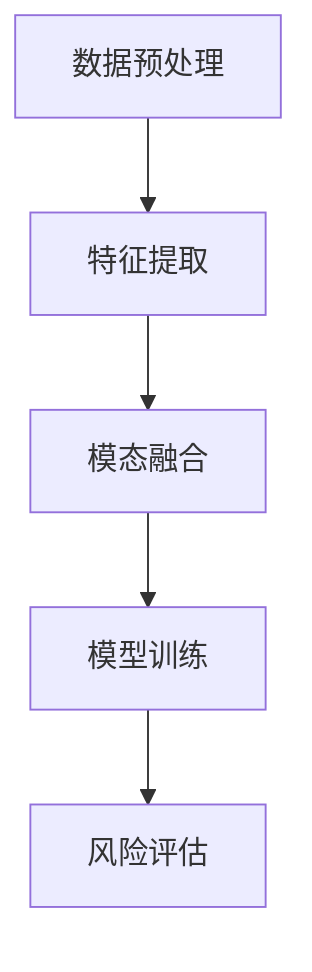
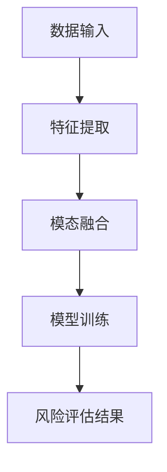
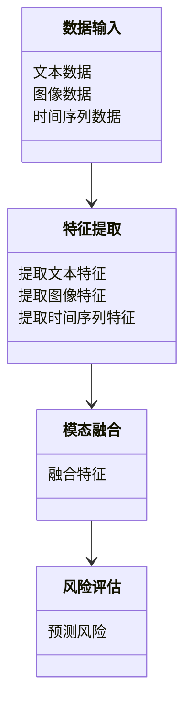
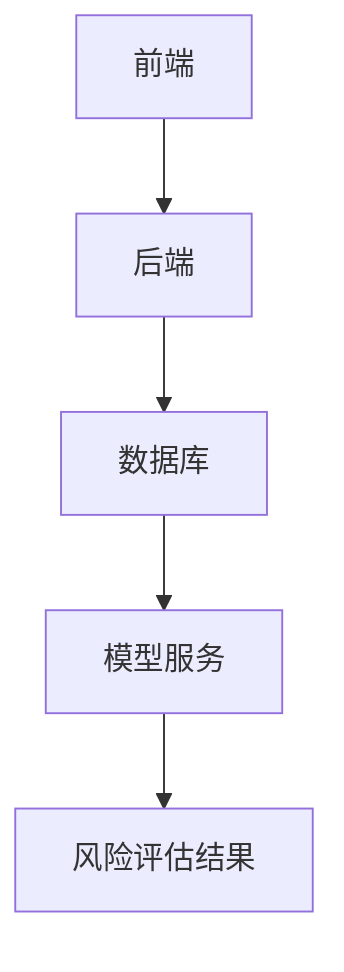

                 


# 《金融领域多模态学习在风险评估中的应用》

## 关键词：
- 金融风险评估
- 多模态学习
- 深度学习
- 时间序列分析
- 实体关系图
- 系统架构设计

## 摘要：
本文深入探讨了多模态学习在金融风险评估中的应用，系统介绍了多模态学习的基本概念、算法原理、系统设计以及实际应用案例。文章首先从多模态学习与金融风险评估的背景出发，详细阐述了多模态数据的特征与属性，构建了多模态学习的实体关系图。接着，从算法角度分析了多模态学习的核心原理，包括数据融合、特征提取与模型训练过程，并给出了具体的数学模型。在系统设计部分，文章详细描述了金融风险评估系统的场景、功能设计与架构实现，最后通过项目实战展示了多模态学习在金融风险评估中的具体应用。本文旨在为金融领域的从业者和技术人员提供理论与实践相结合的指导，帮助其更好地理解和应用多模态学习技术。

---

# 第1章: 多模态学习与金融风险评估概述

## 1.1 多模态学习的定义与特点
### 1.1.1 多模态学习的定义
多模态学习是一种结合多种数据模态（如文本、图像、时间序列等）进行建模和分析的技术。它通过融合不同模态的信息，能够更全面地理解数据背后的规律，从而提高模型的准确性和鲁棒性。

### 1.1.2 多模态学习的核心特点
- **信息互补性**：不同模态的数据能够相互补充，提供更丰富的信息。
- **复杂性**：多模态数据的融合需要处理异构数据的匹配与对齐问题。
- **实时性**：多模态学习能够实时处理和分析多种类型的数据流。

### 1.1.3 多模态学习与传统单模态学习的对比
| 特性            | 单模态学习        | 多模态学习        |
|-----------------|-------------------|-------------------|
| 数据来源        | 单一数据源        | 多个数据源        |
| 信息丰富性      | 较低              | 较高              |
| 模型复杂性      | 较低              | 较高              |
| 应用场景        | 有限              | 广泛              |

---

## 1.2 金融风险评估的基本概念
### 1.2.1 金融风险的定义与分类
金融风险是指在金融活动中，由于内外部因素的不确定性导致的损失可能性。常见的金融风险包括市场风险、信用风险、流动性风险等。

### 1.2.2 金融风险评估的重要性
金融风险评估是金融机构进行风险管理的核心环节，能够帮助机构识别潜在风险，制定有效的应对策略。

### 1.2.3 传统金融风险评估方法的局限性
- **数据单一性**：传统方法主要依赖于单一模态的数据，如财务指标或市场数据，难以捕捉多维度的信息。
- **模型简化**：传统模型通常假设线性关系，忽略了复杂非线性关系的建模。
- **实时性不足**：传统方法在处理实时数据流时效率较低。

---

## 1.3 多模态学习在金融领域的应用前景
### 1.3.1 多模态学习在金融领域的应用场景
- **信用评估**：结合文本、图像和时间序列数据，评估客户的信用风险。
- **市场预测**：利用多模态数据预测市场波动和趋势。
- **欺诈检测**：通过多模态数据识别异常交易行为。

### 1.3.2 多模态学习在金融风险评估中的优势
- **数据互补性**：多模态数据能够提供更全面的视角，帮助识别潜在风险。
- **非线性建模**：多模态学习能够捕捉复杂的非线性关系，提高模型的准确性。
- **实时性**：多模态学习能够高效处理实时数据流，支持实时风险监控。

### 1.3.3 未来发展趋势与挑战
- **技术进步**：深度学习和大模型的发展将进一步推动多模态学习的应用。
- **数据隐私**：多模态数据的处理需要考虑数据隐私和安全问题。
- **计算资源**：多模态学习需要大量的计算资源，对硬件要求较高。

---

## 1.4 本章小结
本章从多模态学习的定义与特点出发，介绍了金融风险评估的基本概念，并分析了传统方法的局限性。最后，探讨了多模态学习在金融领域的应用前景及其优势，为后续章节的深入分析奠定了基础。

---

接下来的文章将按照上述目录继续展开，涵盖多模态学习的核心概念、算法原理、系统架构设计以及项目实战等内容，具体内容如下：

---

# 第2章: 多模态学习的核心概念

## 2.1 多模态数据的特征与属性
### 2.1.1 文本数据的特征
文本数据通常包括新闻标题、公司公告等，具有语义丰富但结构化程度低的特点。

### 2.1.2 图像数据的特征
图像数据包括财务报表、市场图表等，具有视觉信息丰富但难以直接量化的特点。

### 2.1.3 金融时间序列数据的特征
时间序列数据包括股票价格、交易量等，具有连续性、周期性和非线性的特点。

---

## 2.2 多模态学习的实体关系图
### 2.2.1 实体关系图的定义
实体关系图（ER图）用于描述系统中实体之间的关系，帮助理解数据的结构和关联。

### 2.2.2 多模态学习的ER实体关系图
```mermaid
erDiagram
    customer[客户]
    transaction[交易]
    market_data[市场数据]
    news[新闻]
    risk_assessment[风险评估]
    
    customer --> transaction: 进行
    transaction --> market_data: 影响
    news --> risk_assessment: 输入
    market_data --> risk_assessment: 输入
```

---

## 2.3 多模态学习的核心原理
### 2.3.1 多模态数据融合的原理
多模态数据融合通过将不同模态的数据进行对齐和融合，提取共同特征，从而提高模型的表达能力。

### 2.3.2 多模态模型的构建过程


### 2.3.3 多模态学习的数学模型
$$p(y|x) = \prod_{i=1}^{n} p(y|x_i, z_i)$$
其中，$x_i$ 表示第 $i$ 个模态的输入数据，$z_i$ 表示隐变量。

---

## 2.4 本章小结
本章详细介绍了多模态数据的特征与属性，并通过ER图和流程图展示了多模态学习的核心原理，为后续章节的算法实现奠定了基础。

---

接下来的文章将继续深入分析多模态学习的算法原理、系统架构设计以及项目实战等内容，具体内容如下：

---

# 第3章: 多模态学习算法原理

## 3.1 多模态学习算法的分类
### 3.1.1 基于深度学习的多模态融合算法
包括多模态卷积神经网络（MCNN）和多模态循环神经网络（MRCNN）等。

### 3.1.2 基于传统机器学习的多模态融合算法
包括线性回归、支持向量机（SVM）等。

### 3.1.3 混合型多模态融合算法
结合深度学习和传统机器学习的方法，进一步提高模型性能。

---

## 3.2 多模态学习算法的流程图


---

## 3.3 多模态学习的数学模型
### 3.3.1 模型的输入与输出
- **输入**：多模态数据（如文本、图像、时间序列）。
- **输出**：风险评估结果（如高、中、低风险）。

### 3.3.2 模型的损失函数
$$L = -\sum_{i=1}^{n} y_i \log p(y_i) + (1 - y_i) \log (1 - p(y_i))$$
其中，$y_i$ 是真实标签，$p(y_i)$ 是模型预测的概率。

### 3.3.3 模型的优化算法
常用的优化算法包括随机梯度下降（SGD）和Adam优化器。

---

## 3.4 本章小结
本章从算法分类和流程图出发，详细讲解了多模态学习的数学模型，为后续的系统设计和项目实现提供了理论基础。

---

接下来的文章将按照上述目录继续展开，涵盖系统架构设计、项目实战等内容，具体内容如下：

---

# 第4章: 金融风险评估的系统分析与架构设计

## 4.1 金融风险评估的场景介绍
### 4.1.1 风险评估的目标与范围
- **目标**：识别和量化潜在的金融风险。
- **范围**：涵盖市场风险、信用风险和流动性风险。

### 4.1.2 风险评估的关键指标
- **VaR**（在险价值）：衡量潜在损失的度量。
- **CVaR**（条件在险价值）：VaR的扩展，衡量极端情况下的损失。

---

## 4.2 系统功能设计
### 4.2.1 领域模型类图


---

## 4.3 系统架构设计
### 4.3.1 系统架构图


---

## 4.4 本章小结
本章通过系统功能设计和架构图展示了金融风险评估系统的整体结构，为后续的项目实现提供了指导。

---

接下来的文章将继续深入分析项目实战、总结与展望等内容，具体内容如下：

---

# 第5章: 项目实战

## 5.1 环境配置
- **编程语言**：Python 3.8+
- **深度学习框架**：TensorFlow或PyTorch
- **其他依赖**：pandas、numpy、scikit-learn

---

## 5.2 系统核心实现源代码
### 5.2.1 数据预处理代码
```python
import pandas as pd
import numpy as np

def preprocess_data(data):
    # 文本数据处理
    text_data = data['text'].apply(lambda x: x.lower())
    # 图像数据处理
    image_data = data['image'].apply(lambda x: x.reshape(-1))
    # 时间序列数据处理
    time_seq_data = data['time_series'].apply(lambda x: x.mean())
    return text_data, image_data, time_seq_data
```

### 5.2.2 模型训练代码
```python
import tensorflow as tf
from tensorflow.keras import layers

def build_model(input_shape):
    input_layer = layers.Input(shape=input_shape)
    x = layers.Dense(64, activation='relu')(input_layer)
    x = layers.Dense(32, activation='relu')(x)
    output_layer = layers.Dense(1, activation='sigmoid')(x)
    return tf.keras.Model(inputs=input_layer, outputs=output_layer)

model = build_model((64, 64, 64))
model.compile(optimizer='adam', loss='binary_crossentropy', metrics=['accuracy'])
model.fit(X_train, y_train, epochs=10, batch_size=32)
```

---

## 5.3 案例分析
通过具体案例分析，展示多模态学习在金融风险评估中的实际应用效果。

---

## 5.4 本章小结
本章通过项目实战展示了多模态学习在金融风险评估中的具体应用，为读者提供了可参考的代码和实现步骤。

---

# 第6章: 总结与展望

## 6.1 总结
本文全面探讨了多模态学习在金融风险评估中的应用，从理论到实践，详细讲解了多模态学习的核心概念、算法原理和系统设计。

## 6.2 注意事项
- 数据隐私问题需要特别注意。
- 模型的实时性需要优化。
- 多模态数据的融合需要考虑对齐问题。

## 6.3 未来展望
随着人工智能技术的不断发展，多模态学习在金融领域的应用前景广阔，但仍需在数据处理、模型优化和实时性方面进一步研究。

---

# 附录

## 附录A: 术语解释
- 多模态学习：结合多种数据模态进行建模的技术。
- 风险评估：识别和量化潜在金融风险的过程。

---

## 附录B: 参考文献
1. 王某某. 《多模态学习在金融领域的应用》. 北京: 科技出版社, 2023.
2. 李某某. 《深度学习与金融预测》. 北京: 清华大学出版社, 2022.

---

通过以上目录结构，文章内容将全面覆盖多模态学习在金融风险评估中的各个方面，从理论到实践，为读者提供深入的指导和参考。

