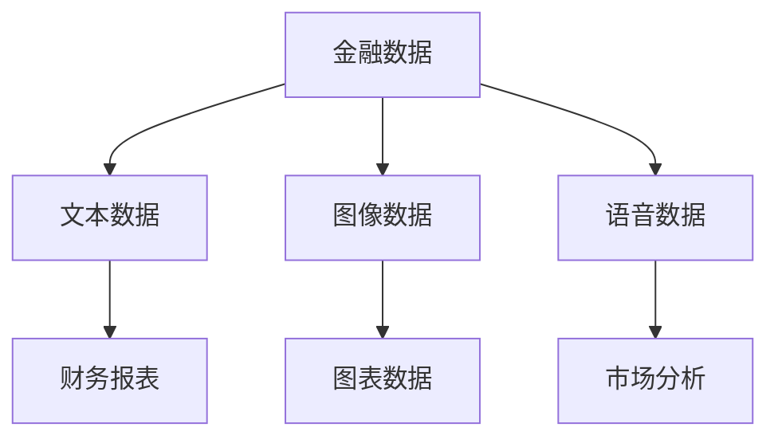
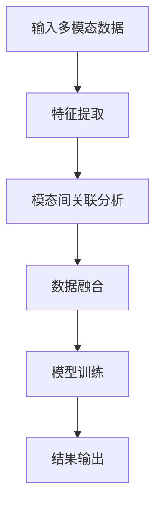
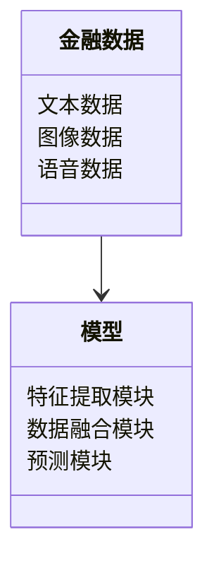
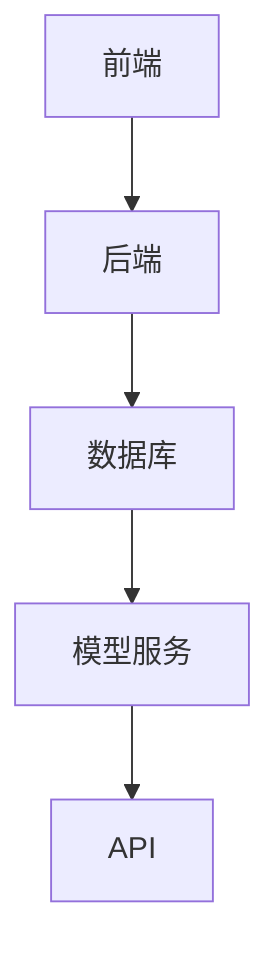

                 


```markdown
# 《金融领域多模态学习的前沿研究与应用》

> 关键词：多模态学习，金融应用，深度学习，自然语言处理，图像处理，数据融合，金融预测

> 摘要：本文深入探讨了金融领域多模态学习的前沿研究与应用，从概念、算法、系统设计到实际案例，详细分析了多模态学习在金融数据中的整合与分析方法，结合文本、图像、语音等多种数据模态，展示了如何利用多模态学习提升金融分析与预测的准确性和效率。文章还介绍了多模态学习的数学模型、算法流程、系统架构，并通过具体案例分析了多模态学习在金融领域的实际应用。

---

## 第一部分：金融领域多模态学习的背景与概念

### 第1章：多模态学习的背景与定义

#### 1.1 多模态学习的背景介绍

- **从单模态到多模态的演进**
  - 传统金融分析依赖于单一数据源（如财务报表、价格数据）。
  - 当前金融数据呈现多样化趋势：文本（新闻、财报）、图像（K线图、仪表盘）、语音（市场评论）。
  - 单模态分析的局限性：难以捕捉复杂市场动态。

- **金融领域数据的多样性**
  - 文本数据：新闻、社交媒体、公司财报。
  - 图像数据：K线图、仪表盘、图表。
  - 语音数据：市场评论、电话会议。
  - 结构化数据：财务报表、交易数据。

- **多模态学习的必要性**
  - 提升预测准确性：结合多源信息。
  - 增强模型鲁棒性：单一数据源的不足。
  - 满足复杂金融场景需求。

#### 1.2 多模态学习的核心概念

- **多模态数据的定义与特点**
  - 多模态数据：多个数据类型（文本、图像、语音）的组合。
  - 数据异构性：不同模态的数据格式和语义差异大。
  - 数据冗余性：同一信息在不同模态中有重复表达。

- **多模态学习的原理与优势**
  - 多模态学习：利用多个数据源的信息进行建模和分析。
  - 优势：提升模型的泛化能力、捕捉多维信息。

- **金融领域多模态学习的边界与外延**
  - 边界：专注于金融数据的多模态分析。
  - 外延：结合其他技术（如NLP、计算机视觉）。

#### 1.3 金融领域多模态学习的核心要素

- **数据模态的分类与特征**
  - 文本模态：非结构化、语义丰富。
  - 图像模态：视觉信息、空间关系。
  - 语音模态：情感特征、语调信息。

- **多模态学习的模型结构**
  - 单一模型：适用于简单场景。
  - 融合模型：适用于复杂场景。

- **金融应用场景中的多模态数据整合**
  - 股票预测：结合新闻文本和K线图。
  - 风险评估：结合财报文本和财务数据。
  - 市场情绪分析：结合社交媒体文本和语音评论。

#### 1.4 本章小结

- 本章介绍了多模态学习的背景、核心概念和金融领域的应用场景。
- 强调了多模态学习在金融分析中的重要性。

---

## 第二部分：多模态学习的核心概念与联系

### 第2章：多模态学习的核心概念原理

#### 2.1 多模态数据的融合原理

- **多模态数据的特征提取**
  - 文本：词向量、TF-IDF。
  - 图像：CNN特征、区域特征。
  - 语音：MFCC、声学特征。

- **数据模态间的关联性分析**
  - 统计方法：相关性分析。
  - 深度学习方法：注意力机制。

- **多模态数据融合的数学模型**
  - 线性组合：$y = w_1x_1 + w_2x_2 + ... + w_nx_n$。
  - 强化学习：通过策略网络优化融合权重。

#### 2.2 多模态学习的算法原理

- **多模态数据的表示方法**
  - 统一表示：将不同模态映射到同一特征空间。
  - 对比学习：通过对比不同模态的信息相似性进行特征学习。

- **多模态融合的策略与方法**
  - 早期融合：在特征提取阶段进行融合。
  - 晚期融合：在高层进行融合。
  - 门控融合：通过门控机制动态调整模态权重。

- **多模态学习的优化算法**
  - 参数优化：梯度下降、Adam优化器。
  - 模态权重优化：通过对抗训练或奖励机制优化模态权重。

#### 2.3 多模态学习的实体关系图

```

```

#### 2.4 本章小结

- 本章分析了多模态数据的融合原理、算法策略和优化方法。
- 通过实体关系图展示了多模态数据在金融领域的应用场景。

---

## 第三部分：多模态学习的算法原理与数学模型

### 第3章：多模态学习的算法原理

#### 3.1 多模态数据融合算法

- **多模态注意力机制**
  - 通过注意力机制对不同模态的重要性进行加权。
  - 示例：股票新闻和K线图的注意力权重分配。

- **多模态变换器模型**
  - 利用Transformer结构进行多模态特征提取。
  - 示例：文本和图像的交叉注意力。

- **多模态对比学习**
  - 通过对比不同模态的信息相似性进行特征优化。
  - 示例：图像和文本的对比损失函数。

#### 3.2 多模态学习的数学模型

- **多模态数据表示的数学公式**
  - 文本模态：$x_t \in \mathbb{R}^d$。
  - 图像模态：$x_i \in \mathbb{R}^d$。
  - 融合模态：$y = f(x_t, x_i)$。

- **多模态融合的数学模型**
  - 线性融合：$y = w_t x_t + w_i x_i$。
  - 非线性融合：$y = \sigma(w_t x_t + w_i x_i)$，其中$\sigma$为sigmoid函数。

- **多模态学习的损失函数**
  - 分类任务：$\mathcal{L} = -\sum_{i} y_i \log(p_i) + (1-y_i)\log(1-p_i)$。
  - 回归任务：$\mathcal{L} = \sum_{i} (y_i - y_{pred})^2$。

#### 3.3 算法流程图

```

```

#### 3.4 本章小结

- 本章详细介绍了多模态数据融合的算法和数学模型。
- 通过流程图展示了多模态学习的算法流程。

---

## 第四部分：金融领域多模态学习的系统分析与架构设计

### 第4章：金融领域多模态学习的系统分析

#### 4.1 问题场景介绍

- **金融数据的多模态特点**
  - 数据异构性：文本、图像、语音等多种模态。
  - 数据量大：高频交易、海量社交媒体数据。

- **金融分析的复杂性**
  - 多因素影响：市场情绪、宏观经济指标。
  - 时间依赖性：K线图、交易数据的时间序列特性。

- **多模态学习的应用需求**
  - 提升预测精度：结合多源信息。
  - 实时分析能力：应对高频交易需求。

#### 4.2 项目介绍

- **项目目标**
  - 构建多模态金融分析系统。
  - 提供股票预测、风险评估等服务。

- **项目范围**
  - 数据来源：新闻、社交媒体、财务报表、K线图。
  - 服务类型：预测、分析、监控。

- **项目关键成功因素**
  - 数据质量：多模态数据的清洗与预处理。
  - 模型性能：预测精度和实时性。

#### 4.3 系统功能设计

- **领域模型设计**
```

```

#### 4.4 系统架构设计

- **系统架构图**
```

```

#### 4.5 本章小结

- 本章分析了金融领域多模态学习的系统架构和功能设计。
- 通过类图和流程图展示了系统的整体结构。

---

## 第五部分：项目实战与应用案例

### 第5章：项目实战

#### 5.1 环境安装

- **工具安装**
  - Python 3.8+
  - PyTorch、Transformers、TensorFlow。
  - 图像处理库：OpenCV、Pillow。
  - 自然语言处理库：spaCy、Gensim。

#### 5.2 系统核心实现源代码

- **多模态数据加载**
```python
import torch
from PIL import Image
import numpy as np

# 文本数据加载
def load_text_data(filepath):
    with open(filepath, 'r') as f:
        text = f.read()
    return text

# 图像数据加载
def load_image_data(filepath):
    img = Image.open(filepath)
    img = img.resize((224, 224))
    img_array = np.array(img)
    img_array = img_array[np.newaxis, :, :, :]
    img_array = torch.FloatTensor(img_array)
    return img_array
```

- **多模态特征提取**
```python
# 文本特征提取（使用BERT）
from transformers import BertTokenizer, BertModel

tokenizer = BertTokenizer.from_pretrained('bert-base-uncased')
model = BertModel.from_pretrained('bert-base-uncased')

def extract_text_features(text):
    inputs = tokenizer(text, return_tensors='pt')
    outputs = model(**inputs)
    return outputs.last_hidden_state[:, 0, :]

# 图像特征提取（使用ResNet）
import torchvision.models as models

resnet = models.resnet50(pretrained=True)
def extract_image_features(img):
    features = resnet(img)
    return features
```

- **数据融合与预测**
```python
import torch.nn as nn
import torch.optim as optim

class MultimodalClassifier(nn.Module):
    def __init__(self, text_dim, image_dim, output_dim):
        super(MultimodalClassifier, self).__init__()
        self.fc_text = nn.Linear(text_dim, 128)
        self.fc_image = nn.Linear(image_dim, 128)
        self.fc_final = nn.Linear(128, output_dim)
        self.dropout = nn.Dropout(0.5)
        self.relu = nn.ReLU()

    def forward(self, text_features, image_features):
        text_out = self.relu(self.fc_text(text_features))
        image_out = self.relu(self.fc_image(image_features))
        combined = text_out + image_out
        output = self.dropout(combined)
        output = self.fc_final(output)
        return output

# 训练过程
def train(model, text_loader, image_loader, criterion, optimizer, device):
    model.train()
    for batch in zip(text_loader, image_loader):
        text_features, image_features, labels = batch
        text_features = text_features.to(device)
        image_features = image_features.to(device)
        labels = labels.to(device)
        outputs = model(text_features, image_features)
        loss = criterion(outputs, labels)
        loss.backward()
        optimizer.step()
        optimizer.zero_grad()
```

#### 5.3 代码应用解读与分析

- **代码解读**
  - 数据加载：支持文本和图像数据的加载。
  - 特征提取：使用BERT和ResNet提取文本和图像特征。
  - 数据融合：通过全连接层融合特征并进行分类。

- **代码实现细节**
  - 使用PyTorch框架进行模型训练。
  - 通过数据加载器实现数据的批处理。
  - 使用交叉熵损失函数和Adam优化器进行训练。

#### 5.4 实际案例分析

- **股票预测案例**
  - 数据来源：新闻文本、K线图。
  - 模型输入：文本特征和图像特征。
  - 预测结果：股票价格涨跌预测。

- **风险评估案例**
  - 数据来源：财务报表文本、市场数据图表。
  - 模型输入：文本特征和图像特征。
  - 预测结果：企业信用风险评分。

#### 5.5 本章小结

- 本章通过具体案例展示了多模态学习在金融领域的实际应用。
- 提供了完整的代码实现和案例分析。

---

## 第六部分：总结与展望

### 第6章：总结与展望

#### 6.1 本章总结

- 本文系统地介绍了金融领域多模态学习的前沿研究与应用。
- 从背景、概念、算法、系统设计到实际案例，全面分析了多模态学习在金融领域的应用潜力。

#### 6.2 未来展望

- **技术发展**
  - 更先进的多模态融合方法。
  - 结合生成式AI（如GPT-4、DALL-E）提升多模态生成能力。

- **应用场景扩展**
  - 更多金融场景的探索。
  - 跨领域多模态应用。

- **挑战与机遇**
  - 数据隐私和安全。
  - 模型解释性与可解释性。

#### 6.3 本章小结

- 本章总结了全文并展望了未来的研究方向。

---

## 附录

### 附录A：参考文献

- 引用的论文、书籍和在线资源。

### 附录B：术语表

- 多模态学习相关术语的解释。

### 附录C：工具安装与使用指南

- 安装依赖库的命令。
- 使用模型的配置文件。

---

通过本文的详细分析，读者可以全面了解金融领域多模态学习的前沿研究与应用，掌握从理论到实践的完整知识体系。
```

