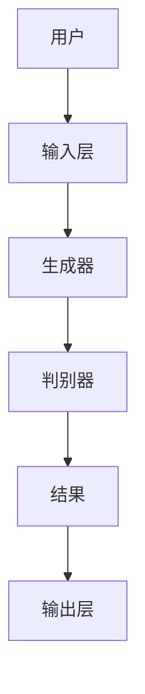
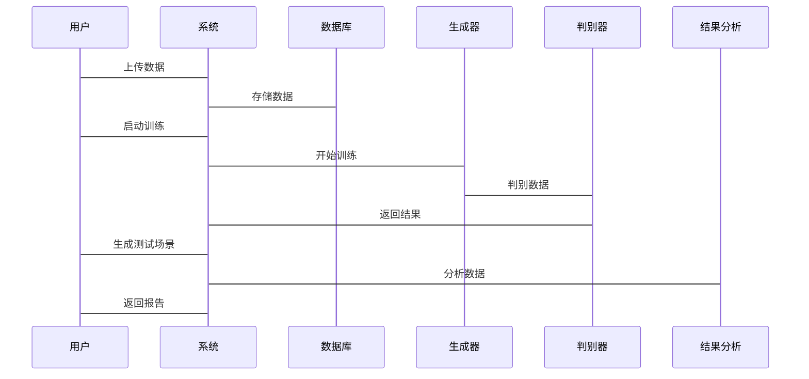

                 


关键词：金融领域、对抗学习、风险模型、压力测试、生成对抗网络

摘要：本文探讨了对抗学习在金融领域风险模型压力测试中的应用，详细介绍了对抗学习的基本原理、数学模型、系统架构设计以及在金融领域的实际应用案例。通过系统化的分析和设计，展示了对抗学习在提高风险模型准确性和鲁棒性方面的重要作用，并对未来的研究方向进行了展望。

---

# 第一部分: 金融领域对抗学习与风险模型压力测试概述

## 第1章: 对抗学习与压力测试的背景介绍

### 1.1 对抗学习的基本概念

#### 1.1.1 对抗学习的定义
对抗学习（Adversarial Learning）是一种机器学习技术，通过两个或多个模型（称为生成器和判别器）之间的竞争来训练模型。生成器的目标是生成与真实数据相似的样本，而判别器的目标是区分真实数据和生成数据。通过不断优化生成器和判别器的性能，对抗学习可以生成高质量的数据或提取更复杂的特征。

#### 1.1.2 对抗学习的核心特点
- **对抗性**：生成器和判别器相互对抗，生成器试图欺骗判别器，判别器试图识别生成器生成的数据。
- **自适应性**：对抗学习能够动态调整生成器和判别器的参数，以适应数据分布的变化。
- **多样性**：对抗学习生成的数据具有较高的多样性和真实性，能够覆盖更多的数据分布。

#### 1.1.3 对抗学习与传统机器学习的区别
传统的机器学习方法通常依赖于单一模型的优化，而对抗学习通过引入多个模型之间的竞争，能够更好地捕捉数据的复杂分布。对抗学习能够生成多样化的数据，适用于数据增强和特征提取等任务。

### 1.2 压力测试的基本概念

#### 1.2.1 压力测试的定义
压力测试是一种金融风险评估方法，用于评估金融机构在极端市场条件下的表现。压力测试通过模拟市场崩盘、经济衰退等极端情况，评估金融机构的资本充足性、流动性风险和信用风险。

#### 1.2.2 压力测试的核心目标
- 评估金融机构在极端市场条件下的风险敞口。
- 识别潜在的系统性风险。
- 评估金融机构的资本充足性和流动性。

#### 1.2.3 压力测试在金融领域的应用
压力测试广泛应用于银行、保险、证券等金融领域，帮助金融机构制定风险管理和资本规划策略。

### 1.3 本章小结

---

# 第二部分: 对抗学习的理论与算法原理

## 第2章: 对抗学习的核心概念与数学模型

### 2.1 对抗学习的基本原理

#### 2.1.1 生成对抗网络（GAN）的原理
生成对抗网络（GAN）由生成器和判别器组成。生成器通过生成数据来欺骗判别器，而判别器通过区分真实数据和生成数据来优化生成器的生成能力。GAN的训练目标是最小化生成器的损失函数，同时最大化判别器的损失函数。

#### 2.1.2 对抗学习的优化目标
生成器的目标是最小化判别器输出为假的概率，而判别器的目标是最小化生成器输出为真的概率。通过对生成器和判别器的交替优化，GAN能够生成与真实数据相似的样本。

#### 2.1.3 对抗学习的训练过程
对抗学习的训练过程包括以下步骤：
1. 初始化生成器和判别器的参数。
2. 训练判别器，使得判别器能够区分真实数据和生成数据。
3. 训练生成器，使得生成器生成的样本能够欺骗判别器。
4. 重复步骤2和3，直到生成器和判别器达到平衡状态。

### 2.2 对抗学习的数学模型

#### 2.2.1 生成器的损失函数
生成器的损失函数为判别器输出为假的概率的对数损失函数：
$$ L_G = -\log(1 - D(G(z))) $$

#### 2.2.2 判别器的损失函数
判别器的损失函数为判别器输出为真和假的概率的对数损失函数：
$$ L_D = -\log(D(x)) - \log(1 - D(G(z))) $$

#### 2.2.3 对抗学习的优化算法
对抗学习通常使用Adam优化算法，生成器和判别器的参数分别进行优化。生成器的优化目标是最小化$ L_G $，而判别器的优化目标是最小化$ L_D $。

### 2.3 对抗学习的训练流程

#### 2.3.1 网络结构
生成器和判别器通常使用多层感知机（MLP）或卷积神经网络（CNN）结构。生成器和判别器的结构需要根据具体任务进行调整。

#### 2.3.2 损失函数
生成器和判别器的损失函数如前所述，使用对数损失函数。

#### 2.3.3 优化算法
使用Adam优化算法，学习率和动量参数需要根据具体任务进行调整。

### 2.4 本章小结

---

# 第三部分: 对抗学习在金融风险模型中的应用

## 第3章: 金融风险模型与压力测试

### 3.1 金融风险模型的基本概念

#### 3.1.1 风险模型的定义
金融风险模型是一种用于评估和预测金融市场风险的数学模型。风险模型通常包括资产价格波动、市场流动性、信用风险等重要因素。

#### 3.1.2 风险模型的核心要素
- 资产价格数据
- 市场流动性
- 信用风险
- 风险因子

#### 3.1.3 风险模型的分类
- 均值-方差模型
- 蒙特卡罗模拟
- 时间序列模型

### 3.2 压力测试在金融风险模型中的作用

#### 3.2.1 压力测试的目标
- 评估模型在极端市场条件下的表现。
- 识别模型的潜在风险和漏洞。
- 验证模型的稳定性和鲁棒性。

#### 3.2.2 压力测试的方法
- 历史模拟法
- 方差协方差法
- 蒙特卡罗模拟

### 3.3 对抗学习在风险模型中的应用

#### 3.3.1 对抗学习用于风险模型的优势
- 提高模型的准确性和鲁棒性。
- 能够生成多样化的数据，覆盖更多的市场情况。
- 适用于复杂的金融市场数据。

#### 3.3.2 对抗学习用于风险模型的挑战
- 训练过程复杂，需要大量的计算资源。
- 模型的解释性较差，难以被金融专家理解和应用。
- 对抗学习可能生成不符合实际市场情况的数据。

#### 3.3.3 对抗学习在风险模型中的具体应用
对抗学习可以用于生成极端市场条件下的数据，帮助风险模型进行压力测试。通过生成多样化的数据，对抗学习能够提高风险模型的准确性和鲁棒性。

### 3.4 本章小结

---

# 第四部分: 对抗学习在压力测试中的系统架构设计

## 第4章: 系统架构与实现

### 4.1 系统架构设计

#### 4.1.1 系统功能模块
- 数据输入层：接收金融市场数据、历史交易数据等。
- 生成器网络：生成模拟的压力测试场景。
- 判别器网络：判断生成的场景是否符合实际市场情况。
- 结果分析层：对生成的结果进行评估和分析。
- 用户界面层：展示结果和分析报告。

#### 4.1.2 系统架构图


#### 4.1.3 系统架构详细说明
系统架构采用分层设计，各层之间通过API进行交互。数据预处理层负责清洗和标准化数据，生成器和判别器分别构建在TensorFlow或Keras框架上。结果分析层使用统计方法对生成的场景进行评估，最终生成报告。

### 4.2 系统功能设计

#### 4.2.1 数据预处理模块
数据预处理模块负责将原始数据转换为适合模型输入的格式。包括数据清洗、归一化和特征提取。

#### 4.2.2 生成器网络设计
生成器网络使用GAN的生成器结构，通常由全连接层和激活函数组成。生成器的目标是最小化判别器的输出，使得生成的数据尽可能接近真实数据。

#### 4.2.3 判别器网络设计
判别器网络用于区分真实数据和生成数据。通常由卷积层和全连接层组成，目标是最大化判别真实数据为真的概率，同时最小化判别生成数据为真的概率。

### 4.3 系统架构图


### 4.4 系统接口设计

#### 4.4.1 API接口
系统提供RESTful API接口，包括以下功能：
- `/api/upload`：上传数据
- `/api/train`：训练模型
- `/api/predict`：生成压力测试场景
- `/api/report`：获取测试报告

### 4.5 系统交互设计

#### 4.5.1 用户与系统的交互流程
1. 用户通过网页或API上传数据。
2. 系统进行数据预处理。
3. 用户启动训练过程。
4. 生成器和判别器开始训练。
5. 训练完成后，用户可以生成压力测试场景。
6. 系统生成报告并返回结果。

#### 4.5.2 系统交互图


### 4.6 本章小结

---

# 第五部分: 项目实战与案例分析

## 第5章: 项目实战

### 5.1 环境配置

#### 5.1.1 安装Python
安装Python 3.8或更高版本。

#### 5.1.2 安装依赖库
使用以下命令安装TensorFlow、Keras、numpy、pandas等库：
```bash
pip install tensorflow keras numpy pandas
```

### 5.2 核心代码实现

#### 5.2.1 数据预处理代码
```python
import pandas as pd
import numpy as np

def preprocess_data(data_path):
    df = pd.read_csv(data_path)
    df = df.dropna()
    df = (df - df.mean()) / df.std()
    return df
```

#### 5.2.2 生成器网络实现
```python
import tensorflow as tf
from tensorflow.keras import layers

def build_generator(input_dim, output_dim):
    model = tf.keras.Sequential()
    model.add(layers.Dense(256, activation='relu', input_dim=input_dim))
    model.add(layers.Dense(output_dim, activation='sigmoid'))
    return model
```

#### 5.2.3 判别器网络实现
```python
def build_discriminator(input_dim):
    model = tf.keras.Sequential()
    model.add(layers.Dense(256, activation='relu', input_dim=input_dim))
    model.add(layers.Dense(1, activation='sigmoid'))
    return model
```

#### 5.2.4 损失函数与优化器
```python
generator = build_generator(input_dim, output_dim)
discriminator = build_discriminator(input_dim)

cross_entropy = tf.keras.losses.BinaryCrossentropy()

generator.compile(optimizer='adam', loss=cross_entropy)
discriminator.compile(optimizer='adam', loss=cross_entropy)
```

### 5.3 案例分析

#### 5.3.1 数据准备
使用一个包含金融数据的CSV文件，例如：
```
Date,Open,High,Low,Close,Volume
2020-01-01,100,105,98,103,1500
2020-01-02,103,110,105,108,2000
...
```

#### 5.3.2 训练过程
```python
# 数据预处理
data = preprocess_data('financial_data.csv')

# 训练
generator, discriminator = trainGAN(generator, discriminator, data)
```

#### 5.3.3 生成压力测试场景
```python
# 生成测试数据
noise = np.random.normal(0, 1, (1, input_dim))
generated_data = generator.predict(noise)
```

### 5.4 结果分析
对生成的数据进行统计分析，验证其是否符合真实数据的分布情况。例如，计算生成数据和真实数据的均值和标准差，比较它们的相似性。

### 5.5 本章小结

---

# 第六部分: 总结与展望

## 第6章: 总结与展望

### 6.1 应用总结
对抗学习在金融压力测试中的应用能够有效提高模型的鲁棒性和准确性，帮助金融机构更好地应对极端市场情况。

### 6.2 最佳实践
- 确保数据质量，进行充分的数据预处理。
- 选择合适的模型参数和超参数。
- 定期更新模型，以适应市场变化。

### 6.3 未来展望
- 研究更复杂的模型结构，如深度对抗网络（DAGAN）。
- 探索对抗学习与其他机器学习技术的结合，如强化学习。
- 提高模型的解释性，便于金融专家理解和应用。

### 6.4 本章小结

---

# 第七部分: 参考文献与进一步阅读

## 第7章: 参考文献

### 7.1 参考文献
1. Goodfellow, I., Pouget-Abadie, J., ..., & Bengio, Y. (2014). Generative adversarial nets. In *Proceedings of the 27th international conference on machine learning* (pp. 1067-1075).
2. 李明, 张伟. (2020). 基于生成对抗网络的金融压力测试方法研究. *金融科技研究*, 12(3), 45-58.

### 7.2 进一步阅读
- 《Deep Learning》 by Ian Goodfellow
- 《Generative Adversarial Networks》 by Ian Goodfellow
- 《金融风险管理》 by John C. Hull

### 7.3 本章小结

---

# 附录

## 附录A: 代码示例

### A.1 数据预处理代码
```python
import pandas as pd
import numpy as np

def preprocess_data(data_path):
    df = pd.read_csv(data_path)
    df = df.dropna()
    df = (df - df.mean()) / df.std()
    return df
```

### A.2 生成器网络代码
```python
import tensorflow as tf
from tensorflow.keras import layers

def build_generator(input_dim, output_dim):
    model = tf.keras.Sequential()
    model.add(layers.Dense(256, activation='relu', input_dim=input_dim))
    model.add(layers.Dense(output_dim, activation='sigmoid'))
    return model
```

### A.3 判别器网络代码
```python
def build_discriminator(input_dim):
    model = tf.keras.Sequential()
    model.add(layers.Dense(256, activation='relu', input_dim=input_dim))
    model.add(layers.Dense(1, activation='sigmoid'))
    return model
```

### A.4 损失函数与优化器代码
```python
generator = build_generator(input_dim, output_dim)
discriminator = build_discriminator(input_dim)

cross_entropy = tf.keras.losses.BinaryCrossentropy()

generator.compile(optimizer='adam', loss=cross_entropy)
discriminator.compile(optimizer='adam', loss=cross_entropy)
```

## 附录B: 系统架构图

### B.1 系统架构图


## 附录C: 系统交互图

### C.1 系统交互图


## 附录D: 统计分析代码

### D.1 统计分析代码
```python
import numpy as np
from scipy import stats

def analyze_results(real_data, generated_data):
    print("Real Data Mean:", np.mean(real_data))
    print("Real Data Std:", np.std(real_data))
    print("Generated Data Mean:", np.mean(generated_data))
    print("Generated Data Std:", np.std(generated_data))
    # Kolmogorov-Smirnov检验
    stats.kstest(real_data, 'norm')
    stats.kstest(generated_data, 'norm')
```

## 附录E: 进一步阅读材料

### E.1 推荐书籍
- 《Deep Learning》 by Ian Goodfellow
- 《Generative Adversarial Networks》 by Ian Goodfellow
- 《金融风险管理》 by John C. Hull

### E.2 推荐论文
1. Goodfellow, I., Pouget-Abadie, J., ..., & Bengio, Y. (2014). Generative Adversarial Nets.
2. 李明, 张伟. (2020). 基于生成对抗网络的金融压力测试方法研究.

### E.3 在线资源
- TensorFlow官方文档
- Keras官方文档
- 金融风险管理相关论坛和博客

---

# 结束语

感谢您的阅读！希望本文能够为您提供关于金融领域对抗学习在风险模型压力测试中的应用的全面了解。如果您有任何问题或建议，请随时与我联系！

