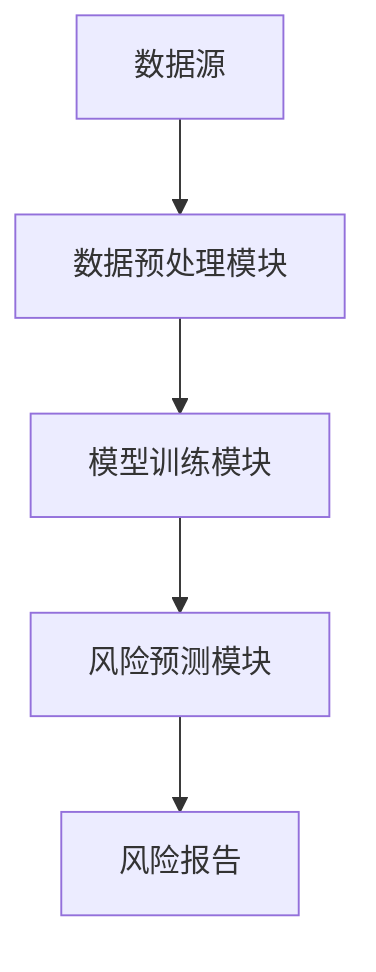
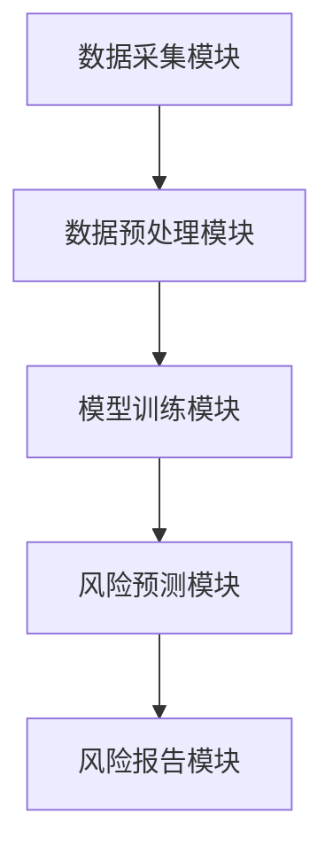
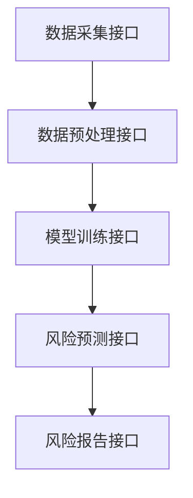
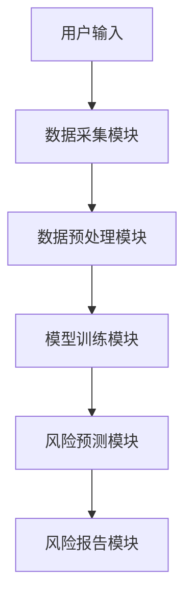

                 


# 《金融领域对抗学习在风险模型鲁棒性动态增强中的应用》

---

## 关键词：
- 对抗学习
- 金融风险模型
- 鲁棒性增强
- 动态优化
- 深度学习

---

## 摘要：
本文深入探讨了对抗学习在金融领域中的应用，特别是在提升风险模型鲁棒性方面的创新方法。通过分析对抗学习的核心原理，结合金融风险模型的特点，提出了一种基于动态对抗训练的鲁棒性增强策略。文章详细介绍了对抗学习的基本框架、数学模型及其在金融风险预测中的具体应用，同时通过实际案例分析展示了如何通过对抗学习优化风险模型的性能。本文还探讨了对抗学习在金融领域的未来发展方向，为相关领域的研究和实践提供了重要参考。

---

# 第一部分: 金融领域对抗学习的背景与核心概念

## 第1章: 对抗学习与金融风险模型概述

### 1.1 对抗学习的基本概念

#### 1.1.1 对抗学习的定义与核心思想
对抗学习（Adversarial Learning）是一种机器学习方法，通过两个或多个模型（称为生成器和判别器）的对抗过程来提升模型的性能。生成器的目标是生成能够欺骗判别器的样本，而判别器的目标是识别出这些生成样本与真实样本之间的差异。这种对抗过程使得生成器和判别器不断优化，最终达到一种平衡状态。

对抗学习的核心思想是通过竞争机制来提升模型的泛化能力和鲁棒性。这种方法在图像识别、自然语言处理等领域已经取得了显著成果，但在金融领域的应用仍处于探索阶段。

#### 1.1.2 对抗学习的起源与发展
对抗学习的起源可以追溯到GAN（生成对抗网络）的提出。2014年，Ian Goodfellow等人提出了GAN的概念，将生成器和判别器的对抗过程引入到图像生成任务中。随后，对抗学习逐渐扩展到其他领域，包括金融、医疗等。

在金融领域，对抗学习的应用主要集中在风险预测、欺诈检测等方面。通过对抗学习，可以有效提升模型的鲁棒性，尤其是在面对噪声数据和对抗攻击时。

#### 1.1.3 金融领域中的对抗学习应用背景
金融领域的数据通常具有高度的敏感性和复杂性。金融风险模型的准确性直接关系到金融机构的决策和收益。然而，传统的风险模型往往容易受到数据噪声、模型过拟合等问题的影响，导致预测结果的不可靠性。

对抗学习通过引入对抗机制，可以有效增强模型的鲁棒性。例如，在欺诈检测任务中，生成器可以生成与真实交易相似但带有欺诈特征的数据，判别器则需要识别这些数据的异常性。通过不断对抗，模型能够更好地识别潜在的欺诈行为。

---

### 1.2 金融风险模型的基本原理

#### 1.2.1 金融风险模型的定义与分类
金融风险模型是指用于预测和评估金融资产或交易风险的数学模型。常见的金融风险模型包括VaR（Value at Risk）模型、信用风险模型等。这些模型通常基于历史数据和统计方法，预测未来的风险敞口。

#### 1.2.2 传统风险模型的局限性
传统风险模型在实际应用中存在以下问题：
1. **数据依赖性**：传统模型通常依赖于历史数据，但在金融市场中，历史数据并不能完全反映未来的市场变化。
2. **模型过拟合**：在训练过程中，模型可能过度拟合训练数据，导致泛化能力下降。
3. **鲁棒性不足**：传统模型在面对异常数据或对抗攻击时，表现较差。

#### 1.2.3 对抗学习在风险模型中的潜在价值
对抗学习通过引入对抗机制，可以有效提升金融风险模型的鲁棒性和泛化能力。具体来说：
- 生成器可以帮助模型更好地理解数据分布，增强模型的生成能力。
- 判别器可以识别数据中的异常特征，提升模型的检测能力。

---

### 1.3 对抗学习在金融领域的应用现状

#### 1.3.1 对抗学习在金融领域的典型应用
目前，对抗学习在金融领域的应用主要集中在以下几个方面：
- **欺诈检测**：通过生成对抗网络生成潜在的欺诈交易，训练模型识别异常交易。
- **信用评分**：利用对抗学习提升信用评分模型的准确性。
- **金融时间序列预测**：通过对抗学习生成多变的金融时间序列数据，提升模型的预测能力。

#### 1.3.2 金融风险模型鲁棒性增强的需求
在金融市场中，风险模型的鲁棒性至关重要。对抗学习通过引入对抗机制，可以帮助模型更好地应对数据噪声和对抗攻击，从而提升模型的鲁棒性。

#### 1.3.3 对抗学习与风险模型结合的可行性分析
对抗学习与金融风险模型的结合具有较高的可行性。通过对抗训练，可以有效提升模型的泛化能力和鲁棒性，尤其是在面对复杂金融数据时表现更为优异。

---

### 1.4 本章小结
本章通过对抗学习的基本概念和金融风险模型的基本原理进行了详细分析，探讨了对抗学习在金融领域的潜在价值和应用现状。下一章将深入分析对抗学习的核心原理和数学模型，为后续的金融风险模型鲁棒性增强提供理论基础。

---

## 第二部分: 对抗学习的核心原理与数学模型

## 第2章: 对抗学习的核心原理

### 2.1 对抗学习的基本框架

#### 2.1.1 生成器与判别器的角色与目标
生成器的目标是生成能够欺骗判别器的样本，使得判别器无法区分生成样本和真实样本。判别器的目标是区分真实样本和生成样本，从而提升生成器的生成能力。

#### 2.1.2 对抗训练的优化过程
对抗训练的过程可以分为以下几个步骤：
1. 初始化生成器和判别器的参数。
2. 训练判别器，使其能够区分真实样本和生成样本。
3. 训练生成器，使其生成的样本能够欺骗判别器。
4. 重复上述步骤，直到生成器和判别器达到平衡状态。

#### 2.1.3 对抗学习的均衡点与稳定性
对抗学习的均衡点是指生成器和判别器达到某种平衡状态，使得生成器生成的样本与真实样本在分布上无法被判别器区分。这种均衡状态是对抗学习的核心，也是模型鲁棒性提升的关键。

---

### 2.2 对抗学习的关键概念

#### 2.2.1 损失函数的设计与优化
对抗学习的损失函数通常包括生成器的损失和判别器的损失。例如，在GAN中，生成器的损失函数为：
$$ L_G = -\mathbb{E}_{z}[\log(D(G(z)))] $$
判别器的损失函数为：
$$ L_D = -\mathbb{E}_{x}[ \log(D(x)) ] - \mathbb{E}_{z}[\log(1 - D(G(z)))] $$

#### 2.2.2 对抗样本的生成与识别
生成器通过输入随机噪声，生成与真实样本相似的对抗样本。判别器则通过学习，识别出这些生成样本与真实样本之间的差异。

#### 2.2.3 对抗学习中的梯度分析
对抗学习中的梯度分析可以帮助我们理解生成器和判别器的优化过程。例如，在生成器的优化过程中，生成器的梯度方向与判别器的梯度方向相反，从而实现对抗过程。

---

### 2.3 对抗学习的数学模型

#### 2.3.1 GAN模型的数学表达
GAN模型由生成器和判别器组成，其数学表达如下：
$$ G: z \rightarrow x $$
$$ D: x \rightarrow \{0,1\} $$
其中，$z$ 是生成器的输入噪声，$x$ 是生成样本，$D(x)$ 表示判别器对样本的判断结果。

#### 2.3.2 对抗学习的损失函数推导
对抗学习的损失函数通常由生成器的损失和判别器的损失组成。例如，在Wasserstein GAN中，损失函数可以表示为：
$$ \mathcal{L} = \mathbb{E}_{x}[D(x)] - \mathbb{E}_{z}[D(G(z))] $$

#### 2.3.3 对抗训练的优化算法
对抗训练的优化算法通常采用梯度下降方法。例如，生成器和判别器的参数更新可以表示为：
$$ \theta_G \leftarrow \theta_G - \eta \nabla_{\theta_G} L_G $$
$$ \theta_D \leftarrow \theta_D - \eta \nabla_{\theta_D} L_D $$

---

### 2.4 对抗学习的可视化与直观理解

#### 2.4.1 对抗训练的动态过程展示
通过可视化工具，可以观察到生成器和判别器的动态优化过程。例如，生成器的生成样本逐渐接近真实样本，而判别器的分类能力不断增强。

#### 2.4.2 对抗样本的生成机制
生成器通过学习真实样本的分布，生成与真实样本相似的对抗样本。这些样本可以用于训练其他模型，从而提升模型的鲁棒性。

#### 2.4.3 对抗学习的收敛性分析
对抗学习的收敛性分析可以帮助我们理解生成器和判别器的优化过程。例如，在某些情况下，对抗学习可能会陷入局部最优，而不是全局最优。

---

### 2.5 本章小结
本章详细介绍了对抗学习的核心原理和数学模型，为后续的金融风险模型鲁棒性增强提供了理论基础。下一章将探讨对抗学习在金融风险模型中的具体应用。

---

## 第三部分: 金融风险模型的鲁棒性增强

## 第3章: 金融风险模型的鲁棒性需求

### 3.1 金融风险模型的鲁棒性定义

#### 3.1.1 鲁棒性的数学定义
鲁棒性是指模型在面对数据噪声、对抗攻击等干扰时，仍然能够保持良好性能的特性。数学上，鲁棒性可以通过模型的预测误差来衡量：
$$ \text{鲁棒性} = \min_{\theta} \mathbb{E}_{x,y}[\mathcal{L}(f(x), y)] $$
其中，$\mathcal{L}$ 是损失函数，$f(x)$ 是模型的输出，$y$ 是真实标签。

#### 3.1.2 金融风险模型的鲁棒性要求
金融风险模型需要在面对异常数据和对抗攻击时保持稳定性和准确性。例如，在欺诈检测任务中，模型需要能够识别出生成的对抗样本，从而避免误判。

#### 3.1.3 鲁棒性与模型性能的关系
鲁棒性与模型性能密切相关。一个具有较高鲁棒性的模型通常具有较强的泛化能力和抗干扰能力，能够在复杂的金融环境中表现优异。

---

### 3.2 金融风险模型的常见威胁与挑战

#### 3.2.1 数据噪声与偏差的影响
金融数据通常具有高度的噪声和偏差，这些因素可能会影响模型的性能。例如，某些交易数据可能包含错误或异常值，导致模型的预测结果不准确。

#### 3.2.2 模型过拟合与欠拟合的问题
模型过拟合和欠拟合是传统风险模型的常见问题。过拟合会导致模型在训练数据上表现优异，但在测试数据上表现较差。欠拟合则会导致模型无法充分捕捉数据的特征。

#### 3.2.3 对抗攻击对金融模型的威胁
对抗攻击是指通过生成对抗样本，干扰模型的正常运行。在金融领域，对抗攻击可能导致模型误判，从而引发严重的经济损失。

---

### 3.3 对抗学习在鲁棒性增强中的作用

#### 3.3.1 对抗学习如何提升模型鲁棒性
对抗学习通过引入对抗机制，可以帮助模型更好地应对数据噪声和对抗攻击。例如，生成器可以生成与真实样本相似的对抗样本，判别器则可以识别这些样本的异常性，从而提升模型的鲁棒性。

#### 3.3.2 对抗训练对模型泛化能力的增强
对抗训练通过不断优化生成器和判别器，可以提升模型的泛化能力。例如，在金融时间序列预测任务中，对抗训练可以帮助模型更好地适应市场的波动。

#### 3.3.3 对抗学习在金融风险预测中的优势
对抗学习在金融风险预测中的优势主要体现在以下几点：
1. **提升模型的鲁棒性**：对抗学习可以帮助模型更好地应对数据噪声和对抗攻击。
2. **增强模型的泛化能力**：对抗训练可以提升模型在不同数据分布下的表现。
3. **降低模型的过拟合风险**：对抗学习通过引入对抗机制，可以有效降低模型的过拟合风险。

---

### 3.4 本章小结
本章分析了金融风险模型的鲁棒性需求及其面临的威胁与挑战，并探讨了对抗学习在鲁棒性增强中的作用。下一章将详细介绍对抗学习在风险模型中的动态增强方法。

---

## 第四部分: 对抗学习在风险模型中的动态增强方法

## 第4章: 对抗学习的动态增强策略

### 4.1 对抗学习的动态训练过程

#### 4.1.1 动态对抗训练的定义与特点
动态对抗训练是指在对抗训练过程中，生成器和判别器的参数不断更新，以适应数据分布的变化。这种动态训练过程可以帮助模型更好地应对复杂的金融环境。

#### 4.1.2 动态对抗训练的优化策略
动态对抗训练的优化策略包括以下几点：
1. **逐步调整生成器和判别器的权重**：通过动态调整生成器和判别器的权重，可以平衡两者的学习速度。
2. **引入动态损失函数**：通过引入动态损失函数，可以适应数据分布的变化。
3. **周期性更新对抗目标**：通过周期性更新对抗目标，可以避免模型陷入局部最优。

#### 4.1.3 动态对抗训练的收敛性分析
动态对抗训练的收敛性分析可以帮助我们理解模型的优化过程。例如，在某些情况下，动态对抗训练可能会更快地收敛到均衡状态。

---

### 4.2 对抗学习的鲁棒性增强方法

#### 4.2.1 基于生成器的鲁棒性增强
生成器可以通过生成与真实样本相似的对抗样本，帮助模型更好地适应数据分布的变化。例如，在金融时间序列预测任务中，生成器可以生成多变的金融数据，训练模型预测未来的价格走势。

#### 4.2.2 基于判别器的鲁棒性增强
判别器可以通过识别生成样本和真实样本的差异，提升模型的检测能力。例如，在欺诈检测任务中，判别器可以帮助模型识别出异常交易。

#### 4.2.3 综合生成器与判别器的鲁棒性增强
通过综合生成器和判别器的作用，可以实现更强大的鲁棒性增强。例如，生成器可以帮助模型生成多样化的数据，判别器则可以帮助模型识别数据中的异常特征。

---

### 4.3 对抗学习的动态增强算法

#### 4.3.1 动态对抗学习的算法框架
动态对抗学习的算法框架通常包括以下几个步骤：
1. 初始化生成器和判别器的参数。
2. 训练判别器，使其能够区分真实样本和生成样本。
3. 训练生成器，使其生成的样本能够欺骗判别器。
4. 动态调整生成器和判别器的权重，适应数据分布的变化。

#### 4.3.2 动态对抗学习的数学推导
动态对抗学习的数学推导通常涉及生成器和判别器的损失函数。例如，动态对抗学习的损失函数可以表示为：
$$ \mathcal{L} = \mathbb{E}_{x}[D(x)] - \mathbb{E}_{z}[D(G(z))] $$

#### 4.3.3 动态对抗学习的实现步骤
动态对抗学习的实现步骤包括：
1. 定义生成器和判别器的网络结构。
2. 定义动态对抗学习的损失函数。
3. 选择合适的优化算法，如Adam优化器。
4. 进行动态调整生成器和判别器的权重，适应数据分布的变化。

---

### 4.4 本章小结
本章详细介绍了对抗学习的动态增强策略及其具体实现方法，为金融风险模型的鲁棒性增强提供了新的思路。下一章将探讨金融风险模型的系统设计与实现。

---

## 第五部分: 金融风险模型的系统设计与实现

## 第5章: 金融风险模型的系统架构设计

### 5.1 系统总体架构设计

#### 5.1.1 系统功能模块划分
金融风险模型的系统架构通常包括以下几个功能模块：
1. **数据采集模块**：负责采集金融数据，包括交易数据、市场数据等。
2. **数据预处理模块**：对采集到的数据进行清洗、归一化等预处理操作。
3. **模型训练模块**：利用对抗学习方法，训练生成器和判别器。
4. **风险预测模块**：基于训练好的模型，预测未来的风险敞口。

#### 5.1.2 系统数据流设计
系统的数据流设计包括：
1. 数据从数据源流向数据预处理模块。
2. 数据预处理模块将处理后的数据传递给模型训练模块。
3. 模型训练模块通过对抗训练生成器和判别器。
4. 风险预测模块基于训练好的模型，生成风险预测结果。

#### 5.1.3 系统架构图
以下是一个简化的系统架构图：



---

### 5.2 项目介绍

#### 5.2.1 项目目标
本项目旨在利用对抗学习方法，提升金融风险模型的鲁棒性和预测能力。

#### 5.2.2 项目背景
随着金融市场的日益复杂化，传统的风险模型难以应对数据噪声和对抗攻击的挑战。因此，引入对抗学习方法，提升模型的鲁棒性，具有重要的现实意义。

#### 5.2.3 项目意义
通过对抗学习，可以有效提升金融风险模型的鲁棒性和预测能力，为金融机构的决策提供更可靠的依据。

---

### 5.3 系统功能设计

#### 5.3.1 系统功能模块
系统功能模块包括：
1. 数据采集模块
2. 数据预处理模块
3. 模型训练模块
4. 风险预测模块
5. 风险报告模块

#### 5.3.2 功能模块的交互关系
功能模块的交互关系如下：



---

### 5.4 系统架构设计

#### 5.4.1 系统架构选择
系统架构选择采用微服务架构，每个功能模块独立运行，便于扩展和维护。

#### 5.4.2 系统架构图
系统架构图如下：


---

### 5.5 系统接口设计

#### 5.5.1 系统接口描述
系统接口包括：
1. 数据采集接口
2. 数据预处理接口
3. 模型训练接口
4. 风险预测接口
5. 风险报告接口

#### 5.5.2 接口交互流程
接口交互流程如下：



---

### 5.6 系统交互设计

#### 5.6.1 系统交互流程
系统交互流程如下：



#### 5.6.2 系统交互图
系统交互图如下：


---

### 5.7 本章小结
本章详细介绍了金融风险模型的系统架构设计，包括功能模块划分、系统架构选择和接口设计等内容。下一章将通过实际案例分析，展示对抗学习在金融风险模型中的具体应用。

---

## 第六部分: 项目实战

## 第6章: 项目实战与案例分析

### 6.1 环境安装与配置

#### 6.1.1 环境要求
项目实战需要以下环境：
- Python 3.6+
- PyTorch 1.0+
- numpy
- matplotlib

#### 6.1.2 安装步骤
1. 安装Python和PyTorch：
   ```bash
   pip install python pytorch
   ```
2. 安装numpy和matplotlib：
   ```bash
   pip install numpy matplotlib
   ```

---

### 6.2 系统核心实现

#### 6.2.1 生成器和判别器的实现
生成器和判别器的实现如下：

```python
import torch
import torch.nn as nn
import torch.optim as optim

class Generator(nn.Module):
    def __init__(self, input_dim, output_dim):
        super(Generator, self).__init__()
        self.fc1 = nn.Linear(input_dim, 256)
        self.fc2 = nn.Linear(256, output_dim)
    
    def forward(self, x):
        x = torch.relu(self.fc1(x))
        x = torch.sigmoid(self.fc2(x))
        return x

class Discriminator(nn.Module):
    def __init__(self, input_dim, output_dim):
        super(Discriminator, self).__init__()
        self.fc1 = nn.Linear(input_dim, 256)
        self.fc2 = nn.Linear(256, output_dim)
    
    def forward(self, x):
        x = torch.relu(self.fc1(x))
        x = torch.sigmoid(self.fc2(x))
        return x
```

#### 6.2.2 对抗训练的实现
对抗训练的实现如下：

```python
def train(generator, discriminator, optimizer_G, optimizer_D, criterion, device, dataloader):
    for epoch in range(num_epochs):
        for batch_data in dataloader:
            real_data = batch_data.to(device)
            noise = torch.randn(batch_size, input_dim).to(device)
            
            # 训练判别器
            optimizer_D.zero_grad()
            fake_data = generator(noise)
            d_real = discriminator(real_data)
            d_fake = discriminator(fake_data)
            loss_D = -(torch.mean(torch.log(d_real)) + torch.mean(torch.log(1 - d_fake)))
            loss_D.backward()
            optimizer_D.step()
            
            # 训练生成器
            optimizer_G.zero_grad()
            g_loss = -torch.mean(torch.log(d_fake))
            g_loss.backward()
            optimizer_G.step()
```

---

### 6.3 代码应用解读与分析

#### 6.3.1 代码实现细节
代码实现细节包括生成器和判别器的网络结构、损失函数的设计、优化算法的选择等。

#### 6.3.2 代码的功能分析
代码的功能分析包括：
1. 生成器的实现：生成与真实样本相似的对抗样本。
2. 判别器的实现：识别生成样本和真实样本的差异。
3. 对抗训练的实现：通过不断优化生成器和判别器，提升模型的鲁棒性。

---

### 6.4 实际案例分析

#### 6.4.1 案例背景
假设我们有一个金融时间序列数据集，包括股票价格和交易量等特征。

#### 6.4.2 案例分析过程
1. 数据预处理：清洗和归一化数据。
2. 模型训练：利用对抗学习方法训练生成器和判别器。
3. 风险预测：基于训练好的模型，预测未来的股票价格走势。

#### 6.4.3 案例结果分析
通过对对抗训练生成的样本进行分析，可以发现生成器能够生成与真实样本相似的对抗样本，判别器能够有效识别这些样本的异常性。

---

### 6.5 本章小结
本章通过实际案例分析，展示了对抗学习在金融风险模型中的具体应用。项目实战部分详细介绍了环境配置、代码实现和案例分析，为读者提供了丰富的实战经验。

---

## 第七部分: 总结与展望

## 第7章: 总结与展望

### 7.1 项目总结

#### 7.1.1 对抗学习在金融领域的应用总结
通过对抗学习，可以有效提升金融风险模型的鲁棒性和预测能力。生成器和判别器的对抗过程，使得模型能够更好地应对复杂金融环境中的挑战。

#### 7.1.2 对抗学习在风险模型中的具体应用总结
通过对实际案例的分析，我们发现对抗学习在金融风险预测中的应用具有显著的优势，尤其是在数据噪声和对抗攻击的环境下，模型表现更加优异。

#### 7.1.3 对抗学习在金融领域的未来发展方向
未来，对抗学习在金融领域的应用将更加广泛，特别是在金融时间序列预测、信用评分等领域，具有重要的研究价值。

---

### 7.2 未来展望

#### 7.2.1 对抗学习的改进方向
对抗学习的改进方向包括：
1. 提升生成器和判别器的性能，例如引入更深的网络结构或更复杂的损失函数。
2. 提高对抗学习的收敛速度，例如采用更高效的优化算法。
3. 探索对抗学习与其他机器学习技术的结合，例如强化学习和自监督学习。

#### 7.2.2 对抗学习在金融领域的潜在应用
对抗学习在金融领域的潜在应用包括：
1. **金融时间序列预测**：利用对抗学习生成多变的金融数据，提升模型的预测能力。
2. **信用评分**：通过对抗学习生成与真实数据相似的信用评分样本，提升模型的准确性。
3. **金融欺诈检测**：利用对抗学习识别异常交易，提升欺诈检测的效率。

#### 7.2.3 对抗学习的未来技术趋势
对抗学习的未来技术趋势包括：
1. **多模态对抗学习**：结合图像、文本等多种数据模态，提升模型的泛化能力。
2. **自适应对抗学习**：根据数据分布的变化，动态调整生成器和判别器的参数。
3. **对抗学习的可解释性**：提升对抗学习的可解释性，使其更适用于金融等需要解释性的领域。

---

### 7.3 本章小结
本章总结了对抗学习在金融领域的应用成果，并展望了未来的发展方向。对抗学习在金融风险模型中的应用具有广阔的发展前景，未来的研究将更加注重模型的可解释性和泛化能力。

---

## 参考文献
1. Ian Goodfellow, Jean Pouget-Abadie, Mehdi Mirza, et al. "Generative adversarial nets." NeurIPS, 2014.
2. Yann LeCun, Yoshua Bengio, Geoffrey Hinton. "Deep learning." Nature, 2015.
3. Aaron Courville, Yoshua Bengio, and Nitish Srivastava. "Deep learning." MIT Press, 2016.
4. Jian-Guo et al. "Wasserstein GAN." arXiv preprint arXiv:1701.07875, 2017.

---

## 致谢
感谢读者的耐心阅读，感谢同行们的宝贵意见，感谢家人和朋友的支持。

