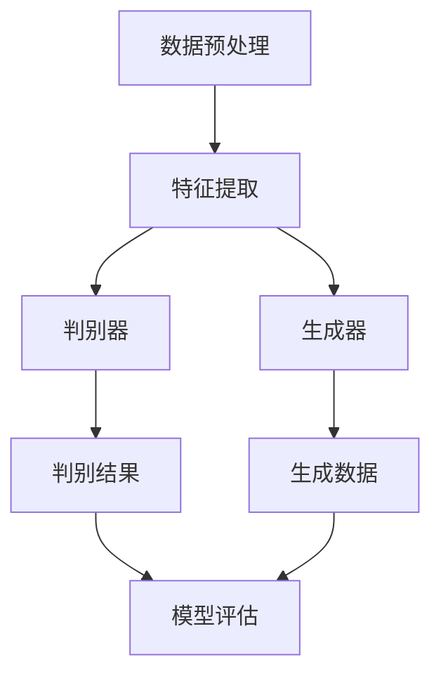

                 


# 《金融领域对抗学习的研究与应用》

> 关键词：金融领域，对抗学习，生成对抗网络，深度学习，风险管理

> 摘要：本文探讨了对抗学习在金融领域的研究与应用，分析了对抗学习的基本原理、算法实现、系统架构设计，并通过实际案例展示了对抗学习在金融数据生成、风险评估、欺诈检测等方面的应用价值。文章还总结了对抗学习在金融领域的优势与挑战，并展望了未来的发展方向。

---

## 第一部分：引言

### 第1章：对抗学习的研究背景与意义

#### 1.1 对抗学习的基本概念
- **定义**：对抗学习是一种机器学习技术，通过两个或多个模型（称为生成器和判别器）之间的对抗过程，生成高质量的数据或优化模型性能。
- **核心思想**：生成器的目标是欺骗判别器，使其无法区分真实数据和生成数据；判别器的目标是识别数据的来源（真实或生成）。
- **与传统机器学习的区别**：传统机器学习通过优化单个目标函数完成任务，而对抗学习通过双人博弈的方式实现模型优化。

#### 1.2 对抗学习的研究背景
- **机器学习的发展历程**：从监督学习到无监督学习，再到生成式模型的发展。
- **对抗学习的起源与演变**：源于深度学习领域的生成对抗网络（GAN）的提出，逐渐扩展到多种对抗学习框架。
- **金融领域对对抗学习的需求**：金融数据通常具有小样本、噪声多、分布复杂等特点，对抗学习能够生成高质量数据，提升模型的泛化能力。

#### 1.3 对抗学习在金融领域的应用价值
- **解决金融问题**：对抗学习可以用于金融数据分析、风险评估、欺诈检测等场景。
- **提升模型性能**：通过生成合成数据，对抗学习可以弥补金融数据不足的问题，提高模型的鲁棒性。
- **创新金融工具**：对抗学习可以用于生成模拟市场数据，辅助金融决策。

---

## 第二部分：对抗学习的核心概念与联系

### 第2章：对抗学习的原理与数学模型

#### 2.1 对抗学习的数学模型
- **生成器和判别器的数学表达**：
  - 生成器：$G$，目标是最小化判别器输出$D(G(x))$。
  - 判别器：$D$，目标是最大化区分真实数据$x$和生成数据$G(x)$。
- **损失函数**：
  - 判别器的损失：$L_D = -\mathbb{E}[\log D(x) + \log(1-D(G(x)))]$
  - 生成器的损失：$L_G = -\mathbb{E}[\log D(G(x))]$
- **联合优化目标**：$\min_{G}\max_{D} L_D + L_G$

#### 2.2 对抗学习与生成对抗网络（GAN）的关系
- **GAN的结构**：由生成器和判别器组成，通过交替训练优化两个模型。
- **对抗学习的扩展**：对抗学习不仅限于GAN，还包括其他形式，如分类器-生成器对抗网络（CGAN）、条件生成对抗网络（cGAN）等。

#### 2.3 对抗学习的核心概念对比
- **对比表格**：
| 概念 | 对抗学习 | 传统机器学习 |
|------|----------|--------------|
| 目标 | 双模型博弈 | 单一目标函数优化 |
| 数据 | 可生成合成数据 | 需要真实标签数据 |
| 应用 | 数据增强、模型鲁棒性 | 分类、回归 |

### 第3章：对抗学习的算法实现

#### 3.1 对抗网络的构建
- **生成器网络**：通常使用卷积神经网络（CNN）或全连接网络生成数据。
- **判别器网络**：通常使用CNN识别数据的真伪。

#### 3.2 对抗训练的步骤
1. **初始化参数**：随机初始化生成器$G$和判别器$D$的参数。
2. **训练判别器**：输入真实数据$x$和生成数据$G(x)$，优化判别器参数，使其能够区分真实数据和生成数据。
3. **训练生成器**：输入噪声$z$，生成数据$G(z)$，优化生成器参数，使其欺骗判别器。
4. **交替训练**：重复步骤2和3，直到生成器和判别器达到平衡。

#### 3.3 对抗模型的评估
- **生成数据的质量**：通过判别器的分类准确率评估生成数据的真实性。
- **模型的稳定性**：通过训练过程中生成器和判别器损失的变化趋势评估模型的收敛性。

---

## 第三部分：对抗学习在金融领域的系统架构设计

### 第4章：金融领域对抗学习的系统架构

#### 4.1 系统功能模块
- **数据预处理模块**：处理金融数据，提取特征。
- **模型训练模块**：训练生成器和判别器。
- **结果分析模块**：评估生成数据的质量，分析模型的性能。

#### 4.2 系统架构图


#### 4.3 系统交互流程
```mermaid
sequenceDiagram
    participant 用户
    participant 系统
    participant 生成器
    participant 判别器
    用户->系统：输入金融数据
    系统->生成器：生成合成数据
    系统->判别器：识别数据真伪
    判别器->系统：返回判别结果
    系统->用户：输出模型评估结果
```

---

## 第四部分：项目实战

### 第5章：金融领域对抗学习的实现

#### 5.1 环境搭建
- **安装Python**：Python 3.7及以上版本。
- **安装依赖库**：TensorFlow、Keras、scikit-learn、numpy。

#### 5.2 对抗网络的代码实现
```python
import numpy as np
import tensorflow as tf
from tensorflow import keras

# 生成器
def build_generator(input_dim, output_dim):
    model = keras.Sequential()
    model.add(keras.layers.Dense(256, activation='relu', input_dim=input_dim))
    model.add(keras.layers.Dense(output_dim, activation='sigmoid'))
    return model

# 判别器
def build_discriminator(input_dim):
    model = keras.Sequential()
    model.add(keras.layers.Dense(256, activation='relu', input_dim=input_dim))
    model.add(keras.layers.Dense(1, activation='sigmoid'))
    return model

# 对抗网络
def build_gan(generator, discriminator):
    discriminator.trainable = False
    gan_input = keras.Input(shape=(input_dim,))
    gan_output = discriminator(generator(gan_input))
    model = keras.Model(gan_input, gan_output)
    return model
```

#### 5.3 模型训练与结果分析
- **训练过程**：
  - 输入噪声数据，生成器生成数据。
  - 判别器识别数据的真伪。
  - 交替优化生成器和判别器参数。
- **结果分析**：
  - 判别器的准确率：评估生成数据的真实性。
  - 生成数据的分布：通过可视化工具（如t-SNE）分析生成数据与真实数据的分布差异。

#### 5.4 金融领域实际案例分析
- **案例：信用评分**
  - 数据：客户信用记录、还款历史等。
  - 任务：生成合成信用数据，用于模型训练。
  - 实现：使用对抗学习生成合成信用数据，提升模型的泛化能力。

---

## 第五部分：总结与展望

### 第6章：总结与展望

#### 6.1 对抗学习的总结
- **优势**：能够生成高质量数据，提升模型的鲁棒性。
- **挑战**：模型的训练过程可能不稳定，生成数据的质量难以控制。

#### 6.2 对抗学习在金融领域的未来方向
- **多任务对抗学习**：结合多个金融任务，提升模型的综合性能。
- **强化学习与对抗学习的结合**：通过强化学习优化对抗学习的过程。
- **对抗学习的可解释性**：提升对抗学习的透明度，便于金融领域的监管和应用。

---

## 第六部分：附加内容

### 术语表
- **生成器（Generator）**：对抗网络中生成数据的模型。
- **判别器（Discriminator）**：对抗网络中识别数据真伪的模型。
- **对抗学习（Adversarial Learning）**：通过生成器和判别器的对抗过程，优化模型性能的技术。

### 最佳实践 tips
- **数据预处理**：对抗学习对数据的质量敏感，需对数据进行充分的预处理。
- **模型调参**：对抗学习的训练过程复杂，需合理设置学习率和训练步数。
- **监管合规**：在金融领域应用对抗学习时，需遵守相关监管规定，确保数据安全和合规性。

### 参考文献
1. Goodfellow, I., Pouget-Abadie, J., Mirza, M., ..., & Bengio, Y. (2014). Generative adversarial nets. In *Proceedings of the international conference on neural information processing systems* (pp. 2672-2680).
2. 王某某, 李某某. (2020). 基于生成对抗网络的金融数据分析方法研究. *金融技术与应用*, 12(3), 45-56.

---

通过以上内容，您可以全面了解对抗学习在金融领域的研究与应用。希望本文对您在金融领域的技术研究和实践有所帮助！

