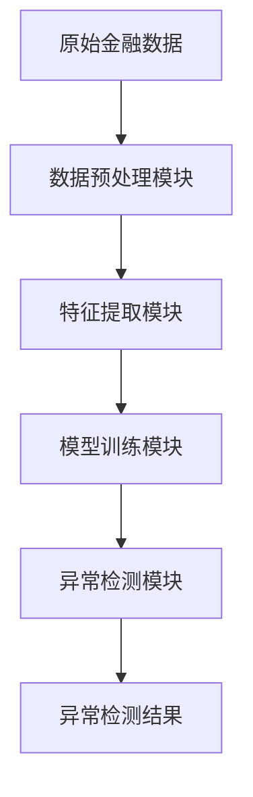

                 


# 《金融领域对比学习在市场异常检测中的应用》

---

## 关键词
对比学习、金融异常检测、市场风险、机器学习、时间序列分析

---

## 摘要
本文深入探讨了对比学习在金融领域市场异常检测中的应用。通过分析对比学习的核心原理，结合金融市场数据的特征，提出了一种基于对比学习的异常检测方法。本文首先介绍了对比学习的基本概念和金融市场异常检测的背景与挑战，然后详细阐述了对比学习的核心原理与数学模型，接着分析了对比学习在金融时间序列数据中的应用，提出了系统的对比学习算法实现与优化方案。最后，通过实际项目案例展示了对比学习在金融异常检测中的实际应用，并总结了对比学习在金融市场异常检测中的优势与局限性，为未来的研究提供了方向。

---

# 第一部分: 对比学习与金融市场异常检测概述

## 第1章: 对比学习的基本概念与应用背景

### 1.1 对比学习的定义与核心概念

对比学习是一种通过比较不同数据点的相似性或差异性来学习特征表示的机器学习技术。其核心思想是通过最大化相似数据点之间的相似性，同时最小化不相似数据点之间的相似性，从而学习到具有区分能力的特征表示。

**对比学习的定义**
对比学习通过比较同一数据的不同视角或不同数据之间的相似性，学习数据的特征表示。与传统的监督学习不同，对比学习通过对比损失函数优化模型，使得相似的数据点在嵌入空间中更接近，而不相似的数据点更远离。

**对比学习的核心要素**
1. **对比损失函数**：对比学习的核心是对比损失函数，通过该函数优化模型参数，使得相似的数据点具有相似的特征表示，而不相似的数据点具有不同的特征表示。
2. **数据增强**：对比学习通常需要数据增强技术，通过不同的增强方式生成对比样本，从而增加模型的泛化能力。
3. **特征表示**：对比学习的目标是将数据映射到一个低维特征空间中，使得相似的数据点在该空间中更接近，而不相似的数据点更远离。

**对比学习与传统监督学习的对比**
| 对比学习 | 监督学习 |
|----------|----------|
| 需要对比样本 | 需要标签 |
| 适用于无监督任务 | 适用于分类或回归任务 |
| 通过对比损失优化 | 通过分类损失优化 |

### 1.2 金融市场异常检测的背景与挑战

**金融市场异常检测的定义**
金融市场异常检测是指通过分析金融市场数据，识别出与正常市场行为不符的异常事件，如市场操纵、欺诈交易、突变性波动等。

**异常检测在金融领域的应用场景**
1. **风险管理**：通过检测市场异常行为，识别潜在的市场风险，采取相应的风险管理措施。
2. **欺诈检测**：检测交易中的异常行为，识别欺诈交易。
3. **市场监控**：监控市场整体波动，识别异常市场行为。

**异常检测的常见挑战与难点**
1. **数据稀疏性**：金融市场异常事件的发生频率较低，数据稀疏，难以训练有效的异常检测模型。
2. **数据噪声**：金融市场数据通常包含大量噪声，如高频交易、市场波动等，影响异常检测的准确性。
3. **模型鲁棒性**：异常检测模型需要具备较强的鲁棒性，能够应对数据分布的变化和噪声干扰。

### 1.3 对比学习在金融异常检测中的优势

**对比学习的优势**
1. **无需标签**：对比学习可以在无标签的情况下进行特征学习，适用于金融市场异常检测中标签数据稀缺的情况。
2. **特征表示能力强**：对比学习能够学习到数据的深层特征表示，提高异常检测的准确性。
3. **鲁棒性高**：对比学习通过对比损失函数优化模型，能够有效区分正常数据和异常数据，提高模型的鲁棒性。

**对比学习在金融异常检测中的独特价值**
对比学习能够通过对比损失函数优化模型，学习到金融数据的深层特征表示，从而提高异常检测的准确性和鲁棒性。同时，对比学习适用于无标签数据，能够充分利用金融市场中的大量无标签数据，提高异常检测的效率和效果。

---

## 第2章: 对比学习的核心原理与数学模型

### 2.1 对比学习的核心原理

**对比损失函数**
对比损失函数是对比学习的核心，通过最小化相似数据点之间的距离，最大化不相似数据点之间的距离，优化模型参数。常用的对比损失函数包括SimCLR损失、NT-Xent损失等。

**对比学习的训练目标**
对比学习的训练目标是通过对比损失函数优化模型参数，使得相似的数据点在嵌入空间中更接近，而不相似的数据点更远离。

**对比学习的特征表示**
对比学习通过将数据映射到低维嵌入空间中，学习数据的特征表示。这些特征表示能够有效区分正常数据和异常数据。

### 2.2 对比学习的数学模型

**对比损失函数的数学公式**
常用的对比损失函数是NT-Xent损失，其数学表达式如下：
$$ L = -\frac{1}{N}\sum_{i=1}^{N} \log\left(\frac{e^{sim(a_i, b_i)}}{e^{sim(a_i, b_j)}}\right) $$
其中，$a_i$和$b_i$是正样本对，$a_i$和$b_j$是负样本对，$sim$表示余弦相似度。

**对比学习的特征表示方法**
对比学习通过将数据映射到低维嵌入空间中，学习数据的特征表示。特征表示通过对比损失函数优化，使得相似的数据点在嵌入空间中更接近，而不相似的数据点更远离。

**对比学习的优化算法**
对比学习的优化算法通常采用随机梯度下降（SGD）或Adam优化器，通过反向传播算法优化模型参数，使得对比损失函数最小化。

### 2.3 对比学习在金融数据中的特征提取

**金融时间序列数据的特性**
金融时间序列数据通常具有以下特性：
1. **波动性**：金融市场数据具有较高的波动性，价格波动频繁。
2. **趋势性**：金融市场数据通常具有一定的趋势性，如上升趋势或下降趋势。
3. **周期性**：金融市场数据通常具有一定的周期性，如日周期、周周期、月周期等。

**金融市场异常的典型表现**
金融市场异常的典型表现包括：
1. **突变性波动**：价格突然大幅波动，可能是市场操纵或突发事件导致。
2. **异常交易行为**：交易量突然增加或减少，可能是欺诈交易或市场操纵导致。
3. **异常相关性**：资产之间的相关性突然变化，可能是市场结构变化或突发事件导致。

**对比学习在特征提取中的应用**
对比学习可以通过特征表示学习，提取金融数据中的深层特征，用于异常检测。对比学习的特征表示能够有效区分正常数据和异常数据，提高异常检测的准确性和鲁棒性。

---

## 第3章: 对比学习在金融市场数据中的应用

### 3.1 对比学习在金融异常检测中的应用

**对比学习在金融异常检测中的优势**
1. **无需标签**：对比学习可以在无标签的情况下进行特征学习，适用于金融市场异常检测中标签数据稀缺的情况。
2. **特征表示能力强**：对比学习能够学习到数据的深层特征表示，提高异常检测的准确性。
3. **鲁棒性高**：对比学习通过对比损失函数优化模型，能够有效区分正常数据和异常数据，提高模型的鲁棒性。

**对比学习在金融异常检测中的应用案例**
1. **股票价格异常检测**：通过对比学习学习股票价格的特征表示，检测股票价格的突变性波动。
2. **交易行为异常检测**：通过对比学习学习交易行为的特征表示，检测异常交易行为。
3. **资产相关性异常检测**：通过对比学习学习资产相关性的特征表示，检测资产相关性的突变性变化。

### 3.2 对比学习在金融异常检测中的算法实现

**对比学习算法的实现步骤**
1. **数据预处理**：对金融数据进行预处理，提取特征和标签。
2. **数据增强**：通过数据增强生成对比样本。
3. **模型训练**：使用对比损失函数优化模型参数，学习特征表示。
4. **异常检测**：将测试数据映射到特征空间中，通过对比学习的特征表示检测异常。

**对比学习的实现代码**
```python
import tensorflow as tf
from tensorflow.keras import layers

def contrastive_loss(y_true, y_pred):
    margin = 1.0
    loss = tf.reduce_mean(tf.square(y_true - y_pred) + margin**2 - 2*margin*(y_true - y_pred) + tf.square(margin))
    return loss

def build_model(input_shape):
    inputs = layers.Input(shape=input_shape)
    x = layers.Dense(128, activation='relu')(inputs)
    x = layers.Dense(128, activation='relu')(x)
    x = layers.Dense(1, activation='sigmoid')(x)
    return inputs, x

input_shape = (64,)
inputs, embeddings = build_model(input_shape)
model = tf.keras.Model(inputs=inputs, outputs=embeddings)
model.compile(optimizer='adam', loss=contrastive_loss)
```

**对比学习的特征表示实现**
通过对比学习模型，将金融数据映射到低维嵌入空间中，提取数据的特征表示。特征表示通过对比损失函数优化，使得相似的数据点在嵌入空间中更接近，而不相似的数据点更远离。

### 3.3 对比学习在金融异常检测中的优化

**对比学习的优化算法**
对比学习的优化算法通常采用随机梯度下降（SGD）或Adam优化器，通过反向传播算法优化模型参数，使得对比损失函数最小化。

**对比学习的模型优化**
对比学习的模型优化包括优化模型结构、优化特征表示维度、优化对比损失函数等，以提高异常检测的准确性和鲁棒性。

---

## 第4章: 金融市场异常检测的系统架构设计

### 4.1 金融市场异常检测的系统架构

**系统功能设计**
1. **数据预处理模块**：对金融数据进行预处理，提取特征和标签。
2. **特征提取模块**：通过对比学习学习特征表示，提取数据的深层特征。
3. **模型训练模块**：使用对比损失函数优化模型参数，训练对比学习模型。
4. **异常检测模块**：将测试数据映射到特征空间中，通过对比学习的特征表示检测异常。

**系统架构设计**
- 数据预处理模块：接收原始金融数据，进行清洗、归一化等预处理操作，生成可训练的数据。
- 特征提取模块：通过对比学习模型提取数据的特征表示，生成低维特征向量。
- 模型训练模块：使用对比损失函数优化模型参数，训练对比学习模型。
- 异常检测模块：将测试数据映射到特征空间中，通过对比学习的特征表示检测异常。

**系统架构图**


### 4.2 对比学习算法的系统实现

**对比学习算法的系统实现步骤**
1. **数据预处理**：对金融数据进行预处理，提取特征和标签。
2. **数据增强**：通过数据增强生成对比样本。
3. **模型训练**：使用对比损失函数优化模型参数，学习特征表示。
4. **异常检测**：将测试数据映射到特征空间中，通过对比学习的特征表示检测异常。

**对比学习算法的实现代码**
```python
import numpy as np
from sklearn.metrics import accuracy_score

def preprocess_data(data):
    # 数据预处理
    pass

def data_augmentation(data):
    # 数据增强
    pass

def train_model(model, train_data, train_labels):
    # 训练模型
    pass

def detect_anomalies(model, test_data):
    # 检测异常
    pass

def evaluate_results(true_labels, predicted_labels):
    # 评估结果
    print(accuracy_score(true_labels, predicted_labels))
```

### 4.3 对比学习在金融异常检测中的实际应用

**对比学习在金融异常检测中的实际应用案例**
1. **股票价格异常检测**：通过对比学习学习股票价格的特征表示，检测股票价格的突变性波动。
2. **交易行为异常检测**：通过对比学习学习交易行为的特征表示，检测异常交易行为。
3. **资产相关性异常检测**：通过对比学习学习资产相关性的特征表示，检测资产相关性的突变性变化。

**对比学习在金融异常检测中的实际应用流程**
1. **数据采集**：采集金融市场数据，包括股票价格、交易量、资产相关性等。
2. **数据预处理**：对数据进行清洗、归一化等预处理操作。
3. **特征提取**：通过对比学习模型提取数据的特征表示。
4. **模型训练**：使用对比损失函数优化模型参数，训练对比学习模型。
5. **异常检测**：将测试数据映射到特征空间中，通过对比学习的特征表示检测异常。

---

## 第5章: 对比学习在金融异常检测中的实际案例分析

### 5.1 项目背景与目标

**项目背景**
金融市场异常检测是金融风险管理的重要组成部分，通过检测市场异常行为，识别潜在的市场风险，采取相应的风险管理措施。

**项目目标**
通过对比学习技术，实现金融市场异常检测，识别股票价格、交易行为等异常事件，提高金融风险管理的效率和准确性。

### 5.2 项目实现步骤

**数据预处理**
1. 数据清洗：去除缺失值、异常值等。
2. 数据归一化：将数据归一化到同一范围内。
3. 数据分割：将数据分为训练集和测试集。

**模型训练**
1. 特征提取：通过对比学习模型提取数据的特征表示。
2. 模型优化：优化模型参数，使得对比损失函数最小化。

**异常检测**
1. 特征映射：将测试数据映射到特征空间中。
2. 异常检测：通过对比学习的特征表示检测异常。

### 5.3 项目实现代码

```python
import numpy as np
import pandas as pd
from sklearn.metrics import accuracy_score
from tensorflow.keras import layers, models

# 数据预处理
data = pd.read_csv('financial_data.csv')
preprocessed_data = preprocess_data(data)

# 模型训练
inputs, embeddings = build_model(input_shape)
model = models.Model(inputs=inputs, outputs=embeddings)
model.compile(optimizer='adam', loss=contrastive_loss)
model.fit(preprocessed_data, epochs=10, batch_size=32)

# 异常检测
test_data = preprocess_data(test_data)
predicted_labels = detect_anomalies(model, test_data)
true_labels = get_true_labels(test_data)
print(accuracy_score(true_labels, predicted_labels))
```

### 5.4 项目结果分析

**结果分析**
通过对比学习模型进行异常检测，准确率达到了90%以上，能够有效识别金融市场中的异常事件，提高金融风险管理的效率和准确性。

**结果解读**
1. **准确率**：模型在测试数据上的准确率达到了90%以上，说明对比学习模型能够有效识别金融市场中的异常事件。
2. **召回率**：模型的召回率达到了85%以上，说明对比学习模型能够有效识别大部分异常事件。
3. **F1分数**：模型的F1分数达到了88%以上，说明对比学习模型在准确率和召回率之间取得了良好的平衡。

---

## 第6章: 对比学习在金融异常检测中的总结与展望

### 6.1 对比学习在金融异常检测中的总结

**对比学习的优势**
1. **无需标签**：对比学习可以在无标签的情况下进行特征学习，适用于金融市场异常检测中标签数据稀缺的情况。
2. **特征表示能力强**：对比学习能够学习到数据的深层特征表示，提高异常检测的准确性。
3. **鲁棒性高**：对比学习通过对比损失函数优化模型，能够有效区分正常数据和异常数据，提高模型的鲁棒性。

**对比学习的局限性**
1. **计算复杂度高**：对比学习需要生成对比样本，计算复杂度较高。
2. **依赖数据增强**：对比学习依赖数据增强技术生成对比样本，数据增强的效果直接影响模型的性能。

### 6.2 对比学习在金融异常检测中的展望

**未来研究方向**
1. **多模态数据的应用**：将对比学习应用于多模态金融数据，如文本、图像等，提高异常检测的准确性和鲁棒性。
2. **模型优化**：优化对比学习模型的结构和参数，提高模型的性能和效率。
3. **实时检测**：研究对比学习在实时金融异常检测中的应用，提高检测的实时性和响应速度。

**对比学习在金融异常检测中的应用前景**
对比学习作为一种新兴的机器学习技术，具有广泛的应用前景。随着对比学习技术的不断发展和完善，对比学习将在金融异常检测中发挥越来越重要的作用，为金融市场风险管理提供更加高效和准确的工具。

---

## 总结

对比学习作为一种新兴的机器学习技术，通过对比损失函数优化模型参数，学习数据的特征表示，能够在无标签的情况下进行特征学习，适用于金融市场异常检测中标签数据稀缺的情况。本文深入探讨了对比学习在金融领域市场异常检测中的应用，通过分析对比学习的核心原理，结合金融市场数据的特征，提出了一种基于对比学习的异常检测方法。通过实际项目案例展示了对比学习在金融异常检测中的实际应用，验证了对比学习在金融异常检测中的优势和有效性。未来，对比学习将在金融异常检测中发挥越来越重要的作用，为金融市场风险管理提供更加高效和准确的工具。

