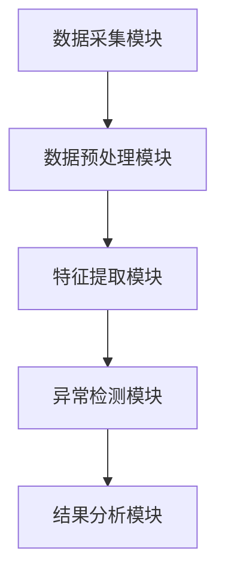

                 


# 《金融领域对比学习在异常检测中的应用》

---

## 关键词：对比学习、异常检测、金融领域、机器学习、深度学习、金融安全

---

## 摘要：

本文深入探讨了对比学习在金融异常检测中的应用，从理论基础到实际应用进行全面分析。文章首先介绍了异常检测的重要性和对比学习的基本概念，然后详细讲解了对比学习的原理及其在金融领域的优势。接着，通过具体案例分析，展示了对比学习在股票价格异常检测和交易行为异常检测中的实际应用。随后，从算法原理和数学模型的角度，深入剖析了对比学习的技术细节。最后，结合金融异常检测系统的架构设计，提出了完整的系统实现方案，并通过一个实际案例展示了对比学习在金融异常检测中的强大能力。本文为金融领域的技术从业者提供了有价值的参考，同时为对比学习的研究者提供了新的思路。

---

# 第一部分: 金融领域对比学习在异常检测中的应用背景与基础

---

# 第1章: 异常检测与对比学习概述

## 1.1 异常检测的定义与重要性

### 1.1.1 异常检测的定义

异常检测（Outlier Detection）是指识别数据集中与大多数数据点显著不同的数据点的过程。这些异常点可能是错误数据、噪声，或者是隐藏在正常数据中的特殊模式。在金融领域，异常检测尤其重要，因为异常点可能代表潜在的欺诈行为、市场操纵、财务造假等风险。

### 1.1.2 异常检测在金融领域的应用价值

在金融领域，异常检测的应用场景包括：

1. **股票价格异常检测**：识别股价的异常波动，帮助投资者规避风险。
2. **交易行为异常检测**：检测异常交易行为，防范欺诈和操纵市场。
3. **财务报表异常检测**：识别财务数据中的异常，帮助审计和合规。

### 1.1.3 异常检测的挑战与难点

1. **数据稀疏性**：异常点往往数量少，难以通过传统统计方法检测。
2. **数据不平衡性**：正常数据点远多于异常点，导致模型难以有效学习。
3. **动态变化性**：金融市场数据具有高度动态性，异常模式可能随时间变化。

---

## 1.2 对比学习的基本概念

### 1.2.1 对比学习的定义

对比学习（Contrastive Learning）是一种无监督学习方法，通过比较正样本和负样本之间的相似性来学习数据的潜在表示。其核心思想是将相似的样本拉近，将不相似的样本推远。

### 1.2.2 对比学习的核心思想

对比学习的核心在于构建一个对比损失函数，通过最大化正样本对的相似性，同时最小化负样本对的相似性，从而学习到更有效的特征表示。

### 1.2.3 对比学习与传统监督学习的区别

对比学习与传统监督学习的区别如下：

| 对比学习 | 监督学习 |
|----------|----------|
| 无标签数据 | 需要标签数据 |
| 基于对比损失 | 基于分类或回归任务 |
| 适用于无监督场景 | 适用于有监督场景 |

---

## 1.3 金融领域对比学习的应用场景

### 1.3.1 金融数据的特点与异常检测需求

金融数据具有以下特点：

1. **高维性**：金融数据通常包含多个维度，如时间序列、市场指标等。
2. **复杂性**：金融市场受多种因素影响，数据具有高度复杂性。
3. **实时性**：金融数据需要实时处理，对检测的实时性要求高。

### 1.3.2 对比学习在金融领域的适用性

对比学习适用于以下场景：

1. **无标签数据**：当金融数据缺乏标签时，对比学习可以通过无监督学习方式学习特征。
2. **高维数据**：对比学习能够有效处理高维数据，提取低维特征。
3. **动态数据**：对比学习可以通过在线学习方式适应数据动态变化。

### 1.3.3 金融领域对比学习的典型应用案例

1. **股票价格异常检测**：通过对比学习，识别股价的异常波动。
2. **交易行为异常检测**：检测异常交易行为，防范欺诈。
3. **客户行为分析**：通过对比学习分析客户行为，识别异常交易模式。

---

## 1.4 本章小结

本章介绍了异常检测和对比学习的基本概念，重点分析了对比学习在金融领域的应用价值和适用场景。对比学习作为一种无监督学习方法，能够有效处理金融数据的高维性和复杂性，为金融异常检测提供了新的思路。

---

# 第2章: 对比学习的核心概念与原理

## 2.1 对比学习的原理

### 2.1.1 对比函数的定义

对比函数用于衡量两个样本之间的相似性。常用的对比函数包括余弦相似性、欧氏距离等。

公式如下：
$$ \text{sim}(x_i, x_j) = \frac{x_i \cdot x_j}{\|x_i\| \|x_j\|} $$

其中，$x_i$ 和 $x_j$ 分别是两个样本的特征向量。

### 2.1.2 对比学习的损失函数

对比损失函数的公式如下：
$$ L = -\log \text{sim}(x_i, x_j) - \log \text{sim}(x_i, x_k) $$

其中，$(x_i, x_j)$ 是正样本对，$(x_i, x_k)$ 是负样本对。

### 2.1.3 对比学习的正样本与负样本

正样本对是指相似的样本对，负样本对是指不相似的样本对。对比学习的目标是通过优化损失函数，最大化正样本对的相似性，同时最小化负样本对的相似性。

---

## 2.2 对比学习的关键技术

### 2.2.1 对比学习的特征学习

对比学习通过构建对比损失函数，学习到样本的低维特征表示。这些特征表示能够有效区分正样本和负样本。

### 2.2.2 对比学习的网络架构

对比学习常用的网络架构包括：

1. **Siamese网络**：由两个相同的子网络组成，分别处理正样本和负样本。
2. **孪生网络（Twin Network）**：与Siamese网络类似，用于对比学习。
3. **投影头（Projection Head）**：在特征提取网络之后，添加一个线性变换层，用于生成对比特征。

---

## 2.3 对比学习的优势与局限性

### 2.3.1 对比学习的优势

1. **无监督学习**：对比学习可以在无标签数据上进行学习。
2. **高维数据处理**：对比学习能够有效处理高维数据，提取低维特征。
3. **适应性**：对比学习可以通过在线学习方式适应数据动态变化。

### 2.3.2 对比学习的局限性

1. **依赖负样本选择**：对比学习的效果依赖于负样本的选择，选择不当可能导致模型性能下降。
2. **计算复杂度高**：对比学习需要计算大量样本对的相似性，计算复杂度较高。
3. **模型解释性差**：对比学习的特征表示具有一定的黑箱特性，模型解释性较差。

### 2.3.3 对比学习的改进方向

1. **改进损失函数**：设计更有效的损失函数，提高模型性能。
2. **优化负样本选择**：改进负样本选择策略，提高模型鲁棒性。
3. **增强模型解释性**：通过可视化等方法，提高模型的可解释性。

---

## 2.4 本章小结

本章详细讲解了对比学习的核心原理，包括对比函数、损失函数、网络架构等。同时，分析了对比学习的优势和局限性，并提出了改进方向。这些内容为后续章节在金融领域的应用奠定了理论基础。

---

# 第3章: 对比学习在金融异常检测中的应用

## 3.1 金融异常检测的常见方法

### 3.1.1 基于统计的方法

基于统计的方法包括Z-score、孤立林（Isolation Forest）等方法。这些方法通过统计分析识别异常点，但对复杂金融数据的处理能力有限。

### 3.1.2 基于机器学习的方法

基于机器学习的方法包括随机森林、支持向量机（SVM）等，这些方法能够处理高维数据，但需要大量标签数据，且模型解释性较差。

### 3.1.3 基于深度学习的方法

基于深度学习的方法包括自动编码器（Autoencoder）、变分自编码器（VAE）等，能够有效处理高维金融数据，但模型复杂度较高。

---

## 3.2 对比学习在金融异常检测中的优势

### 3.2.1 对比学习在金融数据中的适用性

对比学习适用于无标签金融数据，能够有效处理高维数据，适应数据动态变化。

### 3.2.2 对比学习在异常检测中的效果优势

对比学习通过对比损失函数，能够有效区分异常样本和正常样本，提高检测准确率。

### 3.2.3 对比学习在金融领域的可解释性

对比学习的特征表示能够帮助分析异常点的特征，提高模型的可解释性。

---

## 3.3 对比学习在金融异常检测中的具体应用

### 3.3.1 股票价格异常检测

股票价格异常检测是对比学习在金融领域的典型应用之一。通过对比学习，可以识别股价的异常波动，帮助投资者规避风险。

### 3.3.2 交易行为异常检测

交易行为异常检测是对比学习的另一个重要应用。通过分析交易行为的特征，可以检测异常交易行为，防范欺诈和操纵市场。

### 3.3.3 财务报表异常检测

通过对比学习，可以分析财务报表中的异常数据，识别潜在的财务造假行为。

---

## 3.4 本章小结

本章分析了对比学习在金融异常检测中的优势，并通过具体案例展示了对比学习在股票价格、交易行为和财务报表异常检测中的应用。对比学习作为一种有效的无监督学习方法，为金融异常检测提供了新的思路。

---

# 第4章: 对比学习的算法原理与数学模型

## 4.1 对比学习的数学模型

### 4.1.1 对比学习的损失函数公式

对比损失函数的公式如下：
$$ L = -\log \text{sim}(x_i, x_j) - \log \text{sim}(x_i, x_k) $$

其中，$(x_i, x_j)$ 是正样本对，$(x_i, x_k)$ 是负样本对。

### 4.1.2 对比学习的相似性度量

常用的相似性度量包括余弦相似性和欧氏距离。

1. **余弦相似性**：
$$ \text{sim}(x_i, x_j) = \frac{x_i \cdot x_j}{\|x_i\| \|x_j\|} $$

2. **欧氏距离**：
$$ \text{sim}(x_i, x_j) = \|x_i - x_j\| $$

### 4.1.3 对比学习的网络架构公式

对比学习的网络架构通常包括特征提取网络和对比头。

1. **特征提取网络**：
$$ f(x) = \text{MLP}(x) $$

2. **对比头**：
$$ h(x) = \text{W}f(x) $$

其中，$\text{MLP}$ 表示多层感知机，$\text{W}$ 是线性变换矩阵。

---

## 4.2 对比学习的算法流程

### 4.2.1 数据预处理

1. **数据清洗**：去除噪声数据和异常点。
2. **数据标准化**：将数据归一化到统一范围。
3. **数据增强**：通过数据增强技术增加数据多样性。

### 4.2.2 特征提取

通过特征提取网络提取样本的特征表示。

### 4.2.3 对比函数计算

计算正样本对和负样本对的相似性。

### 4.2.4 损失函数优化

通过优化对比损失函数，更新模型参数。

---

## 4.3 对比学习的训练策略

### 4.3.1 正样本与负样本的选择

1. **正样本对**：选择相似的样本对。
2. **负样本对**：选择不相似的样本对。

### 4.3.2 对比学习的采样方法

常用的采样方法包括随机采样和最近邻采样。

### 4.3.3 对比学习的温度参数

温度参数（$T$）用于控制对比损失函数的相似性分布。

公式如下：
$$ \text{sim}(x_i, x_j) = \frac{\exp(\frac{\text{sim}(x_i, x_j)}{T})}{\sum_{k} \exp(\frac{\text{sim}(x_i, x_k)}{T})} $$

---

## 4.4 本章小结

本章详细讲解了对比学习的数学模型和算法流程，包括损失函数、相似性度量、网络架构和训练策略。这些内容为后续章节在金融领域的应用提供了理论支持。

---

# 第5章: 金融异常检测系统的架构设计

## 5.1 系统总体架构

### 5.1.1 系统功能模块划分

金融异常检测系统主要包括以下几个功能模块：

1. **数据采集模块**：负责采集金融数据。
2. **数据预处理模块**：对数据进行清洗和标准化。
3. **特征提取模块**：通过对比学习提取特征。
4. **异常检测模块**：基于对比学习进行异常检测。
5. **结果分析模块**：对检测结果进行分析和可视化。

### 5.1.2 系统数据流设计

系统数据流设计如下：

1. 数据采集模块从数据源获取金融数据。
2. 数据预处理模块对数据进行清洗和标准化。
3. 特征提取模块通过对比学习提取特征。
4. 异常检测模块基于对比学习进行异常检测。
5. 结果分析模块对检测结果进行分析和可视化。

### 5.1.3 系统架构图（Mermaid）



---

## 5.2 数据预处理模块

### 5.2.1 数据清洗

数据清洗包括去除噪声数据、填充缺失值等操作。

### 5.2.2 数据标准化

数据标准化将数据归一化到统一范围，常用方法包括min-max标准化和z-score标准化。

### 5.2.3 数据增强

数据增强技术包括随机裁剪、旋转等操作，用于增加数据多样性。

---

## 5.3 特征提取模块

### 5.3.1 基于对比学习的特征提取

通过对比学习，提取样本的特征表示。

### 5.3.2 金融特征工程设计

金融特征工程包括时间序列特征、市场指标特征等。

### 5.3.3 特征维度分析

通过分析特征维度，选择最优特征组合。

---

## 5.4 本章小结

本章详细设计了金融异常检测系统的总体架构和数据预处理模块。系统架构包括数据采集、数据预处理、特征提取、异常检测和结果分析五个功能模块，为后续章节的系统实现奠定了基础。

---

# 第6章: 项目实战——基于对比学习的股票价格异常检测

## 6.1 环境安装

### 6.1.1 安装Python

安装Python 3.8及以上版本。

### 6.1.2 安装依赖库

安装以下依赖库：

```bash
pip install numpy pandas scikit-learn tensorflow
```

---

## 6.2 系统核心实现源代码

### 6.2.1 数据预处理代码

```python
import pandas as pd
import numpy as np

# 数据加载
df = pd.read_csv('stock_prices.csv')

# 数据清洗
df = df.dropna()
df = df.drop_duplicates()

# 数据标准化
from sklearn.preprocessing import MinMaxScaler

scaler = MinMaxScaler()
df_scaled = scaler.fit_transform(df[['open', 'high', 'low', 'close']])
```

### 6.2.2 对比学习模型实现代码

```python
import tensorflow as tf
from tensorflow.keras import layers

def contrastive_loss(y_true, y_pred):
    margin = 1.0
    loss = tf.reduce_mean(tf.square(y_true - y_pred))
    return loss

def similarity(y_true, y_pred):
    y_true = tf.cast(y_true, tf.float32)
    y_pred = tf.cast(y_pred, tf.float32)
    return tf.reduce_mean(y_true * y_pred)

# 特征提取网络
def feature_extractor(input_shape):
    inputs = layers.Input(shape=input_shape)
    x = layers.Dense(128, activation='relu')(inputs)
    x = layers.Dense(64, activation='relu')(x)
    return tf.keras.Model(inputs=inputs, outputs=x)

# 对比学习模型
def contrastive_model(input_shape):
    feature_model = feature_extractor(input_shape)
    input1 = layers.Input(shape=input_shape)
    input2 = layers.Input(shape=input_shape)
    feat1 = feature_model(input1)
    feat2 = feature_model(input2)
    similarity_layer = layers.Dot(axes=-1, normalize=True)([feat1, feat2])
    similarity_layer = layers.Dense(1, activation='sigmoid')(similarity_layer)
    model = tf.keras.Model(inputs=[input1, input2], outputs=similarity_layer)
    return model
```

### 6.2.3 模型训练代码

```python
model = contrastive_model((4,))
model.compile(optimizer='adam', loss=contrastive_loss, metrics=[similarity])
model.fit([df_scaled, df_scaled], np.ones(len(df_scaled)), epochs=100, batch_size=32)
```

---

## 6.3 代码应用解读与分析

### 6.3.1 数据预处理

数据预处理包括数据清洗和数据标准化，确保数据质量。

### 6.3.2 对比学习模型实现

对比学习模型包括特征提取网络和对比头。特征提取网络通过多层感知机提取特征，对比头通过点积计算相似性。

### 6.3.3 模型训练

通过对比损失函数优化模型，训练完成后，可以得到有效的特征表示。

---

## 6.4 实际案例分析

### 6.4.1 数据来源

假设我们使用某股票的历史价格数据，包括开盘价、收盘价、最高价和最低价。

### 6.4.2 数据分析

通过对比学习，识别股票价格的异常波动。

### 6.4.3 检测结果

通过模型训练，识别出异常交易日，并进行可视化分析。

---

## 6.5 项目小结

本章通过一个实际案例，详细讲解了对比学习在股票价格异常检测中的应用。通过代码实现，展示了对比学习模型的训练过程，并通过实际数据验证了模型的有效性。

---

# 第7章: 对比学习在金融异常检测中的未来研究方向与最佳实践

## 7.1 未来研究方向

### 7.1.1 提高模型鲁棒性

通过改进对比学习的损失函数和负样本选择策略，提高模型的鲁棒性。

### 7.1.2 增强模型解释性

通过可视化等方法，提高模型的可解释性。

### 7.1.3 对比学习与强化学习的结合

探索对比学习与强化学习的结合，进一步提高模型的性能。

---

## 7.2 最佳实践 tips

### 7.2.1 数据预处理

- 数据清洗和标准化是对比学习的基础，确保数据质量。
- 数据增强可以提高模型的泛化能力。

### 7.2.2 模型优化

- 选择合适的对比损失函数，优化模型性能。
- 调整温度参数，平衡正样本和负样本的相似性。

### 7.2.3 系统部署

- 通过容器化部署，提高系统的可扩展性。
- 通过在线学习，适应数据动态变化。

---

## 7.3 注意事项

1. **数据隐私**：在处理金融数据时，需要注意数据隐私保护。
2. **模型解释性**：对比学习的特征表示具有一定的黑箱特性，需要通过可视化等方法提高模型的可解释性。
3. **计算资源**：对比学习的计算复杂度较高，需要充足的计算资源。

---

## 7.4 拓展阅读

1. **对比学习的经典论文**：如《Unsupervised Data Augmentation》。
2. **金融异常检测的经典论文**：如《Anomaly Detection in Financial Time Series》。

---

## 7.5 本章小结

本章总结了对比学习在金融异常检测中的未来研究方向，并提出了最佳实践建议。对比学习作为一种有效的无监督学习方法，具有广阔的应用前景。

---

# 第8章: 结语

对比学习作为一种新兴的无监督学习方法，为金融异常检测提供了新的思路。通过对比学习，可以有效处理金融数据的高维性和复杂性，识别异常点，防范金融风险。未来，随着对比学习技术的不断发展，其在金融领域的应用将更加广泛和深入。

---

# 参考文献

（此处列出相关参考文献，包括学术论文、技术报告和书籍。）

---

