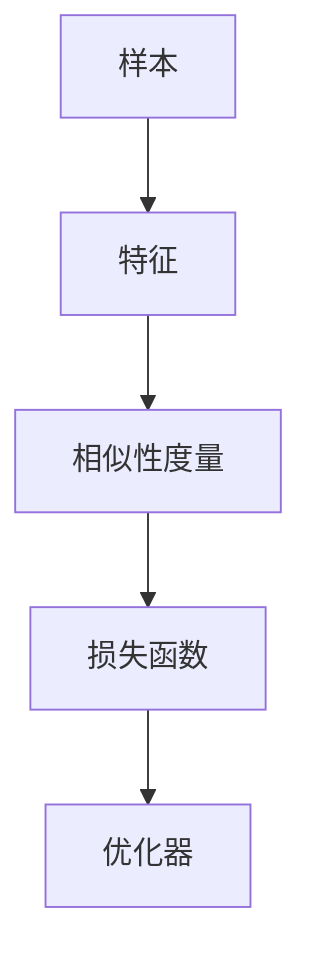
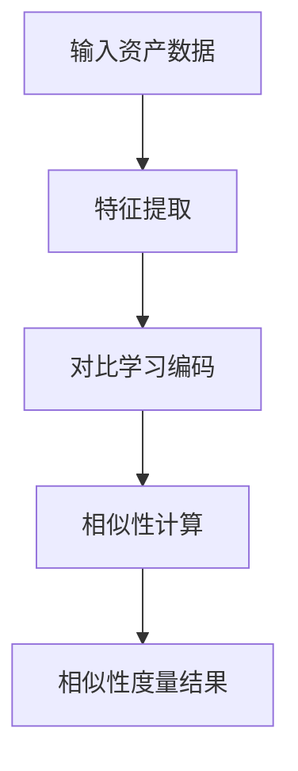
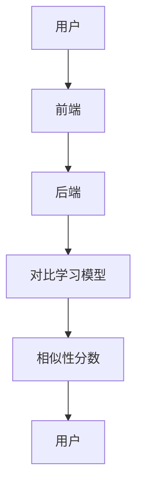

                 


# 《金融领域对比学习在资产相似性度量中的应用》

## 关键词：
- 对比学习
- 资产相似性度量
- 金融领域
- 深度学习
- 对比网络

## 摘要：
本文深入探讨了对比学习在金融领域资产相似性度量中的应用，结合理论与实践，分析了对比学习的核心原理及其在金融资产相似性度量中的优势与挑战。文章从对比学习的背景与核心概念出发，详细阐述了对比学习在资产相似性度量中的算法原理、系统架构设计以及项目实战，并通过实际案例展示了对比学习在金融领域的具体应用。本文旨在为金融领域的技术从业者提供一个全面而深入的技术指南，帮助其更好地理解和应用对比学习技术。

---

# 第1章: 对比学习与资产相似性度量概述

## 1.1 对比学习的基本概念
### 1.1.1 对比学习的定义
对比学习（Contrastive Learning）是一种基于对比的无监督或弱监督学习方法，旨在通过比较不同样本之间的相似性来学习特征表示。其核心思想是通过最大化正样本之间的相似性，同时最小化负样本之间的相似性，从而优化模型的特征表示能力。

### 1.1.2 对比学习的核心思想
对比学习的核心思想可以概括为：通过设计一个对比损失函数，使得正样本之间的相似性尽可能高，而负样本之间的相似性尽可能低。这种对比机制能够有效地捕捉数据中的潜在结构，从而提升模型的特征提取能力。

### 1.1.3 对比学习与传统相似性度量的区别
传统的相似性度量方法（如余弦相似性、欧氏距离等）通常依赖于固定的距离函数，而对比学习则通过学习一个自适应的相似性度量函数，能够更好地捕捉数据的内在结构。

## 1.2 金融资产相似性度量的背景与意义
### 1.2.1 金融资产相似性度量的定义
资产相似性度量是指通过某种方法量化不同金融资产之间的相似程度，从而为投资组合管理、风险评估等金融任务提供支持。

### 1.2.2 传统资产相似性度量方法的局限性
传统的资产相似性度量方法通常依赖于简单的统计指标（如均值、方差等），难以捕捉资产之间的复杂关系，尤其是在高维数据空间中表现不佳。

### 1.2.3 对比学习在资产相似性度量中的优势
对比学习通过学习一个自适应的相似性度量函数，能够更好地捕捉资产之间的潜在关系，尤其是在数据量较大且复杂的情况下表现优异。

## 1.3 对比学习在金融领域的应用前景
### 1.3.1 对比学习在金融领域的潜在应用场景
对比学习可以在金融领域的多个场景中应用，如资产分类、投资组合优化、风险评估等。

### 1.3.2 对比学习在资产相似性度量中的具体应用
通过对资产的特征表示进行对比学习，可以更准确地量化资产之间的相似性，从而为投资决策提供支持。

### 1.3.3 对比学习在金融领域的挑战与机遇
对比学习在金融领域的应用还面临一些挑战，如数据稀疏性、模型的可解释性等。然而，这些挑战也为对比学习在金融领域的进一步研究提供了机遇。

## 1.4 本章小结
本章从对比学习的基本概念出发，分析了资产相似性度量的背景与意义，并探讨了对比学习在金融领域的应用前景。

---

# 第2章: 对比学习的核心原理

## 2.1 对比学习的数学基础
### 2.1.1 对比学习的损失函数
对比学习的核心是通过对比损失函数来优化模型的特征表示。常用的对比损失函数包括NT-Xent损失和Binary Cross-Entropy损失。

#### NT-Xent损失
$$ L = -\log\left(\frac{e^{s_{pos}}}{e^{s_{pos}} + \sum_{i=1}^N e^{s_{neg}}}}\right) $$

其中，$s_{pos}$表示正样本的相似性分数，$s_{neg}$表示负样本的相似性分数。

### 2.1.2 对比学习的相似性度量公式
对比学习通过相似性度量公式将样本之间的相似性转化为概率。常用的相似性度量公式包括余弦相似性和点积相似性。

#### 余弦相似性
$$ \text{sim}(x, y) = \frac{x \cdot y}{\|x\| \|y\|} $$

#### 点积相似性
$$ \text{sim}(x, y) = x \cdot y $$

### 2.1.3 对比学习的优化目标
对比学习的优化目标是通过最大化正样本的相似性分数，同时最小化负样本的相似性分数，从而优化模型的特征表示。

## 2.2 对比学习的网络架构
### 2.2.1 对比学习的编码器网络
编码器网络（Encoder）将输入的样本映射到一个特征空间，通常是一个深度神经网络。

### 2.2.2 对比学习的投影头网络
投影头网络（Projection Head）将编码器输出的特征进一步映射到一个低维空间，以便于计算相似性分数。

### 2.2.3 对比学习的负采样策略
负采样策略通过随机选择负样本，避免计算所有负样本的开销过大。

## 2.3 对比学习的训练过程
### 2.3.1 对比学习的正样本与负样本选择
正样本是指同一资产的不同表示，负样本是指不同的资产。

### 2.3.2 对比学习的损失计算与优化
通过计算对比损失函数，优化器（如Adam）更新模型参数。

### 2.3.3 对比学习的训练技巧
包括学习率调整、批量归一化等技巧。

## 2.4 对比学习的核心概念对比表格
| 概念 | 描述 |
|------|------|
| 正样本 | 相似或相同的样本 |
| 负样本 | 不相似或不同的样本 |
| 损失函数 | 衡量正样本和负样本之间相似性的差异 |
| 编码器 | 将样本映射到特征空间的网络 |

## 2.5 对比学习的ER实体关系图


## 2.6 本章小结
本章详细介绍了对比学习的核心原理，包括数学基础、网络架构和训练过程。

---

# 第3章: 对比学习在资产相似性度量中的算法原理

## 3.1 对比学习的资产表示学习
### 3.1.1 资产表示学习的定义
资产表示学习是指通过深度学习模型将资产的特征映射到一个低维表示空间。

### 3.1.2 资产表示学习的目标
资产表示学习的目标是通过对比学习优化资产的特征表示，使得相似的资产具有相似的表示，而不相似的资产具有不同的表示。

### 3.1.3 资产表示学习的实现方法
资产表示学习可以通过预训练的深度神经网络实现。

## 3.2 对比学习的资产相似性度量模型
### 3.2.1 基于对比学习的资产相似性模型
对比学习模型通过编码器网络和投影头网络实现资产的特征表示。

### 3.2.2 模型的输入与输出
输入是资产的特征，输出是资产的相似性分数。

### 3.2.3 模型的训练与优化
通过对比损失函数优化模型参数。

## 3.3 对比学习的数学模型与公式
### 3.3.1 对比学习的损失函数
$$ L = -\log\left(\frac{e^{s_{pos}}}{e^{s_{pos}} + \sum_{i=1}^N e^{s_{neg}}}}\right) $$

### 3.3.2 对比学习的相似性分数
$$ s(x, y) = \text{sim}(x, y) $$

## 3.4 对比学习的算法流程图


## 3.5 本章小结
本章详细介绍了对比学习在资产相似性度量中的算法原理，包括资产表示学习、模型实现和数学公式。

---

# 第4章: 对比学习在资产相似性度量中的系统架构设计

## 4.1 系统功能设计
### 4.1.1 资产相似性度量模块
通过对比学习模型计算资产之间的相似性分数。

### 4.1.2 用户界面模块
展示资产相似性结果。

## 4.2 系统架构设计
### 4.2.1 前端架构
用户通过前端界面输入资产数据。

### 4.2.2 后端架构
后端接收用户请求，调用对比学习模型计算相似性分数。

## 4.3 系统接口设计
### 4.3.1 接口输入
资产的特征数据。

### 4.3.2 接口输出
资产之间的相似性分数。

## 4.4 系统交互流程图


## 4.5 本章小结
本章设计了对比学习在资产相似性度量中的系统架构，包括功能设计、架构设计和交互设计。

---

# 第5章: 对比学习在资产相似性度量中的项目实战

## 5.1 项目环境安装
### 5.1.1 安装Python
```bash
python --version
```

### 5.1.2 安装深度学习框架
```bash
pip install tensorflow
```

## 5.2 系统核心实现源代码
### 5.2.1 编码器网络实现
```python
import tensorflow as tf

def encoder(x):
    dense1 = tf.keras.layers.Dense(64, activation='relu')(x)
    dense2 = tf.keras.layers.Dense(32, activation='relu')(dense1)
    return dense2
```

### 5.2.2 对比学习模型实现
```python
def contrastive_model(x):
    encoded_x = encoder(x)
    projection = tf.keras.layers.Dense(1, activation='sigmoid')(encoded_x)
    return projection
```

## 5.3 代码应用解读与分析
对比学习模型通过编码器网络提取资产特征，并通过投影头网络计算相似性分数。

## 5.4 实际案例分析
### 5.4.1 数据准备
资产的特征数据。

### 5.4.2 模型训练
```python
model = contrastive_model(input_layer)
model.compile(optimizer='adam', loss='binary_crossentropy')
model.fit(x_train, y_train, epochs=10)
```

## 5.5 项目小结
本章通过实际案例展示了对比学习在资产相似性度量中的应用，包括环境安装、代码实现和案例分析。

---

# 第6章: 对比学习在资产相似性度量中的总结与展望

## 6.1 本章总结
对比学习在资产相似性度量中具有重要的应用价值，能够通过自适应的相似性度量函数捕捉资产之间的潜在关系。

## 6.2 未来研究方向
### 6.2.1 对比学习的可解释性研究
### 6.2.2 对比学习的实时性优化
### 6.2.3 对比学习在多模态数据中的应用

## 6.3 最佳实践 tips
- 确保数据质量
- 选择合适的对比学习模型
- 定期更新模型

## 6.4 本章小结
本章总结了对比学习在资产相似性度量中的应用，并展望了未来的研究方向。

---

# 第7章: 扩展阅读

## 7.1 对比学习的经典论文
- SimCLR: A Simple Framework for Contrastive Learning of Visual Representations
- MoCo: Memory-based Contrastive Learning of Visual Representations

## 7.2 金融领域的相关书籍
- 《Financial Machine Learning》
- 《Python for Finance》

## 7.3 代码库与工具
- TensorFlow官方文档
- PyTorch官方文档

## 7.4 本章小结
本章提供了对比学习和金融领域的扩展阅读资源。

---

# 附录: 对比学习的数学公式汇总

## 附录A: 对比学习的损失函数
$$ L = -\log\left(\frac{e^{s_{pos}}}{e^{s_{pos}} + \sum_{i=1}^N e^{s_{neg}}}}\right) $$

## 附录B: 对比学习的相似性分数
$$ s(x, y) = \text{sim}(x, y) $$

## 附录C: 对比学习的网络架构
- 编码器网络
- 投影头网络

---

# 参考文献

（此处列出相关的参考文献）

---

# 作者简介

（此处介绍作者的背景和相关著作）

---

# END

